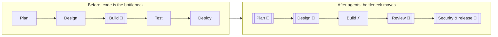
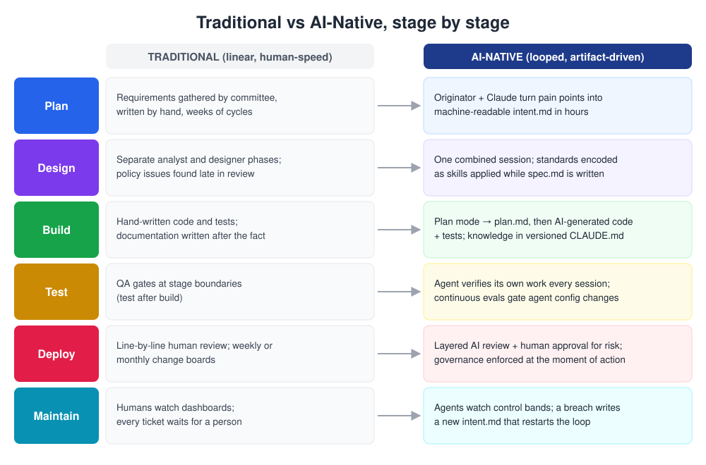
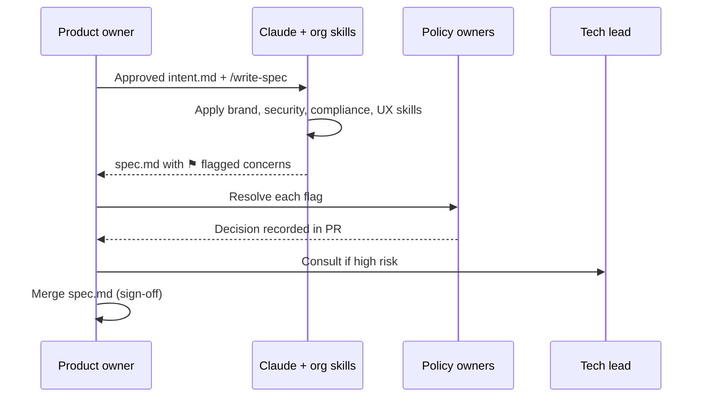
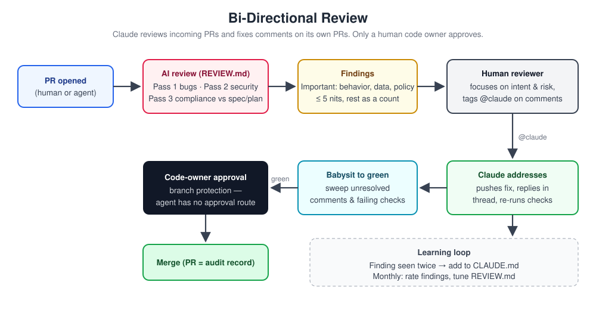
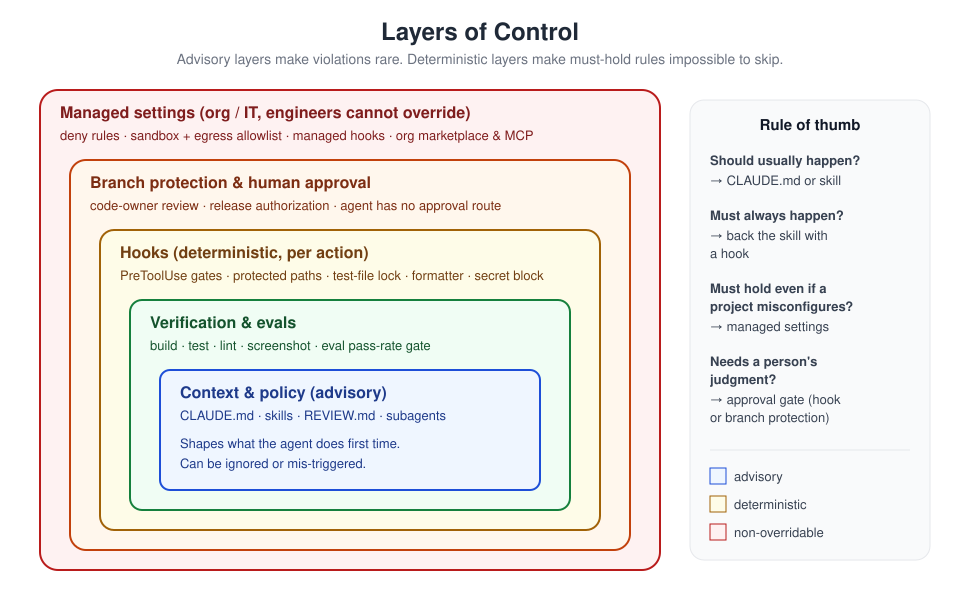
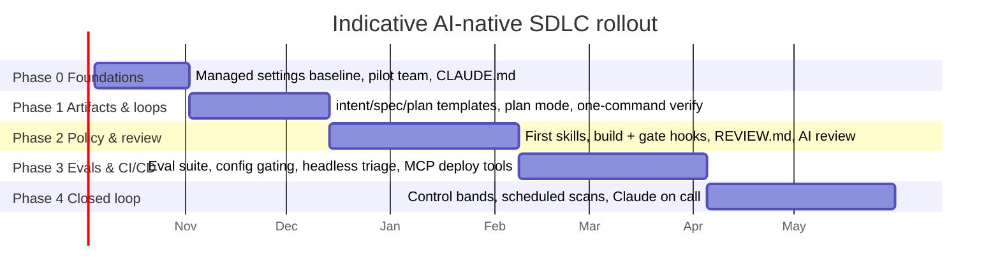

# The AI-Native SDLC Playbook

> **An implementation-ready edition.** This playbook restates and expands the ideas in Anthropic's article
> [*The AI-Native SDLC Playbook*](https://claude.com/blog/the-ai-native-sdlc-playbook). It is organised so that a
> product owner, engineer, platform team, security lead, or executive can find what they need, act on it, and
> measure whether it worked. The six stage chapters in [`../01-Stages`](../01-Stages/README.md), the how-to guides in
> [`../02-Guides`](../02-Guides/README.md), and the copy-paste templates in [`../03-Templates`](../03-Templates/README.md)
> go deeper on every section below.

| | |
|---|---|
| **Audience** | Engineering leadership, product owners, tech leads, engineers, platform/DevEx, security, compliance, SRE/on-call |
| **Scope** | The full software delivery lifecycle — idea to production and back again — using Claude and Claude Code |
| **Status** | Living document. Version it in git and change it through pull requests like any other artifact |
| **Last reviewed** | 2026-09-25 |

---

## Contents

1. [Why the SDLC has to change](#1-why-the-sdlc-has-to-change)
2. [What "AI-native" means](#2-what-ai-native-means)
3. [Design principles](#3-design-principles)
4. [The artifact chain](#4-the-artifact-chain)
5. [Stage 1 — Plan: capture ideas as `intent.md`](#5-stage-1--plan-capture-ideas-as-intentmd)
6. [Stage 2 — Design: requirements and design in one pass](#6-stage-2--design-requirements-and-design-in-one-pass)
7. [Stage 3 — Build: plan first, then let the agent build](#7-stage-3--build-plan-first-then-let-the-agent-build)
8. [Stage 4 — Test: feedback loops and continuous evals](#8-stage-4--test-feedback-loops-and-continuous-evals)
9. [Stage 5 — Deploy: two-way review and gates at the moment of action](#9-stage-5--deploy-two-way-review-and-gates-at-the-moment-of-action)
10. [Stage 6 — Maintain: closing the loop](#10-stage-6--maintain-closing-the-loop)
11. [Governance model](#11-governance-model)
12. [Measurement framework](#12-measurement-framework)
13. [Roles and responsibilities](#13-roles-and-responsibilities)
14. [Adoption roadmap](#14-adoption-roadmap)
15. [Common failure modes](#15-common-failure-modes)
16. [Where to go next](#16-where-to-go-next)

---

## 1. Why the SDLC has to change

For decades the scarce resource in software delivery was the time it took people to write code. Every process we
inherited — requirements committees, design hand-offs, line-by-line review, weekly change boards — was sized around
that constraint. When code arrived slowly, a slow review process was invisible.

Coding agents remove that constraint. A single engineer steering Claude Code can produce several times the
volume of working, tested change they could produce by hand. The result is not that everything gets faster. The
result is that **the bottleneck moves** to whichever stage still runs at human speed:

- Product ideas wait weeks for someone to write them up.
- Pull requests queue for reviewers who are sized for human output.
- Security teams, staffed for the old volume, cannot keep up with agent-multiplied change.
- Governance is enforced by meetings that happen after the fact.



Speeding up only the build stage therefore produces a pile-up in front of every other stage. To realise the
benefit, the **whole lifecycle** has to be redesigned so that each stage can run at agent speed while people keep
authority over the decisions that matter.

---

## 2. What "AI-native" means

An AI-native SDLC (also called an *agentic SDLC* or simply *AI SDLC*) keeps the **control objectives** of a mature
delivery process — traceability, peer review, segregation of duties, release authorisation, auditability — and
replaces the **mechanisms** that enforce them.



| Stage | Traditional mechanism | AI-native mechanism |
|---|---|---|
| **Plan** | Requirements gathered by committee and written by hand | The person with the idea works with Claude to produce a machine-readable `intent.md` |
| **Design** | Separate analysis and design phases; policy problems discovered late | One session produces requirements and design together, with policy applied through **skills** |
| **Build** | Hand-written code and tests; documentation after the fact | Plan mode produces `plan.md`; Claude writes code and tests; team knowledge lives in versioned `CLAUDE.md` |
| **Test** | QA gates at stage boundaries | Every session verifies its own work; **evals** continuously regression-test the agent's configuration |
| **Deploy** | Line-by-line human review; periodic change boards | Layered AI review plus human approval for risk; **hooks** enforce governance at the moment of action |
| **Maintain** | People watch dashboards; every ticket waits for a person | Deterministic **control bands** trigger Claude; findings re-enter the pipeline as a new `intent.md` |

The shape also changes. A traditional SDLC is a line that ends at "deployed". An AI-native SDLC is a **loop**:
production signals, scans and incidents are turned into new intent, which flows back through the same gates.


---

## 3. Design principles

These principles recur in every stage. When a situation is not covered by this playbook, reason from them.

1. **Every stage produces a versioned artifact the next stage reads.** Ideas, specs, plans, review policies,
   agent instructions and monitoring thresholds are all files in git. Git supplies authorship, timestamps, history
   and review for free.
2. **Humans own the gates; agents own the work between them.** A person approves intent, signs off the spec,
   accepts the plan, approves the PR and authorises the release. The agent never holds an approval route.
3. **Advise with context, enforce with code.** `CLAUDE.md` and skills make the right behaviour the default.
   Anything that *must* hold is backed by a deterministic hook, a managed setting, or branch protection.
   See [Layers of control](#113-layers-of-control).
4. **Close the loop on verification.** Claude should always have a way to check its own work — a test, a build,
   a screenshot — and should not report "done" until that check passes.
5. **Treat agent configuration as code.** `CLAUDE.md`, skills, hooks, subagents and prompts change behaviour, so
   they are reviewed, versioned and regression-tested with evals.
6. **Detection is deterministic; diagnosis is intelligent.** Statistics decide *whether* something is wrong. The
   model is invoked only after a threshold is breached.
7. **Enforce at the moment of action, not in a meeting afterwards.** A hook that blocks a production deploy
   without authorisation is a better control than a monthly report that discovers one.
8. **Mistakes become permanent improvements.** A review finding seen twice goes into `CLAUDE.md`; an incident
   becomes an eval; a dismissed alert tunes a band.

---

## 4. The artifact chain


| Artifact | Created in | Written by | Read by | Human gate | Template |
|---|---|---|---|---|---|
| `intent.md` | Plan | Originator + Claude | Product owner, spec pass | PO merges or closes | [intent.template.md](../03-Templates/intent.template.md) |
| `spec.md` | Design | PO + Claude + org skills | Engineer, plan mode | PO signs off; policy owners resolve flags | [spec.template.md](../03-Templates/spec.template.md) |
| `plan.md` | Build | Engineer + Claude (plan mode) | Claude during implementation; reviewers | Engineer accepts plan | [plan.template.md](../03-Templates/plan.template.md) |
| `CLAUDE.md` | Build (ongoing) | Whole team | Every Claude session | Code owners approve changes | [CLAUDE.template.md](../03-Templates/CLAUDE.template.md) |
| Skills (`SKILL.md`) | Any stage | Policy owner + platform | Claude when relevant | Policy owner approves | [secure-api-review](../03-Templates/skills/secure-api-review/SKILL.md) |
| Hooks + settings | Build / Deploy | Platform engineer | Claude Code runtime | Platform / change management | [project-settings.json](../03-Templates/settings/project-settings.json) |
| Evals | Test | Platform + owning teams | CI | Config owner approves threshold | [example-eval.json](../03-Templates/evals/example-eval.json) |
| `REVIEW.md` | Deploy | Tech lead | AI reviewer | Tech lead | [REVIEW.template.md](../03-Templates/REVIEW.template.md) |
| Pull request | Deploy | Claude / engineer | Code owner | Code-owner approval | — |
| `bands.yaml` | Maintain | Service owner | Detection script | Service owner | [bands.yaml](../03-Templates/monitoring/bands.yaml) |
| Post-mortem / lessons | Maintain | Claude + on-call | Future investigations | Service owner | [postmortem.template.md](../03-Templates/lessons/postmortem.template.md) |

A recommended repository layout that holds all of these:

```text
repo/
├── CLAUDE.md                  # team context for every session
├── REVIEW.md                  # AI review policy
├── work/                      # one folder per change, named <record-id>-<slug>
│   ├── _templates/            # intent.md, spec.md, plan.md templates
│   └── CLM-1427-claims-status-self-service/
│       ├── intent.md          # Stage 1
│       ├── spec.md            # Stage 2
│       └── plan.md            # Stage 3
├── .claude/
│   ├── settings.json          # project hooks + permissions (checked in)
│   ├── hooks/                 # hook scripts
│   ├── skills/<name>/SKILL.md # policy as skills
│   ├── agents/<name>.md       # subagents
│   └── commands/<name>.md     # team slash commands
├── evals/                     # agent-config regression suite
├── monitoring/                # bands.yaml + detection scripts
└── lessons/                   # post-mortems Claude reads on future incidents
```

> **Legacy tools.** If Jira, ServiceNow or another system is already the record of truth, decide per artifact which
> system is authoritative and link both ways (record ID in the markdown, commit SHA in the record). See
> [Source-of-Truth-and-Legacy-Systems.md](../02-Guides/Source-of-Truth-and-Legacy-Systems.md).

---

## 5. Stage 1 — Plan: capture ideas as `intent.md`

**Deep dive:** [01-Plan-Intent.md](../01-Stages/01-Plan-Intent.md)

### What changes
Ideas no longer wait in a queue for a product manager to write them up. Whoever notices the problem — a claims
handler, a support lead, an engineer — describes it to Claude, brainstorms until it is concrete, and asks Claude to
write it in the organisation's `intent.md` format. The result is a short, structured, version-controlled
proto-specification that downstream stages can read directly.

### Prerequisites and infrastructure
- Claude access for non-engineers (Claude apps with connectors let them commit without learning git).
- An agreed `intent.md` template — ideally encoded as a skill so Claude applies it automatically
  ([intent-writer skill](../03-Templates/skills/intent-writer/SKILL.md)).
- A shared, version-controlled home, typically a per-change folder `work/<record-id>-<slug>/` in the product repo.

### How to do it
1. **Describe the problem** in plain language: who is affected, what hurts, how often.
2. **Brainstorm to concreteness.** Ask Claude to challenge you on scope, affected users, constraints and how
   success will be measured.
3. **Ask Claude to write `intent.md`** using the organisation template.
4. **Correct it.** The originator is the authority on the problem; fix anything Claude misunderstood.
5. **Commit it** as `work/<record-id>-<slug>/intent.md` with author and date. Opening a PR routes it to the product owner.

**Starter prompt**
```text
I want to capture a product idea as an intent.md using our template.
Problem in my words: <describe>.
Before writing anything, interview me: ask one question at a time about scope,
who is affected, constraints (security, PII, systems we must not change) and
how we'd measure success. When you have enough, write intent.md and list any
open questions you could not resolve.
```

**Shape of the artifact** (full example: [intent.claims-status.md](../03-Templates/examples/intent.claims-status.md))
```markdown
# Intent: Claims status self-service
Author: <name> (claims operations) · Status: draft · Date: 2026-06-02

## Problem
Roughly a third of contact-centre call time is customers asking where their claim is.
## Proposed outcome
Customers see claim status, next step and expected dates in the portal.
## Affected users / systems
Policyholders, claims handlers, portal team, claims-core API.
## Constraints
Existing authentication only. No new PII in the portal session.
## Success measures
Share of status calls falls; portal status views per claim.
## Open questions
Should third-party loss adjusters see the same view?
```

### Governance
Git records the author, timestamp and every revision. The product owner's decision is recorded as a merged PR
(accepted) or a closed PR with a reason (rejected).

### Measurement
| Type | Metric | How |
|---|---|---|
| Leading | Time from first conversation to committed `intent.md` | Expect hours, not multi-week cycles |
| Lagging | Product-owner acceptance rate | Merged ÷ opened intent PRs |
| Lagging | Intent churn after spec | Commits to an `intent.md` after its `spec.md` exists |

---

## 6. Stage 2 — Design: requirements and design in one pass

**Deep dive:** [02-Design-Spec.md](../01-Stages/02-Design-Spec.md)

### What changes
Requirements analysis and solution design collapse into a single session. Instead of a design being reviewed for
brand, security, accessibility and compliance problems weeks later, those policies are **applied while the spec is
written**, because they are encoded as skills that Claude loads automatically.

### Prerequisites and infrastructure
- An approved `intent.md`.
- Skills encoding the organisation's policies (brand, security, compliance, UX). See [Skills-Guide.md](../02-Guides/Skills-Guide.md).
- A product owner with Claude access. No engineering skills needed.

### How to do it
1. Open a session with the organisation's skills available and attach the approved `intent.md`.
2. Prompt Claude to write requirements **and** design, naming the constraints that apply and demanding that it
   **flag** any concern rather than silently resolving it.
3. Once the prompt is stable, turn it into an org-level slash command ([write-spec](../03-Templates/commands/write-spec.md)).
   Later, automate it: merging an `intent.md` triggers a non-interactive job that runs the pass and opens
   `spec.md` as a PR.
4. The PO reviews the spec against the original idea and takes each flagged concern to the named policy owner.
5. The PO decides whether to proceed, consulting the tech lead for higher-risk changes.
6. Commit `spec.md` next to its `intent.md`.



### Governance
Policy is applied from the live, versioned skill; the skill versions used can be logged alongside the spec.
Sign-off is the PO's merge; each flag is resolved by a named policy owner in the PR thread.

### Measurement
| Type | Metric | How |
|---|---|---|
| Leading | Time from `intent.md` commit to `spec.md` commit | `git log` timestamps per feature |
| Lagging | Requirements rework after build starts | Count `spec.md` commits after the first `plan.md` commit |

---

## 7. Stage 3 — Build: plan first, then let the agent build

**Deep dive:** [03-Build-Plan-Mode.md](../01-Stages/03-Build-Plan-Mode.md)

### What changes
Three things. **Nothing is implemented without an accepted written plan.** **Institutional knowledge becomes
files** Claude reads (`CLAUDE.md`, skills). **Guardrails run as code** (hooks, permissions).

### 7.1 Plan mode as the default
1. Start Claude Code in **plan mode** (Claude can read and reason but cannot edit until you accept).
2. Give it `intent.md` and `spec.md`; ask for a plan listing files to change, order of work, risks, and proof.
3. Interrogate the plan: risks, alternatives, missing tests. Iterate until someone who did not write it could
   implement from it alone.
4. Commit the approved plan as `plan.md` ([template](../03-Templates/plan.template.md)).
5. Accept the plan and let Claude implement. With a solid plan this is often a single pass.
6. If implementation departs from the plan, update `plan.md` **in the same commit**.

**Plan interrogation prompt**
```text
Before I accept this plan: list the three riskiest assumptions, one alternative
design you rejected and why, and any file you'll touch that isn't listed.
What test would fail if the rate-limit handling were wrong?
```

Design review therefore happens **before** code exists, and acceptance is attributable.

**Auto mode.** Once guardrails are mature — a tuned `CLAUDE.md`, policy skills, safe-action hooks and a strong test
suite — auto-accepting edits becomes the default for routine work. The engineer approves the plan; Claude works for
longer stretches without per-edit prompts; review shifts from watching individual actions to reviewing the
resulting artifacts.

### 7.2 `CLAUDE.md` — the team's onboarding page for Claude
`CLAUDE.md` gives Claude what a new team member needs on day one: commands, conventions, architecture and the
mistakes people (and agents) commonly make. Guide: [CLAUDE-md-Guide.md](../02-Guides/CLAUDE-md-Guide.md).

1. Run `/init` in the repo to generate a first draft.
2. Cut it to day-one essentials: build/test/lint commands, conventions, known pitfalls.
3. Check it in at the repo root so it is shared and reviewed.
4. **Rule of two:** when the same mistake appears twice, the correction goes into `CLAUDE.md`.
5. Keep it to about a page — it is read at the start of every session.

### 7.3 Skills — institutional knowledge that applies itself
Write a skill for knowledge that is **enforced inconsistently today** (a security standard, an API convention, a
brand rule). Don't write one for things that belong in `CLAUDE.md` or a one-off prompt. Each skill has a named
policy owner and a written source of truth, lives in `.claude/skills/<name>/` or is distributed org-wide through a
plugin marketplace, and is updated centrally so everyone picks up the new version.
Guide: [Skills-Guide.md](../02-Guides/Skills-Guide.md) · Example: [secure-api-review](../03-Templates/skills/secure-api-review/SKILL.md).

> Skills are **advisory**. They make violations rare, not impossible. Anything that must always hold needs a hook.

### 7.4 Hooks — deterministic build-time guardrails
Hooks are scripts Claude Code runs at defined points (for example before a tool is used or after a file is
edited). They can block protected-path edits, run the formatter after every change, and keep credentials out of
the session. Keep build-time hooks fast and scoped to the changed file.
Guide: [Hooks-Guide.md](../02-Guides/Hooks-Guide.md) · Scripts: [hooks/](../03-Templates/hooks/).

### 7.5 Parallel sessions and subagents
- **Parallel sessions:** several Claude Code instances, each in its own git worktree
  (`claude --worktree feature-auth`), steered by one engineer. Split work so tasks touch different files. Start
  with two or three.
- **Subagents:** scoped helpers inside a session with their own context window and tool limits, defined in
  `.claude/agents/`. Ideal for repeated jobs such as verification ([verifier.md](../03-Templates/agents/verifier.md)).

Guide: [Parallel-Sessions-and-Subagents.md](../02-Guides/Parallel-Sessions-and-Subagents.md).

### Measurement
| Type | Metric |
|---|---|
| Leading | Share of changes merged on the first implementation pass |
| Leading | How often Claude repeats a mistake `CLAUDE.md` should have prevented |
| Leading | Concurrent sessions per engineer with review quality maintained |
| Lagging | Rework cycles per change; match between merged diff and `plan.md` |
| Lagging | New joiner's time to first merged PR |
| Lagging | PR findings citing a policy (should trend to zero once its skill exists) |

---

## 8. Stage 4 — Test: feedback loops and continuous evals

**Deep dive:** [04-Test-Feedback-Loops-and-Evals.md](../01-Stages/04-Test-Feedback-Loops-and-Evals.md)

### What changes
Every session checks its own work before a human sees it, and the agent's **configuration** is regression-tested
the same way code is.

### 8.1 Give Claude a way to verify its work
1. Wrap any multi-step check in a single command (`make test`, `npm run verify`).
2. List each command in `CLAUDE.md` with what healthy output looks like.
3. State a measurable target: *"all tests in `test_status.py` pass"*, *"screenshot matches the approved mock"*.
4. **Bug fixes start with a failing test.** Claude reproduces the bug, confirms the test fails, then makes it
   pass — without editing the test.
5. **UI work closes the loop visually** with a browser or screenshot tool, iterating against the mock.
6. Make verification part of the definition of done (instruction in `CLAUDE.md`).
7. **Protect the loop.** A hook blocks edits to test files during a fix
   ([protect-tests.sh](../03-Templates/hooks/protect-tests.sh)); otherwise reviewers reject test changes in fix PRs.

```markdown
## Verifying your work
- Build: `make build` → must end with "Build succeeded"
- Test:  `make test`  → all green; never skip or delete a failing test
- Lint:  `make lint`  → zero warnings
Run all three before saying a task is complete and paste the output.
If a test fails, fix the code, not the test.
```

### 8.2 Continuous evals in CI
Evals are the AI-native equivalent of a QA regression suite — for the *agent setup* rather than the product.
They run whenever `CLAUDE.md`, skills, hooks, prompts or the model change, and on a schedule.

1. A platform engineer collects **20–50 real tasks** with known-good outcomes.
2. Each becomes an eval: a prompt plus checks (tests pass, lint clean, behaviour unchanged, policy followed).
3. The suite runs non-interactively (`claude -p`) nightly and on every config PR.
4. Config changes are gated on the pass rate.
5. **Every production incident gets an eval** written by the owning team, kept as a permanent regression test.

Guide: [Evals-Guide.md](../02-Guides/Evals-Guide.md) · Workflow: [agent-evals.yml](../03-Templates/ci/agent-evals.yml).

### Measurement
| Type | Metric |
|---|---|
| Leading | First-pass CI success rate of agent-written changes |
| Leading | Eval pass rate over time; time from incident to permanent eval |
| Lagging | Review time per PR (should fall); change failure rate |
| Lagging | Regressions caught in CI vs. in production |

---

## 9. Stage 5 — Deploy: two-way review and gates at the moment of action

**Deep dive:** [05-Deploy-Review-and-Gates.md](../01-Stages/05-Deploy-Review-and-Gates.md)

### What changes
Review runs **in both directions**, governance is enforced **as the agent acts**, and the agent may do everything
**up to** the production gate but nothing past it.

### 9.1 AI in the PR review loop


1. Enable the managed Code Review service for chosen repos (a research preview for Team and Enterprise plans at
   the time of writing — check current availability), or run `claude-code-action` in your own CI
   ([claude-pr-review.yml](../03-Templates/ci/claude-pr-review.yml)).
2. The tech lead writes `REVIEW.md`: review passes (bugs/logic, security, compliance against spec/plan), what
   counts as **Important** vs **Nit**, and what to skip ([template](../03-Templates/REVIEW.template.md)).
3. AI findings inform but **never approve or block**. Code-owner approval via branch protection is still required.
4. A reviewer tags `@claude` on a comment; Claude makes the fix and pushes it, recorded in the thread. (This
   comment-driven fix flow runs through `claude-code-action`; see the PR review guide for how it differs from the
   managed service.)
5. For PRs Claude opened, Claude **babysits to merge**: it sweeps unresolved comments and failing checks until
   everything is green and only human approval remains.
6. A finding that appears a second time is added to `CLAUDE.md`.
7. Monthly, the tech lead rates findings, caps nit volume and excludes generated or CI-enforced paths.

Guide: [PR-Review-Guide.md](../02-Guides/PR-Review-Guide.md).

### 9.2 Hooks as approval gates
Leadership, change management and compliance list the approval gates that must survive in the new world
(change sign-off, release authorisation, edits to protected paths). A platform engineer expresses each as a hook
that runs **before** Claude acts and can allow, ask or block. Team hooks live in `.claude/settings.json`;
non-negotiable ones live in **managed settings** that engineers cannot override. A blocking hook always explains
why and how to obtain approval.

```json
{
  "hooks": {
    "PreToolUse": [
      { "matcher": "Bash",
        "hooks": [ { "type": "command",
                     "command": "\"$CLAUDE_PROJECT_DIR\"/.claude/hooks/production-gate.sh" } ] }
    ]
  }
}
```
A hook that exits with code **2** blocks the action and its stderr message is returned to Claude. Full script:
[production-gate.sh](../03-Templates/hooks/production-gate.sh).

### 9.3 Managed settings for regulated enterprises
Pushed by IT through MDM or the admin console and not editable by engineers. The controls that matter most:

| Control | Purpose |
|---|---|
| `permissions.deny` | Keep secrets out of context; block arbitrary network egress |
| `permissions.allow` | Pre-approve the safe inner loop so people don't suffer prompt fatigue |
| `disableBypassPermissionsMode`, `allowManagedPermissionRulesOnly` | No user, project or flag can widen the rules |
| `sandbox` with a domain allowlist | OS-level filesystem and network isolation |
| Sandbox as a gate (`failIfUnavailable`, restricting unsandboxed commands) | Refuse to run if the sandbox can't start |
| Credential protection | Deny reads of `~/.ssh`, `~/.aws/credentials`; strip secrets from command environments |
| `allowManagedHooksOnly` | Only centrally approved gates run |
| `strictKnownMarketplaces`, sideload restrictions | Every skill, agent, hook and MCP server comes from the org marketplace |
| `allowManagedMcpServersOnly` | The agent's tool surface is an allowlist |
| `requiredMinimumVersion` | Refuse to start below an approved version |

Guide and full example: [Managed-Settings-Guide.md](../02-Guides/Managed-Settings-Guide.md) ·
[managed-settings.json](../03-Templates/settings/managed-settings.json). Always verify key names against the current
settings reference before rollout.

> **Watch-outs.** The OS sandbox runs on macOS, Linux and WSL2 but not native Windows, so making the sandbox a
> hard gate stops native-Windows sessions from starting. `allowManagedHooksOnly` also disables team hooks in
> `.claude/settings.json` — move any hook you depend on into managed settings before turning it on.

### 9.4 CI/CD integration


1. Start with **read-only judgment** steps: `claude -p` to triage a failed build, summarise, draft notes.
2. Add **write** steps behind existing gates (lint fixes, docs, addressing review comments). Anything the agent
   writes arrives as a PR through branch protection.
3. **Sandbox** agent jobs: containers, network policy, short-lived scoped tokens, no standing production credentials.
4. Expose deployment as **MCP tools** (deploy, status, rollback) scoped per environment.
5. **Tier autonomy**: free deploys in dev, a middle ground in staging, and in production the agent prepares while a
   named manager authorises.
6. Make **rollback** the most rehearsed path: one command, regularly exercised in staging.

Guide: [CI-CD-Integration-Guide.md](../02-Guides/CI-CD-Integration-Guide.md).

### Measurement
| Type | Metric |
|---|---|
| Leading | Time to first review (minutes); comments resolved without a human touching the branch |
| Leading | Wait time per approval gate (via OpenTelemetry); pipeline failures triaged without paging a human |
| Lagging | Pre-merge defects vs. production escapes; gate violations before vs. after hooks |
| Lagging | DORA four keys: deployment frequency, lead time, change failure rate, time to restore |

---

## 10. Stage 6 — Maintain: closing the loop

**Deep dive:** [06-Maintain-Close-the-Loop.md](../01-Stages/06-Maintain-Close-the-Loop.md)

### What changes
Maintenance moves from reactive (every ticket waits for a person) to proactive: a trigger invokes Claude with no
person in the path, Claude diagnoses and acts only through gated routes, and its findings re-enter the pipeline as
an `intent.md`.

### 10.1 Control bands and response tiers


1. The service owner picks a stable metric: CI test-failure rate, post-deploy 5xx rate, PR cycle time.
2. Write a **deterministic** detection script — rolling mean and standard deviation plus Western Electric rules for
   slow drift and spikes. Version it and unit-test it. **No model is involved in detection.**
3. Define response tiers in version-controlled config:

   | Band | Response |
   |---|---|
   | ≥ 1σ | Log only |
   | ≥ 2σ | Claude performs a **read-only** diagnosis |
   | ≥ 3σ | Claude may **act** — open a PR or trigger a pre-approved runbook |

4. Trigger from a scheduled workflow, a monitoring webhook or cron; Claude runs stateless each time.
5. Claude writes its diagnosis as an `intent.md` (anomaly, evidence, proposed outcome, affected systems, open questions).
6. On-call triages the queue — fix now, schedule, or dismiss. Dismissals tune the bands.
7. When the fix ships, add an eval for that incident class.

```yaml
metric: ci_test_failure_rate
baseline: rolling_30d
rules: western_electric
tiers:
  1sigma: { action: log }
  2sigma: { action: diagnose, tools: "Read,Grep,Bash(gh run view *)" }
  3sigma: { action: propose,  routes: [pull_request, "runbook:rollback-deploy"] }
```

Working implementation: [detect_anomaly.py](../03-Templates/monitoring/detect_anomaly.py) ·
Guide: [Control-Bands-and-Anomaly-Detection.md](../02-Guides/Control-Bands-and-Anomaly-Detection.md).

### 10.2 Recurring codebase scans
A security scan is a statement about one moment; both the code and the models that find flaws keep moving. Run
scans on a schedule with no human in the path, and send every finding through the same gates as any other change.
Claude Security (a hosted scanning capability for Claude Enterprise, in public beta at the time the source was
published) validates findings before reporting them and attaches a confidence rating. Bounded findings become a
patch PR; wide or architectural ones become an `intent.md`; each fixed class gets an eval.
Guide: [Recurring-Security-Scans.md](../02-Guides/Recurring-Security-Scans.md).

### 10.3 Claude on call
With Claude in the team's incident channel under its own identity (Claude Tag for Slack, public beta per the
source), Claude becomes the first responder: it investigates through MCP connections to observability tools,
verifies metrics return to baseline, writes the post-mortem into a versioned `lessons/` folder that future
investigations read, opens a PR for small fixes and an `intent.md` for bigger ones. The channel itself becomes the
audit trail. Guide: [Claude-On-Call-Guide.md](../02-Guides/Claude-On-Call-Guide.md).

### Measurement
| Type | Metric |
|---|---|
| Leading | Time from band breach to `intent.md` in the triage queue |
| Leading | Share of repos on a scan schedule; time from finding to patch in PR |
| Lagging | Share of findings that become merged fixes; repeat incidents (should fall) |
| Lagging | Vulnerabilities found by scan vs. found in production or externally |

---

## 11. Governance model

### 11.1 Control objectives are unchanged
Auditors and regulators care about outcomes: that changes are authorised, reviewed by someone other than the
author, traceable to a requirement, and recorded. The AI-native SDLC satisfies the same objectives with stronger,
continuous evidence. Full mapping: [Controls-Matrix.md](../04-Governance/Controls-Matrix.md).

| Control objective | AI-native mechanism | Evidence |
|---|---|---|
| Requirements traceability | `intent.md` → `spec.md` → `plan.md` → PR, linked by ID | Git history |
| Segregation of duties | Agent has no approval route; code-owner approval required | Branch protection + PR record |
| Change authorisation | PreToolUse gate hook + named approver | Hook logs, OpenTelemetry |
| Secure development | Security skills (advisory) + hooks and managed settings (enforced) | Skill versions, PR findings |
| Least privilege | Managed permissions, sandbox, no standing prod credentials | Managed settings, CI config |
| Audit logging | Every session, invocation and decision attributed | OpenTelemetry, Compliance API, PR and channel history |

### 11.2 Humans at the gates
| Gate | Decision owner | Mechanism |
|---|---|---|
| Accept intent | Product owner | Merge of `intent.md` PR |
| Sign off spec | Product owner (+ policy owners for flags) | Merge of `spec.md` PR |
| Accept plan | Engineer | Plan-mode acceptance; `plan.md` commit |
| Approve change | Code owner | Branch protection |
| Authorise production release | Named release manager | Approval-gate hook |
| Triage findings | Service owner / on-call | Triage of agent-written `intent.md` |

### 11.3 Layers of control


- **Should usually happen?** Put it in `CLAUDE.md` or a skill.
- **Must always happen?** Back the skill with a hook.
- **Must hold even if a project is misconfigured?** Use managed settings.
- **Needs a person's judgment?** Make it an approval gate (hook or branch protection).

See also [Audit-Evidence-Guide.md](../04-Governance/Audit-Evidence-Guide.md) and
[Risk-Register.md](../04-Governance/Risk-Register.md).

---

## 12. Measurement framework


Use **leading indicators** weekly to check that practices are taking hold, and **lagging indicators** monthly or
quarterly to confirm outcomes. Pair every throughput metric with a quality metric so speed is never bought with
rework — for example, *changes merged per engineer per week* is read alongside *rework rate*.

Definitions, formulas, data sources and example queries: [Metrics-and-KPIs.md](../04-Governance/Metrics-and-KPIs.md).

---

## 13. Roles and responsibilities

| Role | What changes for them |
|---|---|
| **Originator** (anyone) | Captures ideas directly as `intent.md` with Claude |
| **Product owner** | Approves intent, produces and signs off the spec with Claude; routes flags to policy owners |
| **Policy owners** (security, compliance, brand, UX) | Own skills as the operational form of their policy; approve skill changes |
| **Tech lead** | Owns `REVIEW.md` and review tuning; consulted on high-risk specs |
| **Engineer** | Interrogates and accepts plans, steers parallel sessions, reviews artifacts rather than keystrokes |
| **Code owner** | Final human approval on PRs |
| **Platform engineer** | Hooks, settings, subagents, evals, CI integration |
| **IT / MDM admin** | Distributes managed settings; owns marketplace and MCP allowlist |
| **Release manager** | Authorises production releases through the gate |
| **Service owner / on-call** | Owns metrics and bands; triages agent findings |
| **Security lead** | Runs scheduled scans and triage |

Full RACI: [Roles-and-RACI.md](../04-Governance/Roles-and-RACI.md).

---

## 14. Adoption roadmap




Guidance per phase — entry and exit criteria, deliverables and risks — is in
[Adoption-Roadmap.md](../04-Governance/Adoption-Roadmap.md). Assess where you are first with the
[Maturity-Model.md](../04-Governance/Maturity-Model.md) and [Readiness-Assessment.md](../06-Checklists/Readiness-Assessment.md).

---

## 15. Common failure modes

| Failure mode | Symptom | Remedy |
|---|---|---|
| Speeding up build only | PR queue and security backlog grow | Adopt Stage 5 review and gates alongside Stage 3 |
| Skipping the plan | Large diffs that miss the intent; repeated rework | Plan mode as default; commit `plan.md` |
| Relying on skills for must-hold rules | Occasional policy breach | Back with hooks or managed settings |
| Agent edits the tests to pass | Green CI, broken behaviour | Test-file lock hook during fixes; reject test edits in review |
| Rubber-stamp human review | Approvals in seconds on large PRs | Review focuses on intent and risk; measure time and defect escapes |
| `CLAUDE.md` bloat | Long file, ignored instructions | Keep ~1 page; move rules to skills |
| Nit flood from AI review | Reviewers ignore findings | Cap nits in `REVIEW.md`; monthly tuning |
| Model in the detection path | Noisy, non-reproducible alerts | Deterministic detection; model only after breach |
| Unmeasured config changes | Silent regressions after a model or prompt swap | Evals gate config PRs |
| Standing production credentials in CI | Blast radius of a mistake is production | Short-lived scoped tokens, MCP tools per environment, approval hook |

More: [FAQ.md](../07-Reference/FAQ.md) · [Risk-Register.md](../04-Governance/Risk-Register.md).

---

## 16. Where to go next

| If you are… | Start with |
|---|---|
| An executive sponsor | This playbook §1–3, [Adoption-Roadmap.md](../04-Governance/Adoption-Roadmap.md), [Metrics-and-KPIs.md](../04-Governance/Metrics-and-KPIs.md) |
| A product owner | [01-Plan-Intent.md](../01-Stages/01-Plan-Intent.md), [02-Design-Spec.md](../01-Stages/02-Design-Spec.md), [Prompt-Library.md](../07-Reference/Prompt-Library.md) |
| An engineer | [03-Build-Plan-Mode.md](../01-Stages/03-Build-Plan-Mode.md), [CLAUDE-md-Guide.md](../02-Guides/CLAUDE-md-Guide.md), [Parallel-Sessions-and-Subagents.md](../02-Guides/Parallel-Sessions-and-Subagents.md) |
| A platform engineer | [Hooks-Guide.md](../02-Guides/Hooks-Guide.md), [Evals-Guide.md](../02-Guides/Evals-Guide.md), [CI-CD-Integration-Guide.md](../02-Guides/CI-CD-Integration-Guide.md), [Platform-Setup-Checklist.md](../06-Checklists/Platform-Setup-Checklist.md) |
| Security / compliance | [Managed-Settings-Guide.md](../02-Guides/Managed-Settings-Guide.md), [Controls-Matrix.md](../04-Governance/Controls-Matrix.md), [Recurring-Security-Scans.md](../02-Guides/Recurring-Security-Scans.md) |
| SRE / on-call | [06-Maintain-Close-the-Loop.md](../01-Stages/06-Maintain-Close-the-Loop.md), [Control-Bands-and-Anomaly-Detection.md](../02-Guides/Control-Bands-and-Anomaly-Detection.md), [Claude-On-Call-Guide.md](../02-Guides/Claude-On-Call-Guide.md) |

---

### Attribution
Concepts, stage structure and control recommendations are drawn from Anthropic's
[*The AI-Native SDLC Playbook*](https://claude.com/blog/the-ai-native-sdlc-playbook), which credits contributions
from Jim Blackhurst, Will Steuk and Jamal Arif. The prose, expanded guidance, diagrams, templates and scripts in this
kit are an independent implementation aid. Product capabilities and configuration keys evolve; verify against the
current [Claude Code documentation](https://code.claude.com/docs/en/overview) before rollout.
