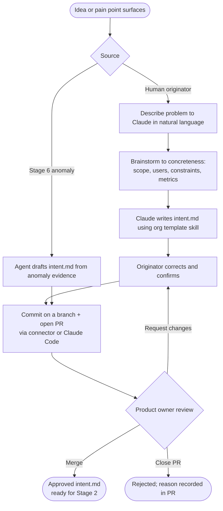
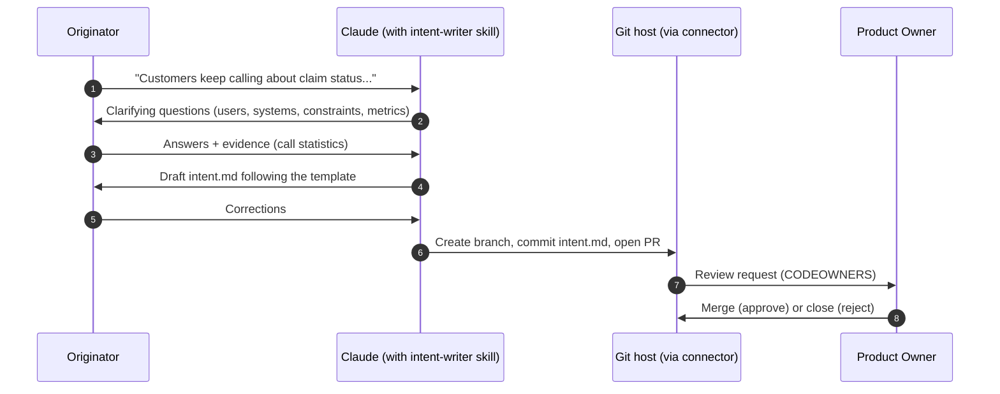

# Stage 1 — Plan: Capturing Intent as a Versioned Artifact

> **Stage output:** `intent.md` &nbsp;|&nbsp; **Read by:** Stage 2 (Design) &nbsp;|&nbsp; **Gate:** Product owner merge


---

## Table of Contents

1. [Purpose](#1-purpose)
2. [What Changes vs. the Traditional Approach](#2-what-changes-vs-the-traditional-approach)
3. [Inputs and Outputs](#3-inputs-and-outputs)
4. [Roles Involved (RACI)](#4-roles-involved-raci)
5. [Prerequisites and Infrastructure](#5-prerequisites-and-infrastructure)
6. [Stage Flow Diagram](#6-stage-flow-diagram)
7. [Step-by-Step How-To](#7-step-by-step-how-to)
8. [Worked Example: Claims Status Self-Service](#8-worked-example-claims-status-self-service)
9. [Governance and Audit Evidence](#9-governance-and-audit-evidence)
10. [Metrics](#10-metrics)
11. [Anti-Patterns and Pitfalls](#11-anti-patterns-and-pitfalls)
12. [Entry and Exit Criteria](#12-entry-and-exit-criteria)
13. [Checklist](#13-checklist)
14. [Related](#14-related)

---

## 1. Purpose

The Plan stage exists to turn an idea into something the rest of the delivery system can act on. In a traditional organization, that translation is slow: an idea surfaces in a meeting or a support escalation, waits for a product manager to find time, gets written up into a requirements document, is reviewed by a committee, and eventually lands in a backlog tool as a ticket whose description has lost most of the original context.

In an AI-native SDLC, the person who *has* the idea — whether that is an engineer, a contact-center manager, a claims adjuster, or a compliance analyst — can work with Claude directly to shape it into a structured, machine-readable proto-specification called `intent.md`. That file is committed to version control, where it becomes the first link in a chain of artifacts that every subsequent stage reads.

The purpose of the stage can be summarized in three commitments:

- **Capture the problem while context is fresh.** The originator is the person with the richest understanding of the pain point. The stage lets them record it before it is filtered through intermediaries.
- **Make the idea concrete enough to be judged.** A good `intent.md` names the users, the systems affected, the constraints that must hold, the outcome that would count as success, and the questions nobody can answer yet.
- **Put the idea under version control.** Once intent is a file in a repository, it has an author, a timestamp, a review history, and a stable address that later artifacts can reference.

Planning does not disappear in an AI-native organization; it becomes faster and more inclusive, and its output becomes an input a machine can read.

## 2. What Changes vs. the Traditional Approach


| Dimension | Traditional planning | AI-native planning |
|---|---|---|
| Who writes it | A product manager or business analyst, often after several meetings | The originator of the idea, working with Claude; the product owner reviews |
| Format | Prose requirements document, slide deck, or ticket description | Structured Markdown (`intent.md`) that follows an agreed organizational template |
| Where it lives | Wiki page, shared drive, or ticket body | Version-controlled repository (an `intent/` folder or a per-feature work folder) |
| Time to first draft | Days to weeks, gated by PM availability | Hours; often a single working session |
| Approval mechanism | Steering committee or backlog grooming meeting | Pull request; the product owner's merge is the approval, a closed PR is a rejection |
| Traceability | Links are manual and frequently broken | Git provides author, timestamp, and revision history automatically; later artifacts reference the file by path |
| Who can participate | Mostly people comfortable with the tooling and the process | Anyone with Claude access; connectors let non-engineers commit without knowing git |

The most important shift is not speed but *who* is empowered. When the bottleneck of "waiting for someone to write it up" is removed, ideas from the front line reach the delivery system with less distortion. The control objective — that someone accountable decides whether an idea is worth pursuing — is preserved; only the enforcement mechanism changes from a meeting to a merge.

## 3. Inputs and Outputs

### Inputs

| Input | Description | Typical source |
|---|---|---|
| Problem statement in natural language | The originator's own description of what is wrong or what is possible | A conversation with Claude |
| Supporting evidence | Call-center statistics, support ticket counts, customer feedback, incident reports, production anomalies | Reporting tools, spreadsheets, connectors, or a Stage 6 anomaly finding |
| Organizational intent template | The agreed structure every `intent.md` must follow | `../03-Templates/intent.template.md`, ideally encoded as a skill |
| Known constraints | Regulatory, privacy, architectural, or contractual limits | The originator's knowledge, policy owners, prior `spec.md` files |

### Outputs

| Output | Description | Consumed by |
|---|---|---|
| `intent.md` | A structured proto-spec with title, author, status, problem, proposed outcome, affected users and systems, constraints, success metrics, and open questions | Stage 2 (Design), which reads it to produce `spec.md` |
| Pull request | The review record containing the product owner's decision and any discussion | Audit, governance, and the source-of-truth linkage |
| Link to legacy record (optional) | If Jira, ServiceNow, or another tool is authoritative, the record ID in the file and the commit SHA in the record | Portfolio tracking; see `../02-Guides/Source-of-Truth-and-Legacy-Systems.md` |


## 4. Roles Involved (RACI)

R = Responsible (does the work), A = Accountable (owns the decision), C = Consulted, I = Informed.

| Activity | Originator | Product Owner | Tech Lead | Policy Owners (Security, Privacy, Compliance) | Platform Engineer | Claude |
|---|---|---|---|---|---|---|
| Describe the problem | **R/A** | I | — | — | — | C (asks clarifying questions) |
| Brainstorm scope, users, constraints | **R** | C | C (optional) | C (when constraint is regulatory) | — | **R** (drafts, challenges, proposes) |
| Draft `intent.md` from template | A | I | — | — | — | **R** |
| Correct and finalize content | **R/A** | C | — | — | — | C |
| Commit and open PR | **R** | I | — | — | — | R (via connector or Claude Code) |
| Approve (merge) or reject (close) | I | **R/A** | C (for higher-risk ideas) | C | — | — |
| Maintain intent template / skill | — | C | C | C | **R/A** | — |

Two points deserve emphasis. First, the originator is accountable for the *content* of the problem statement, because they own the pain; the product owner is accountable for the *decision* to proceed. Second, Claude is a drafting and challenging partner, never an approver. Nothing in this stage lets an agent merge its own intent.

## 5. Prerequisites and Infrastructure

### Prerequisites

The Plan stage has no upstream artifact prerequisites — it is the entry point of the loop. It can be triggered by a human with an idea or, once Stage 6 is mature, by an automated anomaly detection that writes a draft `intent.md` for human triage.

### Infrastructure

| Component | Why it is needed | Notes |
|---|---|---|
| Claude access for non-engineers | Originators are frequently not engineers | Claude desktop or web app is sufficient; Claude Code is not required for this stage |
| An agreed `intent.md` template | Consistency lets Stage 2 read every intent the same way | Start from `../03-Templates/intent.template.md` |
| Template encoded as a skill | So Claude applies the template automatically whenever someone asks for an intent | See `../02-Guides/Skills-Guide.md`; store at `.claude/skills/intent-writer/SKILL.md` or distribute via an organizational plugin |
| A shared, version-controlled home | Intent must live where later stages can read it | A per-change folder `work/<record-id>-<slug>/` in the product repository (the convention used throughout this kit) |
| A connector for committing | Non-engineers should not need to learn git | A GitHub (or equivalent) connector lets Claude open a branch and pull request on the originator's behalf |
| Branch protection on the intent folder | Merge must mean product owner approval | Use CODEOWNERS to require the relevant product owner's review |

### A minimal repository layout

```text
product-portal/
├── CLAUDE.md
├── .claude/
│   └── skills/
│       └── intent-writer/
│           └── SKILL.md
├── work/
│   └── CLM-1427-claims-status-self-service/
│       ├── intent.md        <- Stage 1 output
│       ├── spec.md          <- Stage 2 output
│       └── plan.md          <- Stage 3 output
└── .github/
    └── CODEOWNERS           <- work/** requires product-owner review
```

A sample `CODEOWNERS` rule:

```text
# Product owners must approve every new or changed intent/spec
/work/**/intent.md   @acme-insurance/product-owners-digital
/work/**/spec.md     @acme-insurance/product-owners-digital
```

## 6. Stage Flow Diagram



A sequence view of the same flow, for teams that want to see who talks to whom:



## 7. Step-by-Step How-To

### Step 1 — Describe the problem in plain language

Start a conversation with Claude and describe the problem the way you would explain it to a colleague. Do not try to write requirements yet; focus on what is happening, who is affected, and why it matters. Attach any evidence you have.

**Prompt the originator can paste:**

```text
I want to capture a product idea as an intent.md for our delivery team.

Here's the problem in my own words:
<describe what is going wrong, who experiences it, and how you know>

Evidence I have:
<paste numbers, ticket counts, quotes, or attach a spreadsheet>

Please don't write the document yet. First, ask me the questions you need
answered to make this concrete: who the users are, which systems are
involved, what constraints must hold, and how we'd know it worked.
```

### Step 2 — Brainstorm to concreteness

Let Claude interrogate the idea. The goal is to move from "customers are frustrated" to named users, named systems, explicit constraints, and a measurable outcome. Good brainstorming also surfaces what is *out* of scope.

**Prompt to push for concreteness:**

```text
Challenge this idea. For each of the following, tell me what's still vague
and propose a concrete version I can accept or correct:
1. Scope: what is in, what is explicitly out
2. Users: which user groups, and which are we NOT serving in v1
3. Systems: which existing systems are read from or written to
4. Constraints: regulatory, privacy, performance, contractual
5. Success metric: one primary metric with a baseline and a target
Then list the open questions nobody in this conversation can answer.
```

**Prompt to test the idea against risk:**

```text
Play the role of a skeptical product owner and a security reviewer.
What would each of them reject or question in this idea as it stands?
Keep it to the five most important objections.
```

### Step 3 — Ask Claude to write `intent.md` using the organizational template

If the template is encoded as a skill, Claude will apply it when asked for an intent. If it is not yet a skill, paste or attach the template.

**Prompt:**

```text
Now write intent.md using our organization's intent template.
- Status: Draft
- Author: <your name and team>
- Link the legacy record ID <e.g. CLM-1427> in the header
- Keep "Proposed outcome" to observable behavior, not implementation
- Put anything we couldn't resolve under "Open questions" with a suggested owner
Do not invent numbers; if a baseline is unknown, say so.
```

### Step 4 — Correct and confirm

Read the draft critically. The originator is accountable for the content, so check that the problem statement is faithful, the numbers are real, and the constraints are stated as constraints (must hold) rather than preferences.

**Prompt for a final pass:**

```text
Review this intent.md for three failure modes and fix them:
1. Implementation detail that belongs in spec.md or plan.md
2. Constraints phrased as wishes ("should ideally") instead of rules ("must")
3. Success metrics without a baseline, a target, or a way to measure
Show me a short list of what you changed.
```

### Step 5 — Commit with author and timestamp

Commit the file on a branch and open a pull request. Non-engineers can ask Claude to do this through a connector; engineers can do it in Claude Code.

**Prompt (connector-enabled Claude):**

```text
Commit this intent.md to the product-portal repository at
work/CLM-1427-claims-status-self-service/intent.md on a new branch named
intent/CLM-1427, and open a pull request titled
"Intent: Claims status self-service (CLM-1427)". Request review from the
digital product owners team. Put the one-paragraph problem summary in the
PR description.
```

**Equivalent commands for engineers:**

```bash
git switch -c intent/CLM-1427
git add work/CLM-1427-claims-status-self-service/intent.md
git commit -m "intent: claims status self-service (CLM-1427)"
git push -u origin intent/CLM-1427
gh pr create --title "Intent: Claims status self-service (CLM-1427)" \
  --body-file work/CLM-1427-claims-status-self-service/intent.md \
  --reviewer acme-insurance/product-owners-digital
```

### Step 6 — Product owner decides

The product owner reviews the pull request. Merging is approval. Closing the pull request is rejection, and the reason should be stated in a closing comment so the decision is part of the record. Requesting changes sends the intent back to the originator.

**Prompt the product owner can use to review faster:**

```text
Here is an intent.md submitted for my approval. Assess it against:
- Does it describe a real problem with evidence?
- Is the success metric measurable with data we already collect?
- Are any constraints likely to need a policy owner's sign-off in design?
- Is there overlap with any intent already in work/ (list the folders)?
Give me a recommendation: approve, request changes (with specifics), or reject.
```

### Step 7 — (Optional) Link to the legacy system of record

If your organization keeps Jira, ServiceNow, or another tool as the authoritative portfolio record, apply the minimum linkage: the artifact carries the record ID, and the record carries the commit SHA. See `../02-Guides/Source-of-Truth-and-Legacy-Systems.md` for the two authority models.

```bash
# After merge, capture the SHA to paste into the legacy record
git log -1 --format=%H -- work/CLM-1427-claims-status-self-service/intent.md
```

## 8. Worked Example: Claims Status Self-Service

This example runs through all six stage documents. Here it begins.

### Context

Acme Insurance (a fictional carrier) runs a customer portal for policyholders. The contact-center operations manager, Priya, notices from her reporting that a large share of inbound call time is spent answering one question: *"What is the status of my claim?"* She estimates that roughly one third of total call handling time goes to claim-status queries. Customers already log in to the portal to pay premiums and download documents, but claim status is not shown there.

Priya is not an engineer. She has access to Claude through her organization's enterprise workspace, and the product portal repository has a GitHub connector configured.

### The conversation (abridged)

Priya opens Claude and writes:

```text
I manage the contact center. About a third of our call handling time is
customers asking where their claim is. The portal doesn't show claim status.
I want to propose adding it. Help me write this up as an intent for the
digital team. Ask me what you need.
```

Claude asks about which customers file claims online versus by phone, which systems hold claim status, whether any third parties need visibility, and what "success" would mean. Through the exchange, several facts emerge:

- Claim status lives in the **claims-core** system, which exposes an internal API.
- Priya has heard from the integration team that claims-core is sensitive to load, but she does not know the details. Claude records this as an open question for the technical team rather than inventing a number.
- The privacy office has a standing rule that the portal session must not carry any new categories of personally identifiable information without a privacy review.
- Some claims are handled by third-party loss adjusters, and nobody in the conversation knows whether they should see status in the portal.

### The resulting `intent.md`

```markdown
# Intent: Claims Status Self-Service in the Customer Portal

| Field | Value |
|---|---|
| Record ID | CLM-1427 |
| Author | Priya Raman, Contact Center Operations |
| Status | Draft |
| Created | 2026-09-02 |
| Template version | intent-template v1.3 |

## Problem
Policyholders cannot see the status of their claims in the customer portal,
so they call the contact center. Claim-status queries account for roughly
one third of total contact-center call handling time (source: Q2 contact
center reporting, "reason for call" field). These calls are repetitive,
add wait time for customers with complex needs, and cost handling time
that could be redirected.

## Proposed outcome
A logged-in policyholder can see the current status of each of their open
claims in the portal, with a plain-language explanation of what the status
means and what happens next, without calling the contact center.

## Affected users and systems
- Users: retail policyholders with at least one open claim (v1)
- Not in v1: brokers, commercial policyholders
- Systems: customer portal (web), claims-core (read-only), identity provider
  (existing portal login)

## Constraints
- MUST NOT introduce any new PII into the portal session. Only data already
  permitted in the portal session may be displayed.
- MUST be read-only against claims-core; no status changes from the portal.
- MUST respect claims-core capacity limits (exact limits to be confirmed by
  the integration team — see open questions).
- MUST meet existing portal accessibility standards.

## Success metrics
- Primary: share of contact-center call handling time attributed to claim
  status. Baseline ~33% (Q2). Target: reduce by at least a third within
  two quarters of launch.
- Secondary: portal claim-status page views per open claim; contact-center
  repeat-call rate for the same claim.

## Open questions
1. Do third-party loss adjusters need access to status via the portal?
   (Suggested owner: Claims Operations lead)
2. What are claims-core's rate limits and does the portal need caching?
   (Suggested owner: Integration team / Tech lead)
3. Which claim states exist and which should be customer-visible?
   (Suggested owner: Claims Operations lead)
```

Note how the intent contains no implementation detail — no mention of caching strategy, component names, or endpoints. It states what must be true and leaves *how* to later stages. The rate-limit concern is deliberately captured as an open question rather than a guess; in Stage 2, the integration team will confirm the limit as 50 requests per second.

### Review and merge

Claude commits the file to `work/CLM-1427-claims-status-self-service/intent.md` on branch `intent/CLM-1427` and opens a pull request. Daniel, the digital product owner, reviews it the same afternoon. He asks one change: add the secondary metric on repeat calls, which Priya had mentioned but Claude had left out. Priya asks Claude to update the file; the revision appears as a second commit. Daniel merges. Elapsed time from Priya's first message to merged intent: about four hours.

The Jira epic CLM-1427 is updated with the merge commit SHA, satisfying the minimum source-of-truth linkage.

**Next:** In [Stage 2 — Design](02-Design-Spec.md), Daniel's merge triggers the design pass that produces `spec.md`.

## 9. Governance and Audit Evidence

The Plan stage produces strong evidence with almost no extra effort, because git records it as a side effect of the workflow.

| Control objective | Evidence produced | Where to find it |
|---|---|---|
| Every piece of work traces back to an approved business need | Merged `intent.md` with its merge commit | `git log --follow work/<id>/intent.md` |
| Authorship is attributable | Commit author and PR opener | Git history, PR metadata |
| Approval is recorded and attributable | PR merge by a CODEOWNERS member | PR "merged by" field, branch protection audit log |
| Rejections are recorded with rationale | Closed PR with closing comment | PR history (closed, not merged) |
| Changes to intent after approval are visible | Subsequent commits to `intent.md` | `git log` on the file after the merge date |
| The template in force at the time is known | Template version field in the header; skill version in git | `intent.md` header, `.claude/skills/intent-writer/` history |

**Auditor query examples:**

```bash
# All intents approved in a quarter, with who merged them
gh pr list --state merged --search "Intent: in:title merged:2026-07-01..2026-09-30" \
  --json number,title,mergedBy,mergedAt

# All rejected intents with their closing rationale
gh pr list --state closed --search "Intent: in:title is:unmerged" \
  --json number,title,closedAt,url
```

## 10. Metrics


### Leading indicators

**Time from conversation to committed `intent.md`.** The target is measured in hours, not weeks. Because the conversation start time is not in git, use the timestamp of the first commit on the intent branch as a proxy, and optionally ask originators to record the conversation start in the PR description.

```bash
# Hours from first commit on an intent branch to PR open (proxy for drafting time)
gh pr list --state all --search "Intent: in:title" --limit 200 \
  --json number,createdAt,commits \
  | jq -r '.[] | [.number, .createdAt, (.commits[0].committedDate)] | @tsv'
```

**Time from PR open to product owner decision.** A leading signal of review capacity in this stage.

```bash
gh pr list --state merged --search "Intent: in:title" --limit 200 \
  --json number,createdAt,mergedAt \
  | jq -r '.[] | "\(.number)\t\(((.mergedAt|fromdate) - (.createdAt|fromdate))/3600 | floor)h"'
```

### Lagging indicators

**Product owner acceptance rate.** Merged intent PRs divided by all closed intent PRs in the period. A very high rate may mean intents are pre-filtered too heavily (people are not proposing enough); a very low rate may mean the template or brainstorming step is not doing its job.

```bash
merged=$(gh pr list --state merged --search "Intent: in:title" --limit 500 --json number | jq length)
closed=$(gh pr list --state closed --search "Intent: in:title is:unmerged" --limit 500 --json number | jq length)
echo "acceptance rate: $(echo "scale=2; $merged/($merged+$closed)" | bc)"
```

**Changes to `intent.md` after `spec.md` exists.** Each such change means the problem was not understood well enough before design began. Compute by comparing commit dates:

```bash
for d in work/*/; do
  spec_first=$(git log --diff-filter=A --format=%ct -- "$d/spec.md" | tail -1)
  [ -z "$spec_first" ] && continue
  late=$(git log --format=%ct -- "$d/intent.md" | awk -v s="$spec_first" '$1 > s' | wc -l)
  echo "$d late-intent-changes=$late"
done
```

## 11. Anti-Patterns and Pitfalls

| Anti-pattern | Why it hurts | Better practice |
|---|---|---|
| **Letting Claude invent numbers** | A fabricated baseline anchors every later decision and misleads the success review | Instruct Claude to mark unknowns as open questions; the originator must supply or confirm every number |
| **Writing implementation into intent** | Premature design constrains Stage 2 and bypasses the policy skills that apply there | Keep "Proposed outcome" to observable behavior; move "how" to `spec.md` |
| **Intent living outside the repository** | Later stages cannot read it, and the audit trail breaks | Always commit to the agreed folder; use a connector if the originator is not comfortable with git |
| **Skipping the template** | Every intent looks different, so the Stage 2 automation cannot parse them reliably | Encode the template as a skill so it is applied without anyone having to remember it |
| **Treating merge as a formality** | If the product owner rubber-stamps, the stage loses its only human judgment gate | CODEOWNERS enforcement plus a product-owner review prompt; track acceptance rate |
| **Two systems both claiming to be authoritative** | Conflicting status in Jira and in `intent.md` erodes trust in both | Decide explicitly which system is authoritative for intent; link the other by ID and SHA |
| **Mega-intents** | "Rebuild the portal" cannot be designed, planned, or measured as one unit | Split into intents with one primary success metric each |
| **Constraints phrased as preferences** | "Ideally we avoid PII" will not be enforced by later stages | Write constraints with MUST / MUST NOT language |

## 12. Entry and Exit Criteria

### Definition of Ready (entry)

- [ ] A problem or opportunity has been observed by a person or surfaced by a Stage 6 anomaly.
- [ ] The originator has access to Claude (and a connector, if not an engineer).
- [ ] The organizational intent template (or skill) is available.
- [ ] The target repository and folder convention are known.

### Definition of Done (exit)

- [ ] `intent.md` follows the current template and records the template version.
- [ ] Problem statement is supported by evidence the originator has confirmed.
- [ ] At least one success metric has a baseline (or an explicit "baseline unknown" with a plan to measure) and a target.
- [ ] Constraints use MUST / MUST NOT language.
- [ ] Open questions each name a suggested owner.
- [ ] The file is committed and merged by an authorized product owner, or the PR is closed with a recorded reason.
- [ ] If a legacy system is used, the record ID is in the file and the merge SHA is in the record.

## 13. Checklist

- [ ] Problem described in natural language, with evidence attached
- [ ] Claude asked clarifying questions before drafting
- [ ] Scope, users, systems, constraints, and metrics made concrete
- [ ] Template applied (via skill) and version recorded
- [ ] No invented numbers; unknowns listed as open questions
- [ ] No implementation detail in the intent
- [ ] Committed on a branch, PR opened, product owner requested
- [ ] Decision recorded (merge or closed with reason)
- [ ] Legacy record linked, if applicable

## 14. Related

- Next stage: [02 — Design: Spec](02-Design-Spec.md)
- Stage index: [README](README.md)
- Main playbook: [AI-Native SDLC Playbook](../00-Playbook/AI-Native-SDLC-Playbook.md)
- Guides:
  - [Skills Guide](../02-Guides/Skills-Guide.md) — encoding the intent template as a skill
  - [Source of Truth and Legacy Systems](../02-Guides/Source-of-Truth-and-Legacy-Systems.md) — choosing the authoritative system for intent
  - [CLAUDE.md Guide](../02-Guides/CLAUDE-md-Guide.md) — repository context that later stages rely on
  - [Claude On-Call Guide](../02-Guides/Claude-On-Call-Guide.md) — how on-call findings re-enter as intent
- Templates:
  - [intent.template.md](../03-Templates/intent.template.md)
  - [spec.template.md](../03-Templates/spec.template.md) — to see what the next stage will need from you

---

*Based on concepts from Anthropic's AI-Native SDLC Playbook; expanded guidance for implementation.*
