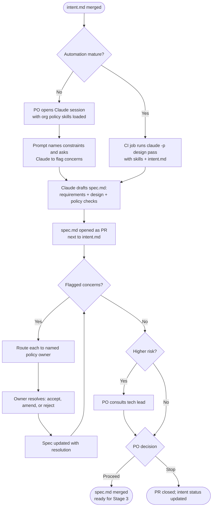
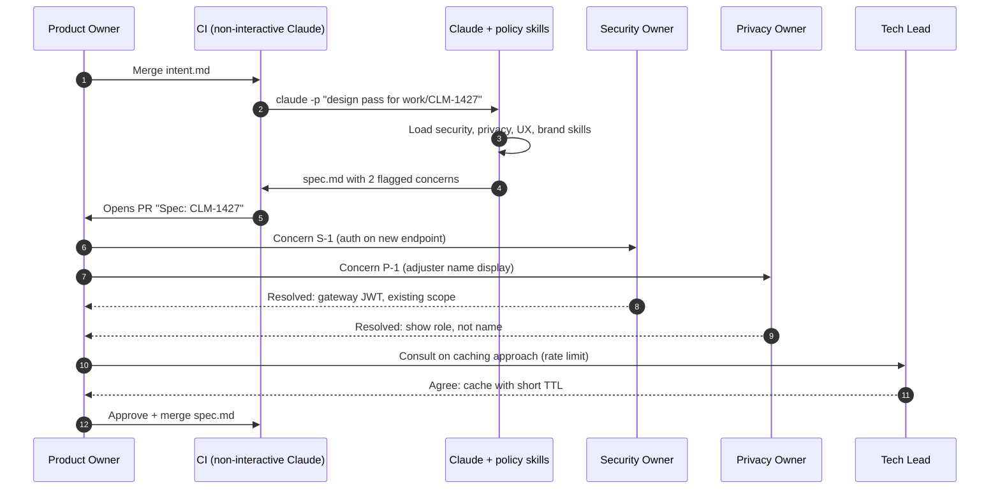

# Stage 2 — Design: Requirements and Design Combined into `spec.md`

> **Stage input:** approved `intent.md` &nbsp;|&nbsp; **Stage output:** `spec.md` &nbsp;|&nbsp; **Read by:** Stage 3 (Build) &nbsp;|&nbsp; **Gate:** Product owner sign-off, with flagged concerns resolved by named policy owners


---

## Table of Contents

1. [Purpose](#1-purpose)
2. [What Changes vs. the Traditional Approach](#2-what-changes-vs-the-traditional-approach)
3. [Inputs and Outputs](#3-inputs-and-outputs)
4. [Roles Involved (RACI)](#4-roles-involved-raci)
5. [Prerequisites and Infrastructure](#5-prerequisites-and-infrastructure)
6. [Stage Flow Diagram](#6-stage-flow-diagram)
7. [Step-by-Step How-To](#7-step-by-step-how-to)
8. [Automating the Design Pass](#8-automating-the-design-pass)
9. [Worked Example: Claims Status Self-Service](#9-worked-example-claims-status-self-service)
10. [Governance and Audit Evidence](#10-governance-and-audit-evidence)
11. [Metrics](#11-metrics)
12. [Anti-Patterns and Pitfalls](#12-anti-patterns-and-pitfalls)
13. [Entry and Exit Criteria](#13-entry-and-exit-criteria)
14. [Checklist](#14-checklist)
15. [Related](#15-related)

---

## 1. Purpose

The Design stage converts an approved intent into a specification that is precise enough for an engineer (working with Claude in plan mode) to build from. The distinctive feature of the AI-native approach is that **requirements analysis and solution design happen in the same session**, and organizational policy is applied *while the spec is being written*, not discovered later in a review.

In most organizations, policy lives in documents that few people read end to end: brand guidelines, a security standard, a privacy handbook, accessibility rules, data-retention schedules. Traditional design phases rely on people remembering those documents, and gaps surface late — in a security review a week before launch, or in an accessibility audit after release. In an AI-native SDLC those policies are encoded as **skills**, and the design session loads them. When the spec is drafted, the security skill checks for authentication and audit requirements, the privacy skill checks data categories, the brand and UX skills check copy and layout conventions, and anything that cannot be resolved automatically is flagged for a named policy owner.

The purpose of the stage is therefore:

- **Produce a single `spec.md`** that combines *what* the feature must do (requirements) with *how* it will fit into the existing system (design) at a level of detail suitable for planning.
- **Apply live policy as the spec is written**, so compliance is built in rather than inspected in.
- **Route unresolved concerns to accountable humans** early, while changing course is cheap.
- **Keep the product owner in control** of whether the work proceeds, without requiring them to have engineering skills.

## 2. What Changes vs. the Traditional Approach


| Dimension | Traditional design | AI-native design |
|---|---|---|
| Structure | Separate requirements (business analyst) and design (architect, UX designer) phases with hand-offs | One combined session guided by policy skills |
| When policy is applied | Late: design reviews, security reviews, compliance sign-off boards | During drafting: policy skills are loaded and consulted as the spec is written |
| Who drives it | Analysts, architects, designers, often in sequence | The product owner with Claude; tech lead consulted for higher-risk work |
| Output | Multiple documents (BRD, FRD, architecture doc, wireframes) | One version-controlled `spec.md` next to `intent.md` |
| Concern handling | Found in review, often after significant effort | Flagged in the spec with a named policy owner; resolved before planning |
| Trigger | A meeting is scheduled | Merge of `intent.md`; can be fully automated as a non-interactive job that opens a PR |
| Policy versioning | Implicit ("the current standard") | Explicit: skill versions used in the session are recorded |

The control objectives are unchanged — requirements must be understood, the design must satisfy security, privacy, brand, and accessibility policy, and an accountable person must approve before build. What changes is *when* and *how* those objectives are enforced.

## 3. Inputs and Outputs

### Inputs

| Input | Description | Source |
|---|---|---|
| Approved `intent.md` | The merged intent from Stage 1 | `work/<id>/intent.md` |
| Organizational policy skills | Security, privacy, compliance, brand, UX, accessibility — each with a named owner | `.claude/skills/` or an organizational plugin marketplace |
| Existing system context | Architecture notes, API contracts (OpenAPI), prior specs | Repository, `CLAUDE.md`, connectors |
| Spec template | The agreed structure for `spec.md` | `../03-Templates/spec.template.md` |
| Answers to open questions | Resolutions from the owners named in `intent.md` | Owners, often via PR comments |

### Outputs

| Output | Description | Consumed by |
|---|---|---|
| `spec.md` | Combined requirements and design: user stories, acceptance criteria, data handled, interfaces, non-functional requirements, policy checks, flagged concerns, and decisions | Stage 3 (Build) — read in plan mode to produce `plan.md` |
| Policy concern log | Flagged items, each with an owner and resolution, inside `spec.md` | Policy owners, audit |
| Skill version record | Which versions of which skills shaped the spec | Audit; reproducibility |
| Pull request | Review and sign-off record | Governance |

## 4. Roles Involved (RACI)

| Activity | Product Owner | Claude (with policy skills) | Tech Lead | Security Owner | Privacy / Compliance Owner | Brand / UX Owner | Platform Engineer |
|---|---|---|---|---|---|---|---|
| Start design session with intent attached | **R/A** | — | I | — | — | — | — |
| Draft requirements and design | A | **R** | C | — | — | — | — |
| Apply policy and flag concerns | I | **R** | I | C | C | C | — |
| Resolve flagged security concerns | C | — | C | **R/A** | — | — | — |
| Resolve flagged privacy/compliance concerns | C | — | — | — | **R/A** | — | — |
| Resolve flagged brand/UX concerns | C | — | — | — | — | **R/A** | — |
| Consult on higher-risk design choices | A | — | **R** | C | C | — | — |
| Decide to proceed (sign-off) | **R/A** | — | C | I | I | I | — |
| Commit `spec.md` | R | R (automated job) | I | — | — | — | — |
| Maintain skills and design automation | — | — | C | C (security skill) | C (privacy skill) | C (brand skill) | **R/A** |

Each policy skill has one named owner. That owner is accountable for the skill's content and for resolving concerns raised under it. This is what keeps skill-based governance from becoming "the AI said it was fine".

## 5. Prerequisites and Infrastructure

### Prerequisites

- An **approved (merged) `intent.md`**. Design never starts from an unmerged intent.
- **Skills that encode policy**, each with a named owner and a written source of truth. Start with the policies that are most often missed in late reviews — typically security and privacy.

### Infrastructure

| Component | Purpose | Notes |
|---|---|---|
| Claude access for the product owner | The PO drives the session | No engineering skill needed; Claude desktop/web with the org plugin, or Claude Code for technical POs |
| Policy skills | Encode brand, security, compliance, UX rules | See `../02-Guides/Skills-Guide.md`; example: `../03-Templates/skills/secure-api-review/SKILL.md` |
| Organizational slash command (later) | Standardize the design prompt so every session asks the same questions | A command such as `/design-from-intent` stored in the org plugin |
| Non-interactive job (later) | Run the design pass automatically when an intent merges | `claude -p` in CI; see Section 8 and `../02-Guides/CI-CD-Integration-Guide.md` |
| CODEOWNERS for `spec.md` | Ensure product-owner sign-off | Same pattern as Stage 1 |

### Skill anatomy reminder

A skill is a folder containing a `SKILL.md` file with YAML frontmatter (`name`, and a `description` stating *when* the skill should be used) and a body describing what to do. Claude decides to load a skill when the task matches its description, so the description must name the trigger clearly.

```markdown
---
name: privacy-data-classification
description: Use when writing or reviewing a spec, plan, or code change that
  displays, stores, logs, or transmits customer data. Checks data categories
  against the portal session data allowlist.
---

# Privacy data classification

1. List every data field the change reads, displays, stores, or logs.
2. Classify each against the portal session allowlist in
   docs/policy/portal-session-data.md.
3. Any field not on the allowlist is a flagged concern owned by the
   Privacy Office (privacy-office@acme.example). Do not propose a
   workaround; flag it.
4. PII-tagged fields must never appear in logs or error messages.
```

Skills are advisory: they guide Claude's behavior but do not deterministically enforce it. Stage 2 relies on human sign-off to close the loop; later stages back must-hold rules with hooks.

## 6. Stage Flow Diagram





## 7. Step-by-Step How-To

### Step 1 — Open a session with organizational skills and attach the intent

The product owner opens Claude (with the organization's plugin, so policy skills are available) and attaches or references the merged `intent.md`. In Claude Code, this means starting a session in the repository; skills in `.claude/skills/` and installed plugins are discovered automatically.

**Prompt:**

```text
I'm the product owner for work/CLM-1427-claims-status-self-service.
Read intent.md in that folder. We're going to produce spec.md together using
our spec template. Before drafting anything, list which of our policy skills
apply to this intent and why.
```

### Step 2 — Name the constraints and ask Claude to flag concerns

Be explicit about the constraints from the intent, and instruct Claude to flag — not silently resolve — any policy concern.

**Prompt:**

```text
Draft spec.md for this intent. Treat these as hard constraints:
- No new PII in the portal session
- Read-only access to claims-core
- Respect claims-core's rate limit (confirm the figure from the integration docs)
- Existing portal accessibility standard

Apply our security, privacy, brand, and UX skills as you write.
For every point where a skill's rule is not clearly satisfied, add an entry
under "Flagged concerns" with: ID, the skill and rule, what's at issue,
the named policy owner, and options. Do not resolve concerns by assumption.
Record the name and version of every skill you applied in the header.
```

### Step 3 — Resolve open questions carried from the intent

Every open question in `intent.md` must be either answered in `spec.md` or explicitly carried forward with a decision about why it can wait.

**Prompt:**

```text
List every open question from intent.md. For each, show:
(a) the answer if we have one (and its source),
(b) otherwise, whether it blocks planning, and who must answer it.
Update spec.md's "Decisions" section accordingly.
```

### Step 4 — Review the spec against the original idea

The product owner's job is to confirm the spec still solves the problem in the intent. Scope creep and scope loss are both common.

**Prompt:**

```text
Compare spec.md with intent.md. Report:
1. Anything in the spec that the intent did not ask for (scope creep)
2. Anything the intent asked for that the spec doesn't deliver
3. Whether each success metric in the intent can actually be measured
   with what the spec builds (e.g. is the page instrumented?)
```

### Step 5 — Route flagged concerns to named owners

Each flagged concern goes to its policy owner. The simplest mechanism is a PR comment mentioning the owner (or their team) with the concern ID. The owner's response is recorded in the PR and reflected in `spec.md`.

**Prompt to prepare the routing:**

```text
For each flagged concern in spec.md, draft a short PR comment addressed to
its owner: the concern ID, the rule, the question we need answered, and the
options with trade-offs. Keep each comment under 120 words.
```

### Step 6 — Decide whether to proceed

The product owner decides. For higher-risk changes — new integrations, authentication changes, data model changes, anything touching money or regulated data — consult the tech lead before signing off.

**Prompt for a risk read:**

```text
Classify this spec's delivery risk as low, medium, or high, with reasons,
using these factors: new external dependencies, changes to auth or data
handling, load on shared systems, reversibility. If medium or high, list
the three questions I should ask the tech lead.
```

### Step 7 — Commit `spec.md` next to `intent.md`

Merge the PR. `spec.md` now lives at `work/<id>/spec.md`, directly beside the intent it satisfies.

## 8. Automating the Design Pass

Once the manual session is working well and the prompt is stable, capture it as an organizational slash command, then automate it: acceptance (merge) of `intent.md` triggers a non-interactive job that performs the design pass and commits `spec.md` as a pull request. The product owner's role shifts from driving the session to reviewing its output.

The following GitHub Actions workflow is an illustrative pattern using headless mode (`claude -p`). Adapt tool permissions to your environment, and see `../02-Guides/CI-CD-Integration-Guide.md` for sandboxing and identity guidance.

```yaml
# .github/workflows/design-pass.yml  (illustrative)
name: design-pass
on:
  push:
    branches: [main]
    paths: ['work/**/intent.md']

permissions:
  contents: write
  pull-requests: write

jobs:
  spec:
    runs-on: ubuntu-latest
    steps:
      - uses: actions/checkout@v4
        with: { fetch-depth: 2 }
      - uses: actions/setup-node@v4
        with: { node-version: '20' }
      - run: npm install -g @anthropic-ai/claude-code
      - name: Find changed intents
        id: changed
        run: |
          echo "dirs=$(git diff --name-only HEAD~1 HEAD -- 'work/**/intent.md' \
            | xargs -n1 dirname | sort -u | tr '\n' ' ')" >> "$GITHUB_OUTPUT"
      - name: Run design pass
        env:
          ANTHROPIC_API_KEY: ${{ secrets.ANTHROPIC_API_KEY }}
          GH_TOKEN: ${{ github.token }}
        run: |
          for d in ${{ steps.changed.outputs.dirs }}; do
            [ -f "$d/spec.md" ] && continue   # never overwrite an existing spec
            branch="spec/$(basename "$d")"
            git switch -c "$branch"
            claude -p "Read $d/intent.md. Produce $d/spec.md using the spec \
              template in docs/templates/spec.template.md. Apply all relevant \
              policy skills, record skill names and versions in the header, \
              and list unresolved policy issues under Flagged concerns with \
              named owners. Do not modify any other file." \
              --allowedTools "Read,Grep,Glob,Write" \
              --output-format json > "$RUNNER_TEMP/design-run.json"
            # Fail closed if the agent touched anything other than spec.md
            other=$(git status --porcelain | grep -v " $d/spec.md$" || true)
            [ -n "$other" ] && { echo "Unexpected changes: $other"; exit 1; }
            git add "$d/spec.md"
            git -c user.name="design-bot" -c user.email="design-bot@acme.example" \
              commit -m "spec: design pass for $(basename "$d")"
            git push -u origin "$branch"
            gh pr create --title "Spec: $(basename "$d")" \
              --body "Automated design pass. Review flagged concerns before merge."
            git switch main
          done
```

Key properties of this pattern:

- The job **only proposes**; it opens a PR. The product owner still signs off by merging.
- Tool access is narrow (read, search, write), and a fail-closed check rejects the run if anything other than `spec.md` changed.
- The job runs under a distinct bot identity, so the audit trail distinguishes agent-authored from human-authored commits.

## 9. Worked Example: Claims Status Self-Service

*Continuing from [Stage 1](01-Plan-Intent.md), where Priya's `intent.md` for CLM-1427 was merged by Daniel, the digital product owner.*

### The design pass

Acme has already automated the design pass. When Daniel merges the intent, the `design-pass` workflow runs and opens PR "Spec: CLM-1427-claims-status-self-service" within a few minutes. The draft `spec.md` loads four skills: `secure-api-review` (v2.1), `privacy-data-classification` (v1.4), `portal-ux-patterns` (v3.0), and `brand-voice` (v1.2).

While reading the integration documentation in the repository, Claude confirms that **claims-core enforces a rate limit of 50 requests per second** for the portal's client credentials. Claude records this as a non-functional constraint and notes, based on portal traffic figures in the architecture notes, that uncached per-page-view calls could exceed it at peak.

### Excerpt of the resulting `spec.md`

```markdown
# Spec: Claims Status Self-Service

| Field | Value |
|---|---|
| Record ID | CLM-1427 |
| Intent | work/CLM-1427-claims-status-self-service/intent.md (merged 2026-09-02) |
| Status | In review |
| Skills applied | secure-api-review v2.1; privacy-data-classification v1.4;
                   portal-ux-patterns v3.0; brand-voice v1.2 |

## User stories
- US-1: As a logged-in policyholder, I see a list of my open claims with
  their current status on the "My claims" page.
- US-2: As a policyholder, I see a plain-language explanation of what my
  claim's status means and what happens next.
- US-3: As a policyholder with no open claims, I see a clear empty state
  and a link to file a claim.

## Customer-visible claim states (v1)
| claims-core state | Portal label | Explanation (brand voice) |
|---|---|---|
| RECEIVED | Received | We have your claim and will assign it shortly. |
| IN_ASSESSMENT | Being assessed | An assessor is reviewing your claim. |
| AWAITING_INFO | We need something from you | Check your messages for what we need. |
| DECIDED | Decision made | We've made a decision; details are in your documents. |
Internal-only states (e.g. FRAUD_REVIEW) map to "Being assessed".

## Acceptance criteria
- AC-1: Each of the four customer-visible states renders its label and
  explanation exactly as in the table above.
- AC-2: Internal-only states never appear by name in the UI, API
  response, or client logs.
- AC-3: Page meets WCAG 2.2 AA per the portal accessibility standard.
- AC-4: Page view emits the existing analytics event with
  `page=claims_status` so the success metric can be measured.

## Interfaces and design
- New portal backend endpoint: GET /api/v1/me/claims/status
  (authenticated via existing gateway JWT; scope `portal.customer`).
- Backend reads claims-core `GET /claims?policyholderId=` using the
  portal's existing client credentials. Read-only.
- Response contains only: claim reference, portal label, explanation,
  last-updated date. No adjuster names, no amounts.

## Non-functional requirements
- NFR-1: claims-core rate limit is 50 rps for the portal client.
  The portal MUST NOT call claims-core once per page view without caching.
  Design: server-side cache keyed by policyholder, TTL 5 minutes;
  on claims-core 429 or timeout, serve cached value with "last updated" time.
- NFR-2: p95 page load under existing portal budget (2.5s).

## Data handled
| Field | Classification | On portal allowlist? |
|---|---|---|
| Claim reference | Customer identifier (already in session) | Yes |
| Status label | Non-PII | Yes |
| Last-updated date | Non-PII | Yes |
| Adjuster name | Third-party PII | NO (see P-1) |

## Flagged concerns
| ID | Skill / rule | Issue | Owner | Resolution |
|---|---|---|---|---|
| S-1 | secure-api-review: gateway JWT on every endpoint | New endpoint must be registered in gateway config | Security (Fatima Khan) | Resolved: register under existing `portal.customer` scope |
| P-1 | privacy-data-classification: session allowlist | UX draft showed assigned adjuster name | Privacy Office | Resolved: show role ("Your assessor") only; no name |

## Decisions
- D-1: Third-party loss adjusters are OUT of scope for v1 (Claims Ops lead,
  PR comment 2026-09-03). Revisit as a separate intent.
- D-2: Caching approach agreed with tech lead Mei Tan (NFR-1).
```

### Resolution and sign-off

Two concerns were flagged. Fatima (security) resolved S-1 in a PR comment within an hour. The privacy office resolved P-1 by removing the adjuster name — which, notably, would have introduced new third-party PII into the portal session and violated the intent's core constraint. In a traditional process, this might have been caught in a privacy review after the UI was built.

Because the feature adds load on a shared system, Daniel classifies it as medium risk and consults Mei, the tech lead, who agrees with the caching design. Daniel merges the spec on 2026-09-04. Elapsed time from intent merge to spec merge: about two days, almost all of it waiting for owners to answer questions.

**Next:** In [Stage 3 — Build](03-Build-Plan-Mode.md), Arjun, an engineer, opens Claude Code in plan mode against this spec.

## 10. Governance and Audit Evidence

| Control objective | Evidence produced | Where to find it |
|---|---|---|
| Designs comply with current policy | "Skills applied" header with versions; policy checks in the spec | `spec.md` header; skill folder git history shows exact content at that version |
| Policy concerns are resolved by accountable owners | Flagged concerns table with owner and resolution; owner's PR comment | `spec.md`, PR comments |
| An accountable person approved the design | PR merged by product owner (CODEOWNERS) | PR metadata |
| Higher-risk designs had technical consultation | Tech lead comment or approval on PR | PR reviews |
| Agent-authored content is distinguishable | Bot identity on automated commits; run output file | `git log --format='%an %s'`; JSON run output archived as a CI artifact |
| Open questions from intent were closed or consciously deferred | Decisions section | `spec.md` |

Because skills are versioned in git, an auditor can reconstruct exactly which policy text was in force for any spec:

```bash
# What did the privacy skill say when CLM-1427's spec was merged?
merge_date=$(git log -1 --format=%cI -- work/CLM-1427-claims-status-self-service/spec.md)
rev=$(git rev-list -1 --before="$merge_date" main -- .claude/skills/privacy-data-classification/)
git show "$rev:.claude/skills/privacy-data-classification/SKILL.md"
```

## 11. Metrics


### Leading indicator — Intent-to-spec elapsed time

The time between the commit that adds (or merges) `intent.md` and the commit that merges `spec.md`. Automation should make the *drafting* part near-instant; what remains is concern resolution and decision time.

```bash
for d in work/*/; do
  i=$(git log --diff-filter=A --format=%ct -- "$d/intent.md" | tail -1)
  s=$(git log --diff-filter=A --format=%ct -- "$d/spec.md" | tail -1)
  [ -n "$i" ] && [ -n "$s" ] && echo "$(basename "$d") $(( (s - i) / 3600 ))h"
done
```

A useful breakdown is concern resolution time per policy owner, taken from the timestamps of the owner's PR comments relative to the PR's creation. Persistent delays for one owner indicate a capacity problem or a skill that flags too aggressively.

### Lagging indicator — Requirements rework after build starts

Count the commits to `spec.md` that occur after the first commit of `plan.md`. Each one means requirements changed after engineering had begun.

```bash
for d in work/*/; do
  p=$(git log --diff-filter=A --format=%ct -- "$d/plan.md" | tail -1)
  [ -z "$p" ] && continue
  n=$(git log --format=%ct -- "$d/spec.md" | awk -v p="$p" '$1 > p' | wc -l)
  echo "$(basename "$d") spec-commits-after-plan=$n"
done
```

### Supporting indicators

- **Concerns flagged per spec, by skill.** A skill that never flags anything may not be triggering; one that flags everything may be too broad.
- **Share of flagged concerns resolved without a meeting.** A proxy for how actionable the concern entries are.

## 12. Anti-Patterns and Pitfalls

| Anti-pattern | Why it hurts | Better practice |
|---|---|---|
| **Claude resolving concerns by assumption** | A plausible-sounding resolution hides a policy decision nobody accountable made | Prompt explicitly to flag, not resolve; require a named owner for every concern |
| **Skills without owners** | Nobody updates them when policy changes; they drift from the real standard | Every skill has one named owner and one written source of truth |
| **Treating skill output as enforcement** | Skills are advisory; a missed trigger silently skips a rule | Keep human sign-off here; back must-hold rules with hooks in later stages (see `../02-Guides/Hooks-Guide.md`) |
| **Specs that drift into implementation plans** | File-by-file detail belongs in `plan.md`, where an engineer interrogates it in plan mode | Keep spec at the interface, data, and behavior level |
| **Regenerating the spec after sign-off** | Automated jobs overwriting a reviewed spec destroy the review | The job skips folders that already contain `spec.md`; changes after merge go through a new PR |
| **Unversioned skill references** | You cannot prove which policy applied | Record skill names and versions in the spec header |
| **PO rubber-stamping technical risk** | The PO may not see load or security implications | Classify risk explicitly; consult the tech lead for medium and high |
| **Acceptance criteria that cannot be tested** | Stage 4 has nothing to verify against | Write criteria as observable, checkable statements |

## 13. Entry and Exit Criteria

### Definition of Ready (entry)

- [ ] `intent.md` is merged by an authorized product owner.
- [ ] Relevant policy skills exist and each has a named owner.
- [ ] The spec template is available.
- [ ] The product owner has Claude access with the organizational skills available.

### Definition of Done (exit)

- [ ] `spec.md` follows the template and sits next to `intent.md`.
- [ ] Skills applied are listed with versions.
- [ ] Every open question from the intent is answered or explicitly deferred with a reason.
- [ ] Every flagged concern has a named owner and a recorded resolution.
- [ ] Acceptance criteria are observable and testable.
- [ ] Non-functional requirements (including shared-system limits) are explicit.
- [ ] Higher-risk specs have a tech lead consultation recorded.
- [ ] The product owner has merged the PR.

## 14. Checklist

- [ ] Session started with intent attached and policy skills available
- [ ] Constraints from intent restated as hard constraints in the prompt
- [ ] Claude instructed to flag, not resolve, policy concerns
- [ ] Spec compared against intent for scope creep and loss
- [ ] Success metric instrumentation included in the spec
- [ ] Concerns routed to owners and resolutions recorded
- [ ] Risk classified; tech lead consulted if needed
- [ ] Spec merged by the product owner

## 15. Related

- Previous stage: [01 — Plan: Intent](01-Plan-Intent.md)
- Next stage: [03 — Build: Plan Mode](03-Build-Plan-Mode.md)
- Stage index: [README](README.md)
- Main playbook: [AI-Native SDLC Playbook](../00-Playbook/AI-Native-SDLC-Playbook.md)
- Guides:
  - [Skills Guide](../02-Guides/Skills-Guide.md)
  - [Hooks Guide](../02-Guides/Hooks-Guide.md) — for making advisory rules enforceable
  - [CI/CD Integration Guide](../02-Guides/CI-CD-Integration-Guide.md) — for the automated design pass
  - [Managed Settings Guide](../02-Guides/Managed-Settings-Guide.md) — distributing skills from an org marketplace
  - [Source of Truth and Legacy Systems](../02-Guides/Source-of-Truth-and-Legacy-Systems.md)
- Templates:
  - [spec.template.md](../03-Templates/spec.template.md)
  - [intent.template.md](../03-Templates/intent.template.md)
  - [skills/secure-api-review/SKILL.md](../03-Templates/skills/secure-api-review/SKILL.md)
  - [plan.template.md](../03-Templates/plan.template.md) — what the next stage produces

---

*Based on concepts from Anthropic's AI-Native SDLC Playbook; expanded guidance for implementation.*
