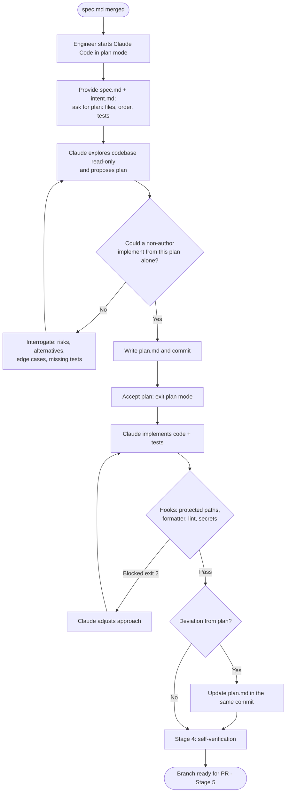

# Stage 3 — Build: Plan Mode as the Default

> **Stage input:** merged `spec.md` (+ `intent.md`) &nbsp;|&nbsp; **Stage output:** `plan.md`, then code and tests &nbsp;|&nbsp; **Read by:** Stage 4 (Test) and Stage 5 (Deploy/Review) &nbsp;|&nbsp; **Gate:** Engineer accepts the written plan before any file is edited


---

## Table of Contents

1. [Purpose](#1-purpose)
2. [What Changes vs. the Traditional Approach](#2-what-changes-vs-the-traditional-approach)
3. [Inputs and Outputs](#3-inputs-and-outputs)
4. [Roles Involved (RACI)](#4-roles-involved-raci)
5. [Prerequisites and Infrastructure](#5-prerequisites-and-infrastructure)
6. [Stage Flow Diagram](#6-stage-flow-diagram)
7. [Step-by-Step How-To: Plan, Then Build](#7-step-by-step-how-to-plan-then-build)
8. [The Supporting System: CLAUDE.md, Skills, Hooks](#8-the-supporting-system-claudemd-skills-hooks)
9. [Scaling Out: Parallel Sessions and Subagents](#9-scaling-out-parallel-sessions-and-subagents)
10. [From Plan Mode to Auto-Accept](#10-from-plan-mode-to-auto-accept)
11. [Sidebar: Source of Truth and Legacy Systems](#11-sidebar-source-of-truth-and-legacy-systems)
12. [Worked Example: Claims Status Self-Service](#12-worked-example-claims-status-self-service)
13. [Governance and Audit Evidence](#13-governance-and-audit-evidence)
14. [Metrics](#14-metrics)
15. [Anti-Patterns and Pitfalls](#15-anti-patterns-and-pitfalls)
16. [Entry and Exit Criteria](#16-entry-and-exit-criteria)
17. [Checklist](#17-checklist)
18. [Related](#18-related)

---

## 1. Purpose

The Build stage is where code is written — but in an AI-native SDLC, code is no longer the slow part. Claude can produce a working implementation of a well-understood change in minutes. The risks move elsewhere: an agent can build the wrong thing quickly, build it in a way that ignores local conventions, or take an action (editing a protected file, leaking a credential) that no reviewer would have allowed.

The Build stage addresses those risks with three principles:

1. **Nothing is implemented without an accepted written plan.** Claude Code's plan mode lets Claude read the codebase and propose an approach but prevents it from editing files until the engineer accepts. The accepted plan is committed as `plan.md`, so design review happens *before* code exists.
2. **Institutional knowledge becomes readable files.** Conventions, commands, architectural rules, and recurring mistakes live in `CLAUDE.md`; policies that must be applied consistently live in skills. Neither depends on anyone's memory.
3. **Guardrails run as code.** Hooks enforce the rules that must hold every time — protected paths, formatting, credential hygiene — deterministically, regardless of what the model decides.

The engineer's role shifts from typing implementation to directing it: interrogating the plan until it is sound, accepting it, and reviewing artifacts.

## 2. What Changes vs. the Traditional Approach


| Dimension | Traditional build | AI-native build |
|---|---|---|
| Design review timing | Often at PR time, after the code is written | Before code: the plan is reviewed and accepted in plan mode |
| Who writes code | Engineer, by hand | Claude, following the accepted plan, frequently in a single pass |
| Tests | Written by hand, sometimes after the code | Generated with the code; the plan names the proof required |
| Documentation | Written after the fact, if at all | `plan.md` is the design record; `CLAUDE.md` is versioned team knowledge |
| Conventions | Tribal knowledge, onboarding sessions, code review comments | `CLAUDE.md` checked in at the repo root, read at the start of every session |
| Policy compliance | Reviewers remember (or don't) | Skills apply policy; hooks enforce must-hold rules |
| Throughput per engineer | One change at a time | Multiple parallel sessions in separate git worktrees |

## 3. Inputs and Outputs

### Inputs

| Input | Description | Source |
|---|---|---|
| `spec.md` | Requirements, design, NFRs, acceptance criteria, decisions | `work/<id>/spec.md` |
| `intent.md` | Original problem and success metrics, for context | `work/<id>/intent.md` |
| `CLAUDE.md` | Repository conventions, commands, architecture, common mistakes | Repository root (and optionally subdirectories) |
| Skills | Policy and procedure encoded for consistent application | `.claude/skills/`, organizational plugins |
| Hooks and permissions | Deterministic guardrails | `.claude/settings.json`, managed settings |
| Plan template | Structure for `plan.md` | `../03-Templates/plan.template.md` |

### Outputs

| Output | Description | Consumed by |
|---|---|---|
| `plan.md` | Files that change, order of work, risks, proof of done; linked to intent and spec | Implementation, Stage 4 verification, Stage 5 review (diff vs plan) |
| Code and tests | The implementation, with tests that prove the plan's "Proof" section | Stage 4, Stage 5 |
| Updated `CLAUDE.md` (when warranted) | New correction added after a mistake recurs | All future sessions |
| Branch / pull request | The change set ready for review | Stage 5 |

## 4. Roles Involved (RACI)

| Activity | Engineer | Claude | Tech Lead | Code Owners | Platform Engineer | Policy Owners |
|---|---|---|---|---|---|---|
| Start plan-mode session with spec | **R/A** | — | I | — | — | — |
| Explore codebase and propose plan | A | **R** | — | — | — | — |
| Interrogate risks and alternatives | **R/A** | R (answers, revises) | C (higher risk) | — | — | — |
| Accept and commit `plan.md` | **R/A** | R (writes the file) | C | I | — | — |
| Implement code and tests | A | **R** | — | — | — | — |
| Keep `plan.md` in sync with deviations | **A** | R | — | — | — | — |
| Maintain `CLAUDE.md` | R (propose) | R (draft corrections) | C | **A** (approve) | — | — |
| Author/maintain skills | C | — | C | — | C | **R/A** |
| Author/maintain hooks | C | — | C | — | **R/A** | C |

## 5. Prerequisites and Infrastructure

### Prerequisites

- Merged `spec.md` (Stage 2 exit).
- A `CLAUDE.md` at the repository root. If none exists, create one with `/init` before starting feature work (see Section 8).
- A test suite and build that run locally with one command (Stage 4 depends on this; the plan's "Proof" section should reference it).

### Infrastructure

| Component | Purpose | Reference |
|---|---|---|
| Claude Code for engineers | Plan mode, file editing, subagents, worktrees | Claude Code docs |
| `CLAUDE.md` | Day-one context for every session | `../02-Guides/CLAUDE-md-Guide.md`, `../03-Templates/CLAUDE.template.md` |
| Project skills | Policy applied during implementation | `../02-Guides/Skills-Guide.md` |
| Project settings with hooks | Protected paths, formatter/linter after edits, credential guards | `../03-Templates/settings/project-settings.json`, `../02-Guides/Hooks-Guide.md` |
| Subagent definitions | Scoped helpers such as a verifier | `.claude/agents/`, `../03-Templates/agents/verifier.md` |
| Git worktree support | Parallel sessions without branch collisions | `claude --worktree <name>` |

## 6. Stage Flow Diagram



```mermaid
sequenceDiagram
    autonumber
    participant E as Engineer
    participant CC as Claude Code (plan mode)
    participant R as Repository
    participant H as Hooks
    E->>CC: claude --permission-mode plan
    E->>CC: "Plan work/CLM-1427 from spec.md"
    CC->>R: Read CLAUDE.md, spec.md, source (read-only)
    CC->>E: Proposed plan
    E->>CC: "What if claims-core returns 429?"
    CC->>E: Revised plan with cache + fallback
    E->>CC: Accept plan
    CC->>R: Write plan.md, commit
    loop Implementation
        CC->>H: PreToolUse (Edit/Write/Bash)
        H-->>CC: allow / block with reason
        CC->>R: Edit files
        R->>H: PostToolUse: format + lint changed file
    end
    CC->>E: Implementation complete; verification output
```

## 7. Step-by-Step How-To: Plan, Then Build

### Step 1 — Start Claude Code in plan mode

Plan mode is a permission mode in which Claude can read and analyze but cannot modify files or run state-changing commands until you approve a plan. Start directly in it, or cycle into it during a session with Shift+Tab.

```bash
cd product-portal
git switch -c feat/CLM-1427-claims-status
claude --permission-mode plan
```

Teams that want plan mode to be the default for everyone can set it in the project settings file (`"permissions": { "defaultMode": "plan" }`) so no session begins in an editing mode by accident.

### Step 2 — Give Claude the spec and ask for a plan

**Prompt:**

```text
Read work/CLM-1427-claims-status-self-service/spec.md and intent.md.
Produce an implementation plan using our plan template, with:
1. Files that change (new and modified), and why each changes
2. Order of work, so each step leaves the build green
3. Risks, especially anything in the NFRs that could fail at runtime
4. Proof: exactly which tests and checks will show each acceptance
   criterion is met, and the command that runs them
Follow CLAUDE.md conventions. Do not propose changes outside the spec.
```

### Step 3 — Interrogate the plan

This is the most important human activity in the stage. Keep asking until a competent engineer who was not in the conversation could implement the change from the plan alone.

**Prompts for interrogation:**

```text
What are the two riskiest steps in this plan and what could go wrong in each?
```

```text
Give me one alternative design for the riskiest step and compare it to your
proposal on complexity, failure behavior, and reversibility.
```

```text
Walk through each acceptance criterion in spec.md and point to the exact test
in your plan that proves it. List any criterion without a test.
```

```text
Which files in this plan are covered by CODEOWNERS or protected paths?
Which conventions in CLAUDE.md apply to each file?
```

```text
If claims-core is slow, returns errors, or rate-limits us, what does the user
see at each step? Add that behavior to the plan.
```

### Step 4 — Commit `plan.md`

Once satisfied, have Claude write the plan file. (Writing the file is the first edit, so accept the plan or approve the single write.)

**Prompt:**

```text
Write the agreed plan to work/CLM-1427-claims-status-self-service/plan.md
using our template. Header must link intent.md (with its merge date) and
spec.md. Then commit it with message "plan: CLM-1427 claims status".
```

### Step 5 — Accept and implement

Accept the plan and let Claude implement. For well-planned changes, implementation often completes in a single pass. Keep the session attached to the plan:

**Prompt:**

```text
Implement plan.md in the stated order. After each step, run the verification
command from CLAUDE.md and show the output. If you need to deviate from the
plan for any reason, stop and tell me why before continuing.
```

### Step 6 — Keep the plan honest

If implementation departs from the plan — a file you did not expect, a different library call, a step reordered — update `plan.md` **in the same commit** as the deviating change. The PR reviewer in Stage 5 will compare the merged diff against the plan, and an out-of-date plan destroys that check.

**Prompt:**

```text
Compare the current diff (git diff main...HEAD --stat) with the "Files that
change" section of plan.md. For any mismatch, either revert the change or
update plan.md with a one-line reason, and include it in the next commit.
```

### Step 7 — Capture recurring mistakes

If Claude makes the same mistake twice (for example, using `double` for money, or putting code in the wrong layer), that is a signal to add a correction to `CLAUDE.md`, not to keep correcting it in conversation.

**Prompt:**

```text
You've now twice put business logic in the controller. Propose a one-line
addition to CLAUDE.md's "Common mistakes" section that would prevent this,
and open it as a separate commit.
```

## 8. The Supporting System: CLAUDE.md, Skills, Hooks

The Build stage is only as good as the context and guardrails around it. Three mechanisms work together; each has a different job.

| Mechanism | What it is | Enforcement | Use it for |
|---|---|---|---|
| `CLAUDE.md` | Markdown file(s) Claude reads at session start | Advisory (context) | Commands, conventions, architecture, common mistakes — what a new team member needs on day one |
| Skills | `SKILL.md` folders Claude loads when a task matches the description | Advisory (procedure) | Institutional knowledge that is enforced inconsistently today; policies with a named owner |
| Hooks | Scripts the harness runs at lifecycle events (`PreToolUse`, `PostToolUse`, and others) | **Deterministic** | Rules that must hold every time: protected paths, formatting, credential hygiene, approval gates |

### CLAUDE.md

Create it with `/init`, which analyzes the repository and drafts a starting file. Then trim it to day-one essentials and check it in at the repository root. Keep it under about a page; long files dilute the signal. Code owners approve changes to it like any other code.

Example (for the portal backend):

```markdown
# product-portal

## Commands
- Build: `make build` — must end with "Build succeeded"
- Test: `make test` — all green; never skip or delete a failing test
- Lint: `make lint` — zero warnings
- Run locally: `make run` (portal on :8080, stubs for claims-core)

## Architecture
- `api/` HTTP handlers only; `core/` business logic; `adapters/` external systems
- External calls go through `adapters/` with timeouts and retries configured there
- All customer-facing copy lives in `web/src/i18n/en.json`

## Conventions
- TypeScript strict mode; no `any`
- Every new endpoint needs an integration test in `test/integration/`
- Feature flags via `core/flags.ts`; new user-facing features ship behind a flag

## Common mistakes (add a line when a mistake happens twice)
- Do not call claims-core directly from `api/`; use `adapters/claimsCore.ts`
- Do not log request bodies; they may contain PII
- Do not bump dependencies as part of feature work
```

See `../02-Guides/CLAUDE-md-Guide.md` for the full method.

### Skills

Write a skill when a piece of knowledge is applied inconsistently across the team and has an owner and a written source. The `secure-api-review` example in `../03-Templates/skills/secure-api-review/SKILL.md` encodes rules such as JWT authentication on every endpoint except health checks, request body validation against the OpenAPI definition with unknown fields rejected, audit events on state changes, and keeping PII-tagged fields out of logs and error messages. Because skills are advisory, any rule that *must* hold should also be backed by a hook or a CI check.

### Hooks

Hooks are configured in `.claude/settings.json` (team-shared, in git) or in managed settings (organization-enforced). A `PreToolUse` hook runs before a tool call and can block it: if the hook script exits with code 2, the call is blocked and the script's stderr is fed back to Claude as the reason. A `PostToolUse` hook runs after a tool call succeeds — ideal for formatting and linting the file that was just edited.

```json
{
  "permissions": {
    "defaultMode": "plan",
    "deny": ["Read(./.env)", "Read(./.env.*)", "Read(./secrets/**)"]
  },
  "hooks": {
    "PreToolUse": [
      {
        "matcher": "Edit|Write",
        "hooks": [
          { "type": "command", "command": "\"$CLAUDE_PROJECT_DIR\"/.claude/hooks/protect-paths.sh" }
        ]
      }
    ],
    "PostToolUse": [
      {
        "matcher": "Edit|Write",
        "hooks": [
          { "type": "command", "command": "\"$CLAUDE_PROJECT_DIR\"/.claude/hooks/format-changed-file.sh" }
        ]
      }
    ]
  }
}
```

A minimal protected-paths hook:

```bash
#!/usr/bin/env bash
# .claude/hooks/protect-paths.sh — block edits to protected paths
set -euo pipefail
file=$(jq -r '.tool_input.file_path // empty')
case "$file" in
  */api/v1/legacy/*|*/infra/prod/*|*/.github/workflows/*)
    echo "Blocked: $file is a protected path. Changes require a code-owner-led PR; \
see CODEOWNERS." >&2
    exit 2 ;;
esac
exit 0
```

Keep build-time hooks fast and scoped to the changed file; a hook that runs the entire test suite on every edit will make sessions unusable. See `../03-Templates/hooks/protect-paths.sh` and `../02-Guides/Hooks-Guide.md`.

## 9. Scaling Out: Parallel Sessions and Subagents


### Parallel sessions

An engineer can steer several Claude Code sessions at once, each in its own git worktree so they never collide on the working tree:

```bash
claude --worktree claims-status-backend
claude --worktree claims-status-frontend
```

Start with two or three concurrent sessions. The limiting factor is not the agents but the engineer's ability to review plans and artifacts with care. Increase concurrency only while review quality holds.

### Subagents

A subagent is a scoped helper inside one session with its own context window, instructions, and tool restrictions. Define project subagents as Markdown files in `.claude/agents/`. A verifier is a good first subagent: it exercises the change without being allowed to fix it, so its report is independent.

```markdown
---
name: verifier
description: Use after implementation to verify changed behavior end to end.
  Reports findings only; never edits code.
tools: Bash, Read
---

Start the app with `make run`. Exercise the behavior changed on this branch
and two neighboring flows that share code with it. For each, report:
what you did, what you expected, what happened, and evidence (command output
or response bodies). Do not attempt fixes. If the app fails to start, report
the error and stop.
```

See `../03-Templates/agents/verifier.md` and `../02-Guides/Parallel-Sessions-and-Subagents.md`. Controls for all sessions come from repository configuration (hooks, permissions), and every session is attributed to the engineer steering it.

## 10. From Plan Mode to Auto-Accept

Plan mode as the default is the right starting point. As the supporting system matures — a tuned `CLAUDE.md`, policy skills that trigger reliably, hooks that block unsafe actions, and a strong test suite — routine work can move to auto-accepting edits, with longer autonomous sessions. The human's attention then shifts from approving individual actions to reviewing the artifacts those sessions produce: the plan, the diff, the verification output.

A sensible progression:

| Maturity | Default mode | Human review focus |
|---|---|---|
| Starting | Plan mode; approve each edit | Plan and individual actions |
| Guardrails in place | Plan mode, then auto-accept edits after plan acceptance | Plan, then diff and verification output |
| Mature (routine work only) | Auto-accept for routine categories | Artifacts after longer sessions; plan mode still for high-risk changes |

Never relax to auto-accept on the basis of confidence in the model alone; relax it on the basis of evidence from the guardrails and metrics in this document.

## 11. Sidebar: Source of Truth and Legacy Systems

Many organizations already track work in Jira, ServiceNow, or similar tools, and those records may be referenced by change management or audit. For every artifact (intent, spec, plan, change record), name **one** authoritative system:

- **Option A — Repository authoritative.** The markdown artifacts are the record; the legacy tool references commits.
- **Option B — Legacy authoritative.** Jira/ServiceNow holds the record; markdown files are working copies for agents.

Whichever you choose, apply the minimum linkage: artifacts carry the legacy record ID, and legacy records carry the commit SHA. See `../02-Guides/Source-of-Truth-and-Legacy-Systems.md`.

## 12. Worked Example: Claims Status Self-Service

*Continuing from [Stage 2](02-Design-Spec.md): `spec.md` for CLM-1427 was merged on 2026-09-04 with the 50 rps claims-core limit captured as NFR-1 and adjuster names excluded (P-1).*

### Planning session

Arjun, a backend-leaning full-stack engineer, starts a plan-mode session on branch `feat/CLM-1427-claims-status`. Claude reads `CLAUDE.md`, the spec, and the existing `adapters/claimsCore.ts`, and proposes a first plan. Arjun interrogates it:

- He asks what happens when claims-core returns HTTP 429. The first plan retried immediately; after discussion, the plan changes to "serve cached value if present, else show a friendly 'status temporarily unavailable' message; no immediate retry".
- He asks how the cache behaves across the portal's three instances. Claude notes that an in-process cache would triple calls at cold start and proposes the existing shared Redis cache, which the architecture notes already sanction.
- He asks Claude to map every acceptance criterion to a test. AC-2 (internal states never exposed) had no test; Claude adds a unit test for the state mapping, including `FRAUD_REVIEW`.

### The committed `plan.md` (excerpt)

```markdown
# Plan: CLM-1427 Claims Status Self-Service

| Field | Value |
|---|---|
| Intent | work/CLM-1427-claims-status-self-service/intent.md (merged 2026-09-02) |
| Spec | work/CLM-1427-claims-status-self-service/spec.md (merged 2026-09-04) |
| Engineer | Arjun Mehta |
| Accepted | 2026-09-05 |

## Files that change
| File | Change |
|---|---|
| adapters/claimsCore.ts | Add `getClaimStatuses(policyholderId)`; timeout 800ms; map 429 to RateLimited |
| core/claimStatus.ts (new) | State mapping (4 visible states; internal -> "Being assessed"); cache via core/cache.ts |
| api/me/claimsStatus.ts (new) | GET /api/v1/me/claims/status; gateway JWT scope portal.customer |
| gateway/routes.yaml | Register new route (security concern S-1) |
| web/src/pages/MyClaims.tsx | Status list, explanations, empty state; behind flag `claimsStatus` |
| web/src/i18n/en.json | Labels and explanations from spec table |
| test/unit/claimStatus.test.ts (new) | State mapping incl. FRAUD_REVIEW; cache hit/miss/429 |
| test/integration/claimsStatus.test.ts (new) | Endpoint: auth required, four states, no internal state names |
| test/e2e/myClaims.spec.ts (new) | Screenshot per state vs approved mock |

## Order of work
1. Adapter method + unit tests (build green)
2. Core mapping + cache + unit tests
3. API endpoint + gateway route + integration tests
4. UI behind flag + i18n + e2e screenshots
5. Analytics event (AC-4)

## Risks
- R-1: claims-core rate limit is 50 rps for the portal client. The panel
  MUST cache: shared Redis, key `claims-status:{policyholderId}`, TTL 300s.
  On 429/timeout: serve cached value with "last updated", else friendly
  unavailable message. No immediate retry.
- R-2: Internal states leaking into responses or logs. Mitigation: mapping
  is an allowlist; unknown states map to "Being assessed"; test asserts
  response never contains raw claims-core state strings.
- R-3: Gateway route misconfiguration exposes endpoint unauthenticated.
  Mitigation: integration test asserts 401 without JWT.

## Proof
- `make test` green, including tests covering all four customer-visible
  claim states and the internal-state fallback.
- Integration test: 401 without token; response fields limited to
  reference, label, explanation, lastUpdated.
- E2E screenshot for each state matches the approved mock (UX-214).
- Load check: 200 simulated page views/sec for 60s produce <= 50 rps to
  the claims-core stub (verified by stub counter).
```

### Implementation

Arjun accepts the plan. Claude implements steps 1-5 in a single pass, running `make test` after each step. Two guardrails fire along the way:

- The `protect-paths.sh` hook blocks an edit to `.github/workflows/e2e.yml` (Claude wanted to add the new e2e spec to the workflow's list). The block message explains the path is protected; Claude reports this, and Arjun discovers the workflow globs the folder anyway, so no change is needed.
- The `PostToolUse` formatter reformats `MyClaims.tsx` after each edit, so style never becomes a review topic.

Claude uses the existing shared-cache wrapper in `core/cache.ts` exactly as the plan says. The only deviation: the i18n keys are placed under an existing `claims` namespace rather than a new one. Claude updates the plan's file table in the same commit.

Arjun runs the verifier subagent, which starts the app with `make run`, exercises the claims status page for each stubbed state, and checks the neighboring "My policies" and "Documents" pages. It reports all green with response bodies attached.

Meanwhile, in a second worktree (`claude --worktree clm-1427-copy-review`), Arjun had Claude check the explanation text against the brand-voice skill; it suggested one wording change, which was already covered by the spec table, so no change was made.

**Next:** In [Stage 4 — Test](04-Test-Feedback-Loops-and-Evals.md), we look closely at the verification loop and at how the team's agent configuration is itself regression-tested.

## 13. Governance and Audit Evidence

| Control objective | Evidence produced | Where to find it |
|---|---|---|
| Design reviewed before implementation | `plan.md` committed before the first code commit; plan mode prevents edits before acceptance | `git log --format='%h %ci %s' -- work/<id>/plan.md` vs first code commit |
| Plan acceptance is attributable | Commit author of `plan.md`; session attributed to steering engineer | Git history; session logs/telemetry |
| Implementation matches approved design | Diff vs `plan.md` "Files that change"; deviations recorded in plan in same commit | PR diff, plan history |
| Protected assets not modified without authority | Hook blocks (exit 2) with reasons; CODEOWNERS on protected paths | Hook logs, PR reviews |
| Conventions are defined and change-controlled | `CLAUDE.md` in git with code-owner approval | `git log -- CLAUDE.md` |
| Policy applied consistently | Skill versions in git; skill-cited findings in review | `.claude/skills/` history |

## 14. Metrics


### Leading — Share of changes merging on the first implementation pass

A change "merges on first pass" if, after the plan is committed, the PR merges without additional implementation commits beyond review nits. A practical proxy: count code commits between the `plan.md` commit and the merge.

```bash
# For each merged PR, count commits after the plan commit (lower is better)
gh pr list --state merged --limit 100 --json number,headRefName \
 | jq -r '.[] | "\(.number) \(.headRefName)"' | while read n ref; do
   commits=$(gh pr view "$n" --json commits --jq '.commits | length')
   echo "PR#$n commits=$commits"
 done
```

Define "first pass" in your team (for example, at most one follow-up commit and no review round requesting functional changes) and chart the share weekly.

### Lagging — Rework cycles per change

Count review rounds with "changes requested" per PR:

```bash
gh api "repos/{owner}/{repo}/pulls/$PR/reviews" \
  --jq '[.[] | select(.state=="CHANGES_REQUESTED")] | length'
```

### Lagging — Consistency between merged diff and `plan.md`

Extract file paths from the plan's "Files that change" table and compare with the merged diff.

```bash
plan=work/CLM-1427-claims-status-self-service/plan.md
grep -oE '^\| [^ |]+\.[a-z]+' "$plan" | sed 's/^| //' | sort -u > /tmp/planned
git diff --name-only main...feat/CLM-1427-claims-status | grep -v '^work/' | sort -u > /tmp/actual
echo "In diff, not in plan:"; comm -13 /tmp/planned /tmp/actual
echo "In plan, not in diff:"; comm -23 /tmp/planned /tmp/actual
```

### Supporting — CLAUDE.md effectiveness

- **Leading:** how often Claude repeats a mistake that `CLAUDE.md` should prevent (tag review comments, e.g. `[claude-md]`, and count).
- **Lagging:** time to first merged PR for a new team member (`gh pr list --author <new-user> --state merged --limit 1`).

### Supporting — Parallel sessions

- Concurrent sessions per engineer while review quality holds (rework rate stable).
- Changes merged per engineer per week, read *together with* rework rate — throughput without quality is not success.

## 15. Anti-Patterns and Pitfalls

| Anti-pattern | Why it hurts | Better practice |
|---|---|---|
| **Skipping plan mode "for small changes"** | Small changes are where conventions get violated unnoticed | Make plan mode the default mode in project settings; allow exceptions by explicit choice |
| **Accepting the first plan** | The value of plan mode is the interrogation, not the document | Use the interrogation prompts until a non-author could implement from the plan |
| **Stale `plan.md`** | Reviewers cannot compare diff with plan; audit evidence becomes misleading | Update the plan in the same commit as any deviation |
| **Bloated `CLAUDE.md`** | Important rules get lost; context is wasted | Keep to about a page; move procedures into skills |
| **Relying on skills for must-hold rules** | Skills are advisory; a missed trigger skips the rule | Back every must-hold rule with a hook or CI check |
| **Slow hooks** | Engineers disable them or sessions become painful | Scope hooks to the changed file; keep heavy checks in CI |
| **Too many parallel sessions too soon** | Review quality collapses and rework rises | Start with 2–3; increase only while rework rate holds |
| **Letting the verifier fix things** | Its report is no longer independent | Give it only `Bash` and `Read`, and instruct it not to fix |
| **Correcting the same mistake in chat repeatedly** | The team pays for the mistake in every session | Second occurrence → `CLAUDE.md` correction |

## 16. Entry and Exit Criteria

### Definition of Ready (entry)

- [ ] `spec.md` merged, with acceptance criteria and NFRs.
- [ ] `CLAUDE.md` exists and lists build, test, lint, and run commands.
- [ ] Project settings include protected-path and formatting hooks.
- [ ] Engineer has a feature branch (or worktree) for the change.

### Definition of Done (exit)

- [ ] `plan.md` committed before the first code commit, linked to intent and spec.
- [ ] Every acceptance criterion maps to a named test in the plan.
- [ ] Implementation complete; any deviations reflected in `plan.md` in the same commit.
- [ ] Verification commands pass locally with output captured (Stage 4 detail).
- [ ] No hook blocks left unresolved; no protected paths changed without owner involvement.
- [ ] Any repeated mistake has been captured as a `CLAUDE.md` correction.

## 17. Checklist

- [ ] Session started in plan mode on a feature branch or worktree
- [ ] Spec and intent provided; plan requested with files, order, risks, proof
- [ ] Risks, alternatives, and failure behavior interrogated
- [ ] Every acceptance criterion has a test
- [ ] `plan.md` committed
- [ ] Implementation done in plan order with verification after each step
- [ ] Deviations recorded in `plan.md`
- [ ] Verifier subagent run and report reviewed
- [ ] `CLAUDE.md` updated for any repeated mistake

## 18. Related

- Previous stage: [02 — Design: Spec](02-Design-Spec.md)
- Next stage: [04 — Test: Feedback Loops and Evals](04-Test-Feedback-Loops-and-Evals.md)
- Stage index: [README](README.md)
- Main playbook: [AI-Native SDLC Playbook](../00-Playbook/AI-Native-SDLC-Playbook.md)
- Guides:
  - [CLAUDE.md Guide](../02-Guides/CLAUDE-md-Guide.md)
  - [Skills Guide](../02-Guides/Skills-Guide.md)
  - [Hooks Guide](../02-Guides/Hooks-Guide.md)
  - [Parallel Sessions and Subagents](../02-Guides/Parallel-Sessions-and-Subagents.md)
  - [Source of Truth and Legacy Systems](../02-Guides/Source-of-Truth-and-Legacy-Systems.md)
  - [Managed Settings Guide](../02-Guides/Managed-Settings-Guide.md)
- Templates:
  - [plan.template.md](../03-Templates/plan.template.md)
  - [CLAUDE.template.md](../03-Templates/CLAUDE.template.md)
  - [skills/secure-api-review/SKILL.md](../03-Templates/skills/secure-api-review/SKILL.md)
  - [agents/verifier.md](../03-Templates/agents/verifier.md)
  - [settings/project-settings.json](../03-Templates/settings/project-settings.json)
  - [hooks/protect-paths.sh](../03-Templates/hooks/protect-paths.sh)

---

*Based on concepts from Anthropic's AI-Native SDLC Playbook; expanded guidance for implementation.*
