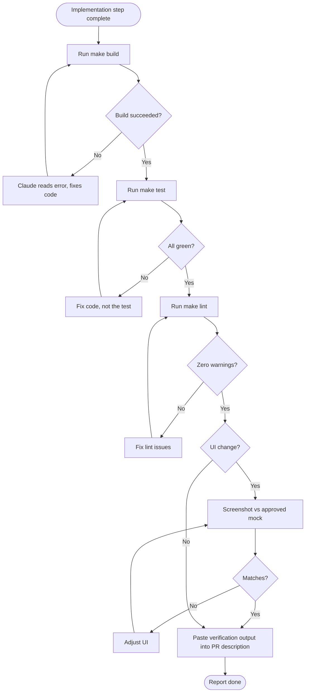
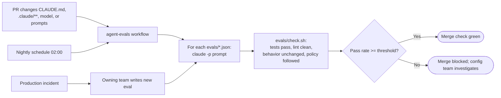

# Stage 4 — Test: Feedback Loops and Continuous Evals

> **Stage input:** code + tests from Stage 3, `plan.md` "Proof" section &nbsp;|&nbsp; **Stage output:** verified change with captured evidence; eval results for agent configuration &nbsp;|&nbsp; **Read by:** Stage 5 (Review) &nbsp;|&nbsp; **Gate:** Verification is part of "done"; eval pass-rate threshold gates configuration changes


---

## Table of Contents

1. [Purpose](#1-purpose)
2. [What Changes vs. the Traditional Approach](#2-what-changes-vs-the-traditional-approach)
3. [Inputs and Outputs](#3-inputs-and-outputs)
4. [Roles Involved (RACI)](#4-roles-involved-raci)
5. [Prerequisites and Infrastructure](#5-prerequisites-and-infrastructure)
6. [Stage Flow Diagrams](#6-stage-flow-diagrams)
7. [Part A — Feedback Loops: Every Session Checks Its Own Work](#7-part-a--feedback-loops-every-session-checks-its-own-work)
8. [Part B — Continuous Evals: Regression-Testing the Agent Configuration](#8-part-b--continuous-evals-regression-testing-the-agent-configuration)
9. [Worked Example: Claims Status Self-Service](#9-worked-example-claims-status-self-service)
10. [Governance and Audit Evidence](#10-governance-and-audit-evidence)
11. [Metrics](#11-metrics)
12. [Anti-Patterns and Pitfalls](#12-anti-patterns-and-pitfalls)
13. [Entry and Exit Criteria](#13-entry-and-exit-criteria)
14. [Checklist](#14-checklist)
15. [Related](#15-related)

---

## 1. Purpose

In a traditional SDLC, testing is a phase: code is handed to QA at a stage boundary, defects are logged, and the code goes back. In an AI-native SDLC, testing is woven through implementation, and it has two distinct jobs.

**Job one: every session checks its own work before a human sees it.** The single most effective thing you can do to improve the quality of agent-written code is to give Claude a reliable way to verify what it did — a test suite, a build, a linter, a screenshot to compare against a mock. When verification is fast, runnable with one command, and part of the definition of done, Claude iterates against it until it passes. Humans then review changes that already work, rather than discovering that they do not.

**Job two: the agent configuration is regression-tested like code.** In an AI-native organization, a meaningful share of "the system that writes the code" is configuration: `CLAUDE.md`, skills, hooks, subagent definitions, prompts, the model version in use. A change to any of these can improve or degrade outcomes across every session in the organization. Continuous evals — a suite of real tasks with checkable outcomes, run in CI — are how you know whether a configuration change helped or hurt. This is the AI-native equivalent of QA.

## 2. What Changes vs. the Traditional Approach


| Dimension | Traditional testing | AI-native testing |
|---|---|---|
| When testing happens | QA gates at stage boundaries | Continuously during implementation; every session verifies itself |
| Who runs tests first | Developer (sometimes), then QA | Claude, as part of completing the task, before any human review |
| Definition of done | "Code complete" then "QA passed" | Verification output captured and passing is part of done |
| Bug fixing | Fix, then maybe add a test | Failing test first; Claude reproduces, confirms failure, then makes it pass without editing the test |
| UI verification | Manual QA pass | Automated screenshot or browser check against the approved mock |
| What else is tested | Application code only | Application code **and** the agent configuration (evals) |
| Regression source | Bug reports | Production incidents become permanent evals |

## 3. Inputs and Outputs

### Inputs

| Input | Description | Source |
|---|---|---|
| Code and tests | Implementation from Stage 3 | Feature branch |
| `plan.md` "Proof" section | The specific checks that prove the change | `work/<id>/plan.md` |
| `CLAUDE.md` verification block | Commands and healthy output | Repository root |
| One-command test/build targets | e.g. `make test`, `make build`, `make lint` | `Makefile` or equivalent |
| Approved UI mocks | Reference images for visual checks | Design system / UX tickets |
| Eval suite | 20–50 real tasks with expected outcomes | `evals/*.json`, `evals/check.sh` |

### Outputs

| Output | Description | Consumed by |
|---|---|---|
| Verification evidence | Pasted output of build, test, lint; screenshots; verifier subagent report | Stage 5 reviewers (in PR description) |
| First-pass CI result | Whether CI passes on the first push | Metrics; Stage 5 |
| Regression tests for bugs | Failing-first tests that now pass | Permanent test suite |
| Eval run results | Pass/fail per eval, pass rate, logs | Merge check on configuration PRs; trend dashboards |
| New evals from incidents | Each production incident class becomes a regression eval | Eval suite |

## 4. Roles Involved (RACI)

| Activity | Engineer | Claude | Platform Engineer | Config-owning team (CLAUDE.md, skills, hooks) | Tech Lead | Incident-owning team |
|---|---|---|---|---|---|---|
| Provide one-command verification targets | **R** | C | C | — | **A** | — |
| Document commands + healthy output in CLAUDE.md | R | R (draft) | — | **A** | C | — |
| Run verification before reporting done | A | **R** | — | — | — | — |
| Write failing test first for bug fixes | **A** | R | — | — | — | — |
| Maintain protect-tests hook | C | — | **R/A** | C | — | — |
| Build and maintain eval suite | C | — | **R/A** | C | C | — |
| Approve configuration changes gated by evals | — | — | C | **R/A** | C | — |
| Write eval for each production incident | C | R (draft) | C | I | — | **R/A** |

## 5. Prerequisites and Infrastructure

### Prerequisites

- **Feedback loops:** a test suite and build that can be run locally with a single command each. If running tests requires a wiki page of steps, fix that first.
- **Evals:** a working `CLAUDE.md` and working feedback loops. Evals measure how well the configured agent completes tasks, so the tasks must be verifiable.

### Infrastructure

| Component | Purpose | Notes |
|---|---|---|
| `make test` / `make build` / `make lint` (or equivalents) | Single-command verification | Wrap multi-step checks in one target |
| Browser or screenshot tooling | Visual verification for UI | Playwright or similar, with stored reference images |
| `protect-tests.sh` hook | Prevent test edits during a bug fix | `../03-Templates/hooks/protect-tests.sh` |
| CI that can run Claude Code non-interactively | Evals and headless checks | `claude -p` with `--output-format json`; see `../02-Guides/CI-CD-Integration-Guide.md` |
| API key with an eval budget | Evals consume model usage | Separate key or workspace so eval spend is visible |
| Eval files and checker | Definitions and deterministic checks | `../03-Templates/evals/example-eval.json`, `../03-Templates/evals/check.sh` |
| Eval workflow | Runs evals on config change and nightly | `../03-Templates/ci/agent-evals.yml` |

## 6. Stage Flow Diagrams

### Feedback loop inside a session



### Bug fix with a protected failing test

```mermaid
sequenceDiagram
    autonumber
    participant E as Engineer
    participant C as Claude
    participant H as protect-tests hook
    participant T as Test suite
    E->>C: Write a failing test reproducing BUG-311
    C->>T: Add test, run it
    T-->>C: FAIL (reproduced)
    C->>E: Confirmed failure, output attached
    E->>E: touch .claude/fix-mode (tests now protected)
    E->>C: Make the test pass by fixing the code
    C->>H: Edit test/unit/claimStatus.test.ts?
    H-->>C: exit 2: tests are locked during fix
    C->>T: Edit core/claimStatus.ts, run tests
    T-->>C: PASS
    C->>E: Fixed; diff touches source only
```

### Eval pipeline for configuration changes



## 7. Part A — Feedback Loops: Every Session Checks Its Own Work

### Step 1 — Wrap multi-step checks in single targets

Claude (and humans) will run what is easy to run. If verification involves starting a database container, seeding data, running migrations, and then running tests, put all of that behind one target.

```makefile
.PHONY: build test lint verify
build:
	npm run build && echo "Build succeeded"
test:
	docker compose up -d redis claims-core-stub
	npm run test:unit && npm run test:integration
lint:
	npm run lint -- --max-warnings=0
verify: build test lint
```

**Prompt to create the targets:**

```text
Look at how tests, build, and lint are run in this repo (package.json,
CI workflow files, README). Create Makefile targets build, test, lint,
and verify so each is a single command that works from a clean checkout.
Show me the output of `make verify` when you're done.
```

### Step 2 — Document commands and healthy output in `CLAUDE.md`

Claude needs to know not just the commands but what *success* looks like, so it can tell a pass from a silent failure.

```markdown
## Verification (run all three before reporting done; paste the output)
- `make build` must end with the line "Build succeeded".
- `make test` must be all green. Never skip, disable, or delete a failing test.
- `make lint` must report zero warnings.
- If a test fails, fix the code, not the test. If you believe the test is
  wrong, stop and explain why instead of changing it.
```

### Step 3 — State a quantifiable target

Vague goals ("make it faster", "improve the tests") produce vague results. Give Claude a number it can check.

**Prompt examples:**

```text
The claims status endpoint's p95 in the local load test is 620ms. Get it
under 300ms with `make loadtest` as the check. Do not change the load test.
```

```text
Raise line coverage for core/claimStatus.ts from 71% to at least 90%,
measured by `make coverage`. Add tests; do not modify production code.
```

### Step 4 — For bug fixes, write the failing test first

The order matters. A test written after the fix is prone to confirming whatever the fix does. A test written first, and confirmed to fail, proves the bug exists and proves the fix addresses it.

**Prompt sequence:**

```text
Bug BUG-311: <description>. Write a test that reproduces it. Run it and show
me that it fails for the reason described in the bug, not for some other
reason. Do not change any production code yet.
```

```text
Now make that test pass by changing production code only. Tests are locked
for this step. Show the full `make test` output when done.
```

### Step 5 — Protect the loop with a hook

A model under pressure to make a test pass may be tempted to change the test. Remove that option deterministically during fix work. The hook below blocks edits to test files while a marker file `.claude/fix-mode` exists (a file works mid-session, whereas an environment variable would only apply to sessions started after it was set; add the marker to `.gitignore`); alternatively, reject any test changes in a bug-fix PR during review.

```bash
#!/usr/bin/env bash
# .claude/hooks/protect-tests.sh — lock tests while fixing a bug
set -euo pipefail
[ -f "$CLAUDE_PROJECT_DIR/.claude/fix-mode" ] || exit 0   # marker file toggles fix mode
file=$(jq -r '.tool_input.file_path // empty')
case "$file" in
  */test/*|*.test.ts|*.spec.ts)
    echo "Blocked: tests are locked during a bug fix (.claude/fix-mode present). \
Fix the production code so the existing failing test passes. \
If the test itself is wrong, stop and explain to the engineer." >&2
    exit 2 ;;
esac
exit 0
```

Register it as a `PreToolUse` hook with matcher `Edit|Write` in `.claude/settings.json`. See `../03-Templates/hooks/protect-tests.sh`.

### Step 6 — Verify UI visually

For user-facing changes, tests that check the DOM are not enough; the change must *look* right. Give Claude a way to render the page and compare it against the approved mock — a Playwright screenshot test with stored references, or a browser tool Claude can drive.

**Prompt:**

```text
Run the e2e screenshot tests for the My Claims page for each of the four
claim states. For any diff against the approved references in
test/e2e/__screenshots__/, show me the diff image and explain the difference.
Only update a reference image if I approve it.
```

### Step 7 — Make verification part of "done"

Put it in `CLAUDE.md`, in the PR template, and in the plan's "Proof" section: a change is not done until verification output is captured. Reviewers in Stage 5 should see that output in the PR description without having to ask.

**Prompt to close out a session:**

```text
Before you report done: run `make verify`, run the verifier subagent, and
produce a PR description with sections Summary, Link to plan.md,
Verification (paste outputs), and Deviations from plan.
```

## 8. Part B — Continuous Evals: Regression-Testing the Agent Configuration

### Why evals

When a platform engineer rewrites a section of the organization's `CLAUDE.md` template, updates a skill, adds a hook, or moves teams to a new model version, the effect is felt in every session. Without evals, the organization learns about regressions from frustrated engineers weeks later. With evals, a configuration PR shows its pass rate before merge.

### Step 1 — Collect real tasks

A platform engineer collects **20–50 real tasks** from the team's history, each with a known good outcome. Good sources are merged PRs with clean tests, bug fixes with regression tests, and tasks that previously went wrong.

### Step 2 — Define each eval as prompt plus checks

An eval is a prompt and a set of deterministic checks: tests pass, lint is clean, specified behavior is unchanged, and relevant policy was followed.

```json
{
  "id": "claims-status-add-state",
  "description": "Add a new customer-visible claim state mapping",
  "repo_ref": "evals/fixtures/portal@a1b2c3d",
  "prompt": "claims-core has added state PAYMENT_SCHEDULED. Map it to the portal label 'Payment on its way' with the explanation 'Your payment has been scheduled.' Follow CLAUDE.md.",
  "checks": [
    { "type": "command", "run": "make test", "expect_exit": 0 },
    { "type": "command", "run": "make lint", "expect_exit": 0 },
    { "type": "grep_absent", "path": "api/", "pattern": "claimsCore\\." },
    { "type": "diff_limited_to", "paths": ["core/claimStatus.ts", "web/src/i18n/en.json", "test/"] },
    { "type": "command", "run": "npm run test:unit -- claimStatus", "expect_exit": 0 }
  ]
}
```

The checker script reads the eval file and the run's workspace and exits non-zero if any check fails. See `../03-Templates/evals/example-eval.json` and `../03-Templates/evals/check.sh`.

### Step 3 — Run on schedule and on configuration change

The workflow runs on pull requests that touch agent configuration and nightly. Each eval runs Claude Code headlessly with `claude -p`, a narrow tool allowlist, and JSON output.

```yaml
# .github/workflows/agent-evals.yml (abridged; see ../03-Templates/ci/agent-evals.yml)
name: agent-evals
on:
  pull_request:
    paths: ['CLAUDE.md', '.claude/**']
  schedule:
    - cron: '0 2 * * *'
jobs:
  evals:
    runs-on: ubuntu-latest
    steps:
      - uses: actions/checkout@v4
      - uses: actions/setup-node@v4
        with: { node-version: '20' }
      - run: npm install -g @anthropic-ai/claude-code
      - name: Run evals
        env:
          ANTHROPIC_API_KEY: ${{ secrets.ANTHROPIC_EVAL_API_KEY }}
        run: |
          pass=0; total=0
          for eval in evals/*.json; do
            total=$((total+1))
            prompt=$(jq -r .prompt "$eval")
            claude -p "$prompt" \
              --allowedTools "Read,Edit,Bash(make test)" \
              --output-format json > result.json
            if ./evals/check.sh "$eval" result.json; then pass=$((pass+1)); fi
            git checkout -- . && git clean -fd -e result.json
          done
          echo "pass_rate=$pass/$total" | tee -a "$GITHUB_STEP_SUMMARY"
          [ $((pass*100/total)) -ge 90 ] || exit 1
```

### Step 4 — Gate configuration changes on pass rate

Make the eval job a required status check for PRs touching configuration paths. The configuration-owning team approves those PRs; the pass rate is part of the evidence they consider. Set the threshold from your baseline (for example, "no lower than the trailing 7-night median minus one eval").

### Step 5 — Turn every production incident into a permanent eval

When a production incident traces back to something an agent did (or failed to do), the owning team writes an eval that reproduces the task and checks for the correct behavior. It stays in the suite as a regression test. Over time, evals that once discriminated between good and bad configurations become the baseline everyone passes, and new, harder cases arrive from monitoring (Stage 6).

**Prompt for drafting an incident eval:**

```text
Here is the post-mortem for INC-2291 and the diff that caused it.
Draft an eval JSON in our format: a prompt that asks for a similar change
in the fixture repo, and checks that would have failed on the bad diff and
pass on the correct one. Explain why each check discriminates.
```

## 9. Worked Example: Claims Status Self-Service

*Continuing from [Stage 3](03-Build-Plan-Mode.md): Arjun's session implemented CLM-1427 in a single pass following `plan.md`.*

### Verification inside the session

The plan's "Proof" section named four checks. Claude ran all of them before reporting done, and pasted the output into the PR description:

| Proof item | Command | Result |
|---|---|---|
| Unit + integration tests, including all four claim states and internal-state fallback | `make test` | 148 passed, 0 failed |
| 401 without token; response fields limited | `make test` (integration) | Passed |
| E2E screenshots per state match approved mock UX-214 | `npm run test:e2e -- myClaims` | 4/4 match |
| Load: 200 page views/sec for 60s produce at most 50 rps to claims-core stub | `make loadtest SCENARIO=claims-status` | Peak 11 rps to stub (cache hit ratio 94%) |
| Build and lint | `make build`, `make lint` | "Build succeeded"; 0 warnings |

The load check is the verification that matters most for this feature: it proves NFR-1 (the 50 rps claims-core limit) is respected, rather than trusting that caching "should" work.

### A bug found during verification

The verifier subagent reported one anomaly: for a claim updated at 23:30 UTC, the "last updated" date displayed as the following day for a user in a UTC-plus timezone and the previous day in another scenario. Arjun logged BUG-311 and used the failing-test-first loop:

1. Claude wrote `formats lastUpdated in policyholder's timezone` in `test/unit/claimStatus.test.ts`, ran it, and showed it failing with the wrong date.
2. Arjun created the `.claude/fix-mode` marker file. When Claude later tried to relax the test's assertion, the `protect-tests.sh` hook blocked the edit with exit code 2 and the explanatory message. Claude instead fixed the date formatting in `core/claimStatus.ts`.
3. `make test` went green and Arjun removed the marker. The fix commit touched only production code, which the reviewer could confirm at a glance.

### First-pass CI

The PR's first CI run passed. Acme tracks first-pass CI success for agent-written changes; this one counts toward it.

### Evals triggered by a configuration change

During the work, Arjun had added a line to `CLAUDE.md` ("Do not call claims-core directly from `api/`; use `adapters/claimsCore.ts`") because Claude had made that mistake twice in earlier work. Because the PR touched `CLAUDE.md`, the `agent-evals` workflow ran. Sam, the platform engineer, had previously added a `claims-status-add-state` eval (see Part B) derived from an earlier portal task. The run showed 46 of 48 evals passing (95.8%), above the 90% threshold and one eval better than the trailing median — the new `CLAUDE.md` line fixed a previously failing eval that checked for direct claims-core calls from `api/`. The configuration change was approved by the portal code owners.

**Next:** In [Stage 5 — Deploy](05-Deploy-Review-and-Gates.md), the PR enters bi-directional review and the production gate.

## 10. Governance and Audit Evidence

| Control objective | Evidence produced | Where to find it |
|---|---|---|
| Changes are tested before review | Verification output in PR description; CI run results | PR body; CI API |
| Bug fixes are proven | Failing-first test commit precedes fix commit; fix commit does not modify tests | `git log -p` on the branch |
| Tests are not weakened to pass | protect-tests hook blocks during fix; review rejects test changes in fix PRs | Hook messages in session transcript; PR diff |
| UI matches approved design | Screenshot test results against stored references | CI artifacts |
| Agent configuration changes are regression-tested | Eval pass rate as required check; run logs retained | CI checks; `$GITHUB_STEP_SUMMARY`; stored `result.json` artifacts |
| Configuration changes are approved by owners | Code-owner approval on CLAUDE.md / .claude/** PRs | PR reviews |
| Incidents lead to prevention | Eval file per incident class, linked to incident ID | `evals/` history |

## 11. Metrics


### Leading — First-pass CI success for agent-written changes

The share of agent-written PRs whose first CI run on the PR succeeds. Identify agent-written PRs by label (e.g. `agent-authored`), by branch prefix, or by commit trailer.

```bash
# First workflow run conclusion for each agent-authored PR (GitHub CLI)
for pr in $(gh pr list --state merged --label agent-authored --limit 100 --json number --jq '.[].number'); do
  sha=$(gh pr view "$pr" --json commits --jq '.commits[0].oid')
  concl=$(gh api "repos/{owner}/{repo}/actions/runs?head_sha=$sha" \
          --jq '[.workflow_runs[] | select(.name=="ci")][0].conclusion')
  echo "$pr $concl"
done | awk '{t++; if($2=="success") s++} END {printf "first-pass CI: %.0f%%\n", 100*s/t}'
```

### Lagging — Review time per PR

Time from PR ready-for-review to approval. As feedback loops improve, reviewers receive changes that already work, and review time falls.

```bash
gh pr list --state merged --limit 100 --json number,createdAt,reviews \
 | jq -r '.[] | select(.reviews|length>0)
   | [.number, (((.reviews|map(select(.state=="APPROVED"))|.[0].submittedAt|fromdate) - (.createdAt|fromdate))/3600)]
   | @tsv'
```

### Lagging — Change failure rate

*General industry practice (DORA):* the share of deployments that cause a failure in production requiring remediation (rollback, hotfix, incident). Compute from your deployment records and incident tracker: `failed_deployments / total_deployments` over a period.

### Eval metrics

| Metric | How to compute |
|---|---|
| Eval pass rate over time | Parse the `pass_rate` line from each nightly run's summary (`gh run list --workflow agent-evals --json databaseId` then `gh run view <id> --log`) and chart it |
| Incident-to-permanent-eval time | Incident resolved timestamp (from tracker) to the merge commit that adds `evals/<incident-id>*.json` |
| Regressions caught in CI vs production | Count of configuration PRs blocked by evals vs incidents later attributed to configuration changes |

## 12. Anti-Patterns and Pitfalls

| Anti-pattern | Why it hurts | Better practice |
|---|---|---|
| **No way for Claude to verify** | Claude reports success based on reading its own code | Provide one-command build/test/lint; include healthy output in `CLAUDE.md` |
| **Multi-step, undocumented test setup** | Claude skips or half-runs verification | Wrap it in a `make` target |
| **Allowing test edits during fixes** | Tests get weakened until they pass | Failing test first; lock tests with a hook or reject test changes in review |
| **Accepting "tests pass" without output** | Unverifiable claims | Require pasted output in the PR description |
| **Evals that are not deterministic** | Flaky evals erode trust and block unrelated PRs | Deterministic checks only (exit codes, greps, diff scope); fixed fixture commits |
| **Evals based on synthetic toy tasks** | They do not reflect how the team actually works | Use 20–50 real tasks from your own history |
| **Not gating config changes** | A popular but harmful `CLAUDE.md` edit silently degrades every session | Required eval check on `CLAUDE.md` and `.claude/**` paths |
| **Letting the eval suite fossilize** | Everything passes; the suite stops discriminating | Keep adding cases from incidents and monitoring |
| **Eval spend hidden in general usage** | Eval budget gets cut or overruns unnoticed | Dedicated key or workspace for evals |

## 13. Entry and Exit Criteria

### Definition of Ready (entry)

- [ ] Implementation from Stage 3 is complete on a branch.
- [ ] `make build`, `make test`, `make lint` (or equivalents) exist and work from a clean checkout.
- [ ] `CLAUDE.md` documents verification commands and healthy output.
- [ ] `plan.md` "Proof" section lists the checks for this change.
- [ ] (For evals) CI can run `claude -p`; an eval API key and budget exist.

### Definition of Done (exit)

- [ ] All "Proof" items from `plan.md` pass, with output captured in the PR description.
- [ ] For UI changes, screenshot checks pass against approved references.
- [ ] Bug fixes include a failing-first test; fix commits do not modify tests.
- [ ] Verifier subagent report reviewed (where used).
- [ ] If the change touches agent configuration, eval pass rate meets the threshold.
- [ ] CI is green.

## 14. Checklist

- [ ] One-command verification targets exist
- [ ] Healthy output documented in `CLAUDE.md`
- [ ] Quantifiable targets given for performance/coverage work
- [ ] Bug fixes: test first, failure confirmed, tests locked, fix code only
- [ ] UI verified visually against the mock
- [ ] Verification output pasted in PR
- [ ] Config changes: evals run and pass threshold
- [ ] Incident-derived evals added where applicable

## 15. Related

- Previous stage: [03 — Build: Plan Mode](03-Build-Plan-Mode.md)
- Next stage: [05 — Deploy: Review and Gates](05-Deploy-Review-and-Gates.md)
- Stage index: [README](README.md)
- Main playbook: [AI-Native SDLC Playbook](../00-Playbook/AI-Native-SDLC-Playbook.md)
- Guides:
  - [Evals Guide](../02-Guides/Evals-Guide.md)
  - [Hooks Guide](../02-Guides/Hooks-Guide.md)
  - [CLAUDE.md Guide](../02-Guides/CLAUDE-md-Guide.md)
  - [CI/CD Integration Guide](../02-Guides/CI-CD-Integration-Guide.md)
  - [Parallel Sessions and Subagents](../02-Guides/Parallel-Sessions-and-Subagents.md)
- Templates:
  - [ci/agent-evals.yml](../03-Templates/ci/agent-evals.yml)
  - [evals/example-eval.json](../03-Templates/evals/example-eval.json)
  - [evals/check.sh](../03-Templates/evals/check.sh)
  - [hooks/protect-tests.sh](../03-Templates/hooks/protect-tests.sh)
  - [agents/verifier.md](../03-Templates/agents/verifier.md)
  - [CLAUDE.template.md](../03-Templates/CLAUDE.template.md)

---

*Based on concepts from Anthropic's AI-Native SDLC Playbook; expanded guidance for implementation.*
