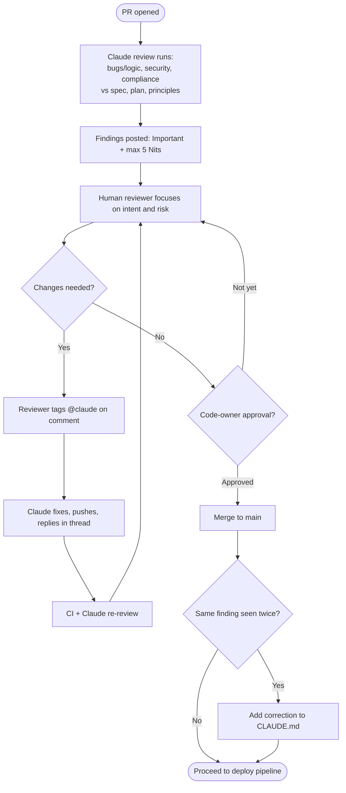

# Stage 5 — Deploy: Bi-Directional Review and Enforcement at the Moment of Action

> **Stage input:** verified branch with `plan.md` and verification evidence &nbsp;|&nbsp; **Stage output:** reviewed, merged, and deployed change; PR as audit record; deployment record &nbsp;|&nbsp; **Read by:** Stage 6 (Maintain) &nbsp;|&nbsp; **Gate:** Code-owner approval to merge; named human authorization for production


---

## Table of Contents

1. [Purpose](#1-purpose)
2. [What Changes vs. the Traditional Approach](#2-what-changes-vs-the-traditional-approach)
3. [Inputs and Outputs](#3-inputs-and-outputs)
4. [Roles Involved (RACI)](#4-roles-involved-raci)
5. [Prerequisites and Infrastructure](#5-prerequisites-and-infrastructure)
6. [Stage Flow Diagrams](#6-stage-flow-diagrams)
7. [Part A — Bi-Directional PR Review](#7-part-a--bi-directional-pr-review)
8. [Part B — Hooks as Approval Gates](#8-part-b--hooks-as-approval-gates)
9. [Part C — Managed Settings for Regulated Enterprises](#9-part-c--managed-settings-for-regulated-enterprises)
10. [Part D — CI/CD Integration and Tiered Autonomy](#10-part-d--cicd-integration-and-tiered-autonomy)
11. [Worked Example: Claims Status Self-Service](#11-worked-example-claims-status-self-service)
12. [Governance and Audit Evidence](#12-governance-and-audit-evidence)
13. [Metrics](#13-metrics)
14. [Anti-Patterns and Pitfalls](#14-anti-patterns-and-pitfalls)
15. [Entry and Exit Criteria](#15-entry-and-exit-criteria)
16. [Checklist](#16-checklist)
17. [Related](#17-related)

---

## 1. Purpose

When agents multiply the volume of code, review and release governance become the constraint. Security teams and approval boards sized for human output cannot read every line of agent-multiplied output, and weekly or monthly change boards cannot keep up with daily (or hourly) change. The Deploy stage resolves this without lowering the bar by changing *how* controls are enforced:

- **Review runs in both directions.** Claude reviews incoming pull requests and addresses review comments on the pull requests it opens. Engineers spend their attention on intent and risk — "is this the right change, and what could it break?" — rather than on mechanical correctness that an agent can check.
- **Governance is enforced at the moment of action.** Instead of a board approving a batch of changes after the fact, the rules that must hold are expressed as hooks, permissions, and branch protection that act when an agent tries to do something. A deployment to production without release authorization is not flagged in a later review; it is blocked when attempted.
- **The agent does everything up to the production gate and nothing past it.** Agents prepare, test, summarize, triage, and propose. A named human authorizes production.

## 2. What Changes vs. the Traditional Approach


| Dimension | Traditional deploy/review | AI-native deploy/review |
|---|---|---|
| Code review | Line-by-line human review of every change | Layered: agentic review of every PR, human review focused on intent, risk, and critical code |
| Review direction | Humans review; authors respond | Claude reviews incoming PRs *and* responds to comments on PRs it opened |
| Time to first review | Hours to days | Minutes |
| Governance | Weekly or monthly change advisory boards | Enforced as the action occurs: hooks, permissions, branch protection, environment approvals |
| Approval authority | Board or manager, often in batches | Code owners approve merges; a named human authorizes production — agents never approve |
| Pipeline failures | Someone gets paged and reads the log | Claude triages non-interactively (flaky vs real) and summarizes before anyone is paged |
| Rollback | Rarely rehearsed | The most rehearsed path: one command, exercised in staging |


## 3. Inputs and Outputs

### Inputs

| Input | Description | Source |
|---|---|---|
| Feature branch | Code and tests from Stages 3–4 | Git |
| Verification evidence | Build, test, lint output; screenshots; verifier report | PR description |
| `plan.md`, `spec.md`, `intent.md` | The chain the reviewer checks the diff against | `work/<id>/` |
| `REVIEW.md` | Review passes, severity definitions, what to skip | Repository root; `../03-Templates/REVIEW.template.md` |
| Hooks and managed settings | Approval gates and non-negotiable policy | `.claude/settings.json`, managed settings |
| CI/CD pipeline | Build, test, deploy, rollback | CI system with `claude-code-action` |

### Outputs

| Output | Description | Consumed by |
|---|---|---|
| Reviewed and merged PR | The audit record: diff, Claude findings, human reviews, fixes, approvals | Audit, Stage 6 |
| Review findings | Tagged Important/Nit findings, resolved or dismissed | Monthly review tuning; `CLAUDE.md` updates |
| Deployment record | Environment, version, who authorized, when | Change management; Stage 6 correlation |
| Triage notes | Headless triage of pipeline failures | On-call; metrics |
| Updated `CLAUDE.md` | Corrections from repeated review findings | Future sessions |

## 4. Roles Involved (RACI)

| Activity | Engineer (author/steerer) | Claude (reviewer and author) | Tech Lead | Code Owners | Platform Engineer | Release Manager / Named Approver | Compliance / Change Mgmt | Admin |
|---|---|---|---|---|---|---|---|---|
| Enable managed Code Review or claude-code-action | — | — | C | — | **R** | — | — | **A** (selects repos) |
| Write and tune `REVIEW.md` | C | — | **R/A** | C | — | — | C | — |
| Automated review of PR | I | **R** | I | I | — | — | — | — |
| Review intent and risk | R | — | C | **R/A** | — | — | — | — |
| Address review comments on request (@claude) | A | **R** | — | C | — | — | — | — |
| Babysit Claude-opened PRs to green | A | **R** | — | — | — | — | — | — |
| Approve merge | — | ✗ (no approval route) | C | **R/A** | — | — | — | — |
| Define gates that must survive | — | — | C | — | C | C | **R/A** | — |
| Implement gates as hooks / managed settings | — | — | — | — | **R** | — | C | **A** |
| Authorize production deployment | I | ✗ | C | — | — | **R/A** | I | — |
| Rehearse and own rollback | C | — | C | — | **R/A** | C | — | — |

The ✗ entries matter: the code-writing agent has no route to approve a PR or authorize production. That separation is the backbone of the stage's governance.

## 5. Prerequisites and Infrastructure

### Prerequisites

- `CLAUDE.md`, skills, and subagents in place (Stage 3), because the reviewer uses the same context.
- Feedback loops (Stage 4), so PRs arrive with verification evidence.
- For CI/CD autonomy: a working PR review loop and approval hooks *before* adding write steps.

### Infrastructure

| Component | Purpose | Reference |
|---|---|---|
| Managed Code Review service, or `anthropics/claude-code-action` in CI | Automated review on every PR | `../03-Templates/ci/claude-pr-review.yml`, `../02-Guides/PR-Review-Guide.md` |
| Branch protection with required code-owner approval | Human approval remains mandatory; no direct path to `main` | Git host settings, CODEOWNERS |
| `REVIEW.md` | Review instructions | `../03-Templates/REVIEW.template.md` |
| Approval-gate hooks | Deterministic enforcement at action time | `../03-Templates/hooks/production-gate.sh` |
| Managed settings | Organization-wide, non-overridable policy | `../03-Templates/settings/managed-settings.json`, `../02-Guides/Managed-Settings-Guide.md` |
| Model access for CI | Anthropic API, Amazon Bedrock, Microsoft Foundry, or Google Vertex AI | `../02-Guides/CI-CD-Integration-Guide.md` |
| MCP servers for deploy targets | Deploy/status/rollback exposed as tools, scoped per environment | Platform team |
| Sandbox profile for CI agents | Containers, network policy, short-lived scoped tokens, no standing production credentials | Platform team |
| OpenTelemetry export | Measure gate wait times and agent activity | Claude Code monitoring docs |

## 6. Stage Flow Diagrams

### Review flow



### Deploy flow with the production gate

```mermaid
sequenceDiagram
    autonumber
    participant CI as CI pipeline
    participant C as Claude (agent identity)
    participant MCP as Deploy MCP tools
    participant H as production-gate hook
    participant RM as Named approver
    CI->>C: Build/test passed on main
    C->>MCP: deploy(dev)
    MCP-->>C: dev healthy
    C->>MCP: deploy(staging)
    MCP-->>C: staging healthy; rollback rehearsed
    C->>C: Prepare release notes + change record
    C->>H: Bash "deploy --env production"
    H-->>C: exit 2: RELEASE_APPROVAL not set; request approval from release manager
    C->>RM: Release package ready for authorization
    RM->>CI: Approve production environment (sets RELEASE_APPROVAL)
    CI->>MCP: deploy(production) under pipeline identity
    MCP-->>CI: production healthy
```


## 7. Part A — Bi-Directional PR Review

### Step 1 — Enable automated review

Two options exist. An administrator can enable the managed Code Review service and select the repositories it covers, or the platform team can run `claude-code-action` in CI. An illustrative workflow:

```yaml
# .github/workflows/claude-pr-review.yml (illustrative; see ../03-Templates/ci/claude-pr-review.yml)
name: claude-pr-review
on:
  pull_request:
    types: [opened, synchronize, ready_for_review]
  issue_comment:
    types: [created]
  pull_request_review_comment:
    types: [created]
permissions:
  contents: write
  pull-requests: write
  issues: write
jobs:
  review:
    if: github.event_name == 'pull_request'
    runs-on: ubuntu-latest
    steps:
      - uses: actions/checkout@v4
      - uses: anthropics/claude-code-action@v1
        with:
          anthropic_api_key: ${{ secrets.ANTHROPIC_API_KEY }}
          prompt: |
            Review this pull request following REVIEW.md at the repo root.
            Read the linked plan.md, spec.md, and intent.md under work/.
            Post findings as review comments tagged [Important] or [Nit].
  respond:
    # Runs when someone mentions @claude in a PR comment
    if: contains(github.event.comment.body, '@claude')
    runs-on: ubuntu-latest
    steps:
      - uses: actions/checkout@v4
      - uses: anthropics/claude-code-action@v1
        with:
          anthropic_api_key: ${{ secrets.ANTHROPIC_API_KEY }}
```

Claude's findings neither approve nor block. Branch protection still requires code-owner approval.

### Step 2 — Write `REVIEW.md`

The tech lead writes `REVIEW.md` so every review follows the same passes, severity scale, and exclusions.

```markdown
# REVIEW.md

## Passes (tag every finding with its pass)
1. [bugs] Logic errors, unhandled failure modes, race conditions, incorrect
   edge-case behavior.
2. [security] Apply the secure-api-review skill. Auth on every endpoint,
   input validation, audit events, PII never in logs or errors.
3. [compliance] Does the diff match plan.md "Files that change"? Does it
   satisfy spec.md acceptance criteria and NFRs? Any conflict with
   intent.md constraints?

## Severity
- Important: breaks behavior, leaks data, or breaches a policy. Must be
  resolved or explicitly dismissed by a code owner with a reason.
- Nit: style, naming, minor readability. At most 5 nits per review;
  summarize the rest as a count.

## Skip
- Anything under src/gen/ (generated code)
- Anything CI already enforces (formatting, lint rules, type checks)
```

**Prompt for the tech lead to draft it:**

```text
Draft a REVIEW.md for this repo. Use three passes (bugs, security,
compliance vs work/*/spec.md and plan.md). Define Important vs Nit.
Cap nits at 5. Exclude generated code paths and anything our CI already
checks — inspect .github/workflows/ to find what that is.
```

### Step 3 — Humans review intent and risk

Human reviewers read Claude's findings, then ask the questions Claude is less positioned to answer: Is this the right change? What does it risk in production? Is the blast radius acceptable?

**Prompt a reviewer can use in their own session:**

```text
Summarize PR #412 for a code owner in under 200 words: what it changes,
how it maps to plan.md, the riskiest part of the diff, and what production
signal would tell us it went wrong. Link specific lines.
```

### Step 4 — Tag @claude to fix

When a reviewer wants a change, they mention `@claude` in a comment with the request. Claude makes the change, pushes it, and replies in the thread, so the request and its resolution are recorded together.

```text
@claude This log line includes the raw claims-core response body, which can
contain the claimant's name. Log only the status code and the claim reference.
```

### Step 5 — Claude babysits its own PRs to merge

For PRs Claude opened (for example, from a Stage 6 finding), Claude sweeps unresolved comments and failing checks repeatedly until the PR is green, waiting only on the code owner's approval.

**Prompt for a session that owns a PR:**

```text
You own PR #418. Until it is approved: every time checks finish, fix any
failing check; address every unresolved review comment (or reply with why
not); re-request review when green. Never approve or merge. Stop and report
if a comment asks for something outside plan.md.
```

### Step 6 — Recurring findings become `CLAUDE.md` corrections

If the same finding appears a second time, add a correction to `CLAUDE.md` so authoring sessions stop producing it.

### Step 7 — Tune monthly

Once a month, the tech lead samples findings and rates them (useful / not useful), caps nits, and excludes paths or classes of issue that generate noise or that CI already enforces. Treat `REVIEW.md` as configuration: its changes go through the eval gate described in Stage 4 if your eval suite covers review behavior.

## 8. Part B — Hooks as Approval Gates

### Step 1 — List the gates that must survive

Leadership, change management, and compliance agree which gates must remain in an agent-accelerated world. Typical gates: change sign-off, release authorization for production, protected paths (infrastructure, payment logic, auth), and data-handling rules.

### Step 2 — Express each gate as a hook

A platform engineer implements each gate as a hook. A `PreToolUse` hook receives the proposed tool call as JSON on stdin and can allow it, ask for confirmation, or block it. Exiting with code 2 blocks the call and returns the script's stderr to Claude, so Claude knows why and what to do next.

```json
{
  "hooks": {
    "PreToolUse": [
      {
        "matcher": "Bash",
        "hooks": [
          { "type": "command", "command": "\"$CLAUDE_PROJECT_DIR\"/.claude/hooks/production-gate.sh" }
        ]
      }
    ]
  }
}
```

```bash
#!/usr/bin/env bash
# .claude/hooks/production-gate.sh — no production deploys without release approval
set -euo pipefail
cmd=$(jq -r '.tool_input.command // empty')
if [[ "$cmd" == *deploy* && "$cmd" == *production* && -z "${RELEASE_APPROVAL:-}" ]]; then
  cat >&2 <<'EOF'
Blocked: production deployment requires release authorization.
Prepare the release package (release notes, change record, rollback command)
and request approval from the release manager via the production environment
approval in CI. Do not retry this command.
EOF
  exit 2
fi
exit 0
```

String matching on commands is a coarse control; use it as one layer alongside permissions (`deny` rules for deploy commands), CI environment approvals, and the absence of production credentials in agent environments.

### Step 3 — Place hooks at the right level

- **Team gates** live in `.claude/settings.json`, checked into git, reviewed like code.
- **Non-negotiable gates** live in managed settings, where engineers cannot override them (see Part C).

### Step 4 — Make blocks helpful

A block should always explain *why* and *how to get approval*. A bare "denied" leads to retries and workarounds; a clear message leads Claude to prepare the right package and ask the right person.

## 9. Part C — Managed Settings for Regulated Enterprises

Managed settings are deployed centrally (via MDM or the admin console) and take precedence over user and project settings; engineers cannot override them. In a regulated enterprise, they encode the non-negotiables:

| Concern | Managed setting (as named in the settings reference) | Effect |
|---|---|---|
| Secrets out of context | `permissions.deny` for secret files and credential paths (e.g. `~/.ssh`, `~/.aws/credentials`) | Claude cannot read them |
| Arbitrary egress | `permissions.deny` for network tools; sandbox with a domain allowlist | Blocks exfiltration paths, including at OS level |
| Prompt fatigue | `permissions.allow` for the safe inner loop (build, test, lint) | Fewer approvals for safe actions, more attention for risky ones |
| No bypass | `disableBypassPermissionsMode`; `allowManagedPermissionRulesOnly` | Engineers cannot switch off permission checks or add their own allow rules |
| Sandbox as a gate | `failIfUnavailable`; `allowUnsandboxedCommands` set to disallow | Claude refuses to start if the sandbox cannot initialize |
| Hooks cannot be bypassed | `allowManagedHooksOnly` | Only centrally managed hooks run |
| Supply chain | `disableSideloadFlags`; `strictKnownMarketplaces` | Plugins and skills come only from the organization's marketplace |
| MCP servers | `allowManagedMcpServersOnly` | Only approved MCP servers can be used |
| Version floor | `requiredMinimumVersion` | Old clients without required controls cannot run |
| Credential hygiene | Strip secrets from the environment passed to tools | Keeps credentials out of commands and transcripts |

Exact key names, nesting, and accepted values should be taken from the current settings reference; the template at `../03-Templates/settings/managed-settings.json` and `../02-Guides/Managed-Settings-Guide.md` show a complete worked configuration.

## 10. Part D — CI/CD Integration and Tiered Autonomy

### Step 1 — Start with read-only judgment steps

Begin with non-interactive (`claude -p`) steps that read and summarize but change nothing: triage a failing build, summarize a PR for release notes, draft a change record.

```yaml
# Illustrative step; see ../03-Templates/ci/triage-on-failure.yml
- name: Triage failure
  if: failure()
  env:
    ANTHROPIC_API_KEY: ${{ secrets.ANTHROPIC_API_KEY }}
  run: |
    claude -p "Read out/build.log. Decide whether this failure is flaky or real, \
      and give a three-line summary: what failed, likely cause, suggested next step." \
      --allowedTools "Read" >> triage.md
```

### Step 2 — Add write steps behind existing gates

Next, allow write steps — lint fixes, documentation updates, addressing review comments — but ensure all writes arrive as PRs that go through the same review and branch protection as human changes.

### Step 3 — Sandbox the pipeline agent

Run CI agents in containers with network policy, short-lived and narrowly scoped tokens, and **no standing production credentials**. Non-interactive runs execute under a distinct agent identity so the audit trail distinguishes them.

### Step 4 — Expose deploy, status, and rollback as scoped MCP tools

Rather than giving the agent shell access to deployment tooling, expose `deploy`, `status`, and `rollback` as MCP tools, scoped per environment.

### Step 5 — Tier autonomy by environment

| Environment | Agent autonomy | Human role |
|---|---|---|
| Development | Deploys freely | None required |
| Staging | Deploys after checks pass; can roll back | Informed; can intervene |
| Production | Prepares the release (notes, change record, rollback command) | A named manager authorizes |

### Step 6 — Make rollback the most rehearsed path

Rollback should be one command (or one MCP tool call), exercised in staging on every release. Stage 6 relies on it being boring and reliable.

## 11. Worked Example: Claims Status Self-Service

*Continuing from [Stage 4](04-Test-Feedback-Loops-and-Evals.md): PR #412 for CLM-1427 passed first-pass CI with verification evidence in its description.*

### Automated review

Within four minutes of Arjun opening PR #412, Claude's review posts:

- **[security][Important]** `adapters/claimsCore.ts:88` logs the raw claims-core response body on non-2xx responses. The body can include the claimant's full name and adjuster details, which are PII-tagged fields; the secure-api-review skill forbids PII in logs. This would also breach the intent constraint on PII.
- **[compliance][Important]** `plan.md` states "no immediate retry" on HTTP 429, but `adapters/claimsCore.ts:61` inherits the adapter's default retry policy of two retries. Under load this could triple calls to claims-core and threaten the 50 rps limit.
- **[bugs][Nit]** Three nits (variable naming, a redundant null check, an unused import), summarized; two more suppressed as the nit cap was reached.

The generated API client under `src/gen/` was excluded, as `REVIEW.md` instructs.

### Humans focus on intent and risk

Mei, the tech lead and code owner, reads the findings and agrees with both Important items. She also asks a risk question that is not about correctness: *what happens to claims-core if the feature flag is flipped to 100% at 9:00 on a Monday?* Arjun answers with the load-check evidence already in the PR (11 rps peak at 200 page views/sec) and proposes a 10% initial rollout.

Mei tags Claude on both findings:

```text
@claude Fix both Important findings: log only status code and claim reference,
and disable retries for getClaimStatuses on 429 per plan.md R-1.
Add a unit test asserting no retry on 429.
```

Claude pushes a commit fixing both, adds the test, and replies in each thread with the commit link. CI and Claude's re-review pass. Mei approves; branch protection is satisfied; the PR merges.

Because this was the second time a PR in the portal repo had logged a raw upstream body, Mei adds to `CLAUDE.md`: *"Never log upstream response bodies; log status code and a correlation ID only."* That change triggers the eval workflow from Stage 4, which passes.

### Through the pipeline

- **Dev:** Claude deploys via the `deploy(dev)` MCP tool automatically after merge.
- **Staging:** Deploys after checks; the pipeline exercises the rollback command (`rollback(staging, to=previous)`) and redeploys, proving rollback works for this release.
- **Production:** Claude prepares release notes, the change record (linking CLM-1427, the PR, and `plan.md`), and the rollback command. When the release job's agent step attempts `deploy --env production`, the `production-gate.sh` hook blocks it with exit code 2 and its message; Claude posts the release package to the release manager. Oliver, the release manager, approves the production environment in CI. The pipeline — not the agent — deploys under its own identity, with the `claimsStatus` feature flag at 10%.

The Jira record CLM-1427 is updated with the merge SHA and deployment ID.

**Next:** In [Stage 6 — Maintain](06-Maintain-Close-the-Loop.md), the feature is live and monitored; production signals begin feeding the loop.

## 12. Governance and Audit Evidence

| Control objective | Evidence produced | Where to find it |
|---|---|---|
| Every change is reviewed | Claude review comments + human review on every PR | PR history |
| Separation of duties: author cannot approve | Agent identity has no approval permission; branch protection requires code owner | Branch protection settings; PR "approved by" |
| Review requests and fixes are traceable | @claude request and Claude's reply with commit link in the same thread | PR threads |
| No direct path to main | Branch protection audit log | Git host audit log |
| Production changes are authorized by a named person | CI environment approval record; hook block record for agent attempts | CI deployment logs; session/OTel logs |
| Non-negotiable policy cannot be overridden locally | Managed settings deployed via MDM/admin console | Admin console; device management |
| Agent runs are attributable | Non-interactive runs under agent identity | CI logs; commit author; OTel traces |
| Rollback is proven before production | Staging rollback exercise per release | Pipeline logs |

## 13. Metrics


### Review metrics

**Time to first review (minutes).** From PR creation to first review or review comment.

```bash
gh pr list --state merged --limit 100 --json number,createdAt,reviews \
 | jq -r '.[] | select(.reviews|length>0)
   | "\(.number)\t\(((.reviews[0].submittedAt|fromdate) - (.createdAt|fromdate))/60|floor) min"'
```

**Share of review comments resolved without a human touching the branch.** For each PR, compare commits authored by the agent identity after the first review comment against commits authored by humans.

```bash
gh pr view 412 --json commits \
  --jq '.commits[] | "\(.authors[0].login) \(.committedDate) \(.messageHeadline)"'
# Count commits by claude[bot] vs humans after the first review timestamp
```

**Pre-merge defects vs production escapes.** Count Important findings resolved before merge versus incidents or bugs later attributed to merged PRs (tag incidents with the PR number).

### Gate metrics

**Wait time per gate.** Using Claude Code's OpenTelemetry export plus CI approval timestamps, measure time from a gate block (or approval request) to authorization. Long waits show where human capacity is the constraint.

**Gate violations reaching production, before and after hooks.** Compare the count of unauthorized or out-of-policy production changes per quarter before and after gates were implemented.

### CI/CD metrics

**Share of pipeline failures triaged without paging a human.** Failed runs with a `triage.md` artifact and no page, divided by all failed runs.

```bash
gh run list --status failure --limit 200 --json databaseId \
 | jq -r '.[].databaseId' | while read id; do
   gh run view "$id" --json jobs --jq '[.jobs[].steps[] | select(.name=="Triage failure" and .conclusion=="success")] | length'
 done | awk '{t++; if($1>0) s++} END {printf "triaged: %d/%d\n", s, t}'
```

**DORA metrics** *(general industry practice)*: deployment frequency, lead time for changes, change failure rate, and time to restore service. Compute from deployment records and incident data; track them before and after AI-native adoption so improvements (or regressions) are visible.

## 14. Anti-Patterns and Pitfalls

| Anti-pattern | Why it hurts | Better practice |
|---|---|---|
| **Treating Claude's review as approval** | Removes the human accountability the control requires | Findings never approve or block; code-owner approval stays mandatory |
| **Unbounded nits** | Reviewers stop reading; real issues drown | Cap nits (e.g. 5) and summarize the rest as a count |
| **Reviewing generated code and CI-enforced rules** | Noise and duplication | Exclude them in `REVIEW.md` |
| **Never tuning review** | Signal-to-noise decays | Monthly tuning: rate findings, adjust passes and exclusions |
| **Hooks that just say "no"** | Claude retries or works around | Every block explains why and how to obtain approval |
| **Standing production credentials in CI agent environments** | A single mistake or injection reaches production | Short-lived scoped tokens; production deploy by pipeline identity after human authorization |
| **Letting agents write straight to main** | Bypasses review entirely | All agent writes arrive as PRs; branch protection |
| **Starting CI autonomy with write steps** | Risk before trust is established | Start read-only (triage, summaries), then add writes behind gates |
| **Unrehearsed rollback** | Rollback fails exactly when needed | Exercise rollback in staging on every release |
| **Team-level settings for non-negotiables** | Engineers can edit or bypass them | Put non-negotiables in managed settings |

## 15. Entry and Exit Criteria

### Definition of Ready (entry)

- [ ] PR opened with link to `plan.md` and verification evidence in the description.
- [ ] CI green on the PR.
- [ ] `REVIEW.md` exists; automated review is enabled for the repository.
- [ ] Branch protection requires code-owner approval.
- [ ] Production gate hook and environment approvals are configured.

### Definition of Done (exit)

- [ ] All Important findings resolved or dismissed by a code owner with a reason.
- [ ] Code-owner approval recorded; PR merged via branch protection.
- [ ] Repeated findings captured in `CLAUDE.md`.
- [ ] Deployed to dev and staging; rollback exercised in staging.
- [ ] Production deployment authorized by a named approver and executed by the pipeline identity.
- [ ] Deployment record links the change record, PR, and artifacts; legacy record updated with SHA.

## 16. Checklist

- [ ] Automated review ran and posted tagged findings
- [ ] Human review addressed intent and risk
- [ ] @claude used for requested fixes; replies recorded in thread
- [ ] Code-owner approval obtained; merged
- [ ] `CLAUDE.md` updated for repeated findings
- [ ] Dev and staging deploys healthy; rollback rehearsed
- [ ] Production gate respected; named approver authorized
- [ ] Deployment and change records linked

## 17. Related

- Previous stage: [04 — Test: Feedback Loops and Evals](04-Test-Feedback-Loops-and-Evals.md)
- Next stage: [06 — Maintain: Close the Loop](06-Maintain-Close-the-Loop.md)
- Stage index: [README](README.md)
- Main playbook: [AI-Native SDLC Playbook](../00-Playbook/AI-Native-SDLC-Playbook.md)
- Guides:
  - [PR Review Guide](../02-Guides/PR-Review-Guide.md)
  - [Hooks Guide](../02-Guides/Hooks-Guide.md)
  - [Managed Settings Guide](../02-Guides/Managed-Settings-Guide.md)
  - [CI/CD Integration Guide](../02-Guides/CI-CD-Integration-Guide.md)
  - [CLAUDE.md Guide](../02-Guides/CLAUDE-md-Guide.md)
  - [Source of Truth and Legacy Systems](../02-Guides/Source-of-Truth-and-Legacy-Systems.md)
- Templates:
  - [REVIEW.template.md](../03-Templates/REVIEW.template.md)
  - [ci/claude-pr-review.yml](../03-Templates/ci/claude-pr-review.yml)
  - [ci/triage-on-failure.yml](../03-Templates/ci/triage-on-failure.yml)
  - [hooks/production-gate.sh](../03-Templates/hooks/production-gate.sh)
  - [settings/managed-settings.json](../03-Templates/settings/managed-settings.json)
  - [settings/project-settings.json](../03-Templates/settings/project-settings.json)

---

*Based on concepts from Anthropic's AI-Native SDLC Playbook; expanded guidance for implementation.*
