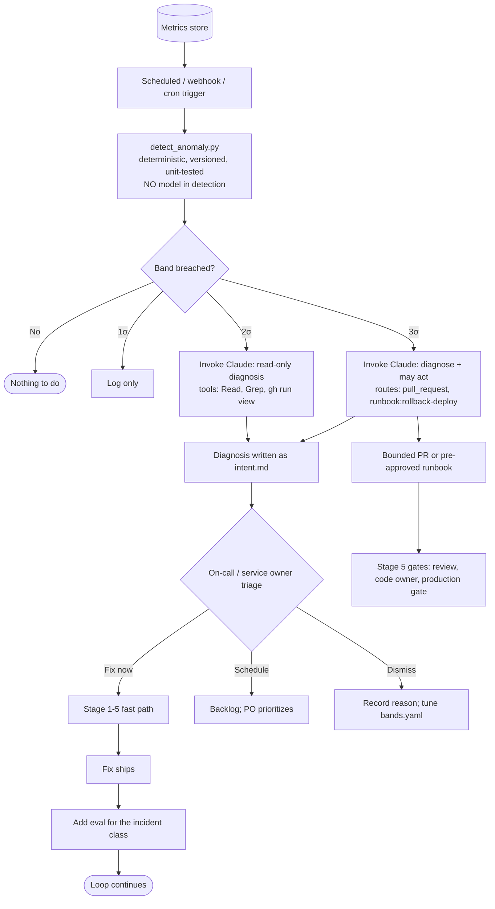

# Stage 6 — Maintain: Closing the Loop

> **Stage input:** production signals (metrics, CI data, scan findings, on-call conversations) &nbsp;|&nbsp; **Stage output:** a new `intent.md` (or a bounded fix PR / pre-approved runbook action), new evals, lessons learned &nbsp;|&nbsp; **Read by:** Stage 1 (Plan) — the loop restarts &nbsp;|&nbsp; **Gate:** Human triage of every finding; all fixes pass through the same review and production gates


---

## Table of Contents

1. [Purpose](#1-purpose)
2. [What Changes vs. the Traditional Approach](#2-what-changes-vs-the-traditional-approach)
3. [Inputs and Outputs](#3-inputs-and-outputs)
4. [Roles Involved (RACI)](#4-roles-involved-raci)
5. [Prerequisites and Infrastructure](#5-prerequisites-and-infrastructure)
6. [Stage Flow Diagrams](#6-stage-flow-diagrams)
7. [Part A — Control Bands and Anomaly-Triggered Intent](#7-part-a--control-bands-and-anomaly-triggered-intent)
8. [Part B — Recurring Codebase and Security Scans](#8-part-b--recurring-codebase-and-security-scans)
9. [Part C — Claude On Call](#9-part-c--claude-on-call)
10. [Worked Example: Claims Status Self-Service](#10-worked-example-claims-status-self-service)
11. [Governance and Audit Evidence](#11-governance-and-audit-evidence)
12. [Metrics](#12-metrics)
13. [Anti-Patterns and Pitfalls](#13-anti-patterns-and-pitfalls)
14. [Entry and Exit Criteria](#14-entry-and-exit-criteria)
15. [Checklist](#15-checklist)
16. [Related](#16-related)

---

## 1. Purpose

Traditional maintenance depends on people watching production: dashboards on a wall, alerts that page someone, a weekly review of error trends. It works, but it scales with headcount, and what humans notice depends on what they happen to be looking at.

In an AI-native SDLC, the Maintain stage **closes the loop**. Deterministic detection watches stable metrics; when a metric leaves its normal band, a trigger invokes Claude with no person in the path. Claude investigates within tightly scoped permissions, and its findings re-enter the delivery system as a new `intent.md` — the same artifact that begins Stage 1. A human triages every finding. Fixes flow back through design, plan, test, review, and the production gate exactly like any other change.

Three mechanisms feed the loop:

1. **Control bands and anomaly detection** on operational and delivery metrics (Part A).
2. **Recurring codebase and security scans**, because a scan is a point-in-time result and both code and threats drift (Part B).
3. **Claude on call**, acting as a first responder in the team's incident channel (Part C).

The stage's defining principle is the same as the playbook's: the loop keeps running, and human judgment stays above it.

## 2. What Changes vs. the Traditional Approach


| Dimension | Traditional maintenance | AI-native maintenance |
|---|---|---|
| Who watches production | Humans, with dashboards and alerts | Deterministic detection scripts; agents investigate when bands are breached |
| Detection logic | Ad-hoc thresholds, often tuned by feel | Versioned, unit-tested detection (rolling baselines, Western Electric-style rules); **no model in detection** |
| First response | A human is paged and starts from zero | Claude has already gathered evidence and written a diagnosis |
| Output of an investigation | A ticket, a chat thread, tribal memory | A versioned `intent.md` (or bounded PR / runbook action) plus a lessons-learned file |
| How fixes ship | Hotfix path, sometimes bypassing process | Through the same gates as every other change |
| Security scanning | Periodic audits; point-in-time | Scheduled scans with findings routed through the same gates |
| Learning | Post-mortems filed and forgotten | Every incident class becomes an eval; lessons are versioned and read by future investigations |

## 3. Inputs and Outputs

### Inputs

| Input | Description | Source |
|---|---|---|
| Stable metrics | e.g. CI test failure rate, post-deploy 5xx rate, PR cycle time, feature-specific error rates | Prometheus, CI API, APM |
| Band configuration | Metric definitions, baselines, rules, response tiers | `monitoring/bands.yaml` (versioned) |
| Detection script | Deterministic anomaly detection | `monitoring/detect_anomaly.py` (versioned, unit-tested) |
| Scan findings | Security and code-health findings with confidence ratings | Claude Security, other scanners |
| Incident channel conversations | Human and agent investigation in chat | Slack (via Claude Tag) |
| Lessons folder | Prior post-mortems | `lessons/` in the repository |
| Business success metrics | From the originating `intent.md` | Reporting systems |

### Outputs

| Output | Description | Consumed by |
|---|---|---|
| Anomaly log entries | 1σ breaches recorded for trend analysis | Service owner |
| Read-only diagnosis | 2σ breaches: evidence and hypothesis | On-call triage |
| New `intent.md` | Diagnosis written as intent: anomaly, evidence, proposed outcome, affected systems, open questions | Stage 1 |
| Bounded fix PR or runbook action | 3σ breaches where the tier config allows (e.g. revert PR, rollback runbook) | Stage 5 gates |
| Post-mortem in `lessons/` | Versioned lessons learned | Future investigations |
| New eval | One per incident class | Stage 4 eval suite |
| Band tuning changes | Dismissals feed back into band configuration | `bands.yaml` |

## 4. Roles Involved (RACI)

| Activity | Service Owner | On-Call Engineer | Claude (triggered, stateless) | Platform Engineer | Security Lead | Product Owner | Tech Lead |
|---|---|---|---|---|---|---|---|
| Pick stable metrics to monitor | **R/A** | C | — | C | — | C | C |
| Write and test detection script | C | — | — | **R/A** | — | — | C |
| Maintain `bands.yaml` tiers | **A** | C | — | **R** | — | — | C |
| Detect breach and trigger | — | — | — | (automated) | — | — | — |
| Investigate and write diagnosis/intent | I | I | **R** | — | — | — | — |
| Triage: fix now / schedule / dismiss | **A** | **R** | — | — | — | C (for product-level intents) | C |
| Act at 3σ within allowed routes | A | C | **R** (PR or pre-approved runbook only) | — | — | — | — |
| Approve fix PR / authorize production | — | — | ✗ | — | — | — | Code owner **R/A** |
| Connect repos and schedule scans | — | — | — | C | **R/A** | — | — |
| Triage scan findings | C | — | — | — | **R/A** | — | C |
| Write eval for incident class | **A** | R | R (draft) | C | — | — | — |
| Tune bands from dismissals | **A** | C | — | **R** | — | — | — |

## 5. Prerequisites and Infrastructure

### Prerequisites

This stage is the last to adopt because it depends on everything before it:

- **`intent.md` template and flow** (Stage 1), because findings re-enter as intent.
- **Fast PR review** (Stage 5), because 3σ actions arrive as PRs.
- **Hooks as action boundaries** (Stages 3 and 5), because the triggered agent runs unattended.
- **Rehearsed rollback** (Stage 5), because rollback is the most common pre-approved runbook.


### Infrastructure

| Component | Purpose | Notes |
|---|---|---|
| Metrics store | Source of truth for monitored metrics | Prometheus, CI API, APM |
| Read access to the repository | For diagnosis | Read-only token for the triggered agent |
| Non-interactive Claude Code in CI, or an Agent SDK service | Receives triggers and runs investigations | Scheduled workflow, monitoring webhook, or cron |
| `bands.yaml` + `detect_anomaly.py` | Deterministic detection and tier routing | `../03-Templates/monitoring/` |
| Claude Security (public beta, Claude Enterprise) | Hosted recurring security scans | Requires the Anthropic GitHub App, Claude Code on the web enabled, extra usage with a spend limit, and admin enablement |
| Claude Tag (public beta) | Claude as a member of the incident channel in Slack | Operates under its own identity |
| MCP connections to observability | Let Claude verify metrics return to baseline | Scoped, read-only |
| `lessons/` folder | Versioned post-mortems | Read by future investigations |

## 6. Stage Flow Diagrams

### Anomaly to intent



### Claude on call in the incident channel

```mermaid
sequenceDiagram
    autonumber
    participant Mon as Monitoring
    participant Ch as #portal-incidents (Slack)
    participant C as Claude (Claude Tag, own identity)
    participant Obs as Observability (MCP)
    participant Eng as On-call engineer
    participant Repo as Repository
    Mon->>Ch: Alert: claims_status_unavailable_rate 3σ
    Ch->>C: Claude, investigate
    C->>Obs: Query metrics, recent deploys, logs
    C->>Repo: Read lessons/ for similar incidents
    C->>Ch: Hypothesis + evidence + options
    Eng->>Ch: Steer: "check cache TTL alignment"
    C->>Obs: Confirm spikes at TTL boundaries
    C->>Repo: Open PR (bounded fix) via review gate
    Eng->>Repo: Code owner approves; ships via pipeline
    C->>Obs: Verify metric back to baseline
    C->>Repo: Write post-mortem to lessons/
    C->>Ch: Summary + links (channel is the audit trail)
```

## 7. Part A — Control Bands and Anomaly-Triggered Intent

### Step 1 — The service owner picks a stable metric

Choose a metric that is stable enough to have a meaningful baseline and important enough that a shift matters. Good starting metrics: CI test failure rate, post-deploy 5xx rate, PR cycle time, and feature-specific error or degradation rates.

### Step 2 — Write deterministic detection

Detection is a plain script — rolling mean and standard deviation, plus rules that catch both spikes and slow drift. It is versioned and unit-tested like any other code. **No model participates in detection.** This keeps the trigger predictable, auditable, and cheap, and means the model is only invoked once something objectively unusual has happened.

The Western Electric rules are *general industry practice* from statistical process control; they are a common, well-understood choice for detecting both sudden shifts and gradual drift. An excerpt:

```python
# monitoring/detect_anomaly.py (excerpt; see ../03-Templates/monitoring/detect_anomaly.py)
from statistics import mean, stdev

def zscores(series, baseline):
    mu, sigma = mean(baseline), stdev(baseline)
    if sigma == 0:
        return [0.0 for _ in series]
    return [(x - mu) / sigma for x in series]

def western_electric(z):
    """Return the highest sigma tier triggered by the most recent points.
    Rule 1: one point beyond 3 sigma           -> tier 3
    Rule 2: 2 of the last 3 beyond 2 sigma, same side -> tier 2
    Rule 3: 4 of the last 5 beyond 1 sigma, same side -> tier 1
    Rule 4: 8 consecutive points on one side of the mean -> tier 1 (drift)
    """
    if abs(z[-1]) > 3:
        return 3
    for side in (1, -1):
        if sum(1 for v in z[-3:] if v * side > 2) >= 2:
            return 2
    for side in (1, -1):
        if sum(1 for v in z[-5:] if v * side > 1) >= 4:
            return 1
        if len(z) >= 8 and all(v * side > 0 for v in z[-8:]):
            return 1
    return 0
```

A unit test pins behavior so a refactor cannot silently change what triggers an agent:

```python
def test_single_spike_is_tier_3():
    assert western_electric([0.1, -0.2, 0.3, 3.4]) == 3

def test_slow_drift_is_tier_1():
    assert western_electric([0.2, 0.4, 0.3, 0.5, 0.6, 0.4, 0.7, 0.5]) == 1
```

### Step 3 — Define response tiers in versioned configuration

Response tiers say what Claude may do at each severity. They live in version control and change only through review.

```yaml
# monitoring/bands.yaml (see ../03-Templates/monitoring/bands.yaml)
metrics:
  - name: ci_test_failure_rate
    source: ci_api
    baseline: rolling_30d
    rules: western_electric
    tiers:
      1sigma: { action: log }
      2sigma:
        action: diagnose
        tools: "Read,Grep,Bash(gh run view *)"
      3sigma:
        action: propose
        routes: [pull_request, "runbook:rollback-deploy"]
```

| Tier | Meaning | What Claude may do |
|---|---|---|
| 1σ | Noticeable but likely noise | Nothing; the breach is logged for trend analysis |
| 2σ | Probably real | Read-only diagnosis; write findings as `intent.md` |
| 3σ | Almost certainly real | Diagnose, and act through allowed routes only: open a PR, or invoke a pre-approved runbook (e.g. rollback) |

### Step 4 — Wire the trigger

Use a scheduled workflow, a monitoring webhook, or cron. Claude is **stateless** across runs; everything it needs is passed in or read from the repository and metrics.

```yaml
# Illustrative scheduled trigger
on:
  schedule: [{ cron: '*/15 * * * *' }]
jobs:
  detect:
    runs-on: ubuntu-latest
    steps:
      - uses: actions/checkout@v4
      - run: python monitoring/detect_anomaly.py --config monitoring/bands.yaml --out breach.json
      - name: Investigate
        if: hashFiles('breach.json') != ''
        env:
          ANTHROPIC_API_KEY: ${{ secrets.ANTHROPIC_API_KEY }}
        run: |
          tools=$(jq -r .tools breach.json)
          claude -p "A control band was breached: $(cat breach.json). Investigate \
            using only read-only evidence. Write your diagnosis as intent.md in \
            work/anomaly-$(date +%Y%m%d%H%M)/ using the intent template: anomaly, \
            evidence, proposed outcome, affected systems, open questions." \
            --allowedTools "$tools,Write" --output-format json > investigation.json
```

### Step 5 — The agent writes the diagnosis as `intent.md`

**Prompt pattern (embedded in the trigger):**

```text
Metric <name> breached <tier> at <time>: <values vs baseline>.
1. Gather evidence: recent deploys, CI runs, logs, related lessons/ files.
2. State the most likely cause and at least one alternative.
3. Write intent.md with sections: Anomaly, Evidence (with links/commands),
   Proposed outcome, Affected systems, Open questions.
4. Do not change code unless this tier allows it and the fix is bounded.
```

### Step 6 — Humans triage

The on-call engineer or service owner triages each intent: **fix now**, **schedule**, or **dismiss**. Dismissals include a reason, and recurring dismissals are the signal to tune the bands (widen, change baseline window, or retire the metric).

### Step 7 — Close with an eval

When the fix ships, add an eval for the incident class (Stage 4) so the configured agent is regression-tested against it from then on.

### Examples of tiered responses

| Signal | Tier | Response |
|---|---|---|
| CI test failure rate at 3σ | 3σ | Quarantine the flaky test via PR, or open a revert PR for the offending commit |
| Post-deploy 5xx at 3σ with a deploy inside the window | 3σ | Trigger the existing rollback pipeline (pre-approved runbook) |
| PR cycle time drifting upward | Drift (1σ rule) | Produce a report for engineering leadership; no code action |

## 8. Part B — Recurring Codebase and Security Scans

A security scan is a point-in-time result. Code changes daily, dependencies change, and the capability of the models used to find vulnerabilities improves. Scans should run on a schedule with no human in the path, and their findings should flow through the same gates as everything else.

Claude Security (public beta, for Claude Enterprise) is a hosted option: you connect GitHub repositories, scans run on Anthropic's infrastructure, and findings are validated before being reported, each with a confidence rating.

### Steps

1. **Connect repositories.** The security lead connects repos, organized by repository, service, or team.
2. **Baseline.** Run a full scan of critical repositories first.
3. **Schedule.** Set a per-project schedule — weekly is typical — optionally scoped to a directory or branch.
4. **Triage with confidence.** Use the confidence rating to prioritize; dismiss false positives with a logged reason.
5. **Bounded findings → patch.** For a contained finding, open the suggested patch in Claude Code on the web, review it, and send it through the normal PR gate.
6. **Wide or architectural findings → intent.** Write them up as `intent.md` for Stage 1.
7. **After a fix ships,** add an eval for the vulnerability class.
8. **Integrate.** Export findings (CSV, Markdown, or webhook) to your existing tracker.

**Prompt to triage a scan export in Claude Code:**

```text
Here is this week's scan export for product-portal. Group findings by
vulnerability class. For each: confidence, affected files, whether it is
bounded (single-file, clear fix) or wide (architectural). Propose which
to patch now, which become intent.md, and which to dismiss — with a
one-line reason for each dismissal.
```

## 9. Part C — Claude On Call

With Claude Tag (public beta), Claude is a member of the incident channel in Slack under its own identity and acts as a first responder. The conversation and the knowledge it produces stay in the channel, anyone in the channel can steer the investigation, and the channel history is the audit trail.

Through MCP connections, Claude can verify that a metric has returned to baseline after a fix and can write the post-mortem to a versioned `lessons/` folder that future investigations read. Small, bounded fixes go out as PRs through the review gate; larger issues become `intent.md`.

**Prompts in the channel:**

```text
@Claude investigate the claims_status_unavailable_rate alert. Check the last
three deploys, claims-core 429 counts, and cache hit ratio. Check lessons/
for similar incidents. Post a hypothesis with evidence before proposing anything.
```

```text
@Claude the fix is deployed. Confirm the metric has been within 1σ of baseline
for 30 minutes, then write a post-mortem to lessons/ using our template and
link it here.
```

See `../02-Guides/Claude-On-Call-Guide.md`.

## 10. Worked Example: Claims Status Self-Service

*Continuing from [Stage 5](05-Deploy-Review-and-Gates.md): CLM-1427 was deployed to production behind the `claimsStatus` flag at 10%, with rollback rehearsed in staging.*

### Rollout and monitoring setup

Over two weeks the flag goes from 10% to 100%. Before the final step, Mei (service owner for the portal backend) adds a feature-specific metric to `bands.yaml`:

```yaml
  - name: claims_status_unavailable_rate
    source: prometheus
    query: sum(rate(portal_claims_status_unavailable_total[5m])) / sum(rate(portal_claims_status_requests_total[5m]))
    baseline: rolling_14d
    rules: western_electric
    tiers:
      1sigma: { action: log }
      2sigma: { action: diagnose, tools: "Read,Grep,Bash(gh run view *)" }
      3sigma: { action: propose, routes: [pull_request] }
```

The metric measures how often customers see "status temporarily unavailable" — the fallback when claims-core rate-limits the portal and no cached value exists.

### The breach

On the first business day of the month, the metric jumps past 3σ at 09:00, 09:05, and 09:10, then settles. The detection script, running every 15 minutes, records a tier-3 breach and triggers an investigation.

Claude's read-only investigation finds:

- claims-core 429 responses to the portal client spike in 5-minute bursts.
- The bursts align with cache TTL boundaries: many policyholders log in at the start of the month (premium statements go out), their cache entries are created within minutes of each other, and with a fixed 300-second TTL they expire together, sending a synchronized wave of calls above the 50 rps limit.
- `lessons/2025-11-cache-stampede-quotes.md` describes the same pattern in the quotes service, where it was fixed with jittered TTLs.

Claude writes `work/anomaly-202610010915/intent.md`:

```markdown
# Intent: Eliminate synchronized cache expiry in claims status

| Field | Value |
|---|---|
| Author | claude-maintain (triggered by bands.yaml: claims_status_unavailable_rate 3σ) |
| Status | Triage |
| Related | CLM-1427; lessons/2025-11-cache-stampede-quotes.md |

## Anomaly
claims_status_unavailable_rate exceeded 3σ (baseline 0.4%, observed 6.8%)
at 09:00-09:10 on 2026-10-01.

## Evidence
- claims-core 429s to portal client: 5-min bursts aligned to TTL expiry
  (query and output attached)
- Cache entry creation timestamps clustered within 4 minutes
- No deploy in the window

## Proposed outcome
Cache expiry for claims status is spread so that expiry of entries created
together does not produce synchronized calls; claims-core stays under 50 rps
at month-start peak.

## Affected systems
core/claimStatus.ts cache usage; claims-core (read-only)

## Open questions
- Should stale-while-revalidate be used so customers never see "unavailable"
  when a stale value exists?
```

Because the 3σ tier allows a pull request, Claude also opens a bounded PR adding ±20% jitter to the TTL, with a unit test. The PR goes through the normal Stage 5 review; the production gate applies as usual.

### Triage and fix

Riya, the on-call engineer, triages the intent as **fix now** in the incident channel, where Claude (via Claude Tag) has posted its evidence. She steers: *"Take the stale-while-revalidate question to the PO; ship the jitter fix now."* Mei approves the PR; it ships through the pipeline with release authorization. The next morning Claude confirms via the observability MCP connection that the metric has stayed within 1σ, and writes `lessons/2026-10-claims-status-ttl-stampede.md`.

Sam, the platform engineer, adds an eval (`evals/cache-jittered-ttl.json`): a task that adds a cached adapter call, with a check that the TTL is jittered. It joins the suite from Stage 4.

The stale-while-revalidate question becomes its own `intent.md`, which Daniel (PO) schedules — the loop has restarted at Stage 1.

### A recurring scan finding

The weekly Claude Security scan of `product-portal` reports a medium-confidence finding: in one environment configuration, the portal's error handler can return stack traces in responses. Fatima (security lead) confirms it is bounded, opens the suggested patch in Claude Code on the web, reviews it, and raises a PR through the standard gate. After merge, a vulnerability-class eval is added.

### Closing the business loop

One quarter after full rollout, contact-center reporting shows claim-status queries have fallen from about 33% of call handling time to about 24% — a relative reduction of roughly 27%, short of the intent's "reduce by at least a third within two quarters" target after the first quarter, but trending toward it. Priya reviews the numbers with Daniel. The deferred question from the Stage 2 spec — access for third-party loss adjusters — returns as a new intent, now backed by data from the live feature.

## 11. Governance and Audit Evidence

| Control objective | Evidence produced | Where to find it |
|---|---|---|
| Detection is predictable and reviewable | Versioned, unit-tested detection script; no model in detection | `monitoring/detect_anomaly.py` and its tests; git history |
| Agent autonomy is bounded and approved | Response tiers in versioned config, changed via PR | `monitoring/bands.yaml` history |
| Every finding is triaged by a human | Triage decision (fix/schedule/dismiss) on each anomaly intent | Intent status, PR/issue history |
| Dismissals are justified | Logged reason for every dismissal; linked band tuning | Triage records, `bands.yaml` commits |
| Fixes pass the same gates | Anomaly-driven PRs reviewed and approved like any other | PR history |
| Incident investigation is auditable | Channel history in Slack; Claude acts under its own identity | Incident channel |
| Learning is retained | Post-mortems in `lessons/`; eval per incident class | Repository |
| Security scanning is continuous | Scan schedule per repo; finding dispositions with reasons | Claude Security; exported findings in tracker |

## 12. Metrics


### Closing-the-loop metrics

**Time from band breach to `intent.md` in the triage queue.** Breach timestamp (from `breach.json` / detection logs) to the commit time of the anomaly intent.

```bash
for d in work/anomaly-*/; do
  breach=$(jq -r .detected_at "$d/breach.json" 2>/dev/null) || continue
  committed=$(git log --diff-filter=A --format=%cI -- "$d/intent.md" | tail -1)
  echo "$(basename "$d") breach=$breach intent=$committed"
done
```

**Share of findings that become merged fixes.** Anomaly intents with a linked merged PR divided by all anomaly intents in the period. Low values indicate noisy bands; very high values with long delays indicate triage capacity problems.

**Repeat incidents fall.** Count incidents per incident class per quarter; classes with an eval should trend toward zero repeats.

### Scan metrics

| Metric | How to compute |
|---|---|
| Share of repositories on a scan schedule | Scheduled repos / total repos in the organization (from the scan configuration export and `gh repo list <org> --limit 1000 --json name`) |
| Time from finding to patch in a PR | Finding reported timestamp (export) to PR created timestamp (tracker/PR link) |
| Scan-found vs production- or externally-found vulnerabilities | Tag vulnerabilities by discovery source in your tracker; compute the ratio per quarter |
| Findings per scan trend | Findings count per scheduled scan over time; should trend down as classes gain evals |

### Business outcome

Return to the success metric in the originating `intent.md` (for the worked example, share of contact-center call time on claim status). This is the lagging metric that tells you whether the loop delivered value, not just change.

## 13. Anti-Patterns and Pitfalls

| Anti-pattern | Why it hurts | Better practice |
|---|---|---|
| **Using a model for detection** | Unpredictable, hard to audit, and expensive to run continuously | Deterministic, versioned, unit-tested detection; the model only investigates |
| **Unstable metrics** | Constant breaches train people to ignore findings | Pick stable metrics with meaningful baselines |
| **Letting the agent act at every tier** | Unbounded autonomy on noisy signals | Log at 1σ, read-only at 2σ, bounded routes only at 3σ |
| **Findings that bypass gates** | Hotfix paths erode every control upstream | Anomaly PRs go through the same review and production gate |
| **Dismissing without reasons** | Bands never improve; the same noise returns | Log every dismissal reason and tune bands from them |
| **Stateful agent memory as the record** | Invisible, unreviewable context | Keep the agent stateless; state lives in git, `lessons/`, and the channel |
| **One-off security scans** | Results decay as code and threats change | Scheduled scans with findings routed through gates |
| **Post-mortems without evals** | The same failure recurs | Every incident class gets an eval |
| **Forgetting the business metric** | The loop optimizes operations but not outcomes | Revisit the originating intent's success metric on a schedule |

## 14. Entry and Exit Criteria

### Definition of Ready (entry)

- [ ] Change is live in production (Stage 5 exit).
- [ ] At least one stable metric for the service is defined in `bands.yaml`, with tiers.
- [ ] Detection script is versioned and unit-tested.
- [ ] Trigger mechanism exists (schedule, webhook, or cron) with non-interactive Claude access and read-only repo access.
- [ ] Rollback is rehearsed and available as a pre-approved runbook (if used as a 3σ route).
- [ ] Repositories are connected to a recurring scan schedule.

### Definition of Done (exit) — for each finding

- [ ] Finding written as `intent.md` (or bounded PR / runbook action per tier).
- [ ] Human triage decision recorded: fix now, schedule, or dismiss (with reason).
- [ ] Fix, if any, merged and deployed through standard gates.
- [ ] Metric verified back within band.
- [ ] Post-mortem written to `lessons/` (for incidents).
- [ ] Eval added for the incident or vulnerability class.
- [ ] Bands tuned if the finding was noise.

## 15. Checklist

- [ ] Stable metrics chosen by the service owner
- [ ] Deterministic, tested detection in place
- [ ] Response tiers versioned in `bands.yaml`
- [ ] Trigger wired; agent is stateless and scoped per tier
- [ ] Diagnoses written as `intent.md`
- [ ] Every finding triaged by a human
- [ ] Fixes shipped through standard gates
- [ ] Lessons written and evals added
- [ ] Scans scheduled; findings triaged with confidence and reasons
- [ ] Business success metric reviewed against the original intent

## 16. Related

- Previous stage: [05 — Deploy: Review and Gates](05-Deploy-Review-and-Gates.md)
- Loop returns to: [01 — Plan: Intent](01-Plan-Intent.md)
- Stage index: [README](README.md)
- Main playbook: [AI-Native SDLC Playbook](../00-Playbook/AI-Native-SDLC-Playbook.md)
- Guides:
  - [Control Bands and Anomaly Detection](../02-Guides/Control-Bands-and-Anomaly-Detection.md)
  - [Recurring Security Scans](../02-Guides/Recurring-Security-Scans.md)
  - [Claude On-Call Guide](../02-Guides/Claude-On-Call-Guide.md)
  - [Evals Guide](../02-Guides/Evals-Guide.md)
  - [CI/CD Integration Guide](../02-Guides/CI-CD-Integration-Guide.md)
  - [Hooks Guide](../02-Guides/Hooks-Guide.md)
- Templates:
  - [monitoring/bands.yaml](../03-Templates/monitoring/bands.yaml)
  - [monitoring/detect_anomaly.py](../03-Templates/monitoring/detect_anomaly.py)
  - [intent.template.md](../03-Templates/intent.template.md)
  - [evals/example-eval.json](../03-Templates/evals/example-eval.json)
  - [ci/triage-on-failure.yml](../03-Templates/ci/triage-on-failure.yml)

---

*Based on concepts from Anthropic's AI-Native SDLC Playbook; expanded guidance for implementation.*
