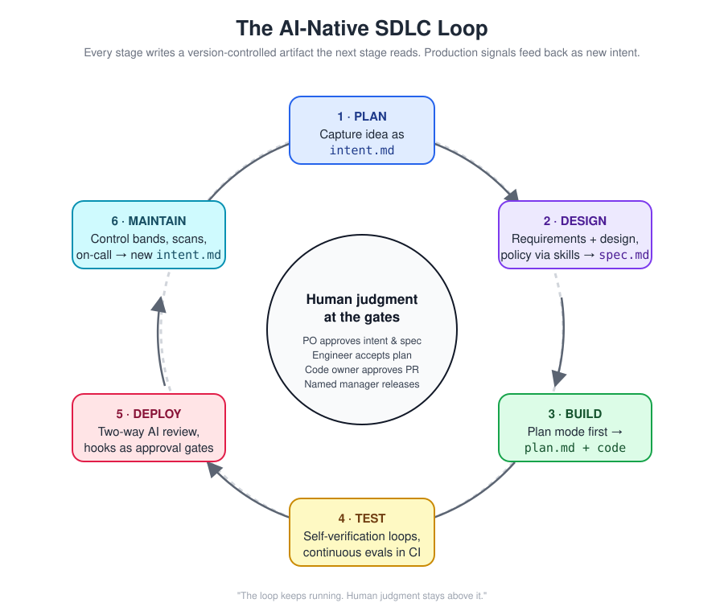
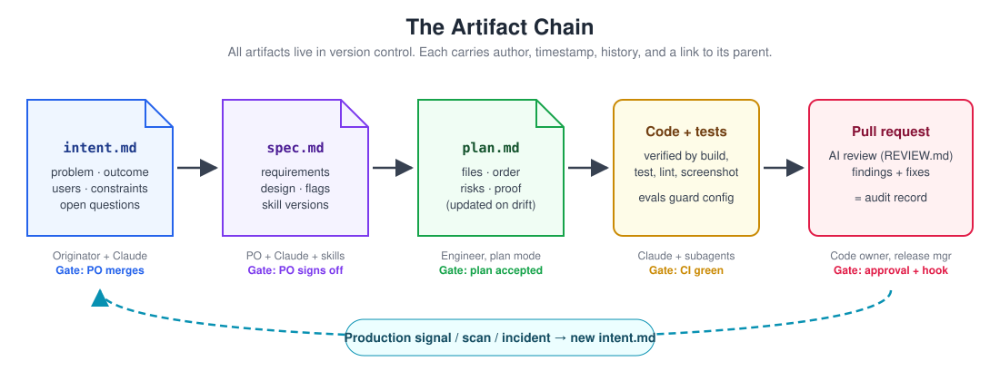
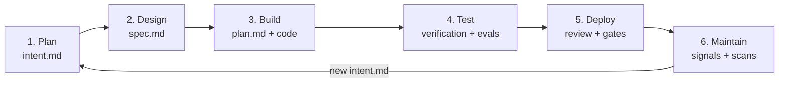

# 01 — Stages: Deep Dives into the AI-Native SDLC

This folder contains one detailed guide for each of the six stages of the AI-native software development lifecycle. Each guide explains what the stage is for, what changes compared with a traditional process, which artifacts go in and come out, who is involved, how to do the work step by step (with prompts you can paste into Claude), what governance evidence it produces, how to measure it, and what to avoid.



## The central idea

Every stage produces a **version-controlled artifact that the next stage reads**. The chain runs:

```text
intent.md -> spec.md -> plan.md -> code + tests -> pull request -> production signals -> new intent.md
```

The control objectives of a traditional SDLC are kept; what changes is the enforcement mechanism. Instead of committees, boards, and phase gates, the AI-native SDLC uses merges, skills, plan mode, hooks, evals, branch protection, and deterministic monitoring — with human judgment placed at the critical gates.





## The running example

All six guides follow one feature end to end so you can see how the artifacts connect: a **claims status self-service** page in a fictional insurer's customer portal. Customers currently call the contact center to ask about claim status, which accounts for roughly one third of call handling time. The feature must not introduce any new PII into the portal session, and it reads from a claims-core API that is rate-limited at 50 requests per second.

## Stages

| # | Stage | Artifact out | Human gate |
|---|---|---|---|
| 1 | [Plan — Intent](01-Plan-Intent.md) | `intent.md` | Product owner merges (approve) or closes (reject) |
| 2 | [Design — Spec](02-Design-Spec.md) | `spec.md` | Product owner signs off; policy owners resolve flagged concerns |
| 3 | [Build — Plan Mode](03-Build-Plan-Mode.md) | `plan.md`, code, tests | Engineer accepts the plan before any edit |
| 4 | [Test — Feedback Loops and Evals](04-Test-Feedback-Loops-and-Evals.md) | Verification evidence, eval results | Verification is part of done; eval pass rate gates config changes |
| 5 | [Deploy — Review and Gates](05-Deploy-Review-and-Gates.md) | Merged PR, deployment record | Code-owner approval; named approver authorizes production |
| 6 | [Maintain — Close the Loop](06-Maintain-Close-the-Loop.md) | New `intent.md`, lessons, evals | Human triage of every finding |

### 1. Plan — Intent

[01-Plan-Intent.md](01-Plan-Intent.md)

Ideas no longer wait for someone to write them up. The person who has the idea — engineer or not — works with Claude to shape it into a structured, machine-readable `intent.md` that follows an organizational template (ideally encoded as a skill), and commits it to version control, using a connector if they do not use git. The product owner's merge is the approval and a closed pull request is the rejection, so authorship, timing, and decisions are recorded automatically. The guide covers brainstorming prompts that push an idea to concreteness, how to keep implementation out of the intent, and how to measure drafting speed, acceptance rate, and late changes to intent.

### 2. Design — Spec

[02-Design-Spec.md](02-Design-Spec.md)

Requirements and design collapse into one session in which organizational policy — security, privacy, compliance, brand, UX — is applied through skills while the spec is written, rather than discovered in a late review. Claude flags concerns it cannot resolve and each goes to a named policy owner; the product owner decides whether to proceed, consulting the tech lead for higher-risk changes. The guide shows how to run the session manually and then automate it so that merging an intent triggers a non-interactive design pass that opens `spec.md` as a pull request, and how to measure intent-to-spec time and requirements rework after build begins.

### 3. Build — Plan Mode

[03-Build-Plan-Mode.md](03-Build-Plan-Mode.md)

Nothing is implemented without an accepted written plan. The engineer starts Claude Code in plan mode, provides the spec, and interrogates the proposed plan until someone who was not in the conversation could implement from it alone; the plan is committed as `plan.md` and kept in sync with any deviation. The guide explains the supporting system — `CLAUDE.md` created with `/init` and kept to a page, skills for inconsistently enforced knowledge, and hooks for rules that must always hold — plus parallel sessions in git worktrees, subagents such as a verifier, the path from plan mode toward auto-accept, and how to pick a single source of truth when legacy tools are involved.

### 4. Test — Feedback Loops and Evals

[04-Test-Feedback-Loops-and-Evals.md](04-Test-Feedback-Loops-and-Evals.md)

Every session checks its own work before a human sees it: one-command build, test, and lint targets; healthy output documented in `CLAUDE.md`; failing-test-first bug fixes with tests locked by a hook; and visual checks against approved mocks. Separately, the agent configuration itself — `CLAUDE.md`, skills, hooks, prompts, model version — is regression-tested with a suite of 20–50 real tasks run headlessly in CI on every configuration change and nightly, with the pass rate gating merges. Production incidents become permanent evals. Metrics include first-pass CI success, review time, change failure rate, and eval pass rate over time.

### 5. Deploy — Review and Gates

[05-Deploy-Review-and-Gates.md](05-Deploy-Review-and-Gates.md)

Review runs in both directions: Claude reviews every incoming pull request against `REVIEW.md` and addresses comments on request, while humans focus on intent and risk and code owners retain sole approval authority. Governance is enforced at the moment of action through hooks (a `PreToolUse` script exiting with code 2 blocks the call and tells Claude why), managed settings that engineers cannot override, and CI/CD autonomy tiered by environment — agents deploy freely to dev, with checks to staging, and only prepare production for a named human to authorize. Rollback is the most rehearsed path. The guide includes DORA metrics (general industry practice) alongside review and gate metrics.

### 6. Maintain — Close the Loop

[06-Maintain-Close-the-Loop.md](06-Maintain-Close-the-Loop.md)

Deterministic, unit-tested detection (rolling baselines and Western Electric-style rules — no model in detection) watches stable metrics; response tiers in versioned configuration decide whether a breach is logged, diagnosed read-only, or allowed to produce a bounded PR or pre-approved runbook action. Claude investigates statelessly and writes its findings as a new `intent.md`, which a human triages as fix now, schedule, or dismiss — restarting the loop. The guide also covers recurring security scans with findings routed through the same gates, and Claude acting as a first responder in the incident channel, with post-mortems written to a versioned lessons folder and every incident class turned into an eval.

## How to use these guides

- **Adopting from scratch:** read the stages in order, but adopt in the order shown in the roadmap — foundations such as `CLAUDE.md`, plan mode, and feedback loops come first; closed-loop maintenance comes last because it depends on everything before it.
- **Improving one stage:** each guide stands alone, with its own entry and exit criteria, checklist, and metrics.
- **Auditors and governance teams:** the "Governance and Audit Evidence" section in each guide lists which control objectives are met and where the evidence lives.


## Related

- Main playbook: [AI-Native SDLC Playbook](../00-Playbook/AI-Native-SDLC-Playbook.md)
- Guides: [CLAUDE.md](../02-Guides/CLAUDE-md-Guide.md) · [Skills](../02-Guides/Skills-Guide.md) · [Hooks](../02-Guides/Hooks-Guide.md) · [Parallel Sessions and Subagents](../02-Guides/Parallel-Sessions-and-Subagents.md) · [Evals](../02-Guides/Evals-Guide.md) · [PR Review](../02-Guides/PR-Review-Guide.md) · [Managed Settings](../02-Guides/Managed-Settings-Guide.md) · [CI/CD Integration](../02-Guides/CI-CD-Integration-Guide.md) · [Control Bands and Anomaly Detection](../02-Guides/Control-Bands-and-Anomaly-Detection.md) · [Recurring Security Scans](../02-Guides/Recurring-Security-Scans.md) · [Claude On-Call](../02-Guides/Claude-On-Call-Guide.md) · [Source of Truth and Legacy Systems](../02-Guides/Source-of-Truth-and-Legacy-Systems.md)
- Templates: [intent](../03-Templates/intent.template.md) · [spec](../03-Templates/spec.template.md) · [plan](../03-Templates/plan.template.md) · [CLAUDE.md](../03-Templates/CLAUDE.template.md) · [REVIEW.md](../03-Templates/REVIEW.template.md)
- Diagrams: [control layers](../05-Diagrams/04-control-layers.svg) · [response tiers](../05-Diagrams/05-response-tiers.svg) · [autonomy by environment](../05-Diagrams/06-autonomy-by-environment.svg) · [PR review flow](../05-Diagrams/08-pr-review-flow.svg) · [metrics by stage](../05-Diagrams/09-metrics-by-stage.svg)

---

*Based on concepts from Anthropic's AI-Native SDLC Playbook; expanded guidance for implementation.*
