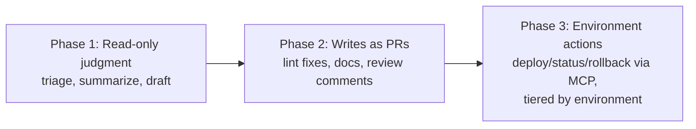
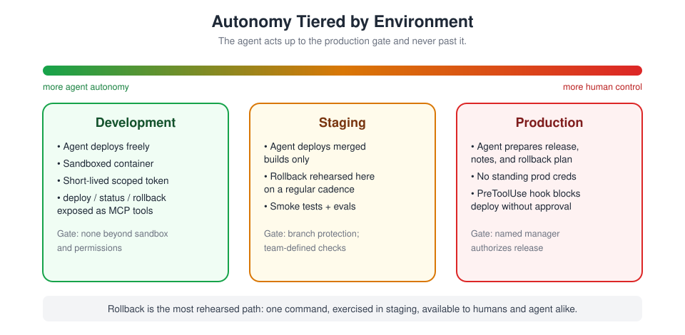
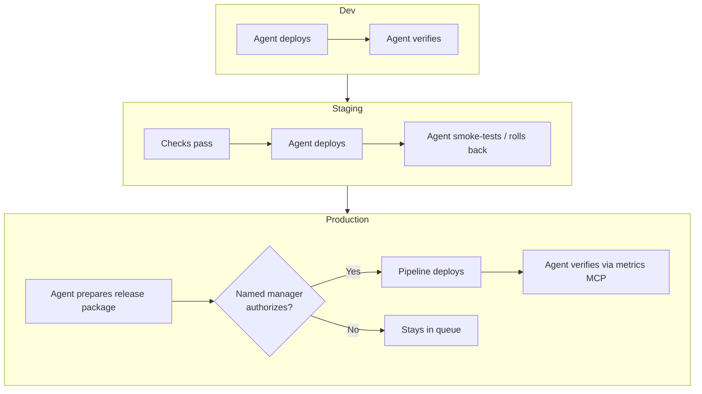
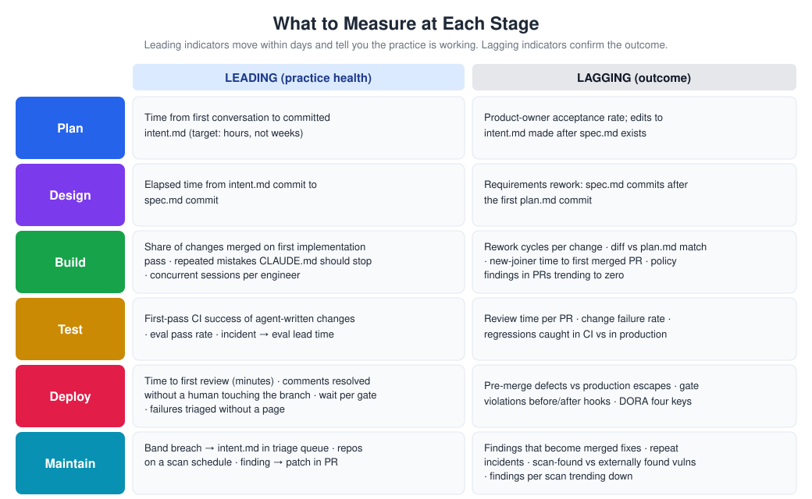

# CI/CD Integration Guide

> **Audience:** platform and DevOps engineers, SREs, release managers, security architects.
> **Stages:** [Deploy](../01-Stages/05-Deploy-Review-and-Gates.md) and [Maintain](../01-Stages/06-Maintain-Close-the-Loop.md).
> **Templates:** [../03-Templates/ci/triage-on-failure.yml](../03-Templates/ci/triage-on-failure.yml), [../03-Templates/ci/claude-pr-review.yml](../03-Templates/ci/claude-pr-review.yml), [../03-Templates/ci/agent-evals.yml](../03-Templates/ci/agent-evals.yml), [../03-Templates/hooks/production-gate.sh](../03-Templates/hooks/production-gate.sh)

---

## 1. The principle: act up to the gate, not past it

Putting an agent into the delivery pipeline is where the AI-native SDLC stops being about developer productivity and starts being about operational risk. The playbook's boundary is simple and worth memorizing:

> **The agent can act up to the production gate, and not past it.**

Everything in this guide is a way to make that sentence true mechanically: through credentials the agent does not have, branch protection it cannot bypass, gates expressed as hooks, tools scoped per environment, and an identity that makes every automated action attributable.

### Prerequisites

- The PR review loop is working ([PR-Review-Guide.md](PR-Review-Guide.md)).
- Approval gates exist as hooks ([Hooks-Guide.md](Hooks-Guide.md)).
- Infrastructure: CI with `claude-code-action` (or the CLI installed in runners); model access through the Anthropic API, Amazon Bedrock, Google Vertex AI, or Microsoft Foundry; MCP servers for deploy targets; a sandbox profile **without standing production credentials**.

---

## 2. Headless Claude: `claude -p`

Every CI integration rests on non-interactive mode. `claude -p "<prompt>"` runs one task to completion and exits, printing the result.

```bash
claude -p "Read out/build.log. Is this failure flaky or real? Give a three-line summary." \
  --allowedTools "Read" \
  --max-turns 5 \
  --output-format json
```

| Flag | Use in CI |
|---|---|
| `-p "<prompt>"` | Run non-interactively |
| `--allowedTools "..."` | Pre-approve exactly the tools the job needs (nothing else can run, because there is no human to approve prompts) |
| `--disallowedTools "..."` | Remove specific tools |
| `--permission-mode <mode>` | For example `plan` for read-only analysis, `acceptEdits` for jobs allowed to edit the checkout |
| `--max-turns N` | Cap iterations and cost |
| `--output-format json` / `stream-json` | Machine-readable output for downstream steps |
| `--model <id>` | Pin the model the job was evaluated with |
| `--settings <file-or-json>` | Job-specific settings (cannot override managed settings) |
| `--mcp-config <file>` | MCP servers for the job (rejected when managed `disableSideloadFlags` is set, except SDK-provided servers; plan accordingly) |

Pipe data in like any Unix tool:

```bash
git log --oneline -20 | claude -p "Summarize these commits for release notes" --allowedTools ""
```

Run `claude --help` in your runner image to confirm flags for the version you pin.

---

## 3. Adoption sequence: read-only first, then writes behind gates



### Phase 1: read-only judgment steps

Start where a wrong answer costs nothing but a few minutes of a human's attention:

- Classify a failed build as flaky or real and summarize it.
- Summarize a PR's risk for the release manager.
- Draft release notes from merged PRs.
- Draft a post-mortem timeline from logs.

These run with `--allowedTools "Read"` (or read-only MCP tools) and produce text that a human reads.

### Phase 2: write steps behind existing gates

Next, let the agent make changes, but **every write arrives as a pull request** and passes the same review and branch protection as human work:

- Auto-fix lint and formatting failures.
- Update documentation after merges.
- Address review comments on its own PRs.
- Open a revert PR when a change breaks main.

The agent pushes to a branch; it never pushes to `main`. Branch protection enforces this, not the prompt.

### Phase 3: environment actions, tiered

Only after phases 1 and 2 are routine, expose deploy, status, and rollback as MCP tools, scoped per environment (section 6), with autonomy tiered by environment (section 7).

---

## 4. Sandboxing CI jobs

A CI job running Claude should be treated like any job running semi-trusted code.

| Control | Implementation |
|---|---|
| **Ephemeral containers** | Fresh runner or container per job; nothing persists between runs |
| **Network policy** | Egress restricted to the model endpoint, your Git host, package mirrors, and approved MCP endpoints. Use Claude Code's sandbox (`sandbox.enabled`, `sandbox.network.allowedDomains`) inside Linux runners, plus network policy at the runner level |
| **Short-lived, scoped tokens** | GitHub: the job's `GITHUB_TOKEN` or an App installation token, with the narrowest `permissions:` block. Cloud: OIDC federation to assume a role for minutes, not static keys |
| **No production credentials** | The job environment never holds prod credentials. Production actions go through a deploy system that requires its own authorization |
| **Least-privilege tools** | `--allowedTools` lists exactly what the job needs |
| **Managed settings in the image** | Bake `/etc/claude-code/managed-settings.json` into the runner image so CI inherits the same deny rules and hooks as laptops |
| **Timeouts and concurrency limits** | `timeout-minutes`, `--max-turns`, and concurrency groups |
| **Untrusted input awareness** | PR titles, issue bodies, and logs can contain prompt-injection attempts. Keep write-capable jobs off untrusted triggers (for example fork PRs), and keep tools narrow |

### Short-lived credentials examples

**GitHub Actions to AWS via OIDC** (for Bedrock or for a non-prod deploy role):

```yaml
permissions:
  id-token: write
  contents: read
steps:
  - uses: aws-actions/configure-aws-credentials@v4
    with:
      role-to-assume: arn:aws:iam::123456789012:role/ci-claude-staging
      aws-region: us-east-1
      role-duration-seconds: 900
```

**Claude API without a long-lived secret:** `claude-code-action` supports workload identity federation with a Claude Console service account (inputs such as `anthropic_federation_rule_id` and `anthropic_organization_id`, with `id-token: write`). Verify setup against the action's documentation.

---

## 5. Agent identity

Non-interactive runs should execute under an **agent identity**, distinct from any human:

- A GitHub App (the Claude GitHub App or a custom app) or a dedicated bot account for commits and PRs.
- A dedicated service account or workspace for model API usage, with its own spend limit.
- Distinct cloud roles per environment (`ci-claude-dev`, `ci-claude-staging`) with no production role.

This makes every automated action attributable in audit logs, lets you rate-limit and budget the agent separately, and lets branch protection treat the agent differently (for example, the agent identity is never in a bypass list and never counts as a code-owner approval).

Note that GitHub does not trigger workflows on commits made with the default `GITHUB_TOKEN`. If Claude's commits need to trigger CI, authenticate as a GitHub App rather than with the default token.

---

## 6. MCP for deploy, status, and rollback

Rather than giving the agent `kubectl` or cloud CLIs with broad credentials, expose a small set of **purpose-built MCP tools** backed by your existing deploy system:

| Tool | Behavior | Scope |
|---|---|---|
| `deploy.status(env, service)` | Current version, health, recent deploys | All environments, read-only |
| `deploy.release(env, service, version)` | Triggers the existing pipeline | dev: allowed; staging: allowed with checks; prod: **prepare only** |
| `deploy.rollback(env, service)` | Triggers the existing, rehearsed rollback pipeline | dev/staging: allowed; prod: see tiers |
| `deploy.prepare_prod_release(service, version)` | Creates a change record and release request for a human to authorize | prod |
| `metrics.query(service, metric, window)` | Read metrics for verification | All, read-only |

Design principles:

- **Scope per environment.** Separate MCP server instances (or separate credentials behind one server) for dev, staging, and prod, so a staging job physically cannot call a prod tool.
- **The MCP server enforces policy**, not the prompt. The prod `release` tool refuses without an authorization token issued by a human approver.
- **Reuse existing pipelines.** MCP tools trigger the same deploy and rollback jobs humans use, so there is one path to production, with one audit trail.
- **Allowlist servers centrally** with `allowManagedMcpServersOnly` and `managed-mcp.json` (see [Managed-Settings-Guide.md](Managed-Settings-Guide.md)).
- Use hook matchers such as `mcp__deploy__.*` to add gates on these tools.

---

## 7. Autonomy tiers by environment



| Environment | Agent may | Human role | Controls |
|---|---|---|---|
| **Dev** | Deploy freely, run migrations, roll back | None required | Sandbox, dev-scoped credentials |
| **Staging** | Deploy after checks pass, roll back, run smoke tests | Notified; can intervene | Required checks, staging-scoped MCP, rollback rehearsal |
| **Production** | **Prepare** the release: PR merged, change record, release notes, rollback command, verification plan | A **named manager authorizes** the release; the pipeline executes | No prod credentials in agent context, production gate hook, deploy system requires authorization, branch protection |



---

## 8. Rollback: the most rehearsed path

An agent that can prepare and trigger changes must be paired with a rollback that is boring. The playbook's guidance is to make rollback the **most rehearsed path** in the system:

- **One command** (or one MCP tool call) rolls back a service to its last good version.
- **Exercised in staging regularly**, not just documented. Schedule a weekly or per-release rollback drill.
- **Pre-approved as a runbook**, so a 3-sigma anomaly response (see [Control-Bands-and-Anomaly-Detection.md](Control-Bands-and-Anomaly-Detection.md)) can trigger it without inventing steps.
- **Verified**: after rollback, check that the key metric returned to its band.
- **Compatible**: database migrations are backward compatible (expand/contract) so rolling back code does not break data. Add this to REVIEW.md "Always check".

Rehearsal record, kept in the repo:

```markdown
## Rollback drill log
| Date       | Service   | Env     | Command                          | Time to healthy | Notes |
|------------|-----------|---------|----------------------------------|-----------------|-------|
| 2026-09-18 | claims-api| staging | make rollback ENV=staging        | 3m 40s          | OK    |
```

---

## 9. GitHub Actions examples

### 9.1 Triage on failure (read-only)

Template: [../03-Templates/ci/triage-on-failure.yml](../03-Templates/ci/triage-on-failure.yml).

```yaml
name: build
on: [push, pull_request]
jobs:
  build:
    runs-on: ubuntu-latest
    permissions:
      contents: read
    steps:
      - uses: actions/checkout@v4
      - name: Build and test
        run: make verify 2>&1 | tee out/build.log
      - name: Triage failure with Claude
        if: failure()
        env:
          ANTHROPIC_API_KEY: ${{ secrets.ANTHROPIC_API_KEY }}
        run: |
          npm install -g @anthropic-ai/claude-code
          claude -p "Read out/build.log. Say whether the failure is flaky or real, name the failing test or step, and give a three-line summary." \
            --allowedTools "Read" --max-turns 5 >> triage.md
          cat triage.md >> "$GITHUB_STEP_SUMMARY"
      - uses: actions/upload-artifact@v4
        if: failure()
        with: { name: triage, path: triage.md }
```

### 9.2 Lint auto-fix as a PR (write behind gates)

```yaml
name: lint-autofix
on:
  workflow_run:
    workflows: ["build"]
    types: [completed]
jobs:
  autofix:
    if: github.event.workflow_run.conclusion == 'failure' && github.event.workflow_run.head_branch != 'main'
    runs-on: ubuntu-latest
    permissions:
      contents: write
      pull-requests: write
      id-token: write
    steps:
      - uses: actions/checkout@v4
        with: { ref: "${{ github.event.workflow_run.head_branch }}" }
      - uses: anthropics/claude-code-action@v1
        with:
          anthropic_api_key: ${{ secrets.ANTHROPIC_API_KEY }}
          prompt: |
            Run `make lint`. Fix only lint and formatting errors; do not change behavior.
            Run `make test` to confirm nothing broke. Commit with message "chore: lint autofix"
            and push to the current branch. If a lint error requires a behavior change, do not fix it;
            leave a PR comment explaining it instead.
          claude_args: >-
            --max-turns 20
            --allowedTools "Read,Edit,Bash(make lint),Bash(make test),Bash(git add *),Bash(git commit *),Bash(git push origin HEAD)"
```

### 9.3 Prepare a production release (agent prepares, human authorizes)

```yaml
name: prepare-release
on:
  workflow_dispatch:
    inputs:
      version: { required: true }
jobs:
  prepare:
    runs-on: ubuntu-latest
    permissions:
      contents: write
      pull-requests: write
      id-token: write
    steps:
      - uses: actions/checkout@v4
        with: { fetch-depth: 0 }
      - uses: anthropics/claude-code-action@v1
        with:
          anthropic_api_key: ${{ secrets.ANTHROPIC_API_KEY }}
          prompt: |
            Prepare release ${{ inputs.version }}: write release notes from merged PRs since the last tag,
            list linked intent/spec/plan records, state the rollback command and verification metrics,
            and open a PR "Release ${{ inputs.version }}". Do not deploy.
  deploy-prod:
    needs: prepare
    runs-on: ubuntu-latest
    environment: production     # GitHub environment with required reviewers = named release manager
    steps:
      - run: ./deploy.sh production ${{ inputs.version }}
```

The `environment: production` protection rule with required reviewers is the human authorization; the Claude job has no access to that environment's secrets.

---

## 10. GitLab CI examples

GitLab's Claude Code integration is in beta and maintained by GitLab at the time of writing; verify current guidance. The CLI runs in any job.

### 10.1 Triage on failure

```yaml
stages: [test, triage]

test:
  stage: test
  image: node:20
  script:
    - make verify 2>&1 | tee build.log
  artifacts:
    when: always
    paths: [build.log]

claude-triage:
  stage: triage
  image: node:20
  when: on_failure
  needs: [test]
  variables:
    GIT_STRATEGY: fetch
  script:
    - curl -fsSL https://claude.ai/install.sh | bash
    - export PATH="$HOME/.local/bin:$PATH"
    - >
      claude -p "Read build.log. Is the failure flaky or real? Name the failing step and give a three-line summary."
      --allowedTools "Read" --max-turns 5 | tee triage.md
  artifacts:
    when: always
    paths: [triage.md]
```

`ANTHROPIC_API_KEY` is a masked, protected CI/CD variable. For Bedrock or Vertex AI, use GitLab OIDC (`id_tokens:`) to obtain short-lived cloud credentials instead of static keys.

### 10.2 MR assistant (writes arrive as MRs)

```yaml
claude-mr:
  stage: triage
  image: node:20
  rules:
    - if: '$CI_PIPELINE_SOURCE == "merge_request_event"'
  script:
    - curl -fsSL https://claude.ai/install.sh | bash
    - export PATH="$HOME/.local/bin:$PATH"
    - >
      claude -p "${AI_FLOW_INPUT:-Review this MR against REVIEW.md and summarize risks}"
      --permission-mode plan
      --allowedTools "Read Grep Glob"
      --max-turns 20
  timeout: 20m
```

Protected branches with required approvals play the role of branch protection; the job token never has permission to push to `main`.

---

## 11. Governance

| Requirement | Mechanism |
|---|---|
| Agent acts up to the prod gate, not past it | No prod credentials; prod deploy requires human authorization in the deploy system |
| No direct path to main | Branch protection; agent identity not in bypass lists |
| Attribution | Agent identity for non-interactive runs; humans remain accountable for approvals |
| Consistent controls between laptop and CI | Same managed settings baked into runner images |
| Change record | PR plus release PR plus deploy log link the change end to end ([Source-of-Truth-and-Legacy-Systems.md](Source-of-Truth-and-Legacy-Systems.md)) |
| Configuration safety | Eval suite gates changes to prompts and agent config ([Evals-Guide.md](Evals-Guide.md)) |

---

## 12. Metrics

| Metric | Why |
|---|---|
| Share of pipeline failures triaged without paging a human | The first, most visible win |
| Time from failure to triage summary | Should be minutes |
| **DORA: deployment frequency** | Should rise as the pipeline absorbs toil |
| **DORA: lead time for changes** | Should fall as review and triage accelerate |
| **DORA: change failure rate** | Must not rise; if it does, slow down |
| **DORA: time to restore service** | Should fall with rehearsed, one-command rollback |
| Rollback drill time to healthy | Tracks rollback readiness |
| Agent cost per pipeline run | Budget control |



## 13. Checklist

- [ ] Read-only triage job in place and trusted
- [ ] Write jobs produce PRs only; branch protection enforced
- [ ] Ephemeral, sandboxed runners with network policy
- [ ] Short-lived, scoped tokens via OIDC; no static cloud keys
- [ ] No production credentials anywhere the agent runs
- [ ] Agent identity (App / service account) with its own budget
- [ ] Deploy/status/rollback as environment-scoped MCP tools
- [ ] Autonomy tiers documented and enforced
- [ ] Rollback is one command and drilled in staging
- [ ] DORA metrics tracked before and after

## Related

- [Hooks-Guide.md](Hooks-Guide.md), [Managed-Settings-Guide.md](Managed-Settings-Guide.md), [PR-Review-Guide.md](PR-Review-Guide.md)
- [Control-Bands-and-Anomaly-Detection.md](Control-Bands-and-Anomaly-Detection.md), [Claude-On-Call-Guide.md](Claude-On-Call-Guide.md)
- [../01-Stages/05-Deploy-Review-and-Gates.md](../01-Stages/05-Deploy-Review-and-Gates.md)

---

*Based on concepts from Anthropic's AI-Native SDLC Playbook; expanded guidance for implementation. Verify configuration keys against current Claude Code documentation.*
