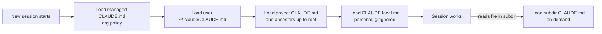
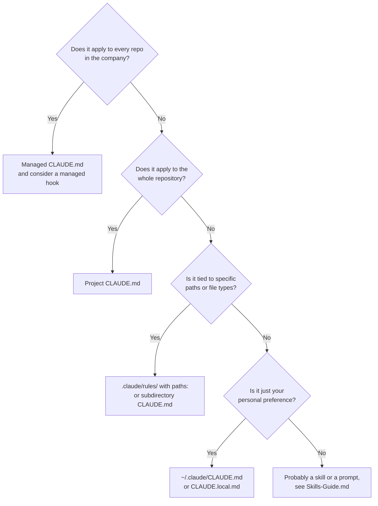
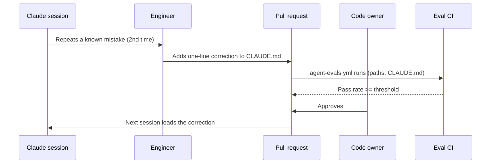

# CLAUDE.md Guide

> **Audience:** tech leads, senior engineers, platform engineers, and anyone who owns a repository that Claude Code works in.
> **Stage:** primarily [Build](../01-Stages/03-Build-Plan-Mode.md), with a direct dependency from [Test](../01-Stages/04-Test-Feedback-Loops-and-Evals.md) (the verification block) and [Deploy](../01-Stages/05-Deploy-Review-and-Gates.md) (Code Review reads CLAUDE.md).
> **Template:** [../03-Templates/CLAUDE.template.md](../03-Templates/CLAUDE.template.md)

---

## 1. What CLAUDE.md is, and what it is not

Every Claude Code session starts with an empty context window. The model does not remember yesterday's session, the code review comment you left last week, or the fact that your team banned floating-point arithmetic for money three years ago. `CLAUDE.md` is the file that carries that institutional knowledge into every session. Claude Code reads it at launch and treats its contents as standing instructions for the project.

A useful mental model is the **onboarding note you would hand a strong new hire on their first morning**. It tells them how to build and test, where things live, which conventions are non-obvious, and which mistakes everyone makes in their first month. It does not re-explain the language, restate the framework's documentation, or list every architectural decision since the project began.

Three properties make CLAUDE.md different from ordinary documentation:

1. **It is read on every run.** Anything in it costs context on every session, every CI job, and every automated review. Length has a real price.
2. **It is advisory, not enforced.** Claude treats CLAUDE.md as context. It follows clear, specific instructions very reliably, but nothing in the file mechanically prevents an action. If a rule must hold every time, back it with a [hook](Hooks-Guide.md) or a permission rule. This is the single most important design principle in the whole control model: *skills and CLAUDE.md advise; hooks and settings enforce.*
3. **It is version-controlled configuration.** Because it changes agent behavior, a CLAUDE.md change is closer to a config change than a doc edit. It should be code-owned, reviewed, and (once you have them) covered by [evals](Evals-Guide.md).



---

## 2. Where CLAUDE.md files live (the hierarchy)

Claude Code discovers instruction files at several scopes. Content is **concatenated, not overridden**: more specific files are read later, so their instructions tend to win when two statements conflict, but you should avoid conflicts rather than rely on ordering.

| Scope | Location | Who writes it | Typical content |
|---|---|---|---|
| Managed (organization) | macOS `/Library/Application Support/ClaudeCode/CLAUDE.md`; Linux/WSL `/etc/claude-code/CLAUDE.md`; Windows `C:\Program Files\ClaudeCode\CLAUDE.md` | IT / platform team via MDM | Company-wide coding and security expectations that apply to every repo |
| User | `~/.claude/CLAUDE.md` | Each engineer | Personal preferences (editor habits, preferred explanation style) |
| Project | `./CLAUDE.md` or `./.claude/CLAUDE.md` at the repo root | The team, code-owned | Commands, conventions, architecture map, common mistakes |
| Local | `./CLAUDE.local.md` (add to `.gitignore`) | Each engineer | Personal sandbox URLs, local test data |
| Subdirectory | `<subdir>/CLAUDE.md` | The owning team of that directory | Rules that only apply inside that module; loaded when Claude reads files there |
| Rules directory | `.claude/rules/*.md`, optionally with `paths:` frontmatter | The team | Topic-scoped rules (testing, API design) that load only for matching files |

Some details worth knowing (verify exact behavior against the current [memory documentation](https://code.claude.com/docs/en/memory)):

- **Imports.** A CLAUDE.md can pull in other files with `@path/to/file` syntax. Relative paths resolve from the importing file. Imports can nest a few levels deep (the docs currently state a maximum of four hops). Imported content still loads at launch, so imports help organization, not context cost.
- **Path-scoped rules.** A file in `.claude/rules/` with `paths:` frontmatter only enters context when Claude works on matching files. This is the right tool when your root file is growing because of rules that only matter for, say, database migrations.
- **Checking what loaded.** Run `/context` in a session and look at the memory files list to confirm which files Claude actually read.
- **AGENTS.md.** If a repository already standardizes on `AGENTS.md`, Claude Code can read it. The loading rules for mixing the two are subtle; check the docs before relying on both.

### Which scope should a rule go in?



---

## 3. Getting started with `/init`

You rarely need to write a CLAUDE.md from a blank page.

1. Open Claude Code at the repository root and run `/init`. Claude explores the codebase and drafts a file containing the build and test commands it discovered, the layout, and conventions it inferred. If a CLAUDE.md already exists, `/init` proposes improvements rather than overwriting it.
2. **Trim aggressively.** The draft will be too long and will contain things Claude could have discovered by itself (the framework in use, the obvious directory names). Cut it down to what a new team member needs on day one. The test for every line: *would a competent engineer new to this repo get this wrong without being told?* If not, delete it.
3. **Add what `/init` cannot discover.** The non-obvious conventions, the frozen APIs, the "we tried that and it broke production" knowledge. This is where most of the value lives.
4. **Add the verification block** (section 6).
5. **Commit at the repo root** and add the file to `CODEOWNERS` so changes need owner approval.

> Tip: the docs describe an optional interactive `/init` flow enabled by setting `CLAUDE_CODE_NEW_INIT=1`, which can also propose skills and hooks. Verify against current docs before standardizing on it.

---

## 4. What to include, and what to leave out

### Include

| Category | Why it earns its place | Example |
|---|---|---|
| **Commands** | Claude must be able to build, test, lint, and run the app without guessing | `make test` runs unit + integration tests; expect `BUILD SUCCESS` |
| **Non-obvious conventions** | These are exactly what a model trained on public code will get wrong | "Money is always `BigDecimal`, never `double`" |
| **Architecture map (short)** | Tells Claude where new code belongs | "`api/` controllers only, `core/` domain logic, `adapters/` I/O" |
| **Frozen or dangerous areas** | Prevents well-intentioned damage | "`/v1` endpoints are frozen; add to `/v2`" |
| **Common mistakes** | The highest-value section; grows via the "mistake twice" rule | "Kafka schemas are generated; edit the `.avsc`, not the Java class" |
| **Definition of done / verification** | Makes self-checking part of every task | See section 6 |
| **Pointers** | Links to deeper docs Claude can read on demand | "Runbooks live in `docs/runbooks/`" |

### Leave out

| Leave out | Where it belongs instead |
|---|---|
| General language or framework tutorials | Nowhere; Claude already knows them |
| Long policy documents (security standard, brand guide) | A [skill](Skills-Guide.md) that loads when relevant |
| Rules that must never be broken | A [hook](Hooks-Guide.md) or managed permission rule (keep a one-line mention in CLAUDE.md so Claude understands why it gets blocked) |
| Review-only criteria | `REVIEW.md` (see [PR-Review-Guide.md](PR-Review-Guide.md)) |
| Task-specific instructions | The prompt, or `plan.md` for that change |
| Secrets, hostnames of production systems, credentials | Never in any file Claude reads |
| Personal preferences | `~/.claude/CLAUDE.md` or `CLAUDE.local.md` |
| Change history, "we used to do X" stories | Commit history or an ADR |
| Things CI already enforces mechanically (formatting) | Keep only the command to run the formatter |

---

## 5. The two rules that keep CLAUDE.md healthy

### 5.1 The one-page rule

Keep the project CLAUDE.md to **roughly one page**. The playbook frames this as a discipline, and the Claude Code docs independently recommend targeting under about 200 lines per file, because longer files consume more context and reduce adherence. One page forces prioritization: when you want to add a line, ask what it displaces.

When you genuinely need more, do not grow the root file. Instead:

- Move path-specific rules into `.claude/rules/` with `paths:` frontmatter or a subdirectory CLAUDE.md.
- Move policy knowledge into a skill.
- Move enforcement into a hook.
- Move reference material into a doc and link to it.

### 5.2 The "mistake twice" rule

Do not try to anticipate every mistake up front. Instead, adopt this operating rule:

> **The first time Claude makes a mistake, fix it in the conversation. The second time the same mistake appears, add a correction to CLAUDE.md.**

This keeps the file evidence-based. Every "Common mistakes" entry exists because it actually happened twice. It also gives you a natural metric (section 9): how often does Claude repeat a mistake that CLAUDE.md should already prevent? If that number is not falling, the entry is badly worded, buried, or in the wrong scope.

The same rule shows up in PR review: when a reviewer (human or Claude) raises the same finding a second time, that finding graduates into CLAUDE.md. See [PR-Review-Guide.md](PR-Review-Guide.md).

Write corrections as **specific, imperative, and testable** statements:

| Weak | Strong |
|---|---|
| "Be careful with money." | "Represent money as `BigDecimal` with scale 2 and `RoundingMode.HALF_EVEN`. Never use `double` or `float`." |
| "Write good tests." | "Every new REST endpoint needs one integration test in `src/it/` that exercises the happy path and one 4xx case." |
| "Don't break the API." | "Do not modify anything under `api/v1/`. It is frozen for external partners. New behavior goes in `api/v2/`." |

---

## 6. The verification block

The Test stage depends on one idea: **every session checks its own work before a human sees it.** CLAUDE.md is where you define what "checked" means. Include a short, explicit block like this in every repository:

```markdown
## Definition of done (run before reporting any task complete)

1. Build: `make build` must print `Build succeeded`.
2. Tests: `make test` must be all green. Never skip, disable, or delete a failing test.
3. Lint: `make lint` must report zero warnings.
4. Run all three, then paste the tail of each command's output in your final message.
5. If a test fails, fix the code, not the test. If you believe the test itself is wrong,
   stop and explain why instead of changing it.
```

Why each element matters:

- **Named healthy output** ("prints `Build succeeded`") gives Claude an unambiguous success signal rather than "it seemed to work".
- **One command per check.** Wrap multi-step checks in a single target (`make test`, `npm run verify`). Claude, CI, and humans all run the same thing.
- **"Paste the output"** turns verification into evidence a reviewer can see.
- **"Fix the code, not the test"** is the most important line. Back it with the protect-tests hook ([../03-Templates/hooks/protect-tests.sh](../03-Templates/hooks/protect-tests.sh)) during bug-fix work, because this is exactly the kind of rule that must hold every time.

---

## 7. Maintenance and ownership

| Aspect | Recommendation |
|---|---|
| Owner | The tech lead of the repository, recorded in `CODEOWNERS` for `CLAUDE.md`, `.claude/rules/`, and `.claude/**` |
| Change path | Pull request, approved by a code owner. No direct pushes. |
| Trigger for additions | "Mistake twice" (section 5.2), repeated PR review findings, post-incident lessons |
| Trigger for removals | A rule that has not been relevant for a quarter, a rule now enforced by a hook or CI, a rule superseded by a skill |
| Review cadence | Light review monthly alongside REVIEW.md tuning; full prune quarterly |
| Regression protection | Once an [eval suite](Evals-Guide.md) exists, every CLAUDE.md change runs it in CI and must meet the pass-rate threshold |
| Drift check | Code Review flags when a PR makes a CLAUDE.md statement outdated; treat those as prompts to update the file in the same PR |



---

## 8. Examples for three stacks

Each example is intentionally about one page. Treat them as shapes to adapt, not as files to copy verbatim. The generic starting point is [../03-Templates/CLAUDE.template.md](../03-Templates/CLAUDE.template.md).

### 8.1 Java 21 / Spring Boot 3 payments service

```markdown
# payments-service

Payment authorization and settlement API. Java 21, Spring Boot 3, Gradle, PostgreSQL, Kafka.

## Commands
- Build: `./gradlew build -x test` -> expect `BUILD SUCCESSFUL`
- Unit tests: `./gradlew test`
- Integration tests (needs Docker): `./gradlew integrationTest`
- Everything CI runs: `make verify`
- Run locally: `make run` (starts app on :8080 with Testcontainers Postgres + Kafka)

## Layout
- `api/`      REST controllers and DTOs only. No business logic.
- `core/`     Domain model and services. No Spring web or JPA annotations here.
- `adapters/` Persistence, Kafka producers/consumers, external HTTP clients.
- `schemas/`  Avro `.avsc` files. Java classes under `build/generated` are generated.

## Conventions
- Money is always `BigDecimal` (scale 2, `RoundingMode.HALF_EVEN`). Never `double`/`float`.
- Every new endpoint gets one integration test in `src/integrationTest/` (happy path + one 4xx).
- Use constructor injection. No field `@Autowired`.
- Log with structured key-value pairs; never log PAN, CVV, or full account numbers.

## Do not
- Do not modify `api/v1/**`. It is frozen for partners; add new behavior under `api/v2/`.
- Do not bump dependency versions. Dependency upgrades go through the platform team's Renovate PRs.
- Do not edit generated Kafka classes; edit the `.avsc` in `schemas/` and rebuild.

## Common mistakes (added after they happened twice)
- Using `BigDecimal.equals` for comparison; use `compareTo` (scale differs).
- Forgetting `@Transactional` boundaries live in `core/` services, not controllers.

## Definition of done
Run `make verify`. It must end with `BUILD SUCCESSFUL` and zero Checkstyle warnings.
Never skip or delete a failing test; fix the code. Paste the last 20 lines of output.
```

### 8.2 TypeScript / React customer portal

```markdown
# customer-portal

Customer self-service web app. TypeScript 5, React 18, Vite, React Query, Playwright, pnpm.

## Commands
- Install: `pnpm install --frozen-lockfile`
- Dev server: `pnpm dev` (http://localhost:5173, uses MSW mocks by default)
- Typecheck + lint + unit tests: `pnpm verify` -> expect `All checks passed`
- E2E: `pnpm e2e` (Playwright, headless)

## Layout
- `src/features/<feature>/` components, hooks, and tests for one feature, co-located.
- `src/shared/ui/` design-system components. Use these before writing new ones.
- `src/api/` generated OpenAPI client. Regenerate with `pnpm gen:api`; never hand-edit.

## Conventions
- Server state goes through React Query hooks in `src/features/*/queries.ts`. No `fetch` in components.
- All user-visible strings go through `t('...')` (i18next). No hard-coded copy.
- Accessibility: every interactive element needs an accessible name; run `pnpm test:a11y` for new pages.
- Styling uses design tokens from `src/shared/ui/tokens.ts`. No raw hex colors.

## Do not
- Do not store tokens or PII in `localStorage`. Session is an HttpOnly cookie handled by the BFF.
- Do not add new runtime dependencies without noting it in the PR description.

## Common mistakes
- Forgetting to add a new route to `src/routes.tsx` guards (`RequireAuth`).
- Snapshot tests for dynamic dates; freeze time with `vi.setSystemTime`.

## Definition of done
`pnpm verify` green with zero lint warnings. For UI changes, run the app, take a screenshot of the
changed screen, and compare it to the mock linked in plan.md. Fix code, not tests.
```

### 8.3 Python 3.12 / FastAPI service

```markdown
# claims-api

Claims intake and status API. Python 3.12, FastAPI, SQLAlchemy 2, Alembic, pytest, uv.

## Commands
- Setup: `uv sync`
- Run: `uv run uvicorn app.main:app --reload`
- Checks: `make check` = ruff + mypy --strict + pytest. Expect `N passed` and `Success: no issues found`.
- New migration: `uv run alembic revision --autogenerate -m "<msg>"` then review the file by hand.

## Layout
- `app/routers/`   FastAPI routers. Thin: validate, call a service, map errors.
- `app/services/`  Business logic. Pure functions where possible.
- `app/models/`    SQLAlchemy models. `app/schemas/` Pydantic request/response models.

## Conventions
- Pydantic models use `model_config = ConfigDict(extra="forbid")` so unknown fields are rejected.
- All DB access is async (`AsyncSession`). No sync sessions in request paths.
- Every state-changing endpoint emits an audit event via `app.audit.record(actor, action, entity)`.
- Fields tagged `PII` in `app/schemas/` must never appear in logs or error messages.

## Do not
- Do not edit an Alembic migration that has been merged; create a new one.
- Do not call `claims-core` more than 50 requests/second; use `app.clients.claims_core` which rate-limits.

## Common mistakes
- Returning SQLAlchemy models directly from routers; always map to a response schema.
- Using `datetime.utcnow()`; use `datetime.now(tz=UTC)`.

## Definition of done
`make check` fully green. Never mark tests `skip`/`xfail` to get green. Paste the summary lines.
```

Notice what all three have in common: commands with expected output, a short layout map, a handful of conventions a model would plausibly get wrong, explicit "do not" rules, a small common-mistakes list, and a definition of done. Notice also what they omit: framework tutorials, security policy text, and anything the build already enforces.

---

## 9. Measuring whether CLAUDE.md is working

| Type | Metric | How to collect | Healthy direction |
|---|---|---|---|
| Leading | Repeat-mistake rate: how often Claude makes a mistake CLAUDE.md already covers | Tag review comments (`claude-md-miss`), or count eval failures on CLAUDE.md-covered behaviors | Falling |
| Leading | First-pass CI success for agent-written changes | CI API, filter by agent-authored PRs | Rising |
| Lagging | Time to first merged PR for a new team member | HR start date vs first merged PR | Falling |
| Hygiene | Line count of the root CLAUDE.md | `wc -l CLAUDE.md` in CI; warn above ~200 | Stable, under one page |

---

## 10. Anti-patterns

| Anti-pattern | Why it hurts | Fix |
|---|---|---|
| **The encyclopedia**: a 1,500-line CLAUDE.md | Burns context on every run; important rules drown | One-page rule; move content to rules, skills, docs |
| **Rules as wishes**: "try to avoid", "where possible" | Ambiguity lets the model trade the rule off against other goals | Imperative, specific, testable phrasing |
| **Enforcement by prose**: relying on CLAUDE.md alone for "never push to main" or "never read `.env`" | CLAUDE.md is advisory | Back with a hook, permission `deny`, or branch protection |
| **Contradictions** between root, subdirectory, and rules files | Claude may pick one arbitrarily | Periodic review; one owner per scope |
| **Stale commands** (`npm test` after migrating to pnpm) | Claude runs the wrong verification and reports false success | Treat command changes as CLAUDE.md changes in the same PR |
| **Personal preferences in the shared file** | Imposes one engineer's taste on everyone and every CI run | Move to `~/.claude/CLAUDE.md` or `CLAUDE.local.md` |
| **Secrets or internal URLs** | Leak into transcripts, logs, and model context | Never; use environment variables and deny rules |
| **Unowned file** that anyone edits | Drift, bloat, conflicting rules | `CODEOWNERS` entry, PR-only changes, eval gate |
| **Duplicating REVIEW.md** | Review rules leak into every coding session | Keep review-only criteria in `REVIEW.md` |
| **Never pruning** | File grows monotonically | Quarterly prune; delete rules now enforced mechanically |

---

## 11. Checklist

- [ ] `/init` run, output trimmed to day-one essentials
- [ ] Commands listed with expected healthy output
- [ ] Short layout map
- [ ] Non-obvious conventions and explicit "do not" rules
- [ ] Common-mistakes section, grown via the "mistake twice" rule
- [ ] Verification block ("definition of done")
- [ ] Roughly one page; overflow moved to `.claude/rules/`, skills, or docs
- [ ] Must-hold rules backed by hooks or permissions
- [ ] `CODEOWNERS` covers `CLAUDE.md` and `.claude/**`
- [ ] Eval suite runs on CLAUDE.md changes ([../03-Templates/ci/agent-evals.yml](../03-Templates/ci/agent-evals.yml))

## Related

- [Skills-Guide.md](Skills-Guide.md): when knowledge belongs in a skill instead
- [Hooks-Guide.md](Hooks-Guide.md): enforcing the rules CLAUDE.md describes
- [Evals-Guide.md](Evals-Guide.md): regression-testing CLAUDE.md changes
- [PR-Review-Guide.md](PR-Review-Guide.md): REVIEW.md and promoting repeat findings
- [../01-Stages/03-Build-Plan-Mode.md](../01-Stages/03-Build-Plan-Mode.md)

---

*Based on concepts from Anthropic's AI-Native SDLC Playbook; expanded guidance for implementation. Verify configuration keys against current Claude Code documentation.*
