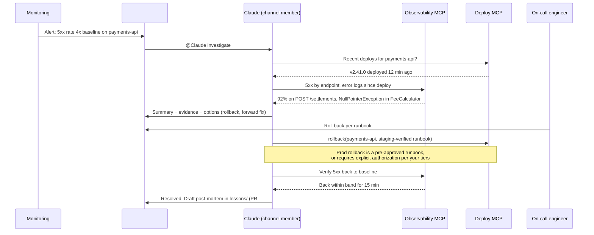
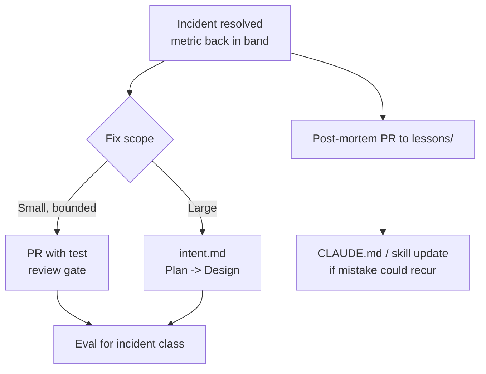

# Claude On-Call Guide

> **Audience:** SRE and on-call leads, incident commanders, service owners, platform teams that run chat operations.
> **Stage:** [Maintain](../01-Stages/06-Maintain-Close-the-Loop.md).
> **Related templates:** [../03-Templates/lessons/postmortem.template.md](../03-Templates/lessons/postmortem.template.md), [../03-Templates/intent.template.md](../03-Templates/intent.template.md)

---

## 1. Claude as first responder

Most incidents begin the same way: an alert fires, someone acknowledges it, and the first fifteen minutes are spent gathering context. Which deploy went out? What changed in the dashboards? Has this happened before? That early phase is exactly where an agent with read access to observability, deploy history, and past post-mortems can help most, and where its mistakes are cheapest.

The playbook describes **Claude Tag**, Claude working as a member of a Slack channel under its own identity (in **public beta** at the time the playbook was written), acting as a **first responder**. The operating model has a few defining features:

- **Claude is a channel member with its own identity**, not a bot hidden behind a human's account. Its actions are attributable.
- **The conversation and knowledge stay in the channel.** Anyone in the channel can see what Claude is doing and **steer** it ("check the database first", "stop, that's expected").
- **The channel history is the audit trail**: questions asked, evidence gathered, decisions taken, and who took them.
- **Through MCP**, Claude can query observability tools, check deploy status, and verify a metric has returned to baseline.
- **After the incident**, Claude writes the post-mortem into a versioned **`lessons/`** folder so future investigations can read it.
- **Small, bounded fixes** become a PR through the normal review gate; **larger problems** become an `intent.md`.

Verify current availability, setup steps (Anthropic's docs reference a Slack app installation flow), and workspace requirements against current documentation before planning a rollout. Anthropic's related post on AI-assisted CI/CD on-call describes how they use this pattern internally.



---

## 2. Why the channel matters

Traditional incident tooling scatters knowledge: one person's terminal, another's browser tabs, a bridge call nobody recorded. Putting the agent in the channel inverts that.

| Property | Benefit |
|---|---|
| Shared visibility | Everyone sees the same evidence at the same time; less "can you paste that?" |
| Steerability | Any responder can redirect Claude with a message; no single operator bottleneck |
| Audit trail | The channel log shows who asked for what and what Claude did, with timestamps |
| Knowledge capture | The raw material for the post-mortem is already written down |
| Onboarding | New on-call engineers learn by reading how incidents were investigated |

Channel conventions that make this work:

- One channel per incident (for example `#inc-2026-09-25-payments-5xx`), created from the alert.
- Claude posts **evidence with links** (dashboard URLs, log queries, deploy IDs), not just conclusions.
- Humans state decisions explicitly ("Decision: roll back"), so the log records them.
- Claude never takes an irreversible or production-changing action unless it is a pre-approved runbook for this situation or a named human explicitly authorizes it in the channel, per your autonomy tiers ([CI-CD-Integration-Guide.md](CI-CD-Integration-Guide.md)).

---

## 3. MCP connections to observability and operations

Claude's usefulness on call depends on what it can see. Provide read access broadly and write access narrowly.

| MCP capability | Access | Examples |
|---|---|---|
| Metrics query | Read | Prometheus/Datadog/Grafana queries; compare to baseline |
| Logs search | Read | Error logs by service and time window |
| Traces | Read | Slow or failing spans |
| Deploy history and status | Read | What changed, when, by whom |
| Feature flags | Read (write only if pre-approved) | Which flags changed recently |
| Runbooks | Read | Retrieve the runbook for the alert |
| `lessons/` and past post-mortems | Read (via repo access) | "Has this happened before?" |
| Rollback | **Write, runbook-scoped** | Trigger the rehearsed rollback pipeline |
| Repository | Write via PR only | Small fixes, post-mortem files |

Administer MCP servers centrally (managed MCP configuration and `allowManagedMcpServersOnly`, see [Managed-Settings-Guide.md](Managed-Settings-Guide.md)), scope credentials per environment, and log every write tool call.

**Verification is part of resolution.** An incident is not resolved when a fix is applied; it is resolved when the metric is back within its baseline band for an agreed period. Claude should query the metric and state the result explicitly. This connects directly to the control bands in [Control-Bands-and-Anomaly-Detection.md](Control-Bands-and-Anomaly-Detection.md).

---

## 4. From incident to durable knowledge: the `lessons/` folder

Post-mortems usually die in a wiki. In an AI-native SDLC they become **versioned, machine-readable context** that future investigations (human and agent) read.

### 4.1 Layout

```text
lessons/
├── README.md                          # index, one line per lesson
├── 2026-09-25-payments-5xx-fee-npe.md
├── 2026-08-11-ci-flaky-settlement-it.md
└── 2026-07-02-dns-ttl-cache-outage.md
```

### 4.2 Post-mortem structure

Use [../03-Templates/lessons/postmortem.template.md](../03-Templates/lessons/postmortem.template.md). The essentials:

```markdown
# 2026-09-25 payments-api 5xx after v2.41.0

- Severity: SEV2 | Duration: 23 min | Channel: #inc-2026-09-25-payments-5xx
- Detected by: control band (post_deploy_5xx_rate, rule1) | Responder: Claude + @oncall-a
- Linked: PR #5130 (rollback), PR #5133 (fix), work/INC-2026-09-25-fee-null-handling/intent.md

## Summary
A null currency on legacy settlement records caused FeeCalculator to throw, returning 500s
on POST /settlements for 7% of traffic.

## Timeline (UTC)
- 14:02 v2.41.0 deployed
- 14:09 5xx band breach (3σ), alert to channel
- 14:10 Claude identifies deploy and FeeCalculator NPE (evidence links)
- 14:14 Decision (@oncall-a): roll back
- 14:18 Rollback complete; 14:33 metric within band for 15 min, resolved

## Root cause
New code assumed currency is non-null; ~2% of legacy records have null currency.

## What went well / what didn't
...

## Lessons (read by future investigations)
- Legacy settlement records can have null currency; treat as EUR per SPEC-221.
- Symptom signature: NPE in FeeCalculator.apply + 5xx on POST /settlements.

## Follow-ups
- [x] Fix with null handling + test (PR #5133)
- [x] Eval added: evals/fee-null-currency-001.json
- [ ] CLAUDE.md "Common mistakes" line proposed (PR #5134)
```

### 4.3 Making lessons useful

- The **"Lessons" section** is written as statements a future investigator can act on, including symptom signatures.
- Point to `lessons/` from CLAUDE.md or an on-call skill: "Before investigating an incident, search `lessons/` for matching symptoms."
- Changes go through PR, so post-mortems are reviewed and versioned.
- Every incident produces an **eval** for its class ([Evals-Guide.md](Evals-Guide.md)) and, where the mistake is one Claude could repeat, a CLAUDE.md or skill update.

---

## 5. Routing fixes: small to PR, large to intent

| Fix size | Example | Route |
|---|---|---|
| **Small and bounded** | Null check with a test; config value correction; quarantine a flaky test | Claude opens a **PR** from the investigation; normal review, CI, and code-owner approval apply |
| **Large or cross-cutting** | Data model change; retry strategy across services; capacity redesign | Claude writes an **intent.md** capturing the problem, evidence, and open questions; it goes through Plan and Design |



---

## 6. Runbook example: "Post-deploy 5xx spike"

A runbook written for both humans and Claude. Store it in the repo (for example `runbooks/post-deploy-5xx.md`) and reference it from the alert.

```markdown
# Runbook: post-deploy 5xx spike

Owner: team-payments | Last rehearsed: 2026-09-18 (staging) | Version: 4

## Trigger
post_deploy_5xx_rate breaches 3σ (bands.yaml) within 60 minutes of a deploy, or a manual page.

## Roles
- First responder: Claude (channel member). Read-only until a decision is recorded.
- Incident lead: on-call engineer. Makes decisions and records them in the channel.

## Step 1: Establish facts (Claude, read-only)
1. Query deploy history for the service over the last 2 hours. Post the version, time, and PR links.
2. Query 5xx rate by endpoint and by version. Post the top endpoints and share of errors.
3. Search error logs since the deploy. Post the top 3 error signatures with counts and a log link.
4. Search lessons/ for matching signatures. Post any matches.
5. State a hypothesis and the evidence for and against it.

## Step 2: Decide (incident lead)
Options Claude should lay out:
- A. Roll back to the previous version (default if the deploy is implicated and rollback is compatible).
- B. Disable the feature flag introduced in the deploy (if one exists).
- C. Forward-fix (only if rollback is unsafe, e.g. an irreversible migration).
The lead writes "Decision: A/B/C" in the channel.

## Step 3: Act
- Rollback: pre-approved runbook action `deploy.rollback(service)`. In production, Claude may run
  this only after the lead's recorded decision, or automatically if bands.yaml marks it
  pre-approved for rule1 with a deploy in window.
- Flag: toggle via the flags MCP after the recorded decision.
- Forward-fix: Claude opens a PR with the fix and a test; normal review; expedited approval.

## Step 4: Verify
Claude queries the 5xx rate every 5 minutes and declares recovery only when it is within
the baseline band for 15 consecutive minutes. Post the chart link.

## Step 5: Close
1. Claude drafts the post-mortem in lessons/ (PR) within 24 hours.
2. Small fix -> PR; larger follow-up -> intent.md.
3. Add an eval for the incident class.
4. If the runbook was wrong or missing a step, update it in the same PR.

## Never
- Never run database migrations or data fixes from the channel.
- Never change production configuration outside the steps above.
- Never declare resolution without verifying the metric.
```

---

## 7. Governance

| Concern | Control |
|---|---|
| Identity | Claude acts under its own identity in Slack and in tools; actions are attributable |
| Authority | Humans make decisions; Claude executes only pre-approved runbook actions or explicitly authorized steps |
| Audit | Channel history, MCP tool logs, PRs, and the post-mortem |
| Least privilege | Read-mostly MCP access; write tools scoped to runbook actions per environment |
| Data handling | Decide what may be posted in channels (no secrets, limited PII); configure channel retention per policy |
| Review | Post-mortems and fixes go through PRs |

## 8. Metrics

| Metric | Why |
|---|---|
| Time to first evidence in the channel | Claude should shorten the context-gathering phase to minutes |
| Mean time to resolve (verified back in band) | The outcome |
| Share of incidents with a post-mortem in `lessons/` within 24 hours | Knowledge capture |
| Repeat incidents with a matching lesson | Should fall |
| Share of incidents producing an eval | Organizational learning |
| Pages to humans for issues Claude triaged as non-actionable | Noise reduction (track carefully; never suppress pages without an agreed policy) |

## 9. Checklist

- [ ] Claude installed in Slack under its own identity (verify current setup steps)
- [ ] Incident channel convention and decision-recording convention
- [ ] MCP read access to metrics, logs, traces, deploy history, runbooks
- [ ] Runbook-scoped write tools only, per environment
- [ ] `lessons/` folder with template and index
- [ ] Runbooks written for both humans and Claude, rehearsed
- [ ] Small fix -> PR, large -> intent.md, always an eval

## Related

- [Control-Bands-and-Anomaly-Detection.md](Control-Bands-and-Anomaly-Detection.md)
- [CI-CD-Integration-Guide.md](CI-CD-Integration-Guide.md)
- [Evals-Guide.md](Evals-Guide.md)
- [../01-Stages/06-Maintain-Close-the-Loop.md](../01-Stages/06-Maintain-Close-the-Loop.md)

---

*Based on concepts from Anthropic's AI-Native SDLC Playbook; expanded guidance for implementation. Verify configuration keys against current Claude Code documentation.*
