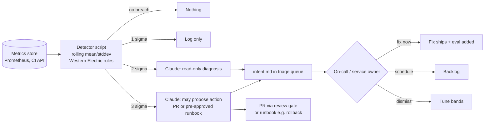
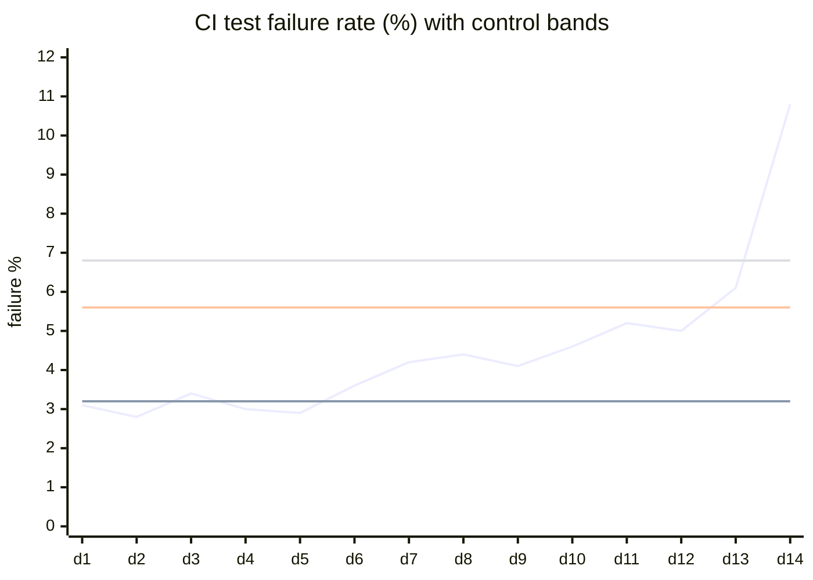
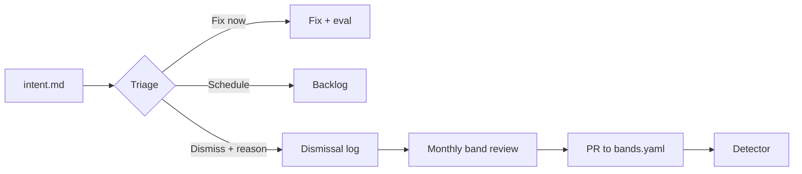

# Control Bands and Anomaly Detection

> **Audience:** SREs, service owners, platform engineers, engineering managers who want production signals to feed the planning loop automatically.
> **Stage:** [Maintain](../01-Stages/06-Maintain-Close-the-Loop.md), which feeds new work back into [Plan](../01-Stages/01-Plan-Intent.md).
> **Templates:** [../03-Templates/monitoring/bands.yaml](../03-Templates/monitoring/bands.yaml), [../03-Templates/monitoring/detect_anomaly.py](../03-Templates/monitoring/detect_anomaly.py), [../03-Templates/intent.template.md](../03-Templates/intent.template.md)

---

## 1. Closing the loop without a person in the path

In a traditional SDLC, humans watch production dashboards and decide when something deserves a ticket. In an AI-native SDLC, the Maintain stage closes the loop: a **deterministic detector** watches a stable metric, and when the metric leaves its normal range, a **trigger** invokes Claude with no person in the path. Claude diagnoses and writes its findings as a new `intent.md`, which enters the same triage and planning flow as any other idea.

Two design decisions make this safe:

1. **Detection is deterministic and contains no model.** Whether something is anomalous is decided by versioned, unit-tested statistics. The model is used for *diagnosis*, never for *detection*. This keeps false-positive behavior predictable and auditable.
2. **Response is tiered by severity.** A small deviation is only logged; a larger one earns read-only diagnosis; only a large, rule-confirmed deviation may lead to action, and even then only through the existing gates (a PR or a pre-approved runbook).



### Prerequisites

- `intent.md` workflow ([../01-Stages/01-Plan-Intent.md](../01-Stages/01-Plan-Intent.md)).
- Fast PR review ([PR-Review-Guide.md](PR-Review-Guide.md)).
- Hooks as action boundaries ([Hooks-Guide.md](Hooks-Guide.md)).
- A rehearsed rollback ([CI-CD-Integration-Guide.md](CI-CD-Integration-Guide.md)).
- Infrastructure: a metrics store (Prometheus, the CI provider's API, a warehouse), read access to the repo, and non-interactive Claude Code in CI or an Agent SDK service that receives webhooks.

---

## 2. Statistical process control in five minutes

Statistical process control (SPC) comes from manufacturing. Its core insight is that every process has **common-cause variation** (the normal noise of a stable system) and occasionally **special-cause variation** (something actually changed). The goal is to react to special causes and *not* react to common causes. Reacting to noise wastes effort and, worse, makes the process less stable.

A **control chart** plots a metric over time with a center line (the mean) and bands at one, two, and three standard deviations (sigma, σ) above and below it. For a roughly normal, stable process:

| Band | Share of points expected inside |
|---|---|
| ±1σ | about 68% |
| ±2σ | about 95% |
| ±3σ | about 99.7% |

So a single point beyond 3σ happens by chance roughly 3 times in 1,000 samples. That is rare enough to be worth a look.

### 2.1 Choosing a metric

Pick metrics that are **stable, meaningful, and owned**. The playbook's examples:

| Metric | Why it works |
|---|---|
| CI test failure rate (per day or per N runs) | Directly reflects code and test health; high volume |
| Post-deploy 5xx rate (per service, first 30 minutes after deploy) | Ties anomalies to changes |
| PR cycle time (open to merge, daily median) | Process health; drift matters more than spikes |

Avoid metrics dominated by external seasonality (raw traffic) unless you model the seasonality; use rates and ratios instead.

### 2.2 Rolling mean and standard deviation

Production systems evolve, so a fixed baseline goes stale. Use a **rolling baseline**, for example the last 30 days (`rolling_30d`), and compute:

```
mean   = average of the metric over the baseline window
stddev = standard deviation over the same window
z      = (current_value - mean) / stddev
```

Practical details:

- **Exclude the evaluation window from the baseline.** Otherwise a sustained anomaly drags the baseline toward itself and hides.
- **Require a minimum sample count** (for example 20 points) before evaluating; otherwise report "insufficient data".
- **Guard against zero stddev** (a metric that has been constant); use a floor value.
- **Consider robust statistics** (median and MAD) for heavy-tailed metrics such as latency. Keep the method in versioned config so a change is reviewable.
- **Separate by dimension** (per service, per pipeline). A global failure rate hides a single broken pipeline.

---

## 3. The Western Electric rules

A point beyond 3σ catches **spikes**. It misses **drift**: a metric that creeps up slowly without ever crossing 3σ. The Western Electric rules, developed for manufacturing quality control, add pattern tests that catch drift and shifts while keeping the false alarm rate low. Each rule looks at points on the **same side** of the mean.

| Rule | Condition | What it catches |
|---|---|---|
| **1** | One point beyond **3σ** | A sudden spike or drop (a bad deploy, an outage) |
| **2** | **Two of three** consecutive points beyond **2σ** | A moderate shift that is not a one-off |
| **3** | **Four of five** consecutive points beyond **1σ** | A smaller but persistent shift |
| **4** | **Eight** consecutive points on the same side of the mean | Slow drift or a sustained level change (for example gradually rising PR cycle time) |

Illustration (each character is one day; `*` is the metric):

```text
   +3σ |.......................................*.......   <- Rule 1 fires (day 40)
   +2σ |..........................*..*...................  <- Rule 2 fires (days 27-29: 2 of 3 above +2σ)
   +1σ |..............*.**.*...............................  <- Rule 3 fires (days 15-19: 4 of 5 above +1σ)
  mean |--*--*-*---*-------------------------------------
   -1σ |.*....*..*.......................................
   -2σ |................................................
   -3σ |................................................
        day 1                                        day 45
```

And a drift example for Rule 4:

```text
  mean |--*-*--*-*--*-*-*-*-*-*-*-*-*-*-----------------
                       ^ 8 consecutive points above the mean -> Rule 4
                         (none beyond 1σ; spike detection alone would miss this)
```

A Mermaid chart of the same idea (renderers that support `xychart-beta`):



(Lines: metric, mean, +2σ, +3σ. Days 6 to 13 are all above the mean, triggering Rule 4 before day 14's spike triggers Rule 1.)

**Combining rules with sigma tiers.** Each rule has a natural severity. A sensible mapping: Rule 1 is a 3σ event; Rule 2 is a 2σ event; Rules 3 and 4 are 1σ or 2σ events depending on how much you care about drift for that metric. Encode the mapping in `bands.yaml` so it is reviewable.

---

## 4. Response tiers


| Tier | Trigger | What Claude may do | Tools | Output |
|---|---|---|---|---|
| **1σ** | Rule 3 or 4 (configurable) | Nothing; the detector logs the event | None | Log line, dashboard annotation |
| **2σ** | Rule 2 (or Rule 4 for drift-sensitive metrics) | **Read-only diagnosis** | Read, Grep, CI/metrics read tools (e.g. `gh run view`) | `intent.md` in the triage queue |
| **3σ** | Rule 1 | Diagnose and **propose action** through existing gates | Read-only tools plus the ability to open a PR, or invoke a pre-approved runbook | `intent.md` plus a PR (for example a quarantine or revert) or a runbook execution (for example rollback) |

The key constraint at 3σ: "may act" means **through the same gates as everything else**. A PR still needs code-owner approval. A runbook is only available if it was pre-approved for exactly this situation (for example, rollback a deploy that happened inside the anomaly window).

Examples from the playbook, expressed as tier responses:

| Situation | Tier | Response |
|---|---|---|
| CI test failure rate breaches 3σ | 3σ | Identify the failing test(s); if flaky, open a PR quarantining the test with evidence; if a real regression, open a revert PR for the suspect commit |
| Post-deploy 5xx breaches 3σ with a deploy inside the window | 3σ | Trigger the existing rollback pipeline (pre-approved runbook), then verify the metric returned to band |
| PR cycle time drifts (Rule 4) | 2σ | Read-only analysis of where time is spent; report for leadership as an intent.md |

---

## 5. `bands.yaml`: versioned configuration

Every threshold, window, and response is configuration in git, owned by the service owner and reviewed like code. The template is [../03-Templates/monitoring/bands.yaml](../03-Templates/monitoring/bands.yaml).

```yaml
version: 3
owner: team-platform-ci
metrics:
  - name: ci_test_failure_rate
    source:
      type: prometheus
      query: sum(rate(ci_test_failures_total[1d])) / sum(rate(ci_test_runs_total[1d]))
      interval: 1d
    baseline: rolling_30d
    min_samples: 20
    exclude_recent: 1          # do not include the evaluated point in its own baseline
    rules: western_electric    # rules 1-4
    tiers:
      1sigma:
        action: log
      2sigma:
        action: diagnose
        tools: "Read,Grep,Bash(gh run view *)"
        max_turns: 20
      3sigma:
        action: propose
        tools: "Read,Grep,Bash(gh run view *),Bash(gh pr create *)"
        routes: [pull_request, "runbook:rollback-deploy"]
        max_turns: 30
    rule_to_tier:
      rule1: 3sigma
      rule2: 2sigma
      rule3: 1sigma
      rule4: 2sigma
    cooldown_hours: 12          # do not re-trigger for the same metric within this window

  - name: post_deploy_5xx_rate
    source:
      type: prometheus
      query: sum(rate(http_requests_total{code=~"5.."}[30m])) / sum(rate(http_requests_total[30m]))
      interval: 30m
      dimension: service
    baseline: rolling_14d
    min_samples: 50
    rules: western_electric
    tiers:
      1sigma: { action: log }
      2sigma: { action: diagnose, tools: "Read,Grep,mcp__metrics__query,mcp__deploy__status" }
      3sigma:
        action: propose
        tools: "Read,Grep,mcp__metrics__query,mcp__deploy__status,mcp__deploy__rollback"
        routes: ["runbook:rollback-deploy"]
        require: deploy_in_window   # only act if a deploy happened in the anomaly window
```

The field names here are this kit's convention, not a Claude Code schema.

---

## 6. Detection script design

The detector is ordinary software. Treat it like production code. The template is [../03-Templates/monitoring/detect_anomaly.py](../03-Templates/monitoring/detect_anomaly.py).

### 6.1 Design rules

| Rule | Why |
|---|---|
| **Deterministic**: same inputs, same output | Reproducible decisions; auditable |
| **No model in detection** | Predictable false-positive rate; no prompt-injection surface; cheap |
| **Pure functions for the statistics** | Easy to unit test |
| **Versioned** alongside `bands.yaml` | Every threshold change has an author and reviewer |
| **Unit tested** with synthetic series for each rule | Proves each rule fires and does not fire when it should |
| **Emits structured output** (JSON) | The trigger layer consumes it; humans can read it |
| **Idempotent with cooldowns** | Avoids a storm of duplicate intents |
| **Fails safe** | If the metrics store is unreachable, report "no data", never "anomaly" |

### 6.2 Core logic (sketch)

```python
from dataclasses import dataclass
from statistics import mean, pstdev

@dataclass
class Finding:
    metric: str
    rule: str          # "rule1".."rule4"
    tier: str          # "1sigma" | "2sigma" | "3sigma"
    value: float
    mean: float
    stddev: float
    window: list[float]

def zscores(series, mu, sd):
    sd = max(sd, 1e-9)
    return [(x - mu) / sd for x in series]

def western_electric(z):
    """Return the list of rules that fire on the most recent points of z (newest last)."""
    fired = []
    if abs(z[-1]) > 3:
        fired.append("rule1")
    last3 = z[-3:]
    for side in (1, -1):
        if len(last3) == 3 and sum(1 for v in last3 if side * v > 2) >= 2:
            fired.append("rule2"); break
    last5 = z[-5:]
    for side in (1, -1):
        if len(last5) == 5 and sum(1 for v in last5 if side * v > 1) >= 4:
            fired.append("rule3"); break
    last8 = z[-8:]
    if len(last8) == 8 and (all(v > 0 for v in last8) or all(v < 0 for v in last8)):
        fired.append("rule4")
    return fired

def evaluate(metric_cfg, history, recent):
    """history: baseline points (excludes recent). recent: newest points, newest last."""
    if len(history) < metric_cfg["min_samples"]:
        return None
    mu, sd = mean(history), pstdev(history)
    z = zscores(recent, mu, sd)
    rules = western_electric(z)
    if not rules:
        return None
    order = {"1sigma": 1, "2sigma": 2, "3sigma": 3}
    tier = max((metric_cfg["rule_to_tier"][r] for r in rules), key=order.get)
    return Finding(metric_cfg["name"], ",".join(rules), tier, recent[-1], mu, sd, recent)
```

### 6.3 Unit tests (sketch)

```python
def test_rule1_fires_on_spike():
    z = [0.1, -0.2, 0.3, 0.0, 3.5]
    assert "rule1" in western_electric(z)

def test_rule2_needs_two_of_three_same_side():
    assert "rule2" in western_electric([0, 0, 2.5, 0.5, 2.1])
    assert "rule2" not in western_electric([0, 0, 2.5, 0.5, -2.1])

def test_rule3_four_of_five_beyond_one_sigma():
    assert "rule3" in western_electric([1.2, 1.5, 0.3, 1.1, 1.4])

def test_rule4_eight_same_side():
    assert "rule4" in western_electric([0.2] * 8)
    assert "rule4" not in western_electric([0.2] * 7 + [-0.1])

def test_insufficient_samples_returns_none():
    cfg = {"name": "m", "min_samples": 20, "rule_to_tier": {}}
    assert evaluate(cfg, [1.0] * 5, [9.0]) is None

def test_no_data_is_not_an_anomaly():
    ...  # metrics store error -> status "no_data", exit code 0, no trigger
```

Run these in CI on every change to the detector or `bands.yaml`.

---

## 7. The trigger layer

The trigger turns a finding into a Claude run. Keep it thin.

| Option | How | Best for |
|---|---|---|
| **Scheduled workflow** | GitHub Actions `schedule` / GitLab scheduled pipeline runs the detector, then Claude if needed | CI metrics, PR cycle time |
| **Monitoring webhook** | Alertmanager or your monitoring tool posts to a small service (Agent SDK) or dispatches a workflow | Post-deploy error rates |
| **Cron** | A cron job on an ops host | Environments without CI scheduling |

Claude runs **stateless**: each invocation gets the finding, the metric's config, and tools for its tier. It does not rely on memory of previous runs; context comes from the repo, the metrics, and prior `intent.md` and `lessons/` files.

```yaml
# .github/workflows/anomaly-watch.yml (sketch)
name: anomaly-watch
on:
  schedule: [{ cron: "*/30 * * * *" }]
jobs:
  detect:
    runs-on: ubuntu-latest
    permissions: { contents: write, pull-requests: write, id-token: write }
    steps:
      - uses: actions/checkout@v4
      - run: python monitoring/detect_anomaly.py --config monitoring/bands.yaml --out finding.json
      - name: Diagnose (2 sigma and above)
        if: hashFiles('finding.json') != ''
        env:
          ANTHROPIC_API_KEY: ${{ secrets.ANTHROPIC_API_KEY }}
        run: |
          tier=$(jq -r .tier finding.json)
          [ "$tier" = "1sigma" ] && exit 0
          tools=$(python monitoring/tools_for_tier.py finding.json)
          npm install -g @anthropic-ai/claude-code
          claude -p "$(cat monitoring/prompts/diagnose.md) Finding: $(cat finding.json)" \
            --allowedTools "$tools" --max-turns 30
```

---

## 8. Output: `intent.md`

Every 2σ and 3σ response writes an `intent.md` into a new `work/anomaly-<date>-<metric>/` folder (via a PR, so it is reviewed like any other intent). The structure matches the org template, adapted for anomalies:

```markdown
# Intent: CI test failure rate breach (3σ) on payments-service

- Author: claude (anomaly-watch) | Detector v3 | bands.yaml v3
- Status: Triage
- Created: 2026-09-25T02:30Z

## Anomaly
ci_test_failure_rate = 10.8% (mean 3.2%, σ 1.2%, z = 6.3). Rules fired: rule1, rule4.
Eight consecutive days above mean before the spike.

## Evidence
- 61% of failures are `SettlementIT.retriesOnTimeout` (runs: 18233, 18240, 18251).
- Failure started after commit a1b2c3d (introduces 2s timeout in SettlementClient).
- Test passes locally 10/10; fails in CI 7/10 (CI runner network latency higher).

## Proposed outcome
Restore failure rate to band. Short term: quarantine the test (PR #5120, opened).
Root fix: make the timeout configurable and use 5s in CI profile.

## Affected users/systems
payments-service CI; developers blocked by red builds.

## Open questions
- Is 2s the production requirement from the spec, or an arbitrary choice?
```

---

## 9. Triage and tuning

The on-call engineer or service owner triages each intent with one of three decisions:

| Decision | Next step |
|---|---|
| **Fix now** | Accept the proposed PR or plan a fix; when it ships, **add an eval** for the incident class ([Evals-Guide.md](Evals-Guide.md)) |
| **Schedule** | Move to the backlog with priority |
| **Dismiss** | Record the reason. Dismissals are the **tuning signal** for the bands |

Tuning rules:

- Two or more dismissals for the same metric and rule in a month: review the band (wider window, robust statistics, different rule-to-tier mapping, or a better metric).
- Seasonality-driven dismissals (Monday spikes): add a seasonal baseline or compare to the same weekday.
- Missed incidents (found by humans, not the detector): tighten the band or add a metric.
- Every tuning change is a PR to `bands.yaml` with the dismissal evidence linked.



---

## 10. Metrics

| Metric | Why |
|---|---|
| Time from band breach to intent.md in the triage queue | Should be minutes |
| Share of findings that become merged fixes | Precision of detection plus quality of diagnosis |
| Dismissal rate per metric | Tuning signal |
| Repeat incidents for the same class | Should fall as evals accumulate |
| Detector test coverage and change history | Hygiene and auditability |

## 11. Checklist

- [ ] One stable, owned metric to start (CI test failure rate is a good first choice)
- [ ] `bands.yaml` in git with owner and review
- [ ] Deterministic detector with unit tests for all four rules, no model
- [ ] Tiered responses: log, diagnose read-only, propose through gates
- [ ] Trigger via schedule or webhook; Claude stateless
- [ ] intent.md output via PR
- [ ] Triage decisions recorded; dismissals tune bands
- [ ] Incident-class eval added after each fix

## Related

- [Claude-On-Call-Guide.md](Claude-On-Call-Guide.md)
- [CI-CD-Integration-Guide.md](CI-CD-Integration-Guide.md)
- [Evals-Guide.md](Evals-Guide.md)
- [../01-Stages/06-Maintain-Close-the-Loop.md](../01-Stages/06-Maintain-Close-the-Loop.md)

---

*Based on concepts from Anthropic's AI-Native SDLC Playbook; expanded guidance for implementation. Verify configuration keys against current Claude Code documentation.*
