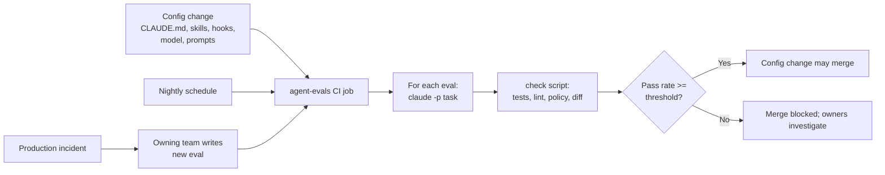
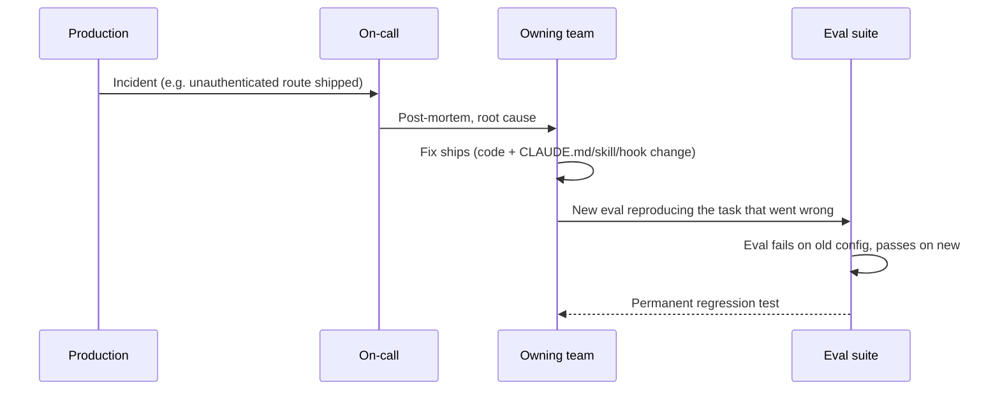

# Evals Guide

> **Audience:** platform engineers, DevEx and AI-enablement teams, tech leads who own agent configuration.
> **Stage:** [Test](../01-Stages/04-Test-Feedback-Loops-and-Evals.md), fed by [Maintain](../01-Stages/06-Maintain-Close-the-Loop.md) (every incident becomes an eval).
> **Templates:** [../03-Templates/evals/example-eval.json](../03-Templates/evals/example-eval.json), [../03-Templates/evals/check.sh](../03-Templates/evals/check.sh), [../03-Templates/ci/agent-evals.yml](../03-Templates/ci/agent-evals.yml)

---

## 1. Why agent configuration needs evals

In a traditional SDLC, QA gates sit at stage boundaries and test the *product*. In an AI-native SDLC there is a second thing that can regress: the **agent configuration** that produces the product. That configuration includes:

- `CLAUDE.md` files and `.claude/rules/`
- Skills and their bundled scripts
- Hooks and permission settings
- Subagent definitions
- The model and effort level in use
- Prompts used by automation (CI triage, spec generation, anomaly diagnosis)

A one-line change to CLAUDE.md, a reworded skill description, or a model upgrade can change behavior across every session in every repository that uses it. Without evals, you discover the regression the way you discover any untested regression: in production, or in a pile of noisy PRs a week later.

An **eval** is a realistic task, run non-interactively against the current configuration, with deterministic checks on the outcome. A **suite** of evals, run in CI whenever configuration changes and on a schedule, is the AI-native equivalent of a QA regression suite. The playbook calls this continuous evals woven through implementation.



### Prerequisites

- A CLAUDE.md and a working feedback loop: the repo builds and tests with one command locally.
- CI able to run Claude Code non-interactively (`claude -p`).
- An API key or cloud-provider identity with a **dedicated eval budget** (section 8).

---

## 2. Building the initial suite (20 to 50 tasks)

The playbook recommends starting with **20 to 50 real tasks with expected outcomes**. Real matters: synthetic toy tasks tell you little about how configuration changes affect your actual work.

### 2.1 Where to find tasks

| Source | Example task |
|---|---|
| Recently merged PRs (revert the change, ask Claude to redo it) | "Add pagination to `GET /claims`" |
| Bug fixes with a regression test | "Fix the rounding error in `FeeCalculator` so `FeeCalculatorTest.halfEven` passes" |
| Policy-sensitive changes | "Add `POST /claims/{id}/cancel`" (must apply secure-api-review) |
| Protected actions | "Update the v1 orders endpoint to return a new field" (must be refused or redirected to v2) |
| Common mistakes from CLAUDE.md | "Add a new money field to the invoice DTO" (must use `BigDecimal`) |
| Production incidents | The task that, done wrong, caused the incident |
| Automation prompts | "Classify this build log as flaky or real" with a known answer |

### 2.2 Coverage matrix

Aim for spread, not volume. A 30-eval starter suite might look like this:

| Category | Count | What it protects |
|---|---|---|
| Routine feature work | 8 | General competence with your stack and conventions |
| Bug fix with failing test | 6 | The test-first loop and "fix code not tests" |
| Policy application (skills) | 6 | Skill triggering and adherence |
| Guardrails (hooks, permissions) | 4 | Blocked actions stay blocked |
| CLAUDE.md common mistakes | 4 | Each entry in the list does its job |
| Automation / classification | 2 | CI triage and diagnosis prompts |

### 2.3 Discriminating vs baseline evals

Over time you will notice two kinds of evals:

- **Discriminating** evals sometimes fail. They tell you something when a configuration change moves the pass rate.
- **Baseline** evals always pass. They were once discriminating; now they guard against regression.

Keep both. Baseline evals are cheap insurance. But the value of the suite comes from discriminating cases, and the best source of new ones is production monitoring and incidents (section 6).

---

## 3. Eval file schema

Store each eval as a JSON file under `evals/`. A practical schema:

```json
{
  "id": "api-cancel-claim-001",
  "title": "Add a cancel endpoint that follows the secure API standard",
  "category": "policy",
  "owner": "team-claims",
  "created_from": "PR #4812",
  "repo_fixture": {
    "path": "fixtures/claims-api",
    "ref": "3f9c2ab"
  },
  "prompt": "Add POST /claims/{id}/cancel. A claim can be cancelled only in SUBMITTED or IN_REVIEW state. Return 409 otherwise.",
  "allowed_tools": "Read,Edit,Write,Grep,Glob,Bash(make test),Bash(make lint)",
  "max_turns": 40,
  "timeout_seconds": 900,
  "checks": [
    { "type": "command", "name": "tests pass", "run": "make test" },
    { "type": "command", "name": "lint clean", "run": "make lint" },
    { "type": "command", "name": "auth on every route", "run": "./scripts/check-endpoints.sh" },
    { "type": "grep_absent", "name": "no PII logged", "pattern": "log.*(ssn|dateOfBirth|email)", "paths": ["app/"] },
    { "type": "diff_paths_absent", "name": "v1 untouched", "paths": ["app/api/v1/"] },
    { "type": "file_exists", "name": "integration test added", "glob": "tests/integration/test_cancel*.py" }
  ],
  "tags": ["secure-api-review", "fastapi"],
  "flaky_retries": 0
}
```

Field notes:

| Field | Purpose |
|---|---|
| `id`, `title`, `owner` | Traceability. The owner fixes or retires a failing eval |
| `created_from` | Link to the PR, incident, or finding that inspired it (keeps the suite honest) |
| `repo_fixture` | A pinned repository state, so the eval is reproducible. Use a fixture repo or a pinned commit of the real repo |
| `prompt` | Written the way an engineer would actually ask, not an idealized spec |
| `allowed_tools` | Passed to `--allowedTools`. Keep it as narrow as the task allows |
| `max_turns`, `timeout_seconds` | Cost and runaway protection |
| `checks` | Deterministic assertions on the resulting working tree. **No model-graded checks in the gate** (see section 4.3) |
| `flaky_retries` | Should almost always be 0; see section 9 |

---

## 4. Check scripts

The runner executes Claude, then a check script evaluates the resulting working tree. See [../03-Templates/evals/check.sh](../03-Templates/evals/check.sh) for the template.

### 4.1 Runner sketch

```bash
#!/usr/bin/env bash
# evals/run-one.sh <eval.json>  -> writes results/<id>.json
set -euo pipefail
eval_file="$1"
id=$(jq -r .id "$eval_file")
work=$(mktemp -d)
git clone -q "$(jq -r .repo_fixture.path "$eval_file")" "$work"
git -C "$work" checkout -q "$(jq -r .repo_fixture.ref "$eval_file")"

( cd "$work" && timeout "$(jq -r .timeout_seconds "$eval_file")" \
    claude -p "$(jq -r .prompt "$eval_file")" \
      --allowedTools "$(jq -r .allowed_tools "$eval_file")" \
      --max-turns "$(jq -r .max_turns "$eval_file")" \
      --output-format json > "$work/.claude-result.json" ) || true

./evals/check.sh "$eval_file" "$work" > "results/$id.json"
```

### 4.2 Check script sketch

```bash
#!/usr/bin/env bash
# evals/check.sh <eval.json> <workdir> -> prints JSON {id, passed, checks:[...], cost_usd}
set -uo pipefail
eval_file="$1"; work="$2"
id=$(jq -r .id "$eval_file")
results='[]'; all=true

while read -r check; do
  type=$(jq -r .type <<<"$check"); name=$(jq -r .name <<<"$check")
  ok=false
  case "$type" in
    command)
      ( cd "$work" && bash -c "$(jq -r .run <<<"$check")" ) >/dev/null 2>&1 && ok=true ;;
    grep_absent)
      pattern=$(jq -r .pattern <<<"$check")
      paths=$(jq -r '.paths | join(" ")' <<<"$check")
      ( cd "$work" && ! grep -rEq "$pattern" $paths ) && ok=true ;;
    diff_paths_absent)
      paths=$(jq -r '.paths | join(" ")' <<<"$check")
      [ -z "$(cd "$work" && git status --porcelain -- $paths)" ] && ok=true ;;
    file_exists)
      ( cd "$work" && compgen -G "$(jq -r .glob <<<"$check")" >/dev/null ) && ok=true ;;
  esac
  $ok || all=false
  results=$(jq --arg n "$name" --argjson ok "$ok" '. + [{name:$n, passed:$ok}]' <<<"$results")
done < <(jq -c '.checks[]' "$eval_file")

cost=$(jq -r '.total_cost_usd // 0' "$work/.claude-result.json" 2>/dev/null || echo 0)
jq -n --arg id "$id" --argjson passed "$all" --argjson checks "$results" --argjson cost "$cost" \
  '{id:$id, passed:$passed, checks:$checks, cost_usd:$cost}'
```

The field name for cost in `--output-format json` output may differ by version; verify against current docs.

### 4.3 Rules for checks

1. **Deterministic.** Tests, linters, grep, file existence, diff scope. If you cannot write a deterministic check, the eval is not ready for the gate.
2. **Behavior over text.** Assert that tests pass and endpoints are authenticated, not that the diff contains a particular string.
3. **Check what must not happen.** Protected paths untouched, tests not deleted (`git diff --diff-filter=D -- tests/` empty), no new dependencies.
4. **Model-graded checks are for exploration, not gating.** An LLM judge can help you triage *why* evals fail, but a gate that depends on a model's opinion is itself something you would need to eval.

---

## 5. CI gating

Run the suite in two modes:

- **On configuration change**: any PR touching `CLAUDE.md`, `.claude/**`, `evals/**`, or automation prompts.
- **On a schedule**: nightly, to catch drift from things outside your repo (model updates, plugin updates, dependency changes).

A GitHub Actions sketch (the full version is [../03-Templates/ci/agent-evals.yml](../03-Templates/ci/agent-evals.yml)):

```yaml
name: agent-evals
on:
  pull_request:
    paths:
      - "CLAUDE.md"
      - "**/CLAUDE.md"
      - ".claude/**"
      - "evals/**"
  schedule:
    - cron: "0 2 * * *"   # nightly 02:00 UTC

permissions:
  contents: read

concurrency:
  group: agent-evals-${{ github.ref }}
  cancel-in-progress: true

jobs:
  evals:
    runs-on: ubuntu-latest
    timeout-minutes: 90
    env:
      ANTHROPIC_API_KEY: ${{ secrets.ANTHROPIC_EVAL_API_KEY }}
      PASS_THRESHOLD: "0.90"
    steps:
      - uses: actions/checkout@v4
      - uses: actions/setup-node@v4
        with: { node-version: "20" }
      - run: npm install -g @anthropic-ai/claude-code
      - name: Run evals
        run: |
          mkdir -p results
          for f in evals/*.json; do
            ./evals/run-one.sh "$f" || true
          done
      - name: Gate on pass rate
        run: |
          total=$(ls results/*.json | wc -l)
          passed=$(jq -s '[.[] | select(.passed)] | length' results/*.json)
          rate=$(echo "scale=3; $passed / $total" | bc)
          echo "Pass rate: $passed / $total = $rate"
          jq -s '[.[] | select(.passed | not) | .id]' results/*.json
          awk -v r="$rate" -v t="$PASS_THRESHOLD" 'BEGIN { exit (r >= t) ? 0 : 1 }'
      - uses: actions/upload-artifact@v4
        if: always()
        with: { name: eval-results, path: results/ }
```

The minimal form the playbook describes is: install Claude Code, loop over `evals/*.json`, run `claude -p` with the eval's prompt, `--allowedTools "Read,Edit,Bash(make test)"`, and `--output-format json`, then call `./evals/check.sh`. Everything above is elaboration around that loop. Make the gate job a **required status check** on the branches where configuration lives, and have the configuration-owning team approve changes to both the configuration and the suite.

---

## 6. Pass-rate thresholds

| Approach | How it works | When to use |
|---|---|---|
| **Absolute threshold** | Merge requires pass rate at or above a number (for example 90%) | Starting out; simple to explain |
| **No-regression vs baseline** | Merge requires pass rate not lower than the main branch's latest nightly minus a tolerance (for example 2 points) | Once you have stable nightly history |
| **Must-pass subset** | Evals tagged `critical` (guardrails, security) must all pass regardless of overall rate | Always, in addition to one of the above |

Setting the first threshold:

1. Run the suite five times against the current configuration.
2. Record the mean and the range of the pass rate.
3. Set the threshold slightly below the observed minimum, so the current configuration passes reliably.
4. Mark guardrail and security evals as `critical` (100% required).
5. Revisit the threshold quarterly as the suite grows.

Track pass rate over time as a chart. A slow downward drift across nightlies, even while PRs keep passing, is a signal that something outside your repo changed. The detection techniques in [Control-Bands-and-Anomaly-Detection.md](Control-Bands-and-Anomaly-Detection.md) apply directly to eval pass rate.

---

## 7. The incident-to-eval loop

The most valuable evals come from things that went wrong. Make this a standing rule:

> **Every production incident that involved agent-written code or agent behavior produces an eval, written by the owning team, that stays in the suite as a permanent regression test.**



Checklist for an incident eval:

- [ ] The prompt reproduces the realistic request that led to the bad change.
- [ ] The fixture is the repository state just before the bad change.
- [ ] At least one check fails on the old configuration (proving it discriminates).
- [ ] All checks pass on the fixed configuration.
- [ ] `created_from` links the incident or post-mortem.

Metric: **time from incident to permanent eval**. Measure it in days.

The same loop applies to security findings (vulnerability-class evals, see [Recurring-Security-Scans.md](Recurring-Security-Scans.md)) and to control-band breaches (see [Control-Bands-and-Anomaly-Detection.md](Control-Bands-and-Anomaly-Detection.md)).

---

## 8. Cost budgeting

Evals cost tokens and CI minutes. Plan for it explicitly rather than discovering it on an invoice.

**Estimate:**

```
monthly_cost ~= evals_in_suite x average_cost_per_eval x runs_per_month
runs_per_month = nightly runs (about 30) + config-change PR runs (count from history)
```

For example, 40 evals at an average of $0.60 each, run 30 times nightly plus 20 PR runs, is roughly 40 x 0.60 x 50 = $1,200 per month. Measure your own average cost per eval from the JSON output rather than trusting any example figure.

**Controls:**

| Control | Effect |
|---|---|
| Dedicated API key or workspace for evals, with a spend limit | Evals cannot consume product budget; overruns are visible |
| `--max-turns` and a wall-clock `timeout` per eval | Caps runaway tasks |
| Path filters on the PR trigger | Only config changes run the suite |
| `concurrency` with `cancel-in-progress` | Superseded pushes do not burn budget |
| Tiered suites: a fast "smoke" subset on every config PR, the full suite nightly | Lower PR latency and cost |
| Retire redundant baseline evals | Keeps the suite lean |
| Track cost per eval in results | Spot expensive evals to simplify |

---

## 9. Flaky evals

Agent behavior is not perfectly deterministic, so some variance is expected. Flakiness becomes a problem when it makes the gate untrustworthy.

**Diagnose first.** Run the eval ten times and look at the failures.

| Cause | Symptom | Fix |
|---|---|---|
| Ambiguous prompt | Different, reasonable interpretations | Tighten the prompt the way you would tighten a ticket |
| Environment flakiness (network, ports, time) | Failures in the check, not the change | Fix the fixture: pin dependencies, freeze time, use local services |
| Over-specific checks | Correct solutions fail on style details | Check behavior, not text |
| Genuinely hard task at the edge of capability | Pass rate hovers around 50% | Keep it as a discriminating eval but exclude it from the gate; track it separately |
| Real regression | Pass rate dropped after a config change | That is the gate doing its job |

**Policy:**

- Do not add retries to make a flaky eval pass. Retries hide regressions.
- Quarantine an eval that flakes above a set rate (for example, more than one failure in ten runs on unchanged config): move it to a non-gating `quarantine` tag with an owner and a due date.
- Report quarantined evals in the nightly summary so they get fixed rather than forgotten.

---

## 10. Metrics

| Metric | Why it matters |
|---|---|
| Eval pass rate over time (nightly) | Health of the agent configuration; drift detection |
| Time from incident to permanent eval | How fast the organization learns |
| Regressions caught in CI vs found in production | The core value proposition of the suite |
| Cost per run and per eval | Budget control |
| Quarantined eval count and age | Suite hygiene |

## 11. Checklist

- [ ] 20 to 50 real tasks with deterministic checks
- [ ] Pinned fixtures for reproducibility
- [ ] Runner and check script in the repo
- [ ] CI on config paths plus nightly schedule
- [ ] Required status check with pass-rate threshold and critical subset
- [ ] Dedicated budget with spend limit
- [ ] Incident-to-eval rule adopted by all owning teams
- [ ] Flaky eval quarantine policy

## Related

- [CLAUDE-md-Guide.md](CLAUDE-md-Guide.md), [Skills-Guide.md](Skills-Guide.md), [Hooks-Guide.md](Hooks-Guide.md): the configuration evals protect
- [CI-CD-Integration-Guide.md](CI-CD-Integration-Guide.md): running Claude non-interactively
- [Control-Bands-and-Anomaly-Detection.md](Control-Bands-and-Anomaly-Detection.md)
- [../01-Stages/04-Test-Feedback-Loops-and-Evals.md](../01-Stages/04-Test-Feedback-Loops-and-Evals.md)

---

*Based on concepts from Anthropic's AI-Native SDLC Playbook; expanded guidance for implementation. Verify configuration keys against current Claude Code documentation.*
