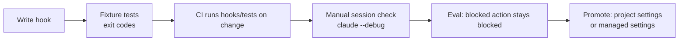

# Hooks Guide

> **Audience:** platform engineers, DevEx teams, security engineers, change-management leads.
> **Stages:** [Build](../01-Stages/03-Build-Plan-Mode.md) (build-time guardrails), [Test](../01-Stages/04-Test-Feedback-Loops-and-Evals.md) (protecting the feedback loop), [Deploy](../01-Stages/05-Deploy-Review-and-Gates.md) (approval gates).
> **Templates:** [../03-Templates/hooks/production-gate.sh](../03-Templates/hooks/production-gate.sh), [../03-Templates/hooks/protect-tests.sh](../03-Templates/hooks/protect-tests.sh), [../03-Templates/hooks/protect-paths.sh](../03-Templates/hooks/protect-paths.sh), [../03-Templates/settings/project-settings.json](../03-Templates/settings/project-settings.json)

---

## 1. Why hooks matter

CLAUDE.md and skills tell Claude what it *should* do. Hooks decide what it *can* do. A hook is a command (or HTTP endpoint, MCP tool, or model-based check) that Claude Code runs automatically at a defined point in its lifecycle, such as just before a tool runs or just after a file is edited. Because the harness runs the hook rather than the model, the outcome is **deterministic**: if the hook blocks, the action does not happen, regardless of what the model intended.

That property is what lets an organization move governance from "a board meets weekly" to "the control is enforced at the moment of action." The playbook's rule of thumb: **back every must-hold skill with a hook.**


| Layer | Nature | Example |
|---|---|---|
| CLAUDE.md | Advisory, always loaded | "Never edit files under `api/v1/`." |
| Skill | Advisory, loaded when relevant | Secure API standard |
| **Hook** | **Deterministic, per action** | Block any `Edit` to `api/v1/**` with exit code 2 |
| Permission rules / managed settings | Deterministic, per tool call, not overridable when managed | `deny: ["Read(./.env)"]` |
| Branch protection / CODEOWNERS | Deterministic, at merge | Code-owner approval required |

---

## 2. Hook events

Claude Code exposes many lifecycle events. The ones you will use most for SDLC guardrails are in bold. Verify the full, current list in the [hooks reference](https://code.claude.com/docs/en/hooks); new events are added over time.

| Event | Fires when | Typical SDLC use |
|---|---|---|
| **`PreToolUse`** | Before a tool call runs | Block protected paths, block dangerous commands, approval gates, require a ticket ID |
| **`PostToolUse`** | After a tool call succeeds | Run formatter/linter on the edited file, scan for secrets in written content |
| `PostToolUseFailure` | After a tool call fails | Capture failure context |
| `PermissionRequest` | When a permission prompt would be shown | Auto-decide specific prompts |
| **`UserPromptSubmit`** | When a user submits a prompt | Reject prompts containing secrets; inject context |
| **`SessionStart`** | Session starts or resumes | Inject branch, ticket, or environment context |
| **`Stop`** / `SubagentStop` | Claude (or a subagent) finishes a turn | Run a final verification, refuse to stop until tests pass |
| `SessionEnd` | Session ends | Flush audit logs |
| `Notification` | Claude Code sends a notification | Route "waiting for input" to chat |
| `PreCompact` / `PostCompact` | Around context compaction | Preserve key context |
| `SubagentStart` | A subagent starts | Log delegation |
| `WorktreeCreate` / `WorktreeRemove` | Worktree lifecycle | Provision or clean per-worktree resources |
| `ConfigChange` | A settings file changes | Audit configuration drift |

```mermaid
sequenceDiagram
    participant U as User / CI
    participant CC as Claude Code harness
    participant H as Hook script
    participant T as Tool (Bash, Edit...)
    U->>CC: Prompt
    CC->>H: UserPromptSubmit (stdin JSON)
    H-->>CC: exit 0
    CC->>H: PreToolUse (tool_name, tool_input)
    alt exit 2
        H-->>CC: stderr reason
        CC-->>U: Tool blocked; Claude sees reason and adapts
    else exit 0
        CC->>T: Run tool
        T-->>CC: Result
        CC->>H: PostToolUse (tool_input, tool_response)
        H-->>CC: exit 0 (formatter ran)
    end
    CC->>H: Stop
```

---

## 3. Configuration

Hooks are configured in settings files under the `hooks` key. Where you put the configuration determines who it applies to and whether it can be overridden.

| Location | Scope | Use for |
|---|---|---|
| `~/.claude/settings.json` | You, every project | Personal conveniences (notifications) |
| `.claude/settings.json` (committed) | Everyone in the repo | Team guardrails: formatter, protected paths, test protection |
| `.claude/settings.local.json` (gitignored) | You, this repo | Local experiments |
| **Managed settings** | Every machine in the org; cannot be overridden | Non-negotiable gates: production deploy, secrets |
| Plugin `hooks/hooks.json` | Wherever the plugin is enabled | Hooks distributed with a skill or policy plugin |
| Skill or subagent frontmatter | While that skill/subagent is active | Scoped checks |

### 3.1 Structure

```json
{
  "hooks": {
    "PreToolUse": [
      {
        "matcher": "Bash",
        "hooks": [
          {
            "type": "command",
            "command": "${CLAUDE_PROJECT_DIR}/.claude/hooks/production-gate.sh",
            "timeout": 10
          }
        ]
      },
      {
        "matcher": "Edit|Write",
        "hooks": [
          { "type": "command", "command": "${CLAUDE_PROJECT_DIR}/.claude/hooks/protect-paths.sh" }
        ]
      }
    ],
    "PostToolUse": [
      {
        "matcher": "Edit|Write",
        "hooks": [
          { "type": "command", "command": "${CLAUDE_PROJECT_DIR}/.claude/hooks/format-changed.sh" }
        ]
      }
    ]
  }
}
```

### 3.2 Matchers

For tool events, `matcher` filters on the tool name:

| Matcher | Matches |
|---|---|
| `"Bash"` | Exactly the Bash tool |
| `"Edit\|Write"` | Edit or Write |
| `"mcp__deploy__.*"` | Every tool from the `deploy` MCP server (regex) |
| `"*"`, `""`, or omitted | Everything |

Strings containing only letters, digits, `_`, `-`, spaces, commas, and `|` are exact names or lists; anything else is treated as a regular expression. Handlers also accept an optional `if` field holding a permission-rule pattern, such as `"if": "Bash(git push *)"`, to narrow when a hook runs without writing that logic in the script (verify availability in your version).

### 3.3 Handler fields

| Field | Meaning |
|---|---|
| `type` | `command` (most common), `http`, `mcp_tool`, `prompt`, or `agent` |
| `command` | Script or executable. `${CLAUDE_PROJECT_DIR}` expands to the project root |
| `args` | Optional argument array; when present, the command runs directly without a shell |
| `shell` | `bash` or `powershell` (for the shell form) |
| `timeout` | Seconds before the hook is cancelled (default is long; set it short) |
| `async` | Run in the background without blocking |
| `statusMessage` | Spinner text while it runs |

---

## 4. What the hook receives (stdin JSON)

Every hook receives a JSON object on standard input. Common fields:

```json
{
  "session_id": "abc123",
  "transcript_path": "/home/dev/.claude/projects/.../transcript.jsonl",
  "cwd": "/home/dev/payments-service",
  "permission_mode": "default",
  "hook_event_name": "PreToolUse",
  "tool_name": "Bash",
  "tool_input": { "command": "kubectl apply -f deploy/production.yaml" },
  "tool_use_id": "toolu_01..."
}
```

For `Edit` and `Write`, `tool_input.file_path` holds the target path. For `PostToolUse`, the payload also includes the tool's response. Subagent calls include `agent_id` and `agent_type`, which is useful for auditing which helper did what.

The environment variable `CLAUDE_PROJECT_DIR` is exported to the hook process.

---

## 5. What the hook returns

### 5.1 Exit codes

| Exit code | Meaning | What Claude sees |
|---|---|---|
| **0** | Success / allow. If stdout is a JSON object, it is parsed for decisions | Nothing (stdout goes to the debug log, except for events like `UserPromptSubmit` and `SessionStart` where plain stdout is added as context) |
| **2** | **Blocking error.** The action is blocked | The **stderr** text is fed back to Claude so it can adjust |
| Any other | Non-blocking error | Action proceeds; error is logged |

The exit-2-with-stderr pattern is the workhorse of SDLC guardrails. Write stderr messages for Claude as the reader: say **what** was blocked, **why**, and **how to proceed legitimately** ("Production deploys require RELEASE_APPROVAL. Prepare the change and ask the release manager to authorize it."). A good message turns a block into a useful redirection rather than a dead end.

### 5.2 JSON decision output (richer control)

For `PreToolUse`, a hook can exit 0 and print a JSON decision instead:

```json
{
  "hookSpecificOutput": {
    "hookEventName": "PreToolUse",
    "permissionDecision": "ask",
    "permissionDecisionReason": "This command touches the staging database. Confirm before running."
  }
}
```

| `permissionDecision` | Effect |
|---|---|
| `allow` | Proceed without a permission prompt (still subject to `deny` and `ask` permission rules, which hooks cannot override) |
| `ask` | Show the user a confirmation prompt with the reason |
| `deny` | Block; the reason is given to Claude |

A PreToolUse hook can also return `updatedInput` to rewrite the tool input (for example, adding `--dry-run`). Use this sparingly; silent rewriting makes behavior harder to reason about.

For `PostToolUse`, `UserPromptSubmit`, and `Stop`, the documented pattern is a `decision` of `block` with a `reason`. The exact placement of these fields (top level versus inside `hookSpecificOutput`) has changed across versions: **verify against current docs** before relying on JSON output for these events, or use exit code 2 plus stderr, which is stable.

Important: **hook decisions do not bypass permission rules.** A matching `deny` rule in settings still blocks even if a hook returns `allow`. This preserves the deny-first model, including managed deny rules.

---

## 6. Build-time guardrails

These run constantly during Build and should be invisible when things are fine.

### 6.1 Run the formatter on the changed file (PostToolUse)

**Bash** (`.claude/hooks/format-changed.sh`):

```bash
#!/usr/bin/env bash
# Format only the file Claude just edited. Fast and scoped.
set -euo pipefail
file=$(jq -r '.tool_input.file_path // empty')
[ -z "$file" ] && exit 0
case "$file" in
  *.ts|*.tsx|*.js|*.json|*.css) npx --no-install prettier --write "$file" >/dev/null 2>&1 || true ;;
  *.py)                          ruff format "$file" >/dev/null 2>&1 && ruff check --fix "$file" >/dev/null 2>&1 || true ;;
  *.java)                        ./gradlew -q spotlessApply -PspotlessFiles="$file" >/dev/null 2>&1 || true ;;
  *.go)                          gofmt -w "$file" ;;
esac
exit 0
```

**PowerShell** (`.claude/hooks/format-changed.ps1`):

```powershell
$ErrorActionPreference = 'Stop'
$payload = [Console]::In.ReadToEnd() | ConvertFrom-Json
$file = $payload.tool_input.file_path
if (-not $file) { exit 0 }
switch -Regex ($file) {
  '\.(ts|tsx|js|json|css)$' { npx --no-install prettier --write $file *> $null }
  '\.py$'                   { ruff format $file *> $null; ruff check --fix $file *> $null }
  '\.cs$'                   { dotnet format --include $file *> $null }
}
exit 0
```

Configure the PowerShell variant with the exec form so no shell parsing is involved:

```json
{
  "type": "command",
  "command": "powershell.exe",
  "args": ["-NoProfile", "-ExecutionPolicy", "Bypass", "-File", "${CLAUDE_PROJECT_DIR}/.claude/hooks/format-changed.ps1"],
  "timeout": 20
}
```

### 6.2 Block edits to protected paths (PreToolUse)

**Bash** (`protect-paths.sh`, see the full template at [../03-Templates/hooks/protect-paths.sh](../03-Templates/hooks/protect-paths.sh)):

```bash
#!/usr/bin/env bash
set -euo pipefail
file=$(jq -r '.tool_input.file_path // empty')
[ -z "$file" ] && exit 0
rel="${file#"$CLAUDE_PROJECT_DIR"/}"
case "$rel" in
  api/v1/*|db/migrations/applied/*|.github/workflows/*|infra/prod/*|CODEOWNERS)
    echo "Blocked: '$rel' is a protected path (frozen API, applied migration, CI, or prod infra)." >&2
    echo "Propose the change in plan.md and ask a code owner to make it, or add new code elsewhere." >&2
    exit 2 ;;
esac
exit 0
```

**PowerShell**:

```powershell
$payload = [Console]::In.ReadToEnd() | ConvertFrom-Json
$file = $payload.tool_input.file_path
if (-not $file) { exit 0 }
$root = $env:CLAUDE_PROJECT_DIR
$rel = $file.Replace($root, '').TrimStart('\','/') -replace '\\','/'
$protected = @('^api/v1/', '^db/migrations/applied/', '^\.github/workflows/', '^infra/prod/', '^CODEOWNERS$')
foreach ($p in $protected) {
  if ($rel -match $p) {
    [Console]::Error.WriteLine("Blocked: '$rel' is a protected path. Propose the change in plan.md for a code owner.")
    exit 2
  }
}
exit 0
```

### 6.3 Keep secrets out (PreToolUse on Read/Bash, PostToolUse on Write)

Use permission `deny` rules as the primary control (`Read(./.env)`, `Read(~/.ssh/**)`, `Read(~/.aws/credentials)`); they are simpler and cannot be bypassed by a hook. Add a hook for what rules cannot express, such as scanning content Claude is about to write for credential patterns:

```bash
#!/usr/bin/env bash
# PreToolUse on Write|Edit: refuse to write content that looks like a credential.
set -euo pipefail
content=$(jq -r '.tool_input.content // .tool_input.new_string // empty')
if printf '%s' "$content" | grep -Eq '(AKIA[0-9A-Z]{16}|-----BEGIN (RSA|EC|OPENSSH) PRIVATE KEY-----|xox[baprs]-[0-9A-Za-z-]+|ghp_[0-9A-Za-z]{36})'; then
  echo "Blocked: the content looks like a credential. Use an environment variable or secret manager reference instead." >&2
  exit 2
fi
exit 0
```

Pair with a repository secret scanner in CI (gitleaks, trufflehog, or your platform's native scanning). Hooks catch it early; CI catches anything the hook missed.

### 6.4 Protect the test loop during bug fixes

During a bug fix, the failing test is the specification. If Claude edits the test to make it pass, the loop is broken. The [protect-tests.sh](../03-Templates/hooks/protect-tests.sh) template blocks edits to test files while an environment flag (for example `BUGFIX_MODE=1`) is set, or while the current branch matches `fix/*`:

```bash
#!/usr/bin/env bash
set -euo pipefail
file=$(jq -r '.tool_input.file_path // empty')
branch=$(git -C "$CLAUDE_PROJECT_DIR" rev-parse --abbrev-ref HEAD 2>/dev/null || echo "")
if [[ "${FIX_MODE:-0}" == "1" || -e "$CLAUDE_PROJECT_DIR/.claude/fix-mode" || "$branch" == fix/* ]]; then
  if [[ "$file" =~ (^|/)(test|tests|__tests__|src/test)/ || "$file" =~ \.(test|spec)\.[jt]sx?$ || "$file" =~ _test\.(py|go)$ ]]; then
    echo "Blocked: test files are read-only during a bug fix. Make the failing test pass by changing the code." >&2
    echo "If the test itself is wrong, stop and explain why so a human can decide." >&2
    exit 2
  fi
fi
exit 0
```

---

## 7. Approval gates

At the Deploy stage, hooks express the controls that change management, compliance, and leadership agree must survive the move to agentic delivery: change sign-off, release authorization, protected systems.

**Process:**

1. Leadership, change management, and compliance list the gates that must survive.
2. A platform engineer expresses each gate as a hook that can allow, ask, or block.
3. Team-level gates go in `.claude/settings.json` in git; non-negotiable gates go in **managed settings** (with `allowManagedHooksOnly` if you need to guarantee only approved hooks run).
4. Every block message explains why and how to obtain approval.

### 7.1 Production deploy gate

**Bash** (see [../03-Templates/hooks/production-gate.sh](../03-Templates/hooks/production-gate.sh)):

```bash
#!/usr/bin/env bash
set -euo pipefail
cmd=$(jq -r '.tool_input.command // empty')
if echo "$cmd" | grep -qiE 'deploy|helm (upgrade|install)|kubectl (apply|rollout)|terraform apply' \
   && echo "$cmd" | grep -qiE 'prod(uction)?'; then
  if [ -z "${RELEASE_APPROVAL:-}" ]; then
    echo "Blocked: production changes require release authorization (RELEASE_APPROVAL is not set)." >&2
    echo "Prepare the release (PR, changelog, rollback command) and request approval from the release manager." >&2
    exit 2
  fi
fi
exit 0
```

**PowerShell**:

```powershell
$payload = [Console]::In.ReadToEnd() | ConvertFrom-Json
$cmd = [string]$payload.tool_input.command
$isDeploy = $cmd -match '(?i)deploy|helm (upgrade|install)|kubectl (apply|rollout)|terraform apply'
$isProd   = $cmd -match '(?i)prod(uction)?'
if ($isDeploy -and $isProd -and -not $env:RELEASE_APPROVAL) {
  [Console]::Error.WriteLine('Blocked: production changes require release authorization (RELEASE_APPROVAL not set).')
  [Console]::Error.WriteLine('Prepare the release and request approval from the release manager.')
  exit 2
}
exit 0
```

> String matching on commands is a heuristic, not a security boundary: a determined process can obfuscate a command. Treat the hook as the *first* line (fast feedback to the agent), and rely on the real boundary being **credentials**: the agent's environment has no standing production credentials, and production deploys run through a pipeline that requires human authorization. See [CI-CD-Integration-Guide.md](CI-CD-Integration-Guide.md).

### 7.2 "Ask" instead of "block"

Some gates should pause for a human rather than refuse outright. Return a JSON `ask` decision:

```bash
#!/usr/bin/env bash
cmd=$(jq -r '.tool_input.command // empty')
if echo "$cmd" | grep -qE 'psql .*staging|migrate .*staging'; then
  jq -n '{hookSpecificOutput:{hookEventName:"PreToolUse",permissionDecision:"ask",
          permissionDecisionReason:"Staging database change: confirm the migration has been reviewed."}}'
  exit 0
fi
exit 0
```

In non-interactive runs (`claude -p`) there is no one to answer a prompt, so design CI gates as allow-or-block.

### 7.3 Measuring gates

- **Wait time per gate**: how long work waits at each gate. With OpenTelemetry enabled (`CLAUDE_CODE_ENABLE_TELEMETRY=1`), tool decision events give you a baseline; detailed hook events may require beta tracing flags (verify against current docs).
- **Gate violations reaching production**, before versus after adopting hooks. This is the evidence that "governance at the moment of action" is working.

---

## 8. Performance tips

Hooks run synchronously in the agent loop. A slow hook on `PostToolUse` for `Edit` runs after every edit and can make sessions painful.

| Tip | Why |
|---|---|
| Scope to the changed file (`tool_input.file_path`), never the whole repo | Formatting one file takes milliseconds; the repo can take minutes |
| Use narrow matchers (`Edit\|Write`, not `*`) | Avoid running on every Read and Grep |
| Exit early when the input is irrelevant | Most calls should cost almost nothing |
| Set a short `timeout` (5 to 30 seconds) | A hung hook should fail fast |
| Avoid network calls in hot-path hooks | Latency and flakiness; use `async` for logging |
| Prefer compiled or preinstalled tools (`jq`, `ruff`, `gofmt`) | `npx` cold starts are slow; use `--no-install` |
| Keep full test runs out of `PostToolUse` | Run them on `Stop` or in CI instead |
| On Windows, use `-NoProfile` for PowerShell | Profile loading adds noticeable latency |

---

## 9. Testing hooks locally

Hooks are code; test them like code before they reach anyone's machine.

**1. Unit test with a fixture payload:**

```bash
echo '{"tool_name":"Bash","tool_input":{"command":"helm upgrade api ./chart -n production"}}' \
  | CLAUDE_PROJECT_DIR=$PWD ./.claude/hooks/production-gate.sh; echo "exit=$?"
# expect: stderr message, exit=2

echo '{"tool_name":"Bash","tool_input":{"command":"helm upgrade api ./chart -n dev"}}' \
  | CLAUDE_PROJECT_DIR=$PWD ./.claude/hooks/production-gate.sh; echo "exit=$?"
# expect: exit=0
```

PowerShell equivalent:

```powershell
'{"tool_name":"Edit","tool_input":{"file_path":"C:/repo/api/v1/Orders.java"}}' |
  powershell -NoProfile -File .\.claude\hooks\protect-paths.ps1; "exit=$LASTEXITCODE"
```

**2. Table-driven tests in CI.** Keep a `hooks/tests/` folder with `cases.jsonl` (payload, expected exit code) and a runner that loops over it. Run it on every change to `.claude/hooks/**`.

**3. Integration check in a real session.** Start `claude --debug` (or use the `/hooks` command to inspect configured hooks), ask Claude to perform a blocked action, and confirm the block message appears and Claude responds sensibly.

**4. Eval coverage.** Add an eval that attempts a protected action and asserts it was blocked. See [Evals-Guide.md](Evals-Guide.md).



---

## 10. Security considerations

- Hooks run with the user's permissions. Review hook changes as carefully as CI pipeline changes; put `.claude/hooks/**` and `.claude/settings.json` under `CODEOWNERS`.
- Use `allowManagedHooksOnly` in managed settings when you need to guarantee that only organization-approved hooks run (for example, to stop a repository from disabling a gate). See [Managed-Settings-Guide.md](Managed-Settings-Guide.md).
- Quote variables and never `eval` input from the payload. The payload is attacker-influenced if Claude processed untrusted content.
- Log decisions (allow/block, reason, session ID) to an append-only location if you need audit evidence.

## 11. Checklist

- [ ] Formatter hook scoped to the changed file
- [ ] Protected paths hook covering frozen APIs, applied migrations, CI config, prod infra
- [ ] Secret content hook plus permission deny rules for credential files
- [ ] Test protection during bug fixes
- [ ] Production gate in managed settings, with explanatory block messages
- [ ] Every hook has fixture tests and a timeout
- [ ] Hooks and settings are code-owned

## Related

- [Managed-Settings-Guide.md](Managed-Settings-Guide.md)
- [CI-CD-Integration-Guide.md](CI-CD-Integration-Guide.md)
- [Skills-Guide.md](Skills-Guide.md)
- [../01-Stages/05-Deploy-Review-and-Gates.md](../01-Stages/05-Deploy-Review-and-Gates.md)

---

*Based on concepts from Anthropic's AI-Native SDLC Playbook; expanded guidance for implementation. Verify configuration keys against current Claude Code documentation.*
