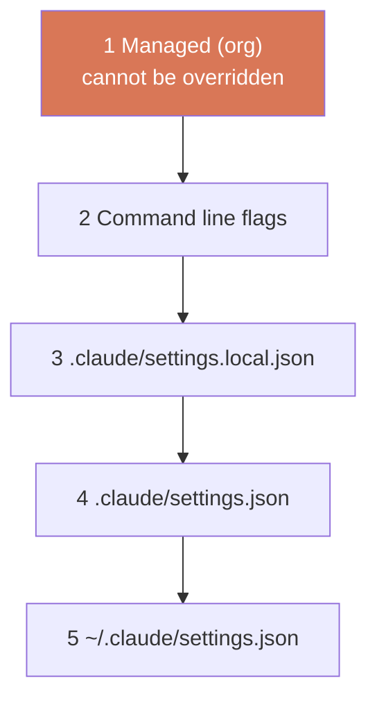
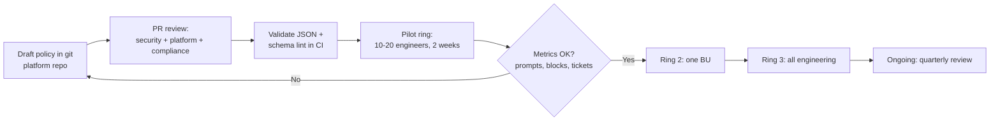

# Managed Settings Guide

> **Audience:** platform engineering, IT/endpoint management, security engineering, compliance, and the change-management function in regulated enterprises.
> **Stages:** cross-cutting; most directly [Deploy](../01-Stages/05-Deploy-Review-and-Gates.md) (enforcement at the moment of action).
> **Templates:** [../03-Templates/settings/managed-settings.json](../03-Templates/settings/managed-settings.json), [../03-Templates/settings/project-settings.json](../03-Templates/settings/project-settings.json)

---

## 1. Why managed settings

Project settings in `.claude/settings.json` are a team agreement: anyone with write access to the repository can change them, and a developer can override many of them locally. That is fine for conveniences and team guardrails. It is not sufficient for controls a regulator, auditor, or CISO expects to hold on every machine regardless of what an individual developer or repository does.

**Managed settings** are the organization's policy layer. They are delivered by IT (through MDM, a system file, or the Claude admin console), they sit at the top of the precedence order, and developers cannot override them. In the playbook's framing, this is how a regulated enterprise keeps its old control objectives while enforcing them through new mechanisms: data stays out of context, egress is blocked at the operating system, only approved hooks and plugins run, and nobody can switch the guardrails off.


---

## 2. Settings precedence

Highest priority first:

| # | Level | File / source | Who controls it |
|---|---|---|---|
| 1 | **Managed** | `managed-settings.json`, MDM/OS policy, or server-managed settings from the Claude admin console | The organization |
| 2 | Command line | `claude --settings ...` and flags | The person running this session |
| 3 | Project local | `.claude/settings.local.json` (gitignored) | The individual, this repo |
| 4 | Shared project | `.claude/settings.json` (committed) | The team |
| 5 | User | `~/.claude/settings.json` | The individual, all projects |



Behavior to understand:

- A managed key cannot be overridden by any lower level, including `--settings`.
- Some array settings (such as `permissions.allow`) **merge** across scopes unless the organization sets `allowManagedPermissionRulesOnly`, in which case only managed rules apply.
- Permission rules evaluate **deny first, then ask, then allow**. An allow rule cannot carve an exception out of a deny rule, and hook decisions cannot bypass deny or ask rules.
- For a few security-sensitive keys, a *stricter* value from a lower level is honored even if managed settings are more permissive. Verify the current list in the settings documentation.

---

## 3. Delivery mechanisms and file locations

| Mechanism | Location | Refresh | Best for |
|---|---|---|---|
| Server-managed settings | Claude admin console (Owner role) | Fetched by Claude Code; applies to cloud sessions too | Organizations on Claude Team/Enterprise without full MDM coverage |
| MDM / OS policy (macOS) | Managed preferences domain `com.anthropic.claudecode` (configuration profile via Jamf, Intune, etc.) | At startup, rechecked periodically | Managed Mac fleets |
| MDM / OS policy (Windows) | Registry value `Settings` (JSON string) under `HKLM\SOFTWARE\Policies\ClaudeCode` (Group Policy, Intune) | At startup, rechecked periodically | Managed Windows fleets |
| Managed settings file | macOS `/Library/Application Support/ClaudeCode/managed-settings.json`<br/>Linux/WSL `/etc/claude-code/managed-settings.json`<br/>Windows `C:\Program Files\ClaudeCode\managed-settings.json` | Watched for changes | Linux servers, CI images, dev containers, simple rollouts |
| Drop-in directory | `managed-settings.d/*.json` beside the file above | As above | Several teams owning parts of one policy |
| Managed MCP | `managed-mcp.json` in the same system directory | As above | Centrally provisioned MCP servers |

Notes (verify details against the [managed settings documentation](https://code.claude.com/docs/en/managed-settings)):

- By default only **one** managed source applies on a machine: the highest-ranked source that delivers any policy key (server-managed, then MDM/OS policy, then files). A `managedSourcesBehavior` key can switch to merging sources.
- The legacy Windows path `C:\ProgramData\ClaudeCode\managed-settings.json` is not read.
- A per-user `HKCU\SOFTWARE\Policies\ClaudeCode` value exists as a fallback but is user-writable, so do not rely on it for enforcement.
- Anthropic publishes starter MDM templates (Jamf, Intune, Group Policy) in the `examples/mdm` folder of the claude-code GitHub repository.
- A managed settings document that is not valid JSON causes Claude Code to **refuse to start** and name the source. Validate before you deploy.

---

## 4. The keys, with rationale

The table follows the controls described in the playbook for regulated enterprises. "Managed-only" means the key only takes effect from managed settings.

### 4.1 Permissions

| Key | Managed-only | What it does | Why a regulated enterprise sets it |
|---|---|---|---|
| `permissions.deny` | No | Blocks listed tool uses, e.g. `Read(./.env)`, `Read(~/.ssh/**)`, `Bash(curl *)` | Keep secrets out of model context; block arbitrary egress tools |
| `permissions.allow` | No | Pre-approves listed tool uses, e.g. `Bash(make test)`, `Bash(git diff *)` | Pre-approve the safe inner loop so engineers are not trained to click "yes" on everything (prompt fatigue is itself a risk) |
| `permissions.ask` | No | Always prompts for listed tool uses | Human confirmation for sensitive but legitimate actions |
| `permissions.defaultMode` | No | Mode new sessions start in | Start in `default` or `plan`, not a permissive mode |
| `permissions.disableBypassPermissionsMode` | No (most useful managed) | Set to `"disable"` to prevent `bypassPermissions` mode | Nobody can turn all prompts and checks off |
| `permissions.disableAutoMode` | No (most useful managed) | Set to `"disable"` to prevent auto mode | Optional; only if your organization is not ready for classifier-reviewed autonomy |
| `allowManagedPermissionRulesOnly` | **Yes** | Only managed permission rules apply; project and user rules are ignored | Stops a repository or user from adding broad allow rules |

Rule syntax reminders: `Bash(npm run test *)` uses glob-style wildcards; `Read(~/.ssh/**)` is relative to home; `Read(//etc/**)` is an absolute path; `Read(./.env)` is relative to the project; `WebFetch(domain:github.com)` restricts fetches by domain. A deny rule on `Bash(curl *)` does not match `curl` invoked through a path or inside `sh -c`, which is why the **sandbox** is the real egress control.

### 4.2 Sandbox (OS-level isolation)

| Key | Managed-only | What it does | Why |
|---|---|---|---|
| `sandbox.enabled` | No | Runs Bash (and related) commands inside an OS sandbox (Seatbelt on macOS, bubblewrap on Linux/WSL2) | Filesystem and network boundaries enforced by the OS, not by string matching |
| `sandbox.network.allowedDomains` | No | Domains sandboxed commands may reach | A domain allowlist blocks egress to anything else at the OS level |
| `sandbox.network.allowManagedDomainsOnly` | **Yes** | Only managed `allowedDomains` (and managed `WebFetch(domain:...)` allow rules) count | Stops projects or users from widening the allowlist |
| `sandbox.failIfUnavailable` | No | Refuse to start if the sandbox cannot initialize | **Sandbox as a gate**: if isolation cannot be guaranteed, the tool does not run unsandboxed |
| `sandbox.allowUnsandboxedCommands` | No | `false` removes the escape hatch that lets a failed command retry outside the sandbox | Every command runs sandboxed (except any explicitly listed in `excludedCommands`) |
| `sandbox.filesystem.denyRead` | No | Paths sandboxed commands cannot read | Credential directories, other projects |
| `sandbox.filesystem.allowWrite` | No | Extra writable paths | Grant narrowly (e.g. build caches) instead of excluding tools from the sandbox |
| `sandbox.credentials.files` / `envVars` | No | Declare credential files (deny or mask) and environment variables to unset or mask for sandboxed commands | Deny reads to `~/.ssh`, `~/.aws/credentials`; strip tokens like `GITHUB_TOKEN` from the environment |
| `sandbox.autoAllowBashIfSandboxed` | No | Sandboxed commands run without prompts | Reduces prompt fatigue once the boundary is trustworthy |

> **Windows note:** the built-in sandbox runs on macOS, Linux, and WSL2. Native Windows is not supported; Windows engineers run Claude Code inside WSL2 when sandboxing is required. With `failIfUnavailable: true`, native Windows sessions will refuse to start, which is the intended fail-closed behavior. Plan your rollout accordingly.

### 4.3 Hooks

| Key | Managed-only | What it does | Why |
|---|---|---|---|
| `hooks` | No | Hook configuration (see [Hooks-Guide.md](Hooks-Guide.md)) | Non-negotiable gates such as the production deploy gate live here |
| `allowManagedHooksOnly` | **Yes** | Only organization-deployed hooks run; user, project, and (by default) plugin hooks do not | A repository cannot disable or shadow a gate, and cannot introduce arbitrary hook commands |
| `disableAllHooks` | No | Turns hooks off | Do **not** set this in managed policy unless you mean it; be aware that it exists |

### 4.4 Plugins, marketplaces, and sideloading

| Key | Managed-only | What it does | Why |
|---|---|---|---|
| `strictKnownMarketplaces` | **Yes** | Allowlist of marketplace sources (objects such as `{ "source": "github", "repo": "acme/claude-marketplace" }`); `[]` blocks all | Everything comes from the organization marketplace |
| `blockedMarketplaces` | **Yes** | Blocklist of marketplace sources | Belt and braces |
| `extraKnownMarketplaces` | No | Registers marketplaces on each machine | Make the org marketplace available without manual steps |
| `enabledPlugins` | No (locked when managed) | `true` force-enables, `false` blocks a plugin | Ship policy skills (secure-api-review, brand-ux) to everyone |
| `disableSideloadFlags` | **Yes** | Rejects `--plugin-dir`, `--plugin-url`, `--agents`, and non-SDK `--mcp-config` at startup | Closes the side door around the marketplace allowlist |
| `strictPluginOnlyCustomization` | **Yes** | Blocks skills, agents, hooks, and/or MCP servers that do not come from plugins or managed settings | Strictest option; consider carefully, as it also blocks repo-local skills |

### 4.5 MCP servers

| Key | Managed-only | What it does | Why |
|---|---|---|---|
| `allowManagedMcpServersOnly` | **Yes** | Only the managed `allowedMcpServers` list applies | Only approved integrations can reach internal systems |
| `allowedMcpServers` / `deniedMcpServers` | No | Allowlist / denylist of MCP servers | Entry format: verify against current docs |
| `managed-mcp.json` | File | Centrally provisioned servers | Ship the approved deploy/status/rollback servers |

### 4.6 Versions, login, telemetry, retention

| Key | Managed-only | What it does | Why |
|---|---|---|---|
| `requiredMinimumVersion` | **Yes** | Refuse to start on older versions | Ensure security fixes and newer policy keys are honored fleet-wide |
| `requiredMaximumVersion` | **Yes** | Refuse to start on newer versions | Optional; for strictly validated rollouts |
| `forceLoginMethod` | No | Restrict login method (for example to the organization's claude.ai accounts or Console) | Prevent personal accounts on corporate machines |
| `forceLoginOrgUUID` | Enforced from managed | Pin logins to your organization | Same |
| `env` | No | Environment variables for every session | Enable OpenTelemetry (`CLAUDE_CODE_ENABLE_TELEMETRY`, `OTEL_*`) to your collector |
| `cleanupPeriodDays` | No | Transcript retention on disk | Align with records-retention policy |
| `availableModels` | No (locked when managed) | Restrict selectable models | Approved models only |
| `companyAnnouncements` | No | Messages shown at startup | Point engineers at policy and support channels (verify value format) |

---

## 5. Full example: `managed-settings.json` for a regulated enterprise

This example assumes a financial-services company with an internal Git host, an internal package mirror, an OpenTelemetry collector, and an organization plugin marketplace. It is deliberately strict. The template copy is [../03-Templates/settings/managed-settings.json](../03-Templates/settings/managed-settings.json). JSON does not allow comments; rationale is in section 4.

```json
{
  "requiredMinimumVersion": "2.1.200",
  "forceLoginMethod": "claude-ai",
  "forceLoginOrgUUID": "00000000-0000-0000-0000-000000000000",
  "cleanupPeriodDays": 30,

  "permissions": {
    "defaultMode": "default",
    "disableBypassPermissionsMode": "disable",
    "deny": [
      "Read(./.env)",
      "Read(./.env.*)",
      "Read(./**/secrets/**)",
      "Read(~/.ssh/**)",
      "Read(~/.aws/credentials)",
      "Read(~/.aws/config)",
      "Read(~/.config/gcloud/**)",
      "Read(~/.kube/config)",
      "Read(~/.netrc)",
      "Read(~/.npmrc)",
      "Bash(curl *)",
      "Bash(wget *)",
      "Bash(nc *)",
      "Bash(ssh *)",
      "Bash(scp *)",
      "Bash(git push --force*)",
      "Bash(git push * main)",
      "Bash(kubectl * --context=prod*)",
      "Bash(terraform apply*)"
    ],
    "ask": [
      "Bash(git push *)",
      "Bash(docker push *)"
    ],
    "allow": [
      "Bash(make build)",
      "Bash(make test)",
      "Bash(make lint)",
      "Bash(make verify)",
      "Bash(git status)",
      "Bash(git diff *)",
      "Bash(git log *)",
      "Bash(git add *)",
      "Bash(git commit *)",
      "Bash(npm test *)",
      "Bash(pnpm test *)",
      "Bash(./gradlew test*)",
      "Bash(pytest *)",
      "WebFetch(domain:docs.acme-internal.com)",
      "WebFetch(domain:code.claude.com)"
    ]
  },
  "allowManagedPermissionRulesOnly": true,

  "sandbox": {
    "enabled": true,
    "failIfUnavailable": true,
    "allowUnsandboxedCommands": false,
    "autoAllowBashIfSandboxed": true,
    "network": {
      "allowedDomains": [
        "git.acme-internal.com",
        "artifacts.acme-internal.com",
        "*.acme-internal.com"
      ],
      "allowManagedDomainsOnly": true
    },
    "filesystem": {
      "denyRead": ["~/.ssh", "~/.aws", "~/.config/gcloud", "~/.kube"],
      "allowWrite": ["~/.gradle", "~/.m2", "~/.cache"]
    },
    "credentials": {
      "files": [
        { "path": "~/.aws/credentials", "mode": "deny" },
        { "path": "~/.ssh", "mode": "deny" }
      ],
      "envVars": [
        { "name": "GITHUB_TOKEN", "mode": "deny" },
        { "name": "NPM_TOKEN", "mode": "deny" },
        { "name": "AWS_SECRET_ACCESS_KEY", "mode": "deny" },
        { "name": "AWS_SESSION_TOKEN", "mode": "deny" }
      ]
    }
  },

  "allowManagedHooksOnly": true,
  "hooks": {
    "PreToolUse": [
      {
        "matcher": "Bash",
        "hooks": [
          {
            "type": "command",
            "command": "/etc/claude-code/hooks/production-gate.sh",
            "timeout": 10
          }
        ]
      },
      {
        "matcher": "Edit|Write",
        "hooks": [
          {
            "type": "command",
            "command": "/etc/claude-code/hooks/protect-paths.sh",
            "timeout": 10
          }
        ]
      }
    ]
  },

  "strictKnownMarketplaces": [
    { "source": "git", "url": "https://git.acme-internal.com/platform/claude-marketplace.git" }
  ],
  "extraKnownMarketplaces": {
    "acme": {
      "source": { "source": "git", "url": "https://git.acme-internal.com/platform/claude-marketplace.git" },
      "autoUpdate": true
    }
  },
  "enabledPlugins": {
    "appsec-standards@acme": true,
    "brand-ux@acme": true,
    "sdlc-templates@acme": true
  },
  "disableSideloadFlags": true,

  "allowManagedMcpServersOnly": true,

  "env": {
    "CLAUDE_CODE_ENABLE_TELEMETRY": "1",
    "OTEL_METRICS_EXPORTER": "otlp",
    "OTEL_LOGS_EXPORTER": "otlp",
    "OTEL_EXPORTER_OTLP_PROTOCOL": "grpc",
    "OTEL_EXPORTER_OTLP_ENDPOINT": "https://otel-collector.acme-internal.com:4317",
    "OTEL_RESOURCE_ATTRIBUTES": "org=acme,business_unit=payments"
  }
}
```

Points to adapt:

- **Hook script paths** must exist on every machine. Deploy the scripts alongside the managed settings file with the same MDM package (the paths above are for Linux; on macOS use a path under `/Library/Application Support/ClaudeCode/`, on Windows under `C:\Program Files\ClaudeCode\`, with PowerShell equivalents).
- **Model provider domains.** If the sandbox allowlist is strict, make sure Claude Code itself can still reach its model endpoint (Anthropic API, Amazon Bedrock, Google Vertex AI, or Microsoft Foundry, or your gateway). Test on a pilot machine.
- **`allowedMcpServers`** is left out because its entry format should be verified against current docs; add your approved servers or deploy `managed-mcp.json`.
- **`requiredMinimumVersion`** should be at least the version that introduced every key you depend on. Keys unknown to older versions are ignored silently, which is exactly why the minimum version matters.
- **`allowManagedHooksOnly: true`** also stops the team-level hooks in `.claude/settings.json` (formatters, protected paths per repo) from running. Either ship those hooks centrally (managed settings or an allowed plugin, depending on what your version permits under this key; verify against current docs) or leave this key off until you have a central hook catalog.
- **`allowManagedPermissionRulesOnly: true`** means your allow list must cover the real inner loop of every stack. Pilot with representative teams or you will create the prompt fatigue you are trying to avoid.

---

## 6. Rollout via MDM



1. **Keep the policy in git.** A dedicated repository (for example `platform/claude-policy`) with the JSON, hook scripts, their tests, and per-OS packaging. Changes go through PR with security, platform, and compliance reviewers.
2. **Validate in CI.** Parse the JSON (`jq empty managed-settings.json`), run hook fixture tests, and lint for known keys.
3. **Package per OS.** macOS: configuration profile for `com.anthropic.claudecode` (or a package that installs the file and hooks). Windows: Group Policy or Intune setting the `Settings` registry value, plus the hook scripts under `C:\Program Files\ClaudeCode\`. Linux: config management (Ansible, Chef) or bake into dev container and CI images.
4. **Pilot ring.** Deploy to a small group across stacks. Collect: permission prompts per session, block events, sandbox startup failures, support tickets.
5. **Expand in rings** once pilot metrics are acceptable.
6. **Communicate.** Use `companyAnnouncements` or your usual channels to tell engineers what changed and where to ask for exceptions.
7. **Exception process.** Define how a team requests a new allowed domain or command (a PR to the policy repo) and the SLA for decisions. A policy with no exception path gets worked around.

For server-managed settings, the same process applies, but deployment is a change in the Claude admin console by an Owner; keep the canonical JSON in git and paste from there.

---

## 7. Testing and verification

| Check | How |
|---|---|
| The policy loaded | Run `/status` in Claude Code; the "Setting sources" line should show `Enterprise managed settings` with the source (file, plist, HKLM, remote) |
| Nothing was dropped | Run `claude doctor`; it reports invalid or dropped entries |
| Deny rules work | Ask Claude to read `~/.ssh/id_rsa` or `.env`; expect refusal |
| Egress blocked | Ask Claude to run a command reaching a non-allowlisted domain; expect a sandbox block |
| Sandbox fails closed | On a machine without sandbox dependencies (or native Windows), confirm Claude Code refuses to start |
| Bypass disabled | Try `--permission-mode bypassPermissions`; expect refusal |
| Sideloading blocked | `claude --plugin-dir ./x` should exit with a message naming `disableSideloadFlags` |
| Marketplace lockdown | `/plugin marketplace add https://example.com/other.git` should be blocked by enterprise policy |
| Hooks enforced | Attempt a production deploy command; expect the gate message |
| Project cannot override | Add a conflicting allow rule in `.claude/settings.json`; confirm it has no effect |
| Version gate | Start an older version; expect refusal |

Automate as much of this as possible in a "policy conformance" job that runs on a reference VM image after each policy change. Several checks are ideal as evals (see [Evals-Guide.md](Evals-Guide.md)).

---

## 8. Governance

| Item | Owner |
|---|---|
| Policy content | Security engineering, with compliance sign-off |
| Packaging and delivery | Endpoint management / IT |
| Hook scripts | Platform engineering |
| Exceptions | Security engineering, via PR to the policy repo |
| Review cadence | Quarterly, and after any incident involving agent behavior |
| Evidence for audit | Policy repo history, MDM deployment reports, `/status` samples, OpenTelemetry data |

## 9. Checklist

- [ ] Policy JSON in git with CODEOWNERS and CI validation
- [ ] Deny rules for credentials and egress tools
- [ ] Allow rules for each stack's safe inner loop
- [ ] Bypass disabled; managed permission rules only
- [ ] Sandbox enabled, fail-closed, no unsandboxed escape, domain allowlist managed-only
- [ ] Credential files denied; secret env vars stripped
- [ ] Managed hooks only; production gate deployed with scripts
- [ ] Marketplace allowlist, sideload flags disabled
- [ ] Managed MCP servers only
- [ ] Minimum version set
- [ ] Telemetry to the org collector
- [ ] Pilot, rings, exception process, conformance tests

## Related

- [Hooks-Guide.md](Hooks-Guide.md)
- [CI-CD-Integration-Guide.md](CI-CD-Integration-Guide.md)
- [Skills-Guide.md](Skills-Guide.md)
- [../04-Governance/Controls-Matrix.md](../04-Governance/Controls-Matrix.md)

---

*Based on concepts from Anthropic's AI-Native SDLC Playbook; expanded guidance for implementation. Verify configuration keys against current Claude Code documentation.*
