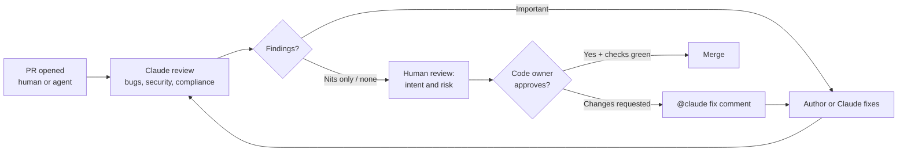
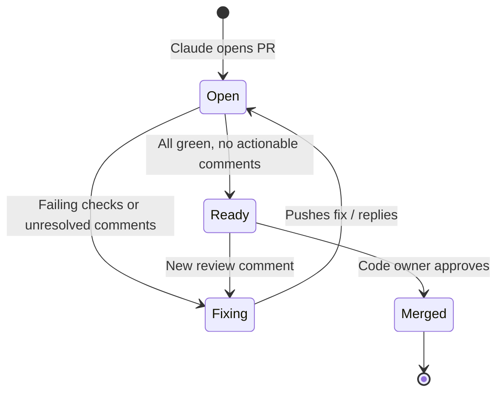

# PR Review Guide

> **Audience:** tech leads, code owners, engineering managers, platform engineers who run CI.
> **Stage:** [Deploy](../01-Stages/05-Deploy-Review-and-Gates.md).
> **Templates:** [../03-Templates/REVIEW.template.md](../03-Templates/REVIEW.template.md), [../03-Templates/ci/claude-pr-review.yml](../03-Templates/ci/claude-pr-review.yml)

---

## 1. Review runs in both directions

When agents write a growing share of code, line-by-line human review becomes the bottleneck. The answer is not to skip review, but to restructure it:

- **Claude reviews incoming PRs** (from humans and from agents), catching logic errors, security issues, and policy violations before a human looks.
- **Claude addresses review comments on its own PRs**, so human reviewers spend their time on judgment rather than on round-trips.
- **Engineers focus on intent and risk**: does this change do what the spec and plan said, and is the risk acceptable?
- **Code-owner approval still gates the merge.** Claude's findings neither approve nor block.

The playbook sums up the boundary: the agent does everything up to the production gate and nothing past it. For review, that means Claude can find, explain, fix, and push, but it has **no approval route**.




### Prerequisites

- A healthy `CLAUDE.md`, policy skills, and subagents (the reviewer is only as good as the context it has).
- Either the managed Code Review service or `claude-code-action` in CI.
- Branch protection requiring code-owner approval.

---

## 2. Managed Code Review vs claude-code-action

There are two ways to get Claude reviewing PRs on GitHub. They are complementary.

| | Managed **Code Review** | **claude-code-action** (GitHub Actions) |
|---|---|---|
| What it is | Anthropic-hosted, multi-agent PR review service | A GitHub Action that runs Claude Code in your workflows |
| Setup | An organization Owner enables it in Claude admin settings, installs the Claude GitHub App, selects repos | Add a workflow file and a secret (or run `/install-github-app`) |
| Where it runs | Anthropic infrastructure | Your GitHub Actions runners |
| Triggers | Per repo: once after PR creation, after every push, or manual (`@claude review`) | Any GitHub event you configure; `@claude` mentions in interactive mode |
| Customization | `CLAUDE.md` (violations flagged as nits) and `REVIEW.md` (review-specific instructions) | Your prompt, skills, `claude_args`, settings |
| Output | Inline comments tagged by severity, plus a neutral "Claude Code Review" check run | Whatever your prompt directs: inline comments, summary, commits |
| Merge blocking | Never blocks (check run is neutral); you can parse its severity counts in your own CI if you want a gate | Up to you (a failing job can be a required check) |
| Fixing code | No; replying to a finding does not make it act. Fix and push, and push-triggered reviews resolve fixed threads | Yes; `@claude` in a comment can make changes and push |
| Availability | Research preview for Team and Enterprise plans at the time of writing; not available with Zero Data Retention (verify current status) | Generally available; works with Claude API, Bedrock, Vertex AI, Foundry |
| Cost | Billed per review on usage credits (the docs cite an average of roughly $15 to $25 per review, scaling with PR size) | Your API usage plus Actions minutes |

**A common pattern:** enable managed Code Review for deep, automatic review of every PR, and add `claude-code-action` in interactive mode so reviewers can say "@claude fix this" in a comment.

---

## 3. Writing REVIEW.md

`REVIEW.md` sits at the repository root and holds review-only instructions. Managed Code Review passes it to the agents that find and verify issues, and consults it when ranking and reporting. For `claude-code-action`, reference it from your review prompt ("Follow REVIEW.md"). Keep general project context in `CLAUDE.md`; keep what should change *review behavior* in `REVIEW.md`.

The tech lead owns it. The template is [../03-Templates/REVIEW.template.md](../03-Templates/REVIEW.template.md).

### 3.1 Structure: tagged passes

Organize the review into explicit passes so each class of issue gets deliberate attention:

```markdown
# Review instructions

Run three passes and tag every finding with its pass.

## Pass 1 [bugs]: correctness and logic
- Incorrect logic, off-by-one, null handling, race conditions, error paths that swallow failures.
- Behavior that contradicts plan.md or the tests.

## Pass 2 [security]: security
- Apply the secure-api-review standard: auth on every endpoint except /health,
  unknown fields rejected, audit events on state changes, no PII in logs or errors.
- Injection, SSRF, path traversal, authorization across tenants.

## Pass 3 [compliance]: conformance to spec, plan, and principles
- Does the diff implement what spec.md and plan.md describe? Flag scope creep and gaps.
- Does it follow CLAUDE.md conventions (e.g. BigDecimal for money, v1 frozen)?

## Severity
- **Important**: breaks behavior, leaks data, or breaches a policy. Must be fixed before merge.
- **Nit**: style, naming, minor readability. Never Important.
- Report at most 5 nits inline; summarize the rest as a count ("plus 7 similar nits").
- If all findings are nits, start the summary with "No blocking issues."

## Evidence
- Every behavior claim needs a file:line citation in the source, not an inference from names.

## Do not report
- Anything CI already enforces (formatting, lint, type errors).
- Generated code under src/gen/ and any *.lock file.
- Test fixtures that intentionally violate production rules.

## Re-reviews
- After the first review, report only Important findings unless asked otherwise.
```

### 3.2 Important vs Nit

The distinction must be crisp, because it determines what humans act on.

| Important | Nit |
|---|---|
| Wrong result for some input | Variable could have a clearer name |
| Unauthenticated route | Comment has a typo |
| PII in a log line | Function could be split |
| Contradicts the accepted plan or spec | Different but equivalent idiom preferred |
| Breaks backward compatibility or rollback | Import ordering |
| Violates a named policy | Anything a formatter would fix |

Managed Code Review also uses a third marker, **Pre-existing**, for bugs it notices that the PR did not introduce. Route those to the backlog rather than the PR author.

### 3.3 Keep it short

A long REVIEW.md dilutes the rules that matter. If it grows past a page, move project facts back into CLAUDE.md and policy into skills.

---

## 4. Enabling review

### 4.1 Managed Code Review

1. An Owner opens Claude Code admin settings and starts Code Review setup.
2. Install the Claude GitHub App on the organization and grant access to the target repositories.
3. Select repositories and choose each repo's **Review Behavior**: once after PR creation, after every push, or manual.
4. Commit `REVIEW.md` to each repo.
5. Open a test PR and confirm a "Claude Code Review" check run appears.
6. Set a monthly spend cap for the Code Review service in usage settings.

### 4.2 claude-code-action review workflow

A minimal automation-mode review job (see [../03-Templates/ci/claude-pr-review.yml](../03-Templates/ci/claude-pr-review.yml) for the full template):

```yaml
name: claude-pr-review
on:
  pull_request:
    types: [opened, synchronize, ready_for_review, reopened]
jobs:
  review:
    if: github.event.pull_request.draft == false
    runs-on: ubuntu-latest
    permissions:
      contents: read
      pull-requests: write
      issues: read
      id-token: write
    steps:
      - uses: actions/checkout@v4
        with: { fetch-depth: 1 }
      - uses: anthropics/claude-code-action@v1
        with:
          anthropic_api_key: ${{ secrets.ANTHROPIC_API_KEY }}
          prompt: |
            Review PR #${{ github.event.pull_request.number }} in ${{ github.repository }}.
            Follow REVIEW.md exactly. Read spec.md and plan.md linked from the PR description.
            Post each Important finding as an inline comment; post nits per REVIEW.md limits;
            finish with a summary comment. Do not approve or request changes.
          claude_args: >-
            --max-turns 30
            --allowedTools "Read,Grep,Glob,Bash(gh pr diff:*),Bash(gh pr view:*),mcp__github_inline_comment__create_inline_comment"
```

Tool names for posting inline comments and the exact `--allowedTools` rule syntax should be verified against the current action documentation; the action only starts its inline-comment MCP server when `--allowedTools` names it.

### 4.3 Interactive `@claude` for fixes

```yaml
name: claude-interactive
on:
  issue_comment:
    types: [created]
  pull_request_review_comment:
    types: [created]
jobs:
  claude:
    if: contains(github.event.comment.body, '@claude')
    runs-on: ubuntu-latest
    permissions:
      contents: write
      pull-requests: write
      issues: write
      id-token: write
      actions: read
    steps:
      - uses: actions/checkout@v4
        with: { fetch-depth: 1 }
      - uses: anthropics/claude-code-action@v1
        with:
          anthropic_api_key: ${{ secrets.ANTHROPIC_API_KEY }}
```

The action checks that the commenter has write access and rejects bot actors unless explicitly allowed, which prevents loops.

---

## 5. Handling `@claude` comments

When a reviewer tags `@claude` on a comment (for example, "@claude this should use `compareTo`, not `equals`; fix it and add a test"), Claude makes the change, pushes to the PR branch, and replies in the thread. The thread becomes the record of the request, the change, and the result.

Guidelines for reviewers:

- Be specific, as with any ticket: say what is wrong and what "fixed" looks like.
- One request per comment keeps the audit trail clean.
- Verify the pushed change like any other commit; CI and the review run again.
- The second time the same kind of comment is needed on different PRs, promote it into CLAUDE.md ("mistake twice", see [CLAUDE-md-Guide.md](CLAUDE-md-Guide.md)).

Note: with managed Code Review alone, replying to a finding does not trigger Claude. Use `@claude review` as a top-level comment to request a fresh review, or `claude-code-action` for fix requests.

---

## 6. Claude babysits its own PRs

When Claude opens a PR (from a session, from CI, or from a maintenance trigger), it should carry that PR to merge-readiness rather than leaving it for a human to shepherd:

1. Sweep unresolved review comments and address each one (fix and push, or reply with reasoning).
2. Watch failing checks; diagnose and fix real failures, and flag suspected flakes with evidence.
3. Repeat until all checks are green and no actionable comments remain.
4. Wait only on the code owner's approval. Never approve, never merge past protection.

How you implement the sweep depends on your tooling: a scheduled `claude-code-action` job that looks for open agent-authored PRs with failing checks or unresolved threads, a session using `/loop` to poll a PR, or cloud features that auto-fix PRs (verify current availability in the Claude Code on the web documentation).



---

## 7. Branch protection and CODEOWNERS

Claude's review is a layer, not the gate. The gate is branch protection.

```text
# .github/CODEOWNERS
*                         @acme/payments-maintainers
/api/                     @acme/payments-api-owners
/CLAUDE.md                @acme/payments-tech-lead
/REVIEW.md                @acme/payments-tech-lead
/.claude/                 @acme/payments-tech-lead @acme/platform-devex
/.github/workflows/       @acme/platform-devex
```

Recommended protection on `main`:

| Setting | Why |
|---|---|
| Require a pull request before merging | No direct pushes by anyone, including agents |
| Require approval from code owners | The human gate |
| Dismiss stale approvals when new commits are pushed | Claude's fix pushes need fresh approval |
| Require status checks (build, tests, evals when config changes) | Deterministic gates |
| Do not allow bypassing for the agent identity | The agent has no approval route |
| Optionally: require conversation resolution | Ensures Important findings are addressed |

If you want Important findings to block, parse the managed Code Review check run output in your own required CI job (the docs describe a machine-readable severity count in the check's details), or have your `claude-code-action` job exit non-zero on Important findings.

---

## 8. Monthly tuning

Review quality degrades without attention: nits creep up, false positives erode trust, and generated code gets reviewed pointlessly. Once a month, the tech lead spends an hour on tuning.

1. **Sample** 20 to 30 recent Claude findings across PRs.
2. **Rate** each: useful Important, useful Nit, wrong, noise. Managed Code Review comments include thumbs up and down reactions; use those counts too.
3. **Act** on patterns:

| Pattern | Action |
|---|---|
| Many nits per PR | Lower the nit cap; move style rules to a formatter |
| Findings on generated code | Add the path to "Do not report" |
| Findings duplicating CI | Add "anything CI enforces" exclusions |
| Same Important finding on multiple PRs | Promote to CLAUDE.md or a skill; consider a hook |
| False positives of one class | Add an evidence requirement for that class |
| Missed issues found later by humans | Add an "Always check" rule |

4. **Commit** REVIEW.md changes via PR, like any configuration.

---

## 9. Metrics

| Metric | Type | Target direction |
|---|---|---|
| Time to first review (PR opened to first review comment) | Leading | Minutes, not hours |
| Share of review comments resolved without a human touching the branch | Leading | Rising |
| Human review time per PR | Lagging | Falling |
| Pre-merge defects caught vs production escapes | Lagging | More caught pre-merge, fewer escapes |
| Nit-to-Important ratio | Hygiene | Stable and low |
| Finding usefulness rate from monthly tuning | Hygiene | Rising |

## 10. Checklist

- [ ] Managed Code Review enabled or claude-code-action review workflow in place
- [ ] REVIEW.md with tagged passes, Important vs Nit, nit cap, skip rules
- [ ] Interactive `@claude` workflow for fix requests
- [ ] Agent-authored PRs are babysat to green
- [ ] Branch protection with code-owner approval; no bypass for agent identity
- [ ] CODEOWNERS covers CLAUDE.md, REVIEW.md, `.claude/`, workflows
- [ ] Monthly tuning on the calendar

## Related

- [CLAUDE-md-Guide.md](CLAUDE-md-Guide.md)
- [Skills-Guide.md](Skills-Guide.md)
- [CI-CD-Integration-Guide.md](CI-CD-Integration-Guide.md)
- [Source-of-Truth-and-Legacy-Systems.md](Source-of-Truth-and-Legacy-Systems.md): linking PRs to records
- [../01-Stages/05-Deploy-Review-and-Gates.md](../01-Stages/05-Deploy-Review-and-Gates.md)

---

*Based on concepts from Anthropic's AI-Native SDLC Playbook; expanded guidance for implementation. Verify configuration keys against current Claude Code documentation.*
