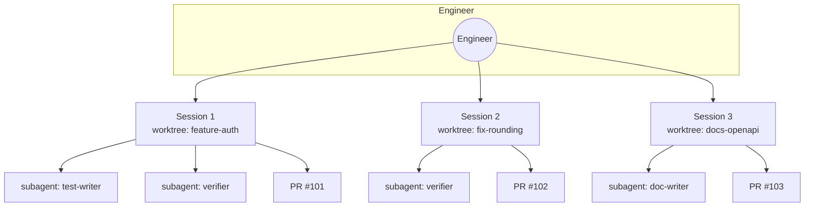
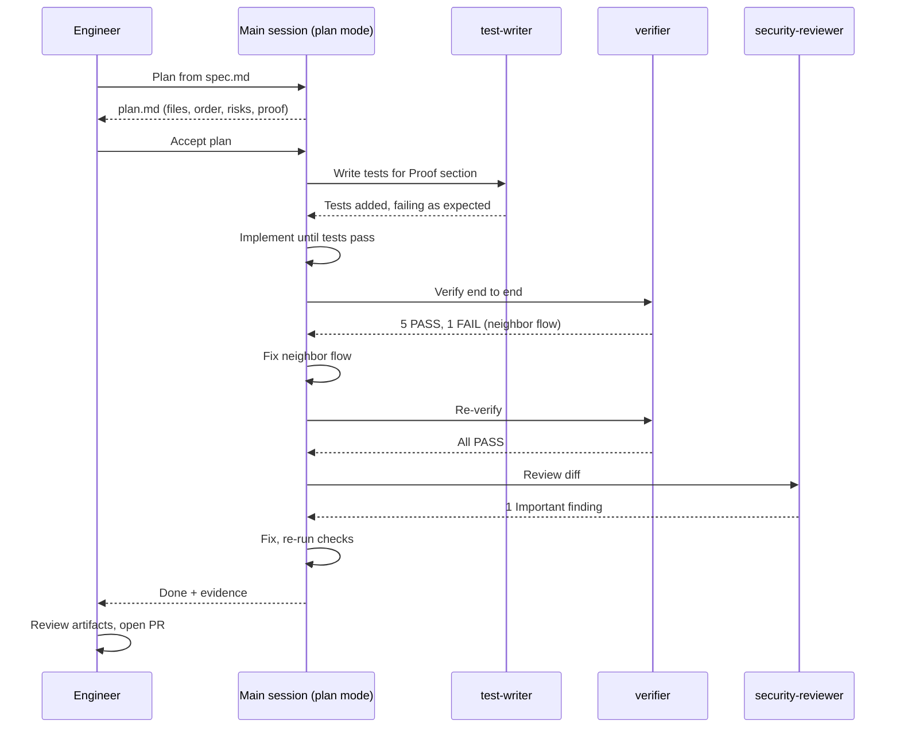

# Parallel Sessions and Subagents

> **Audience:** engineers adopting Claude Code beyond a single session, tech leads, platform engineers.
> **Stage:** [Build](../01-Stages/03-Build-Plan-Mode.md), with verification helpers used in [Test](../01-Stages/04-Test-Feedback-Loops-and-Evals.md).
> **Template:** [../03-Templates/agents/verifier.md](../03-Templates/agents/verifier.md)

---

## 1. Two different ways to multiply work

Once CLAUDE.md, skills, and hooks are in place, a single engineer can supervise more than one stream of agent work. There are two distinct mechanisms, and they solve different problems.

| | Parallel sessions | Subagents |
|---|---|---|
| What it is | Several independent Claude Code instances, each in its own git worktree, steered by one engineer | Scoped helpers spawned *inside* one session, each with its own context window and tool limits |
| Unit of work | A whole change (feature, bug fix, refactor) | A sub-task (verify, write tests, review, research) |
| Isolation | Separate checkout and branch per session | Separate context; shares the session's working tree unless configured with worktree isolation |
| Human interaction | Engineer switches between sessions | The main session delegates and receives a summary |
| Defined in | Nothing to define; started from the CLI | Markdown files in `.claude/agents/` |
| Main benefit | Throughput: more changes in flight | Focus: keeps the main context clean and applies specialist constraints |



Both mechanisms depend on the same foundation: the controls come from **repository configuration** (hooks, permissions, CLAUDE.md, managed settings), not from the engineer watching every action. If you do not trust a single unattended session yet, running three of them in parallel will not help.

---

## 2. Parallel sessions with git worktrees

### 2.1 Why worktrees

Two Claude sessions editing the same checkout will collide: one session's half-finished edit breaks the other's build. A [git worktree](https://git-scm.com/docs/git-worktree) is a separate working directory on its own branch that shares the repository's object store. Each session gets its own files, branch, and build output, while commits still land in the same repository.

### 2.2 Starting a session in a worktree

Claude Code can create the worktree for you:

```bash
# Terminal 1
claude --worktree feature-auth

# Terminal 2
claude --worktree fix-rounding

# Terminal 3
claude --worktree docs-openapi
```

Each command creates an isolated worktree and branch for that name and starts a session inside it. The repository needs at least one commit. Details such as where worktrees are created, cleanup behavior, and the `.worktreeinclude` file (for copying untracked files like local env templates into new worktrees) are described in the [worktrees documentation](https://code.claude.com/docs/en/worktrees); verify against current docs.

You can also manage worktrees yourself:

```bash
git worktree add ../payments-feature-auth -b feature/auth
cd ../payments-feature-auth && claude
# later
git worktree remove ../payments-feature-auth
```

### 2.3 Splitting work so sessions do not collide

Worktrees prevent file-level collisions in the working tree, but they do not prevent **merge** collisions. Split work so each session owns a distinct set of files.

| Good split | Why it works |
|---|---|
| Session per feature in different modules (`billing/`, `notifications/`) | Disjoint files |
| One session implements, one writes docs for a *previous* merged change | No overlap in time or files |
| One session per independent bug in different services | Disjoint files and tests |

| Risky split | Why it hurts |
|---|---|
| Two sessions both "improving" the same service | Overlapping edits, painful rebases |
| A refactor session running alongside feature sessions in the same area | The refactor invalidates everyone else's work |
| Two sessions both regenerating shared generated code or lockfiles | Guaranteed conflicts |

A practical technique is to write the split into the plan: each `plan.md` lists **Files that change**. Before starting a parallel session, compare its file list with the others in flight. Overlap means sequence the work instead.

### 2.4 Start with two or three

The playbook's advice is to begin with **two to three concurrent sessions**. The limit is not the machine; it is the engineer's ability to review artifacts at the quality the change deserves. More sessions produce more PRs, and every PR still needs a meaningful review.

A sustainable rhythm:

1. Start session A in plan mode, iterate on the plan, accept it, let it implement.
2. While A implements, start session B in plan mode on a different change.
3. Return to A when it reports done: read the verification output, review the diff, open the PR.
4. Continue with B; start C only if A and B are both in low-attention phases.

```mermaid
gantt
    title One engineer, three sessions (illustrative)
    dateFormat HH:mm
    axisFormat %H:%M
    section Session A
    Plan (engineer attentive)     :a1, 09:00, 20m
    Implement (autonomous)        :a2, after a1, 40m
    Review + PR                   :a3, after a2, 15m
    section Session B
    Plan                          :b1, 09:20, 20m
    Implement                     :b2, after b1, 45m
    Review + PR                   :b3, after b2, 15m
    section Session C
    Plan                          :c1, 09:45, 15m
    Implement                     :c2, after c1, 30m
    Review + PR                   :c3, after c2, 10m
```



### 2.5 Metrics for parallel sessions

| Metric | Why |
|---|---|
| Concurrent sessions per engineer **at maintained review quality** | The goal is not maximum sessions; it is maximum sessions without quality loss |
| Changes merged per engineer per week, read **alongside rework rate** | Throughput without rework data rewards sloppy merges |
| Share of changes merged on first implementation pass | Tells you whether plans are good enough to run unattended |

---

## 3. Subagents

### 3.1 What a subagent is

A subagent is a specialist that the main session can delegate to. It runs in its **own context window**, with its **own system prompt** and, crucially, **its own tool limits**. When it finishes, only its summary returns to the main session. This has two benefits:

- **Context hygiene.** Reading forty files to verify a change fills the verifier's context, not yours.
- **Least privilege.** A reviewer subagent can be given `Read, Grep, Glob` only, so it cannot "helpfully" fix things it was asked to review.

### 3.2 Where subagent files live

| Location | Scope |
|---|---|
| Managed settings | Organization-wide (highest priority) |
| `--agents` CLI flag | Current session only |
| `.claude/agents/` | This project (commit it) |
| `~/.claude/agents/` | All your projects |
| A plugin's `agents/` directory | Wherever the plugin is enabled |

### 3.3 File format

A subagent is a Markdown file with YAML frontmatter; the body is the subagent's system prompt.

```markdown
---
name: verifier
description: Verifies a completed change by running the app and exercising the changed behavior plus neighboring flows. Use after implementation, before opening a PR.
tools: Bash, Read, Grep, Glob
model: inherit
---

You are the verifier. You never modify code. ...
```

Frontmatter fields verified against the current subagents documentation:

| Field | Required | Meaning |
|---|---|---|
| `name` | Yes | Unique identifier |
| `description` | Yes | When the main session should delegate to this subagent; write it as a trigger |
| `tools` | No | Allowlist of tools. **If omitted, the subagent inherits the main session's tools**, which is usually not what you want for a reviewer |
| `disallowedTools` | No | Denylist removed from the inherited set |
| `model` | No | `sonnet`, `opus`, `haiku`, a full model ID, or `inherit` |
| `permissionMode` | No | For example `default`, `acceptEdits`, `plan` |
| `maxTurns` | No | Cap on agentic turns |
| `skills` | No | Skills to preload |
| `mcpServers` | No | MCP servers available to this subagent |
| `hooks` | No | Lifecycle hooks scoped to the subagent |
| `isolation` | No | `worktree` to run in its own git worktree |
| `color` | No | Display color |

Other fields exist (memory, background, effort); see the docs.

### 3.4 Invoking subagents

- **Automatically:** the main session delegates when a task matches the description.
- **By name in natural language:** "Use the verifier subagent to check this change."
- **Guaranteed:** @-mention, for example `@agent-verifier check the refund flow`.
- **As the main session:** `claude --agent verifier`.

Subagents can themselves spawn subagents up to a small depth limit by default; you can lower it with the `CLAUDE_CODE_MAX_SUBAGENT_SPAWN_DEPTH` environment variable (verify against current docs).

---

## 4. Four example subagents

### 4.1 `verifier`: run it, exercise it, report, do not fix

This is the playbook's example and the template at [../03-Templates/agents/verifier.md](../03-Templates/agents/verifier.md).

```markdown
---
name: verifier
description: >
  Verify a completed change end to end. Use after implementation and before a PR:
  start the app, exercise the changed behavior and two neighboring flows, and report.
tools: Bash, Read
---

You are the verifier. Your job is to find out whether the change works, not to make it work.

1. Read plan.md to learn what changed and what "Proof" it requires.
2. Start the application with `make run` and wait for the health check to pass.
3. Exercise the changed behavior exactly as a user or client would (curl, CLI, or UI script).
4. Exercise two neighboring flows that share code or data with the change.
5. Stop the application.
6. Report: for each check, the command you ran, the observed result, and PASS or FAIL.
   Include the relevant log lines for any failure.

Rules:
- Never edit, create, or delete files. If something is broken, report it; do not fix it.
- Never run deploy, push, or migration commands.
- If the app will not start, report the startup error and stop.
```

Why only `Bash, Read`: the verifier needs to run the app and read logs, but has no `Edit` or `Write`, so it physically cannot "fix" what it finds. The instruction "do not fix" is backed by the tool list.

### 4.2 `test-writer`: tests first, no production edits

```markdown
---
name: test-writer
description: >
  Write missing or failing-first tests for a described behavior or bug.
  Use when a plan's Proof section needs tests, or before a bug fix to capture
  the bug as a failing test.
tools: Read, Grep, Glob, Edit, Write, Bash
---

You write tests. You do not change production code.

1. Read plan.md (Proof section) or the bug description.
2. Find the existing tests for the area and match their framework, style, and fixtures.
3. For a bug: write one test that reproduces it. Run it and confirm it FAILS for the
   reason described. Report the failure output.
4. For a feature: write tests for each behavior listed in Proof, including one error case.
5. Only create or edit files under test directories (`src/test/`, `tests/`, `*.test.ts`,
   `*_test.py`). If you believe production code must change to be testable, report
   that instead of changing it.
6. Report the files you added and the command to run them.
```

To make rule 5 deterministic, attach a `PreToolUse` hook in the subagent's frontmatter (`hooks`) or in project settings that blocks `Edit|Write` outside test paths when `agent_type` is `test-writer`. The hook payload includes `agent_type` for exactly this purpose.

### 4.3 `doc-writer`: keep docs in step with code

```markdown
---
name: doc-writer
description: >
  Update documentation to match a code change: README, OpenAPI descriptions,
  runbooks, CHANGELOG, and CLAUDE.md statements the change made outdated.
tools: Read, Grep, Glob, Edit, Write
model: haiku
---

You update documentation only.

1. Read the diff (`git diff main...HEAD` output provided by the caller) and plan.md.
2. Update only Markdown, OpenAPI description fields, and docstrings that describe
   changed behavior. Do not touch code logic.
3. If a CLAUDE.md statement is now wrong, propose the corrected line in your report
   rather than editing CLAUDE.md (it is code-owned).
4. Add a CHANGELOG entry under "Unreleased" in the existing format.
5. Report each file changed and a one-line reason.
```

A smaller model is often sufficient for documentation tasks and reduces cost; evaluate before standardizing.

### 4.4 `security-reviewer`: read-only, cites policy

```markdown
---
name: security-reviewer
description: >
  Review a diff for security issues against the secure API standard and common
  vulnerability classes. Use before opening a PR that touches endpoints, auth,
  data access, serialization, or dependencies.
tools: Read, Grep, Glob
skills: secure-api-review
---

You are a security reviewer. You never modify files.

Review the change for:
1. The secure-api-review standard (auth on every endpoint except /health, schema validation
   rejecting unknown fields, audit events on state changes, no PII in logs or errors).
2. Injection (SQL, command, template), SSRF, path traversal, insecure deserialization.
3. Authorization: can a caller act on another tenant's or user's data?
4. Secrets or credentials in code, config, or tests.

For each finding give: file:line, the vulnerability class, why it is exploitable
(cite the code, do not infer from names), severity (Important or Nit), and a suggested fix.
If you find nothing, say so explicitly and list what you checked.
```

Note the `skills` field preloads the policy skill, so the reviewer applies the same standard the author was supposed to follow.

---

## 5. Putting them together in one session

A typical flow for a feature in session A:



---

## 6. Governance

| Concern | Control |
|---|---|
| What sessions and subagents can do | Repository and managed configuration: permissions, hooks, sandbox. Not the engineer's attention |
| Least privilege for subagents | Always set `tools` explicitly for reviewers and verifiers |
| Consistency across teams | Commit `.claude/agents/` to the repo, or distribute org-standard subagents via a plugin |
| Blocking ad-hoc subagents | `disableSideloadFlags` rejects `--agents`; `strictPluginOnlyCustomization` can restrict agents to plugins and managed sources (see [Managed-Settings-Guide.md](Managed-Settings-Guide.md)) |
| Attribution | Sessions are logged and attributed to the steering engineer. Commits and PRs carry the engineer's identity; the engineer is accountable for what merges |
| Review of subagent definitions | `.claude/agents/**` under `CODEOWNERS` |
| Change safety | Changes to subagent files trigger the eval suite ([Evals-Guide.md](Evals-Guide.md)) |

## 7. Common pitfalls

| Pitfall | Fix |
|---|---|
| Omitting `tools` on a reviewer, which then edits code | Explicit read-only tool list |
| Vague `description`, so the subagent is never used | Write the description as a trigger: "Use after implementation..." |
| Too many sessions, shallow reviews | Cap at two or three until review quality metrics hold |
| Parallel sessions touching the same files | Compare `plan.md` file lists before starting |
| Subagent prompts that duplicate CLAUDE.md | Subagents load CLAUDE.md by default; keep their prompts about their role |
| Verifier that "fixes" things | Remove Edit/Write; the verifier reports, the main session fixes |

## Related

- [Hooks-Guide.md](Hooks-Guide.md)
- [CLAUDE-md-Guide.md](CLAUDE-md-Guide.md)
- [Evals-Guide.md](Evals-Guide.md)
- [../03-Templates/plan.template.md](../03-Templates/plan.template.md)

---

*Based on concepts from Anthropic's AI-Native SDLC Playbook; expanded guidance for implementation. Verify configuration keys against current Claude Code documentation.*
