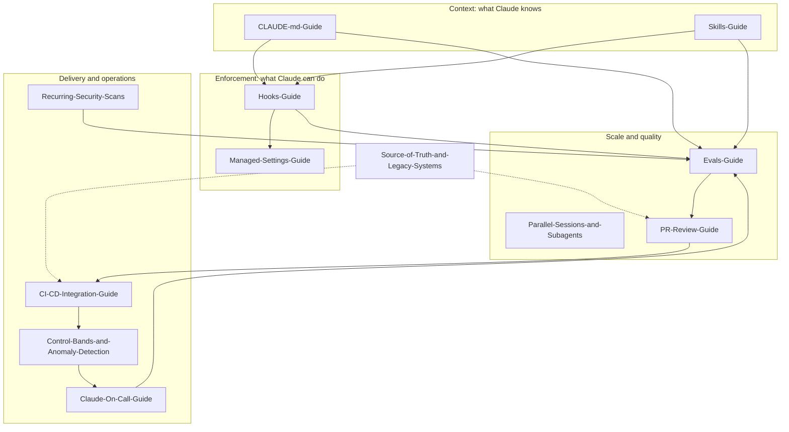

# 02 - Guides

The stage documents in [../01-Stages/](../01-Stages/01-Plan-Intent.md) explain *what* happens at each point in the AI-native SDLC loop. The guides in this folder explain *how* to build the mechanisms those stages depend on: the files, settings, scripts, pipelines, and operating routines that turn the playbook into something a team can actually run.

Each guide is self-contained, links to the relevant stage documents and templates, and ends with a checklist. Where a guide shows Claude Code configuration (settings keys, hook payloads, skill and subagent frontmatter, GitHub Actions inputs), the syntax was checked against the Claude Code documentation at the time of writing. Anything that could not be confirmed is marked "verify against current docs". Products described as beta or research preview may change.

---

## How the guides fit together

---

## The guides

### [CLAUDE-md-Guide.md](CLAUDE-md-Guide.md)
How to write and maintain the project instruction file that every Claude Code session reads. Covers the file hierarchy (managed, user, project, local, subdirectory, and `.claude/rules/`), starting from `/init`, what to include and leave out, the one-page rule, the "mistake twice" rule for growing the common-mistakes list, the verification block that defines "done", ownership and review, and full one-page examples for a Java/Spring payments service, a TypeScript/React customer portal, and a Python/FastAPI API. Ends with the anti-patterns that make CLAUDE.md files bloated or ineffective.

### [Skills-Guide.md](Skills-Guide.md)
How to turn inconsistently enforced institutional knowledge into versioned, centrally updated skills. Includes a decision table for choosing between a skill, CLAUDE.md, a prompt, and a hook; the anatomy of `SKILL.md` and its verified frontmatter fields; writing descriptions that trigger reliably; bundling deterministic scripts; testing triggering; distribution through plugins and a private marketplace; the policy-owner lifecycle; and three complete example skills (`secure-api-review`, `intent-writer`, `brand-ux-review`).

### [Hooks-Guide.md](Hooks-Guide.md)
How to enforce rules deterministically at the moment of action. Explains hook events, matchers, the JSON each hook receives on stdin, exit codes (0 allows, 2 blocks and sends stderr to Claude), and JSON decision output. Provides build-time guardrails (formatter on the changed file, protected paths, secret detection, test protection during bug fixes) and approval gates (production deploy gate, "ask" gates), all in both Bash and PowerShell, plus performance tips and a local testing approach.

### [Parallel-Sessions-and-Subagents.md](Parallel-Sessions-and-Subagents.md)
How one engineer supervises more than one stream of agent work. Covers parallel sessions in separate git worktrees (`claude --worktree`), splitting work by files to avoid collisions, starting with two or three sessions, and subagents defined in `.claude/agents/` with their frontmatter. Includes four example subagents (verifier, test-writer, doc-writer, security-reviewer) with least-privilege tool lists, and the governance that keeps this safe.

### [Evals-Guide.md](Evals-Guide.md)
How to regression-test agent configuration the way you regression-test code. Explains why CLAUDE.md, skills, hooks, prompts, and model changes need evals; how to build an initial suite of 20 to 50 real tasks; an eval JSON schema; runner and check scripts; CI gating on pass rate with critical subsets; the incident-to-eval loop; cost budgeting; and how to handle flaky evals without hiding regressions.

### [PR-Review-Guide.md](PR-Review-Guide.md)
How review runs in both directions: Claude reviews incoming PRs and addresses comments on its own PRs, while code owners keep the approval. Compares the managed Code Review service with `claude-code-action`, shows how to write `REVIEW.md` with tagged passes and an Important-vs-Nit severity model, how `@claude` fix requests work, how Claude babysits its own PRs to green, branch protection and CODEOWNERS, monthly tuning, and review metrics.

### [Managed-Settings-Guide.md](Managed-Settings-Guide.md)
How a regulated enterprise enforces policy that developers and repositories cannot override. Covers settings precedence, delivery mechanisms and file locations per OS (MDM, registry, system files, admin console), every control from the playbook with its rationale (deny and allow rules, bypass lockout, managed-only permission rules, OS sandbox with domain allowlist and fail-closed startup, credential protection, managed hooks only, marketplace lockdown, sideload blocking, managed MCP, minimum version), a full example `managed-settings.json`, a ring-based rollout plan, and a verification checklist.

### [CI-CD-Integration-Guide.md](CI-CD-Integration-Guide.md)
How to put Claude into the delivery pipeline without letting it past the production gate. Covers headless `claude -p`, the adoption sequence (read-only judgment first, then writes as PRs, then environment actions), sandboxing CI jobs, short-lived scoped tokens, agent identity, exposing deploy/status/rollback as environment-scoped MCP tools, autonomy tiers by environment, rehearsed one-command rollback, DORA metrics, and working examples for GitHub Actions and GitLab CI.

### [Control-Bands-and-Anomaly-Detection.md](Control-Bands-and-Anomaly-Detection.md)
How production signals re-enter the loop automatically. Introduces statistical process control, rolling mean and standard deviation, and all four Western Electric rules with charts; maps them to 1σ/2σ/3σ response tiers (log, read-only diagnosis, propose action through gates); shows a versioned `bands.yaml`; explains how to design a deterministic, unit-tested detector with no model in the detection path; the trigger layer; the `intent.md` output; and triage decisions that tune the bands.

### [Recurring-Security-Scans.md](Recurring-Security-Scans.md)
Why point-in-time security reviews drift and how to replace them with scheduled scanning whose findings flow through normal gates. Describes Claude Security as the playbook presents it (hosted, Claude Enterprise, public beta), setup and scheduling, triage by confidence with logged dismissal reasons, routing bounded findings to reviewed patches and wide findings to `intent.md`, exporting to existing trackers, vulnerability-class evals, and security metrics.

### [Claude-On-Call-Guide.md](Claude-On-Call-Guide.md)
How Claude acts as a first responder in an incident channel (Claude Tag in Slack, public beta per the playbook). Explains why the channel is the shared workspace and audit trail, which MCP connections to observability and operations to provide, how post-mortems become versioned lessons in a `lessons/` folder that future investigations read, how small fixes become PRs and large ones become intents, and provides a complete runbook written for both humans and Claude.

### [Source-of-Truth-and-Legacy-Systems.md](Source-of-Truth-and-Legacy-Systems.md)
How to coexist with Jira, ServiceNow, and similar tools without two competing originals. Explains the "one authoritative system per artifact" rule, the repo-authoritative and legacy-authoritative options, the minimum bidirectional linkage (record ID in artifacts, commit SHA in records), commit message conventions and how to enforce them, sync automation options, and a decision table.

---

## Which guide do I need?

| Role | Start with | Then read | Why |
|---|---|---|---|
| **Engineer** (individual contributor) | [CLAUDE-md-Guide](CLAUDE-md-Guide.md) | [Parallel-Sessions-and-Subagents](Parallel-Sessions-and-Subagents.md), [PR-Review-Guide](PR-Review-Guide.md) | Day-to-day effectiveness and how your work is reviewed |
| **Tech lead** | [CLAUDE-md-Guide](CLAUDE-md-Guide.md), [PR-Review-Guide](PR-Review-Guide.md) | [Skills-Guide](Skills-Guide.md), [Evals-Guide](Evals-Guide.md), [Parallel-Sessions-and-Subagents](Parallel-Sessions-and-Subagents.md) | You own CLAUDE.md and REVIEW.md and the quality bar |
| **Platform / DevEx engineer** | [Hooks-Guide](Hooks-Guide.md), [Evals-Guide](Evals-Guide.md) | [Managed-Settings-Guide](Managed-Settings-Guide.md), [CI-CD-Integration-Guide](CI-CD-Integration-Guide.md), [Skills-Guide](Skills-Guide.md) | You build the guardrails, the eval suite, and the pipelines |
| **Security engineer / AppSec lead** | [Managed-Settings-Guide](Managed-Settings-Guide.md), [Recurring-Security-Scans](Recurring-Security-Scans.md) | [Hooks-Guide](Hooks-Guide.md), [Skills-Guide](Skills-Guide.md) (secure-api-review), [PR-Review-Guide](PR-Review-Guide.md) | Policy enforcement, scanning, and security review |
| **Policy owner** (security, compliance, brand, UX) | [Skills-Guide](Skills-Guide.md) | [Hooks-Guide](Hooks-Guide.md) sections 1 and 7 | You own the words in a skill and sign off changes |
| **SRE / on-call lead** | [Claude-On-Call-Guide](Claude-On-Call-Guide.md), [Control-Bands-and-Anomaly-Detection](Control-Bands-and-Anomaly-Detection.md) | [CI-CD-Integration-Guide](CI-CD-Integration-Guide.md) (rollback, autonomy tiers) | Detection, first response, and closing the loop |
| **Release / change manager** | [CI-CD-Integration-Guide](CI-CD-Integration-Guide.md) | [Hooks-Guide](Hooks-Guide.md) (approval gates), [Source-of-Truth-and-Legacy-Systems](Source-of-Truth-and-Legacy-Systems.md) | Gates that must survive, and the audit trail |
| **IT / endpoint management** | [Managed-Settings-Guide](Managed-Settings-Guide.md) | [Hooks-Guide](Hooks-Guide.md) section 10 | Delivering and verifying policy on every machine |
| **Product owner / product ops** | [Source-of-Truth-and-Legacy-Systems](Source-of-Truth-and-Legacy-Systems.md) | [Skills-Guide](Skills-Guide.md) (intent-writer), [../01-Stages/01-Plan-Intent.md](../01-Stages/01-Plan-Intent.md) | Where requirements live and how intents are written |
| **Engineering manager / director** | This README, [Evals-Guide](Evals-Guide.md) section 10, [CI-CD-Integration-Guide](CI-CD-Integration-Guide.md) section 12 | [Control-Bands-and-Anomaly-Detection](Control-Bands-and-Anomaly-Detection.md), [PR-Review-Guide](PR-Review-Guide.md) section 9 | Metrics, adoption order, and risk posture |
| **Compliance / audit** | [Managed-Settings-Guide](Managed-Settings-Guide.md), [Source-of-Truth-and-Legacy-Systems](Source-of-Truth-and-Legacy-Systems.md) | [PR-Review-Guide](PR-Review-Guide.md) section 7, [../04-Governance/Controls-Matrix.md](../04-Governance/Controls-Matrix.md) | Evidence that controls hold |

---

## Suggested reading order for an adoption program

The playbook's resources are listed in a rough adoption order, and these guides follow the same logic: context first, then enforcement, then scale, then automation.

1. **Foundation:** [CLAUDE-md-Guide](CLAUDE-md-Guide.md), [Managed-Settings-Guide](Managed-Settings-Guide.md) (baseline policy), [Hooks-Guide](Hooks-Guide.md) (build-time guardrails).
2. **Policy as skills:** [Skills-Guide](Skills-Guide.md).
3. **Quality at scale:** [Evals-Guide](Evals-Guide.md), [PR-Review-Guide](PR-Review-Guide.md), [Parallel-Sessions-and-Subagents](Parallel-Sessions-and-Subagents.md).
4. **Pipeline:** [CI-CD-Integration-Guide](CI-CD-Integration-Guide.md), [Source-of-Truth-and-Legacy-Systems](Source-of-Truth-and-Legacy-Systems.md).
5. **Close the loop:** [Control-Bands-and-Anomaly-Detection](Control-Bands-and-Anomaly-Detection.md), [Recurring-Security-Scans](Recurring-Security-Scans.md), [Claude-On-Call-Guide](Claude-On-Call-Guide.md).

## Templates referenced by these guides

| Template | Used in |
|---|---|
| [CLAUDE.template.md](../03-Templates/CLAUDE.template.md) | CLAUDE-md-Guide |
| [REVIEW.template.md](../03-Templates/REVIEW.template.md) | PR-Review-Guide |
| [intent.template.md](../03-Templates/intent.template.md), [spec.template.md](../03-Templates/spec.template.md), [plan.template.md](../03-Templates/plan.template.md) | Skills-Guide, Control-Bands, Source-of-Truth |
| [skills/secure-api-review/SKILL.md](../03-Templates/skills/secure-api-review/SKILL.md) | Skills-Guide |
| [agents/verifier.md](../03-Templates/agents/verifier.md) | Parallel-Sessions-and-Subagents |
| [settings/project-settings.json](../03-Templates/settings/project-settings.json), [settings/managed-settings.json](../03-Templates/settings/managed-settings.json) | Hooks-Guide, Managed-Settings-Guide |
| [hooks/production-gate.sh](../03-Templates/hooks/production-gate.sh), [hooks/protect-tests.sh](../03-Templates/hooks/protect-tests.sh), [hooks/protect-paths.sh](../03-Templates/hooks/protect-paths.sh) | Hooks-Guide |
| [ci/agent-evals.yml](../03-Templates/ci/agent-evals.yml), [ci/claude-pr-review.yml](../03-Templates/ci/claude-pr-review.yml), [ci/triage-on-failure.yml](../03-Templates/ci/triage-on-failure.yml) | Evals-Guide, PR-Review-Guide, CI-CD-Integration-Guide |
| [evals/example-eval.json](../03-Templates/evals/example-eval.json), [evals/check.sh](../03-Templates/evals/check.sh) | Evals-Guide |
| [monitoring/bands.yaml](../03-Templates/monitoring/bands.yaml), [monitoring/detect_anomaly.py](../03-Templates/monitoring/detect_anomaly.py) | Control-Bands-and-Anomaly-Detection |

---

*Based on concepts from Anthropic's AI-Native SDLC Playbook; expanded guidance for implementation. Verify configuration keys against current Claude Code documentation.*
