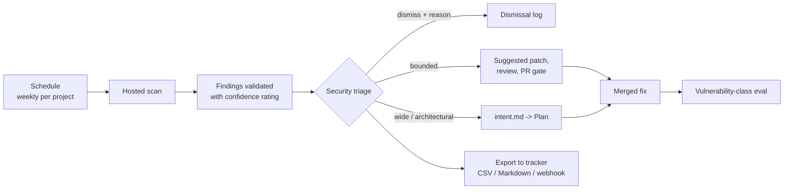
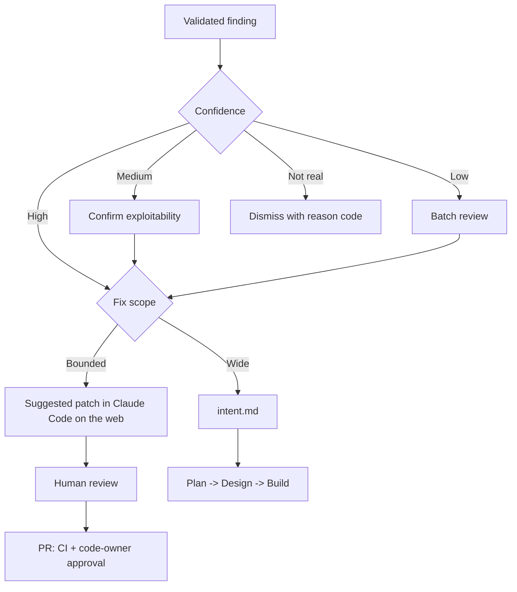

# Recurring Security Scans

> **Audience:** application security leads, security engineers, platform teams, engineering managers responsible for remediation SLAs.
> **Stage:** [Maintain](../01-Stages/06-Maintain-Close-the-Loop.md), with findings routed through [Deploy](../01-Stages/05-Deploy-Review-and-Gates.md) gates and back into [Plan](../01-Stages/01-Plan-Intent.md).
> **Related templates:** [../03-Templates/intent.template.md](../03-Templates/intent.template.md), [../03-Templates/evals/example-eval.json](../03-Templates/evals/example-eval.json)

---

## 1. Why point-in-time scans drift

A security review or penetration test tells you about the codebase **on the day it ran**. The day after, it starts going stale:

- **Code changes.** With agents multiplying output, the volume of new code between annual or quarterly reviews is far larger than security teams sized for human output can absorb.
- **Dependencies change.** New versions and transitive dependencies arrive continuously.
- **Knowledge changes.** New vulnerability classes and exploitation techniques are published; code that was considered safe becomes known-unsafe.
- **Models change.** The capability of the tools doing the scanning improves, so a rescan of unchanged code can find issues a previous scan missed.

The AI-native answer is to treat scanning as a **recurring, scheduled process with no human in the trigger path**, whose findings flow through the **same gates** as any other change: PR review for bounded fixes and `intent.md` for anything larger. The security team's job shifts from running scans to owning the schedule, triaging findings, and tuning.



---

## 2. Claude Security

The playbook describes **Claude Security** as a hosted scanning capability for **Claude Enterprise**, in **public beta** at the time the playbook was written. The characteristics it describes:

- You connect GitHub repositories.
- Scans run on Anthropic infrastructure, not on your runners.
- Findings are **validated before they are reported** and come with a **confidence rating**.
- Scans can run on a schedule per project, scoped to a directory or branch.
- Findings can be exported (CSV, Markdown, or webhook) to your existing tracker.
- A bounded finding can be opened as a suggested patch in Claude Code on the web.

Because this is a beta product, **verify the current feature set, plan availability, setup steps, and data-handling terms against Anthropic's current documentation** before you plan a rollout. This guide describes the operating model around it; the operating model applies equally if you use another scanner.

### 2.1 Prerequisites and infrastructure

| Requirement | Notes |
|---|---|
| Claude Enterprise plan | Per the playbook; verify current eligibility |
| Anthropic GitHub App installed on the target repositories | The same Claude GitHub App used by other GitHub integrations; review its permission set with your GitHub admins |
| Claude Code on the web enabled for the organization | Used to open and work on suggested patches |
| Extra usage enabled, **with a spend limit** | Scans consume usage; set the cap before the first baseline scan |
| An admin enables the feature | Organization Owner or equivalent |

### 2.2 Setup steps

1. **Enable** the feature as an organization admin, confirm extra usage and set a spend limit.
2. **Install or confirm the GitHub App** on the repositories to be scanned.
3. **Connect repositories**, organized by repository, service, and owning team, so findings route to the right people.
4. **Run a baseline full scan of critical repositories first** (payment, identity, customer-data services). Expect the first scan to produce the most findings.
5. **Set a per-project schedule.** Weekly is a typical default. Scope large monorepos by directory or branch so each scan is meaningful and affordable.
6. **Configure export** to your tracker (Jira, ServiceNow, GitHub Issues, a SIEM) by CSV, Markdown, or webhook.
7. **Publish the triage process** (section 4) and remediation SLAs.

---

## 3. Scheduling strategy

| Repository class | Schedule | Scope |
|---|---|---|
| Critical (payments, auth, PII) | Weekly, plus after major releases | Full repo, default branch |
| Standard services | Weekly or biweekly | Default branch |
| Large monorepo | Weekly per high-risk directory; monthly full | Directory-scoped |
| Internal tools, low exposure | Monthly | Default branch |
| Archived / frozen | Quarterly or on demand | Default branch |

Tips:

- Stagger schedules so findings do not arrive for every team on the same morning.
- Align scans with the team's triage rhythm (for example, scan Sunday night, triage Monday).
- Rescan after major framework or dependency upgrades.
- Track **share of repositories on a schedule** as a coverage metric; unscheduled repos are blind spots.

---

## 4. Triage with confidence

Each validated finding carries a confidence rating. Use it to decide how much human attention a finding needs, not whether it deserves attention at all.

| Confidence | Default handling |
|---|---|
| High | Triage within the SLA for its severity; usually fix |
| Medium | Security engineer confirms exploitability before assigning |
| Low | Batch review; dismiss with reason or promote |

### 4.1 Dismiss with a logged reason

Every dismissal records **why**, in a structured field, so dismissals can be audited and used for tuning:

| Reason code | Example |
|---|---|
| `false_positive` | The input is validated upstream in the gateway (cite the code) |
| `not_reachable` | Dead code path; scheduled for deletion |
| `accepted_risk` | Risk accepted by named owner until a date |
| `mitigated_elsewhere` | WAF rule or network policy prevents exploitation (cite control ID) |
| `duplicate` | Same root cause as another finding |

A dismissal without a reason is not a dismissal; it is an unowned open finding.

### 4.2 Bounded vs wide findings

The most important triage decision is not severity; it is **scope**.

| | Bounded finding | Wide / architectural finding |
|---|---|---|
| Definition | Fix is local: one function, one endpoint, one config value | Fix spans many services, requires design change, or changes a contract |
| Example | Missing authorization check on one route; SQL built by string concatenation in one repository method | Tenant isolation relies on client-supplied IDs across the platform; secrets management pattern is unsafe everywhere |
| Route | Open the **suggested patch** in Claude Code on the web, review it, and submit through the normal **PR gate** (code-owner approval, CI, review) | Write an **intent.md** and send it through Plan and Design like any significant change |
| Owner | The owning team's engineer | Product owner plus tech lead, with security as policy owner |



The suggested patch is a starting point, not an approval. It goes through exactly the same review and branch protection as any other change, and the security-reviewer subagent or the managed Code Review can be used on the PR (see [PR-Review-Guide.md](PR-Review-Guide.md)).

---

## 5. Exporting to existing trackers

Most organizations already have a system of record for vulnerabilities (Jira, ServiceNow, a GRC tool, or a SIEM). Do not create a parallel one. Decide which system is authoritative for findings, and link the others. See [Source-of-Truth-and-Legacy-Systems.md](Source-of-Truth-and-Legacy-Systems.md).

| Export method | Use |
|---|---|
| CSV | Periodic import into GRC tools or spreadsheets for audit |
| Markdown | Attach to intent.md or post-mortems; human-readable reports |
| Webhook | Real-time creation of tracker tickets; routing to team queues |

Minimum linkage, whatever the tools:

- The tracker ticket carries the **finding ID**.
- The fix PR (or intent.md) carries the **ticket ID** and **finding ID**.
- The ticket is updated with the **merge commit SHA** when the fix ships.

A webhook receiver sketch (pseudocode) that creates a ticket and labels it by scope:

```python
@app.post("/security-findings")
def receive(finding: dict):
    ticket = tracker.create(
        project=team_for(finding["repository"]),
        summary=f"[{finding['severity']}] {finding['title']}",
        labels=["claude-security", f"confidence-{finding['confidence']}"],
        fields={"finding_id": finding["id"], "repo": finding["repository"]},
    )
    return {"ticket": ticket.key}
```

Field names in the payload depend on the product's webhook format; verify against current docs.

---

## 6. Vulnerability-class evals

Fixing a finding once is good. Making sure agent-written code never reintroduces that **class** of vulnerability is better. After each fix ships, add an eval to the agent eval suite ([Evals-Guide.md](Evals-Guide.md)) that:

1. Presents a realistic task where the vulnerability could be introduced (for example, "add an endpoint to download a claim document by filename").
2. Checks deterministically that the result does not contain the vulnerability (path traversal test passes; file access uses an allowlisted directory and normalized paths).
3. Links the original finding in `created_from`.

```json
{
  "id": "vuln-path-traversal-001",
  "category": "security",
  "created_from": "Claude Security finding CS-2026-0412",
  "prompt": "Add GET /claims/{id}/documents/{filename} that returns the stored document.",
  "allowed_tools": "Read,Edit,Write,Grep,Glob,Bash(make test)",
  "checks": [
    { "type": "command", "name": "tests pass", "run": "make test" },
    { "type": "command", "name": "traversal blocked", "run": "pytest tests/security/test_path_traversal.py" }
  ],
  "tags": ["critical", "path-traversal"]
}
```

Tag these evals `critical` so they must pass for configuration changes to merge. Over time, they also inform the `secure-api-review` skill and the security-reviewer subagent: if a class keeps appearing, add it to the skill and, where it can be checked mechanically, to a hook or CI check.

---

## 7. Governance

| Control | Mechanism |
|---|---|
| Scan coverage | Schedule per project, tracked as share of repos on schedule |
| Human judgment on every fix | Suggested patches go through PR review and code-owner approval |
| Architectural changes follow planning | Wide findings become intent.md |
| Audit trail | Findings, dismissals with reasons, tickets, PRs, merge SHAs |
| Cost control | Spend limit on extra usage; scoped scans for large repos |
| Access | GitHub App permissions reviewed; admin-only configuration |

---

## 8. Metrics

| Metric | Why | Direction |
|---|---|---|
| Share of repositories on a schedule | Coverage | Toward 100% of in-scope repos |
| Time from finding to patch in a PR | Remediation speed | Falling |
| Scan-found vs production-found or externally reported vulnerabilities | Whether scanning finds issues before attackers or customers | More found by scans |
| Findings per scan, per repository | Should trend down as fixes and evals accumulate | Falling |
| Dismissal rate by reason | Tuning and trust | Stable, with few `false_positive` |
| Vulnerability-class evals added | Organizational learning | Rising |

## 9. Checklist

- [ ] Feature enabled by admin; spend limit set
- [ ] GitHub App on target repos; permissions reviewed
- [ ] Repos organized by service and team
- [ ] Baseline scan of critical repos complete
- [ ] Per-project schedules set and staggered
- [ ] Triage process with confidence handling and dismissal reason codes
- [ ] Bounded -> patch -> PR; wide -> intent.md
- [ ] Export to the authoritative tracker with linkage
- [ ] Vulnerability-class eval after every fix
- [ ] Metrics reported monthly

## Related

- [Evals-Guide.md](Evals-Guide.md)
- [PR-Review-Guide.md](PR-Review-Guide.md)
- [Skills-Guide.md](Skills-Guide.md) (secure-api-review)
- [Source-of-Truth-and-Legacy-Systems.md](Source-of-Truth-and-Legacy-Systems.md)
- [../01-Stages/06-Maintain-Close-the-Loop.md](../01-Stages/06-Maintain-Close-the-Loop.md)

---

*Based on concepts from Anthropic's AI-Native SDLC Playbook; expanded guidance for implementation. Verify configuration keys against current Claude Code documentation.*
