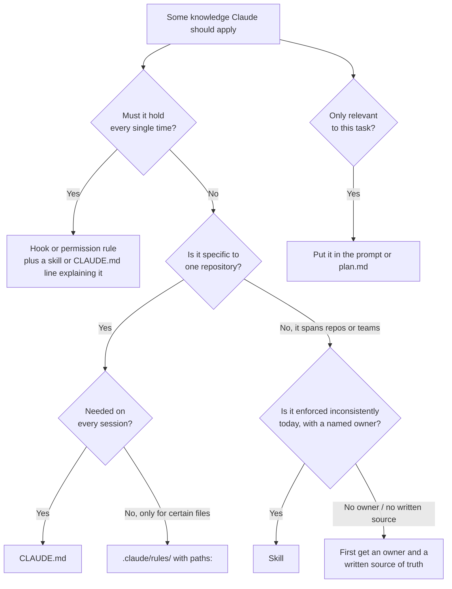
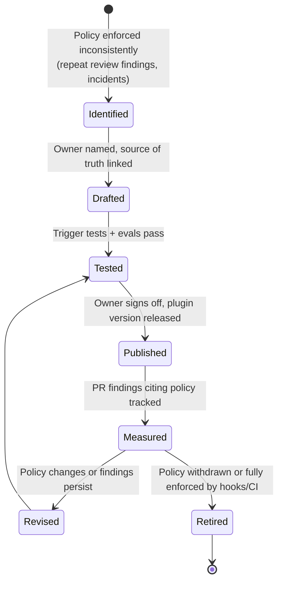

# Skills Guide

> **Audience:** policy owners (security, compliance, brand, UX), platform engineers, tech leads.
> **Stages:** [Plan](../01-Stages/01-Plan-Intent.md) (the intent template as a skill), [Design](../01-Stages/02-Design-Spec.md) (policy applied while the spec is written), [Build](../01-Stages/03-Build-Plan-Mode.md) (policy applied while code is written).
> **Template:** [../03-Templates/skills/secure-api-review/SKILL.md](../03-Templates/skills/secure-api-review/SKILL.md)

---

## 1. Why skills exist in an AI-native SDLC

Most organizations have plenty of written policy: a secure API standard, a logging standard, a brand guide, an accessibility checklist, a data-classification scheme. The problem is rarely that the policy does not exist. The problem is that it is **enforced inconsistently**. It lives in a wiki page that some engineers have read, it gets applied in review by whichever reviewer happens to remember it, and it changes without anyone downstream noticing.

A **skill** turns that policy into something operational. It is a small, versioned folder containing a `SKILL.md` file (and optionally scripts and reference files) that Claude loads when a task matches the skill's description. Once written, a skill is:

- **Explicit**: the policy is written in the exact form the agent applies.
- **Versioned**: it lives in git, and every change has an author, reviewer, and timestamp.
- **Applied broadly**: every session that touches relevant work gets it, not just the sessions of engineers who know about it.
- **Updated centrally**: when the policy owner changes it, every engineer picks up the new version automatically through the plugin or repository they already use.

This is how the Design stage manages to apply policy *while the spec is being written* rather than discovering violations weeks later in review.

One caveat governs everything else in this guide: **a skill is advisory.** Claude applies it when it triggers and follows it well, but a skill cannot mechanically prevent an action. Any policy that must hold every single time needs a deterministic backstop, usually a [hook](Hooks-Guide.md) or a permission rule.

---

## 2. Skill vs CLAUDE.md vs prompt vs hook

These four mechanisms overlap, and choosing the wrong one is the most common mistake teams make. Use this decision table.

| Question | CLAUDE.md | Skill | Prompt | Hook |
|---|---|---|---|---|
| Applies to... | This repository, every session | A class of task, across many repos | This one task | A specific tool action |
| Loaded... | Always, at session start | When the task matches the description (or when invoked by `/name`) | Once | On every matching event |
| Enforcement | Advisory | Advisory | Advisory | **Deterministic** |
| Typical size | About one page | Up to a few hundred lines plus supporting files | A paragraph | A short script |
| Owner | Repo tech lead | Named policy owner | The person asking | Platform engineer, with policy owner sign-off |
| Good for | Commands, layout, repo conventions, common mistakes | Cross-cutting policy, standards, reusable workflows, templates | Task specifics, constraints for this change | Blocking protected paths, formatting after edits, keeping secrets out, approval gates |
| Bad for | Long policies, cross-repo standards | Repo-specific trivia, one-off tasks, must-hold rules on their own | Anything you will repeat | Judgment calls that need reasoning |

A quick way to decide:



### Preconditions for writing a skill

The playbook sets a useful bar: write a skill only when you have **one policy, a named owner, and a written source of truth.** If any of those is missing, you are not ready. A skill without an owner drifts. A skill that combines three unrelated policies triggers unpredictably. A skill with no source of truth becomes the de facto policy without anyone having approved it.

---

## 3. Anatomy of a skill

### 3.1 Where skills live

| Scope | Path | Notes |
|---|---|---|
| Project | `.claude/skills/<skill-name>/SKILL.md` | Committed with the repo; shared with the team |
| Personal | `~/.claude/skills/<skill-name>/SKILL.md` | Your machine, all projects |
| Nested | `<subdir>/.claude/skills/<skill-name>/SKILL.md` | Applies to sessions working in that subtree |
| Plugin | `<plugin>/skills/<skill-name>/SKILL.md` | Distributed through a marketplace; invoked as `/plugin-name:skill-name` |
| Enterprise | Skills directory inside the managed settings location | Organization-wide (verify exact path against current docs) |

### 3.2 Folder layout

```text
.claude/skills/secure-api-review/
├── SKILL.md                 # required: frontmatter + instructions
├── reference.md             # optional: the full standard, loaded only if needed
├── examples.md              # optional: good and bad examples
└── scripts/
    └── check-endpoints.sh   # optional: deterministic helper Claude runs
```

### 3.3 SKILL.md structure

```markdown
---
name: secure-api-review
description: >
  Apply the company secure API standard when designing, writing, or reviewing
  HTTP endpoints, controllers, routers, OpenAPI specs, or request handlers.
  Use for any change that adds or modifies an API route or its authentication,
  validation, logging, or audit behavior.
---

# Secure API standard (v3.2, owner: AppSec, source: SEC-STD-014)

When you design, implement, or review an HTTP endpoint:

1. ...
2. ...

Before reporting done, run `${CLAUDE_SKILL_DIR}/scripts/check-endpoints.sh`
and include its output.
```

Frontmatter fields verified against the current skills documentation (unrecognized fields are silently ignored, so spelling matters):

| Field | Purpose | Notes |
|---|---|---|
| `name` | Display name and slash-command name | Defaults to the directory name |
| `description` | What the skill does **and when to use it**; this is what Claude matches against | Recommended. Combined with `when_to_use`, truncated at about 1,536 characters in the listing |
| `when_to_use` | Extra trigger guidance appended to the description | Optional |
| `allowed-tools` | Tools pre-approved while the skill is active (for example `Bash(./scripts/*) Read Grep`) | Grants for that turn only; does not restrict other tools |
| `disallowed-tools` | Tools removed while the skill is active | Optional |
| `disable-model-invocation` | `true` means only a human can invoke it via `/name` | Use for skills with side effects (deploys, releases) |
| `user-invocable` | `false` hides it from the `/` menu; Claude still uses it | Use for background knowledge |
| `argument-hint`, `arguments` | Argument autocomplete and named `$name` substitution | Optional |
| `model`, `effort` | Override model or effort while active | Optional |
| `context: fork`, `agent` | Run the skill in an isolated subagent | Useful for heavy research or review passes |
| `paths` | Glob patterns; skill only activates on matching files | Useful for language- or directory-specific standards |

Useful substitutions inside the body: `$ARGUMENTS`, `$0`/`$1`, `${CLAUDE_SKILL_DIR}` (the skill's own directory, for bundled scripts), and `${CLAUDE_PROJECT_DIR}`. A line such as `` !`git diff --name-only` `` runs a shell command *before* Claude reads the skill and injects its output; organizations can disable this with the `disableSkillShellExecution` setting.

Keep the `SKILL.md` body focused (the docs suggest under roughly 500 lines) and move long reference material into supporting files that Claude reads only when needed.

---

## 4. Writing descriptions that trigger reliably

The description is the single most important line in a skill. Claude sees the list of skill names and descriptions and decides which to load. A skill with a vague description either never triggers or triggers everywhere.

**Guidelines:**

1. **State the trigger, not just the topic.** "Secure API standard" is a topic. "Apply when designing, writing, or reviewing HTTP endpoints, controllers, routers, or OpenAPI specs" is a trigger.
2. **Use the vocabulary engineers actually type.** Include synonyms across stacks: *endpoint, route, controller, handler, router, resource*.
3. **Name the artifacts.** "spec.md", "OpenAPI", "intent.md" help Claude connect the skill to the Design and Plan stages.
4. **Say what it is not for** if there is a likely false positive: "Not for internal gRPC services; see grpc-standards."
5. **Keep one policy per skill.** A description that tries to cover security, logging, and branding will trigger on everything and be followed partially.

| Weak description | Strong description |
|---|---|
| "Security stuff for APIs." | "Apply the secure API standard when adding or changing any HTTP endpoint, route, controller, handler, or OpenAPI spec, including auth, validation, audit, and logging behavior." |
| "Brand guidelines." | "Apply brand and UX standards when writing or reviewing user-facing UI copy, screens, components, error messages, emails, or design specs." |
| "Writes intents." | "Turn a problem description or brainstorm into an intent.md using the org template. Use when someone describes a problem, feature idea, or pain point and wants it captured." |

---

## 5. Bundled scripts: making skills partly deterministic

A skill can include scripts that Claude runs. This is a powerful pattern because it moves the checkable parts of a policy out of the model's judgment and into code:

- The skill says *what* the policy is and *how to reason* about edge cases.
- The script checks the mechanical parts (every route has an auth decorator, every Pydantic model forbids extra fields) and prints a pass/fail report.
- The skill instructs Claude to run the script and include its output as evidence.

Guidelines for bundled scripts:

- Reference them with `${CLAUDE_SKILL_DIR}/scripts/...` so the path works wherever the skill is installed.
- Keep them read-only. A skill script should report, not modify.
- Make them fast (seconds) and scoped to changed files where possible.
- Exit non-zero on violations and print a human-readable summary.
- Pre-approve them in `allowed-tools` (for example `allowed-tools: Bash(${CLAUDE_SKILL_DIR}/scripts/check-endpoints.sh)`) only if your permission model allows it; verify the exact rule form against current docs.

Remember that a script *inside a skill* still only runs when the skill triggers and Claude chooses to run it. For must-hold checks, run the same script from a hook or from CI as well.

---

## 6. Testing that a skill triggers

A skill that does not trigger is worse than no skill, because everyone assumes the policy is being applied. Test triggering deliberately before you publish.

**Manual test protocol:**

1. Start a fresh session in a representative repository.
2. Try 8 to 12 prompts that *should* trigger the skill, phrased the way different people would phrase them: "add an endpoint to cancel a claim", "new route for refunds", "update the OpenAPI spec for /orders", "review this controller".
3. Try 4 to 6 prompts that *should not* trigger it: "fix the typo in README", "bump the log level".
4. Record for each prompt whether the skill loaded (Claude's transcript shows the skill invocation) and whether the output followed the policy.
5. Compare against a baseline by disabling the skill via `skillOverrides` in settings (for example `"secure-api-review": "off"`) and rerunning the same prompts. If output is identical, the skill is not adding value or not triggering.
6. Iterate on the description until trigger precision and recall are acceptable.

Recent Claude Code versions include a `/skill-doctor` report that shows context cost and invocation frequency per skill; use it to find skills that never fire (verify availability in your version).

**Automated test:** turn the prompt list into evals. Each "should trigger" prompt becomes an eval whose check script verifies the policy was applied (for example, `check-endpoints.sh` passes on the resulting diff). See [Evals-Guide.md](Evals-Guide.md).

---

## 7. Distribution: repository, plugin, marketplace

| Method | When to use | How engineers get updates |
|---|---|---|
| Commit to `.claude/skills/` in each repo | One team, one or two repos | Pull the repo |
| Package in a **plugin** | Many repos, one policy owner | Plugin updates from the marketplace |
| Publish via a **private marketplace** | Organization-wide standards | Managed settings register the marketplace and force-enable the plugin |

For organization-wide policy, the plugin route is the right one. The policy owner maintains a plugin repository (for example `appsec-standards`) containing the skill. The platform team registers the organization's marketplace for every machine via managed settings:

```json
{
  "extraKnownMarketplaces": {
    "acme-standards": {
      "source": { "source": "github", "repo": "acme/claude-marketplace" },
      "autoUpdate": true
    }
  },
  "enabledPlugins": {
    "appsec-standards@acme-standards": true,
    "brand-ux@acme-standards": true
  },
  "strictKnownMarketplaces": [
    { "source": "github", "repo": "acme/claude-marketplace" }
  ]
}
```

`strictKnownMarketplaces` (managed-only) restricts which marketplace sources engineers can install from, so everything comes from the organization marketplace. Pair it with `disableSideloadFlags` so plugins cannot be loaded from arbitrary local directories. See [Managed-Settings-Guide.md](Managed-Settings-Guide.md).

---

## 8. Policy-owner lifecycle

A skill is a policy artifact, and the policy owner is accountable for it. The platform team owns the plumbing; the policy owner owns the words.



| Step | Responsible | Artifact |
|---|---|---|
| Identify inconsistently enforced knowledge | Tech lead or reviewer | Issue linking repeat findings |
| Name the owner and source of truth | Policy owner | Header line in SKILL.md: version, owner, source document ID |
| Draft SKILL.md and scripts | Policy owner with platform engineer | PR to the plugin repo |
| Test triggering and evals | Platform engineer | Eval cases in the suite |
| Sign off and release | Policy owner | Tagged plugin version |
| Log which version was applied | Automatic | Skill versions recorded alongside spec/plan commits (governance requirement from the Design stage) |
| Monitor | Policy owner | Metric: PR findings citing the policy |
| Revise on policy change | Policy owner | New version; engineers receive it automatically |

**Metrics:**

- *Leading:* time from policy approval to the skill change being merged and released. Target days, not months.
- *Lagging:* the number of PR review findings that cite the policy. This should trend toward zero. If it does not, the skill is not triggering, has drifted from the policy, or the policy needs a hook.

---

## 9. Three example skills

### 9.1 `secure-api-review`

Encodes the secure API standard. The full template lives at [../03-Templates/skills/secure-api-review/SKILL.md](../03-Templates/skills/secure-api-review/SKILL.md); this is the shape.

```markdown
---
name: secure-api-review
description: >
  Apply the secure API standard when designing, implementing, or reviewing any
  HTTP endpoint, route, controller, handler, router, or OpenAPI spec, including
  changes to authentication, request validation, audit events, or logging.
allowed-tools: Read Grep Bash(${CLAUDE_SKILL_DIR}/scripts/check-endpoints.sh)
---

# Secure API standard  (v3.2 | owner: AppSec | source: SEC-STD-014)

Apply every rule below. If a rule cannot be met, stop and flag it for the AppSec
owner instead of working around it.

1. **Authentication.** Every endpoint requires the gateway-issued JWT, except `/health`.
   Do not add unauthenticated routes. Do not accept tokens from query strings.
2. **Validation.** Validate request bodies against the OpenAPI schema and reject
   unknown fields (Spring: `FAIL_ON_UNKNOWN_PROPERTIES`; Pydantic: `extra="forbid"`;
   zod: `.strict()`).
3. **Audit.** Every state-changing operation emits an audit event with
   actor, action, entity, and timestamp.
4. **PII.** Fields tagged PII in the schema never appear in logs, exceptions,
   or error responses. Return opaque error codes.
5. **Evidence.** Run `${CLAUDE_SKILL_DIR}/scripts/check-endpoints.sh` on the changed
   files and include its full output in your summary or review.

For the full standard and rationale, read `reference.md` in this skill folder.
```

Backstop: the "no unauthenticated routes" rule is must-hold, so CI also runs `check-endpoints.sh` and fails the build on violations.

### 9.2 `intent-writer`

Encodes the Plan stage template so that anyone, including non-engineers, produces a consistent `intent.md`. See [../01-Stages/01-Plan-Intent.md](../01-Stages/01-Plan-Intent.md) and [../03-Templates/intent.template.md](../03-Templates/intent.template.md).

```markdown
---
name: intent-writer
description: >
  Turn a problem description, pain point, customer complaint, or feature idea
  into an intent.md using the organization's intent template. Use when someone
  describes a problem and wants it captured, or asks to "write an intent",
  "draft a proposal", or "capture this idea".
---

# Intent writer  (v1.4 | owner: Product Operations | source: PRODUCT-PROC-002)

1. Brainstorm with the originator until these are concrete: the problem in one
   paragraph, who is affected, the constraints, and how success will be measured.
   Ask questions one at a time. Do not propose solutions until the problem is clear.
2. Write `work/<ID>-<slug>/intent.md` with exactly these sections:
   Title, Author, Status (Draft), Problem, Proposed outcome,
   Affected users/systems, Constraints, Success metrics, Open questions.
3. Quantify the problem where the originator can (for example "about a third of
   contact-center call time is claim-status queries").
4. List anything unresolved under Open questions rather than guessing.
5. Show the draft to the originator and apply their corrections before committing.
6. Do not write a spec, plan, or code. The intent is the whole deliverable.
```

### 9.3 `brand-ux-review`

Encodes brand voice, UX, and accessibility rules for the Design stage and for UI changes in Build.

```markdown
---
name: brand-ux-review
description: >
  Apply brand voice, UX, and accessibility standards when writing or reviewing
  user-facing UI: screens, components, copy, error messages, empty states,
  emails, notifications, or the UX section of a spec.md.
paths: "src/**/*.tsx,src/**/*.vue,**/spec.md,content/**"
---

# Brand and UX standard  (v2.0 | owner: Design Systems | source: DS-GUIDE-2026)

1. **Voice.** Plain, warm, and direct. Second person ("you"). No jargon, no blame
   in error messages ("We couldn't load your claim" not "Invalid request").
2. **Components.** Use design-system components from `@acme/ui` before creating new
   ones. Never hard-code colors or spacing; use tokens.
3. **Accessibility.** WCAG 2.2 AA: every interactive element has an accessible name,
   contrast meets AA, focus order is logical, nothing relies on color alone.
4. **States.** Every screen defines loading, empty, error, and success states.
5. **Evidence.** For UI changes, take a screenshot of each changed state and compare it
   with the mock referenced in spec.md or plan.md. Note any deviations.
6. Flag, do not silently resolve, any conflict between these rules and the spec;
   the Design Systems owner decides.
```

---

## 10. Common mistakes

| Mistake | Consequence | Fix |
|---|---|---|
| Relying on a skill for a must-hold rule | Occasional violations reach production | Add a hook or CI check that enforces the mechanical part |
| One giant "engineering standards" skill | Triggers everywhere, followed partially | One policy per skill |
| Description names the topic but not the trigger | Skill rarely loads | Rewrite the description around user phrasing and artifacts |
| No version, owner, or source line | No one knows which policy version was applied | Header line in every SKILL.md |
| Skills copied into many repos by hand | Versions drift | Distribute via plugin and marketplace |
| Skill duplicates CLAUDE.md content | Conflicts and wasted context | Repo-specific facts in CLAUDE.md, cross-repo policy in skills |
| Never measuring | Cannot tell if the skill works | Track PR findings citing the policy |

## Related

- [CLAUDE-md-Guide.md](CLAUDE-md-Guide.md)
- [Hooks-Guide.md](Hooks-Guide.md): the enforcement backstop for must-hold skills
- [Evals-Guide.md](Evals-Guide.md): regression-testing skill changes
- [Managed-Settings-Guide.md](Managed-Settings-Guide.md): marketplace and plugin lockdown
- [../01-Stages/02-Design-Spec.md](../01-Stages/02-Design-Spec.md)

---

*Based on concepts from Anthropic's AI-Native SDLC Playbook; expanded guidance for implementation. Verify configuration keys against current Claude Code documentation.*
