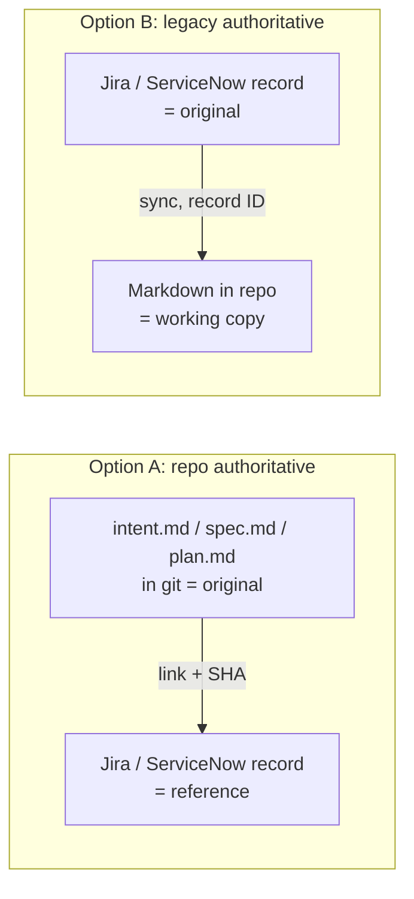
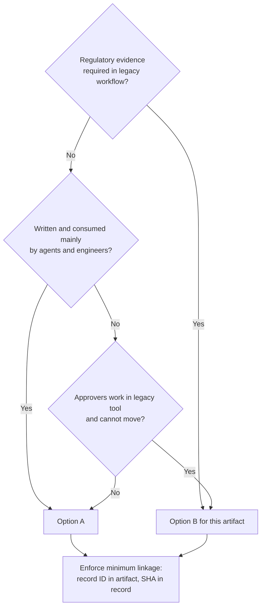

# Source of Truth and Legacy Systems

> **Audience:** engineering managers, product operations, change-management and compliance leads, platform engineers integrating Jira, ServiceNow, Azure DevOps, or similar tools.
> **Stages:** all, starting at [Plan](../01-Stages/01-Plan-Intent.md) and [Build](../01-Stages/03-Build-Plan-Mode.md).
> **Related templates:** [../03-Templates/intent.template.md](../03-Templates/intent.template.md), [../03-Templates/spec.template.md](../03-Templates/spec.template.md), [../03-Templates/plan.template.md](../03-Templates/plan.template.md)

---

## 1. The problem

The AI-native SDLC keeps its artifacts in the repository as version-controlled Markdown: `intent.md`, `spec.md`, `plan.md`, code, tests, PRs. Agents read and write these files naturally, git gives every change an author and a timestamp, and the next stage reads the previous stage's output.


Most organizations, however, already have systems that track the same things: Jira epics and stories, ServiceNow change requests, Azure DevOps work items, a GRC tool for approvals. Those systems carry reporting, workflows, and sometimes regulatory evidence. They will not disappear because the engineering team adopted Markdown.

If both the repository and the legacy tool hold "the" requirements, they will drift, and nobody will know which one is right. The fix is not to pick one system for everything. It is a simple rule:

> **For every artifact type, name exactly one authoritative system.** The other system holds a reference or a working copy, never a competing original.

---

## 2. Two options

### Option A: the repository is authoritative

The Markdown artifacts in git are the originals. The legacy tool references commits and files.

- `intent.md`, `spec.md`, and `plan.md` are written and approved in the repo (approval is a merge).
- The Jira story or ServiceNow record contains a link to the file and the commit SHA of the approved version.
- Status in the legacy tool is updated from repository events (merge, release).

**Best when:** engineering and product both work comfortably in the repo (possibly through connectors that let non-engineers commit without learning git), and the legacy tool is used mainly for reporting.

### Option B: the legacy tool is authoritative

The Jira or ServiceNow record is the original. Markdown files in the repo are **working copies** that agents use.

- The requirement, approval, or change record lives in the legacy tool, with its existing workflow.
- The repo copy is generated from (or synced to) the record and carries the record ID.
- Approval happens in the legacy tool; the repo reflects it.

**Best when:** regulatory evidence, audit processes, or cross-team reporting depend on the legacy tool's workflow, and changing that is out of scope.



You can mix options per artifact type. A common and sensible split:

| Artifact | Typical authority | Reason |
|---|---|---|
| intent.md | Repo (A) or product tool (B) | Depends where product owners work |
| spec.md | Repo (A) | Written by Claude with policy skills; reviewed as a PR |
| plan.md | Repo (A) | Tightly coupled to code |
| Code, tests | Repo (always) | |
| PR and review | Git host (always) | |
| Change request / release approval | ServiceNow or change tool (B) | Change-management and audit workflows |
| Security findings | Security tracker (B) | See [Recurring-Security-Scans.md](Recurring-Security-Scans.md) |
| Incidents | Incident tool (B); post-mortem in repo `lessons/` (A) | Paging and SLAs live in the incident tool; lessons are agent context |

---

## 3. The minimum linkage

Whatever you choose, enforce this **minimum bidirectional linkage**:

1. **Every repository artifact carries the record ID** of its legacy counterpart.
2. **Every legacy record carries the commit SHA** (and ideally the file path or PR link) of the related repository change.

With both links, anyone can navigate from a Jira story to the exact code that implemented it, and from any line of code (via `git blame` and the commit message) to the requirement and approval behind it. That is the audit trail regulators and incident reviewers need.

### 3.1 Record ID in artifacts

Put it in the header of every artifact:

```markdown
# Intent: Claim status self-service

- Author: Priya N. | Status: Approved
- Record: JIRA CLM-1482 | Change: CHG0034567
- Authority: repo (this file is the original)
```

```markdown
# Plan: Claim status panel

- Implements: spec/2026-09-claim-status.md @ 4e1f9a2
- Record: JIRA CLM-1482
- Authority: repo
```

For Option B, the header says `Authority: JIRA CLM-1482 (this file is a working copy; edit the record, not this file)`. Consider a hook that blocks direct edits to working copies so they are only changed by the sync job (see [Hooks-Guide.md](Hooks-Guide.md), protected paths).

### 3.2 Commit SHA in records

- When a PR merges, a CI job posts the merge SHA and PR link to the record.
- When a release deploys, the deploy pipeline adds the release version and SHA range to the change request.

---

## 4. Commit message conventions

Commit messages are the glue that `git log` and `git blame` expose. Adopt a convention that is easy for humans and agents to follow and easy for automation to parse.

```text
feat(claims): add claim status panel to portal

Implements plan/2026-09-claim-status.md (spec @ 4e1f9a2).
Caches claims-core responses to stay under the 50 rps limit.

Refs: CLM-1482
Change: CHG0034567
```

| Element | Convention |
|---|---|
| Subject | Conventional Commits style (`feat`, `fix`, `chore`, `docs`, `refactor`) with scope |
| Body | What and why; link the artifact that drove the change |
| Trailers | `Refs: <record ID>` (required), `Change: <change ID>` (when a change record exists), `Co-Authored-By:` for agent attribution if your policy uses it |

Enforce it:

- Put the convention in CLAUDE.md so Claude follows it in every commit.
- Check it in CI (commitlint or a small script that requires a `Refs:` trailer matching `[A-Z]+-\d+`).
- Optionally, a `PreToolUse` hook on `Bash(git commit *)` that blocks commits missing a record ID with a helpful message.

```bash
#!/usr/bin/env bash
# PreToolUse hook: require a record ID in commit messages made by Claude.
cmd=$(jq -r '.tool_input.command // empty')
case "$cmd" in
  *"git commit"*)
    if ! echo "$cmd" | grep -Eq 'Refs: [A-Z]+-[0-9]+'; then
      echo "Blocked: commit messages must include a 'Refs: <ID>' trailer (for example Refs: CLM-1482)." >&2
      echo "Find the record ID in the header of plan.md or intent.md." >&2
      exit 2
    fi ;;
esac
exit 0
```

(This simple check only works when the message is passed inline with `-m`; a CI commit-message check is the reliable backstop.)

PR titles or descriptions should also carry the record ID so the git host's integrations (Jira smart commits, ServiceNow DevOps) can link automatically.

---

## 5. Sync automation options

| Approach | How it works | Pros | Cons |
|---|---|---|---|
| **Native integrations** | Git host apps for Jira/ServiceNow/Azure DevOps link commits and PRs by record ID in messages | Low effort, well supported | Links only; does not sync content |
| **CI job on merge** | Workflow posts SHA, PR link, and artifact path to the record via its API | Simple, deterministic, auditable | You maintain a small script |
| **MCP server for the tool** | Claude reads records to create working copies, and updates records during a session | Natural for agents; good for Option B working copies | Needs careful scoping (read-mostly), approved via managed MCP |
| **Scheduled reconciliation** | Nightly job compares repo artifacts and records, flags missing links or drift | Catches gaps | Detects, does not prevent |
| **Webhook from the tool** | Record approval triggers a pipeline (for example, approved intent triggers the spec pass) | Event-driven flow across systems | More moving parts |

A merge-time CI job (GitHub Actions sketch):

```yaml
name: link-records
on:
  pull_request:
    types: [closed]
jobs:
  link:
    if: github.event.pull_request.merged == true
    runs-on: ubuntu-latest
    steps:
      - name: Post merge SHA to Jira
        env:
          JIRA_TOKEN: ${{ secrets.JIRA_TOKEN }}
          BODY: ${{ github.event.pull_request.body }}
          TITLE: ${{ github.event.pull_request.title }}
        run: |
          ids=$(printf '%s\n%s' "$TITLE" "$BODY" | grep -oE '[A-Z]+-[0-9]+' | sort -u)
          for id in $ids; do
            curl -sf -X POST -H "Authorization: Bearer $JIRA_TOKEN" -H "Content-Type: application/json" \
              "https://jira.example.com/rest/api/2/issue/$id/comment" \
              -d "{\"body\": \"Merged ${{ github.event.pull_request.html_url }} at ${{ github.event.pull_request.merge_commit_sha }}\"}"
          done
```

Adjust the API endpoint and authentication to your tool and version.

---

## 6. Decision table

Use this to choose per artifact type.

| Question | If yes, lean toward |
|---|---|
| Does a regulator or auditor expect evidence in the legacy tool's workflow? | **B** for that artifact |
| Do approvers (product owners, change board) already work daily in the legacy tool and refuse to move? | **B** |
| Is the artifact written and consumed mostly by agents and engineers? | **A** |
| Does the artifact change frequently with the code (plans, specs during build)? | **A** |
| Do you need cross-team portfolio reporting from the artifact? | **B**, or **A** with sync of status fields |
| Can non-engineers commit via connectors or a web editor? | **A** becomes viable for intents |
| Is the legacy tool being retired within a year? | **A**, with links during transition |



---

## 7. Common failure modes

| Failure | Symptom | Fix |
|---|---|---|
| Two originals | Spec in Confluence and spec.md disagree | Declare authority in the header; archive or convert the other to a link |
| Missing IDs | Commits with no record reference | CLAUDE.md convention + CI check + optional hook |
| One-way links only | Jira links to PR, but code does not reference Jira | Require the `Refs:` trailer |
| Manual copy-paste sync | Working copies go stale | Automate sync or switch that artifact to Option A |
| Agent edits a working copy directly | Record and copy diverge | Protected-path hook on working copies; edits go to the record |
| Over-integration | Agents with write access to every legacy field | Read-mostly MCP; writes limited to link and status fields |

## 8. Metrics

| Metric | Why |
|---|---|
| Share of merged commits with a valid record ID | Linkage coverage |
| Share of closed records with a merge SHA | Reverse linkage |
| Reconciliation drift count (nightly) | Early warning |
| Time to answer "which requirement did this line implement?" in an audit | The practical test |

## 9. Checklist

- [ ] Authority declared per artifact type (A or B) and documented
- [ ] Header convention with record ID and authority line
- [ ] Commit trailer convention in CLAUDE.md and enforced in CI
- [ ] Merge-time job posts SHA to records
- [ ] Working copies (Option B) protected from direct edits
- [ ] Nightly reconciliation report

## Related

- [PR-Review-Guide.md](PR-Review-Guide.md)
- [CI-CD-Integration-Guide.md](CI-CD-Integration-Guide.md)
- [CLAUDE-md-Guide.md](CLAUDE-md-Guide.md)
- [../01-Stages/01-Plan-Intent.md](../01-Stages/01-Plan-Intent.md)
- [../04-Governance/Controls-Matrix.md](../04-Governance/Controls-Matrix.md)

---

*Based on concepts from Anthropic's AI-Native SDLC Playbook; expanded guidance for implementation. Verify configuration keys against current Claude Code documentation.*
