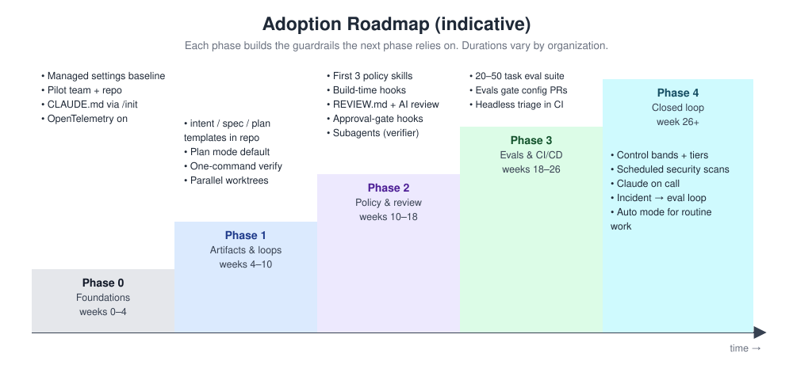
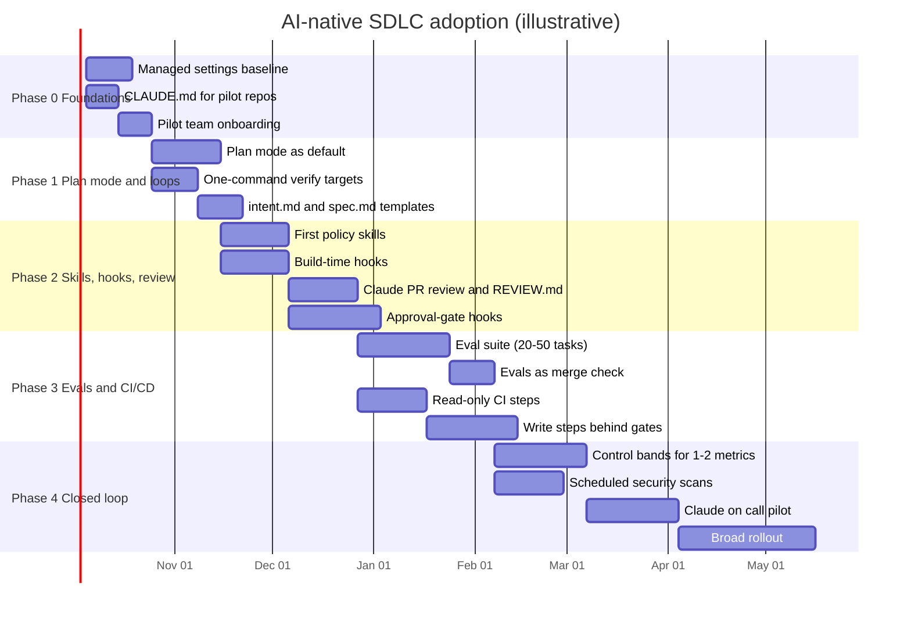
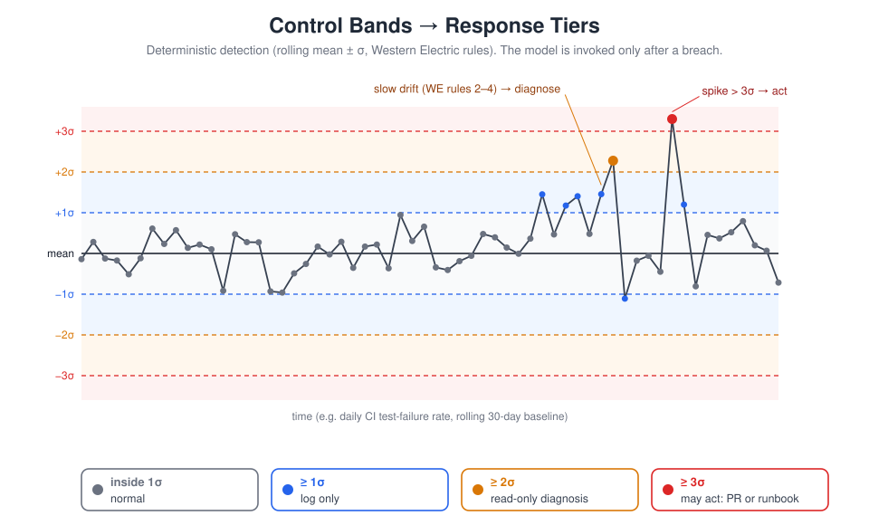

# Adoption Roadmap

Moving to an AI-native SDLC is not a tool installation. It is a sequence of capabilities, each of which depends on the one before. Plan mode is only safe once there is a `CLAUDE.md` that tells Claude how the project works. Automated review is only useful once there is a feedback loop that catches the obvious failures first. Closed-loop monitoring only makes sense once there is fast review, hooks at action boundaries, and a rehearsed rollback. This roadmap orders the work so that each phase builds the prerequisites for the next.

## Phase overview

| Phase | Theme | Typical duration | Scope |
|---|---|---|---|
| 0 | Foundations | 2-4 weeks | One pilot team, one or two repos |
| 1 | Plan mode and feedback loops | 4-6 weeks | Pilot team, then one or two more teams |
| 2 | Skills, hooks, and PR review | 6-8 weeks | Pilot plus early-adopter teams |
| 3 | Evals in CI and CI/CD integration | 6-10 weeks | Early adopters; platform team scales out |
| 4 | Closed-loop monitoring, scheduled scans, on-call | 8-12 weeks | Selected services, then broad rollout |

Durations are guidance for a mid-sized engineering organization. Regulated organizations should expect Phase 0 and Phase 2 to take longer because managed settings and approval-gate hooks need sign-off from security, compliance, and change management.

---

## Phase 0 - Foundations

**Goal:** a safe, consistent environment and one team using Claude Code daily with good project context.

**Entry criteria**
- Executive sponsor named; pilot team volunteered (not assigned).
- Security and IT agree on a baseline of managed settings.
- Model access route chosen (Anthropic API, Amazon Bedrock, Microsoft Foundry, or Google Vertex AI).

**Activities and deliverables**
- Managed settings deployed via MDM or admin console: `permissions.deny` for secrets and credential paths (for example, `~/.ssh`, `~/.aws/credentials`), `permissions.allow` for the safe inner loop, `disableBypassPermissionsMode`, sandbox with a domain allowlist, `requiredMinimumVersion`. See [Managed-Settings-Guide.md](../02-Guides/Managed-Settings-Guide.md).
- `CLAUDE.md` checked in for each pilot repo: generated with `/init`, trimmed to day-one essentials, under one page, code-owner approved. See [CLAUDE-md-Guide.md](../02-Guides/CLAUDE-md-Guide.md).
- OpenTelemetry export configured so usage and cost are visible from day one.
- Baseline metrics captured: DORA four keys, review time per PR, rework cycles.
- Pilot team trained (see [Change-Management-and-Training.md](Change-Management-and-Training.md)).

**Exit criteria**
- Managed settings verified on every pilot endpoint.
- Every pilot engineer has completed at least five real tasks with Claude Code.
- `CLAUDE.md` has had at least one "mistake appeared twice" correction.
- Telemetry visible in a shared dashboard.

**Risks**
- Over-restrictive settings cause prompt fatigue and workarounds. Mitigate by pre-approving the safe inner loop.
- Pilot team selected for enthusiasm only; results do not generalize. Include at least one skeptic.

---

## Phase 1 - Plan mode and feedback loops

**Goal:** nothing is implemented without an accepted written plan, and every session verifies its own work.

**Entry criteria**
- Phase 0 exit criteria met.
- Pilot repos have a test suite and build that run locally with one command (or a plan to create one).

**Activities and deliverables**
- Plan mode as the default starting point for non-trivial work; `plan.md` committed before implementation. See [03-Build-Plan-Mode.md](../01-Stages/03-Build-Plan-Mode.md).
- Single-command verification targets (for example, `make test`) and a verification block in `CLAUDE.md` that states what healthy output looks like.
- Failing-test-first practice for bug fixes.
- `intent.md` and `spec.md` templates agreed and stored as skills; `work/` folder created. See [../03-Templates/](../03-Templates/).
- Product owners and at least one non-engineer originator onboarded.

**Exit criteria**
- At least 70 percent of pilot changes have a committed `plan.md`.
- First-pass CI success for agent-written changes is measured and trending up.
- At least three intents have flowed from `intent.md` to merged code.

**Risks**
- Plans become ceremonial. Mitigate with the "a non-author could implement from this plan" test in review.
- Tests are weak, so feedback loops pass bad code. Invest in the test suite before scaling.

---

## Phase 2 - Skills, hooks, and PR review

**Goal:** institutional policy is applied while work happens, must-hold rules are enforced deterministically, and review runs in both directions.

**Entry criteria**
- Phase 1 exit criteria met.
- At least two policies with a named owner and a written source of truth identified as "enforced inconsistently."
- Branch protection with code-owner approval enabled on pilot repos.

**Activities and deliverables**
- First two to four policy skills (for example, secure API review, brand voice, accessibility), each tested for triggering across phrasings. See [Skills-Guide.md](../02-Guides/Skills-Guide.md).
- Build-time hooks: protected paths, formatter/linter after edit, secret checks, test-edit protection during bug fixes. See [Hooks-Guide.md](../02-Guides/Hooks-Guide.md).
- Claude code review enabled (managed service or `claude-code-action`); `REVIEW.md` written by the tech lead. See [PR-Review-Guide.md](../02-Guides/PR-Review-Guide.md).
- Approval-gate hooks for gates that must survive (change sign-off, release authorization, protected paths); non-negotiable hooks moved to managed settings with `allowManagedHooksOnly`.
- Org plugin marketplace with `strictKnownMarketplaces`; managed MCP servers with `allowManagedMcpServersOnly`.
- Parallel sessions (two to three worktrees) and a verifier subagent piloted. See [Parallel-Sessions-and-Subagents.md](../02-Guides/Parallel-Sessions-and-Subagents.md).

**Exit criteria**
- Every must-hold skill is backed by a hook or managed setting.
- Time to first review is minutes for pilot repos.
- First monthly review-tuning session held; nit cap in place.
- Change management has signed off that existing gates are represented as hooks or pipeline controls.

**Risks**
- Review rubber-stamping as humans trust Claude's review. Keep code-owner approval mandatory and sample-audit approvals.
- Skill drift from the policy source. Require owner sign-off on skill changes and track policy-citing findings.

---

## Phase 3 - Evals in CI and CI/CD integration

**Goal:** agent configuration is regression-tested like code, and Claude participates in the pipeline up to, but not past, the production gate.

**Entry criteria**
- Phase 2 exit criteria met.
- CI can run Claude Code non-interactively with an API key that has an eval budget.
- Rollback exists as a single command and has been exercised in staging.

**Activities and deliverables**
- Eval suite of 20 to 50 real tasks with expected outcomes, collected by the platform engineer; runs nightly and on changes to `CLAUDE.md` and `.claude/**`. See [Evals-Guide.md](../02-Guides/Evals-Guide.md).
- Eval pass-rate threshold as a required merge check for configuration changes.
- Read-only pipeline steps first (triage, summarize failures, draft release notes), then write steps behind existing gates (lint fixes, docs, addressing comments), all arriving as PRs. See [CI-CD-Integration-Guide.md](../02-Guides/CI-CD-Integration-Guide.md).
- Sandboxed CI profile: containers, network policy, short-lived scoped tokens, no standing production credentials.
- Deploy, status, and rollback exposed as environment-scoped MCP tools; tiered autonomy (dev free, staging constrained, production human-authorized).

**Exit criteria**
- Every config-change PR shows an eval result.
- At least one incident has produced a permanent regression eval.
- A measurable share of pipeline failures is triaged without paging a human.

**Risks**
- Eval gaming: the suite stops discriminating. Rotate in new cases from monitoring; retire saturated ones to a baseline set.
- Cost overrun from nightly evals. Set spend limits and monitor cost per run.

---

## Phase 4 - Closed-loop monitoring, scheduled scans, on-call

**Goal:** production signals feed back into the loop as new `intent.md`, with no person required to notice the problem first.

**Entry criteria**
- Phase 3 exit criteria met.
- Metrics store available (for example, Prometheus or CI API); service owner has chosen one or two stable metrics.
- Fast PR review and hooks at action boundaries are proven.

**Activities and deliverables**
- Deterministic detection script (rolling mean and standard deviation, Western Electric rules), versioned and unit-tested; no model in detection. See [Control-Bands-and-Anomaly-Detection.md](../02-Guides/Control-Bands-and-Anomaly-Detection.md).
- Response tiers in versioned configuration: 1 sigma log, 2 sigma read-only diagnosis, 3 sigma may open a PR or run a pre-approved runbook.

- Agent diagnoses written as `intent.md` into the triage queue; service owner triages; dismissals tune the bands.
- Recurring security scans on a per-project schedule, baseline full scans of critical repos first. See [Recurring-Security-Scans.md](../02-Guides/Recurring-Security-Scans.md).
- Claude on call in an incident channel for one service, with post-mortems written to a versioned lessons folder. See [Claude-On-Call-Guide.md](../02-Guides/Claude-On-Call-Guide.md).

**Exit criteria**
- Breach-to-intent time measured for monitored services.
- All critical repos on a scan schedule.
- Repeat incidents trending down for services in the loop.

**Risks**
- Alert fatigue from poorly tuned bands. Start with log-only tier and promote after tuning.
- Automation bias in triage. Require service owner decisions to be recorded with a reason.

---

## 30-60-90 day plan

| Window | Objectives | Key actions | Evidence of success |
|---|---|---|---|
| **Days 1-30** | Foundations in place; pilot team productive | Deploy managed settings baseline; write `CLAUDE.md` for pilot repos; enable telemetry; train pilot team; capture baseline DORA and review metrics; agree `intent.md` template | Settings verified on endpoints; every pilot engineer active; baseline dashboard live |
| **Days 31-60** | Plan-first and self-verifying work is the norm | Make plan mode default; one-command verify targets; failing-test-first for bugs; first intents from non-engineers; draft first two policy skills; build-time hooks for protected paths and linting | Majority of changes have `plan.md`; first-pass CI measured; first intent-to-merge cycles complete |
| **Days 61-90** | Policy and review scale; gates are code | Ship policy skills with owners; enable Claude PR review with `REVIEW.md`; implement approval-gate hooks with change management; set up org marketplace and MCP allowlist; start eval suite collection; plan Phase 3 | Must-hold skills backed by hooks; time to first review in minutes; change management sign-off; eval suite draft of 20+ tasks |

## Scaling beyond the pilot

- Expand team by team, not repo by repo; each new team gets a champion (see [Change-Management-and-Training.md](Change-Management-and-Training.md)).
- Use the [Readiness-Assessment.md](../06-Checklists/Readiness-Assessment.md) before each team starts and the [New-Repo-Onboarding-Checklist.md](../06-Checklists/New-Repo-Onboarding-Checklist.md) for each repository.
- Reassess against the [Maturity-Model.md](Maturity-Model.md) quarterly.

---

*Based on concepts from Anthropic's AI-Native SDLC Playbook; expanded guidance for implementation.*
