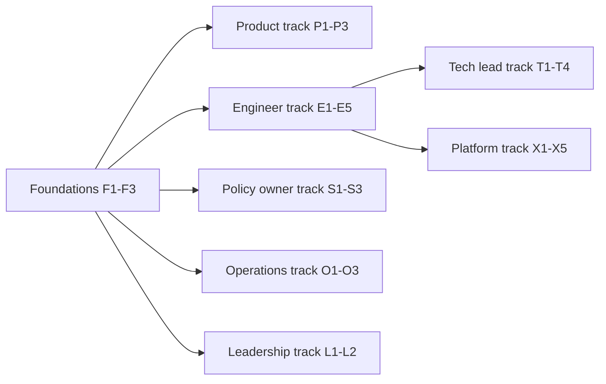

# Change Management and Training

The technical parts of an AI-native SDLC (settings, hooks, skills, evals) are the easier half. The harder half is people: product owners who now review drafts rather than write them, engineers who steer several sessions rather than type every line, reviewers who must resist trusting an automated review too much, and a change advisory board whose meetings are replaced by hooks. This document covers the communication plan, role-based training, office hours, a champions network, and how to measure adoption.

## Guiding messages

Keep these consistent across every channel:

1. **The controls stay; the mechanisms change.** Nothing that auditors or customers rely on is being removed. It is being enforced earlier and more reliably.
2. **Humans stay at the gates.** Claude never approves its own work, never merges, and never authorizes production.
3. **Artifacts are the product of every stage.** If it is not committed, it did not happen.
4. **Mistakes become configuration.** When Claude gets something wrong twice, fix `CLAUDE.md` or a skill so it does not happen a third time.
5. **Speed is only good with quality.** We measure rework, escapes, and change failure alongside throughput.

## Stakeholder map

| Stakeholder | Main concern | What they need to hear | Channel |
|---|---|---|---|
| Executives | Return, risk, pace | Throughput and quality metrics; risk register; roadmap | Quarterly briefing, one-page summary |
| Product owners | Loss of control over requirements | They approve intent and spec; Claude drafts; policy flags come to them early | Workshop, templates, office hours |
| Engineers | Job change, quality, autonomy | Plan-first, parallel sessions, feedback loops; they own what they submit | Demos, pairing, champions |
| Tech leads | Review load, standards | `REVIEW.md`, review tuning, fewer nits | Working session |
| Security and compliance | Enforcement, evidence | Controls matrix, managed settings, audit evidence guide | Review sessions, sign-off |
| Change management / CAB | Loss of the board | Gates become hooks and environment approvals with better evidence | Joint mapping workshop |
| Operations / on-call | Pager load, trust in agents | Bands, tiers, read-only diagnosis, human triage | Runbook walkthroughs |
| Non-engineer originators | Access and confidence | How to brainstorm and commit `intent.md` without git knowledge | Short how-to, office hours |

## Communication plan

| When | Message | Audience | Channel | Owner |
|---|---|---|---|---|
| Week -2 | Why we are doing this; what will and will not change | All engineering and product | All-hands, written memo | Engineering leadership |
| Week -1 | Pilot team announced; how to follow along | All engineering | Engineering channel | Change management |
| Week 0 | Managed settings rollout: what is blocked and why, how to request exceptions | Pilot, then all users | Email, FAQ link | IT/MDM admin, security |
| Every 2 weeks | Pilot notes: what worked, what we changed in `CLAUDE.md` and skills | All engineering | Newsletter or channel post | Champions |
| End of each phase | Phase results against exit criteria; next phase scope | All stakeholders | Demo day and written summary | Transformation lead |
| Before gate changes | Which CAB activities become hooks or approvals, with evidence | CAB, compliance, release managers | Workshop, sign-off record | Change management |
| Quarterly | Metrics, maturity score, risk register changes | Executives, leadership | Briefing | Engineering leadership |

Communication rules:
- Publish a single FAQ and keep it current; link [FAQ.md](../07-Reference/FAQ.md) as a starting point.
- Every block message from a hook should say why it blocked and how to get approval; that is part of communication.
- Announce skill and hook changes in the same channel, with the owner and the reason.

---

## Training curriculum by role

Each module is designed as a short session (45 to 90 minutes) with a hands-on exercise on a real repository. Record sessions and keep exercises in a training repo.

### Foundations (everyone)

| Module | Content | Exercise |
|---|---|---|
| F1 The AI-native loop | Six stages, artifact chain, human gates | Trace a sample change from `intent.md` to production |
| F2 Safe use | Managed settings, what is blocked, data handling, prompt injection awareness | Identify three untrusted content sources in your work |
| F3 Automation bias | Why confident output is not correct output; how to challenge it | Review a flawed Claude-drafted artifact and find the errors |

### Originators and product owners

| Module | Content | Exercise |
|---|---|---|
| P1 Brainstorming to intent | Moving from problem to scope, users, constraints, success metrics | Produce and commit an `intent.md` using the template |
| P2 Reviewing a spec | Checking a spec against the original idea; handling policy flags | Review a spec with two flags; route to the right owners |
| P3 Approving and rejecting | Merge as approval; closing with reasons | Approve one intent, reject one with a written rationale |

### Engineers

| Module | Content | Exercise |
|---|---|---|
| E1 Plan mode | Asking for files, order, tests; interrogating risks until a non-author could implement | Produce and commit a `plan.md` for a real ticket |
| E2 Feedback loops | One-command verify, verification block, failing-test-first | Fix a bug starting from a failing test |
| E3 `CLAUDE.md` hygiene | What belongs, what does not, the "twice" rule | Trim an overlong `CLAUDE.md` to one page |
| E4 Parallel sessions and subagents | Worktrees, two to three sessions, verifier subagent | Run two sessions on independent tasks and review both |
| E5 Working with Claude review | Reading findings, `@claude` fixes, babysitting agent PRs | Resolve review comments on a PR using `@claude` |

### Tech leads and code owners

| Module | Content | Exercise |
|---|---|---|
| T1 Writing `REVIEW.md` | Passes, Important vs Nit, exclusions | Draft `REVIEW.md` for your repo |
| T2 Review tuning | Rating findings, nit caps, excluding generated paths | Run a tuning session on last month's findings |
| T3 Reviewing for intent and risk | What humans should look at when Claude has already reviewed | Review three PRs; record intent and risk notes |
| T4 Governing agent configuration | Approving changes to `CLAUDE.md`, skills, hooks, subagents | Review a hook change PR with eval results |

### Platform engineers

| Module | Content | Exercise |
|---|---|---|
| X1 Hooks | PreToolUse and PostToolUse, exit codes, fast and scoped hooks | Write a protected-path hook and a release-gate hook |
| X2 Managed settings | Deny/allow, sandbox, managed-only rules, marketplace, MCP | Draft a managed settings baseline |
| X3 Evals | Collecting 20-50 tasks, checks, CI wiring, thresholds | Add five eval cases and a CI job |
| X4 CI/CD integration | Read-only steps, write steps behind gates, environment tiers, MCP deploy tools | Add a failure-triage step to a pipeline |
| X5 Control bands | Deterministic detection, Western Electric rules, tiers | Implement and unit-test a detection script |

### Policy owners (security, compliance, brand, UX)

| Module | Content | Exercise |
|---|---|---|
| S1 Policy as skills | Writing `SKILL.md`, triggers, source of truth, ownership | Convert one policy page into a skill |
| S2 Advisory vs deterministic | When a skill needs a hook | Classify ten rules as advisory or must-hold |
| S3 Measuring policy effect | Policy-citing findings, drift detection | Review a month of findings for your policy |

### Service owners, on-call, security lead

| Module | Content | Exercise |
|---|---|---|
| O1 Triage of agent diagnoses | Fix now, schedule, dismiss; recording reasons | Triage three sample diagnosis intents |
| O2 Claude on call | Steering in channel, verifying recovery, post-mortems | Run a game day with Claude in the channel |
| O3 Scheduled scans | Baselines, schedules, confidence triage, dismissals | Triage a scan report and open one patch PR |

### Leadership and change management

| Module | Content | Exercise |
|---|---|---|
| L1 Metrics that matter | Stage metrics, DORA, idea-to-production | Read the dashboard and pick one intervention |
| L2 Gates that must survive | Mapping CAB rules to hooks and approvals | Build the gate inventory for one product line |

## Learning paths

---

## Office hours

- **Cadence:** twice a week during Phases 0-2, weekly afterwards.
- **Hosts:** rotate between a platform engineer, a champion, and (monthly) a security or policy owner.
- **Format:** 45 minutes; bring a real task or artifact; screen-share encouraged.
- **Output:** each session produces at least one improvement candidate (a `CLAUDE.md` line, a skill fix, a hook adjustment, an FAQ entry), logged in a shared tracker with an owner.

## Champions network

| Element | Guidance |
|---|---|
| Ratio | About one champion per 8-12 engineers, and one per product area for product owners |
| Selection | Volunteers with credibility in their team; include at least some constructive skeptics |
| Time allocation | 10-15 percent of their time during rollout, agreed with their manager |
| Responsibilities | First line of help; collect friction points; propose `CLAUDE.md` and skill changes; run team demos; feed the FAQ |
| Community | Fortnightly champions sync; shared channel; early access to skill and hook changes |
| Recognition | Visible credit in phase summaries; included in performance conversations |

## Measuring adoption

Adoption metrics tell you whether people are using the new way of working; outcome metrics in [Metrics-and-KPIs.md](Metrics-and-KPIs.md) tell you whether it is working.

| Metric | Definition | Source | Healthy signal |
|---|---|---|---|
| Active users | Share of licensed users with at least one session per week | OpenTelemetry, analytics dashboard | Rising through Phase 1, then stable |
| Artifact coverage | Share of merged changes with `intent.md`, `spec.md`, and `plan.md` | Git | Rising toward 100 percent of non-trivial changes |
| Non-engineer originators | Count of distinct non-engineer authors of `intent.md` | Git | Rising |
| Training completion | Share of each role that has completed its track | LMS or tracker | 90 percent within the phase |
| Office hours usage | Attendance and improvement candidates generated | Tracker | Steady; candidates closed within two weeks |
| Champion coverage | Teams with an active champion | Champions roster | 100 percent of onboarded teams |
| Sentiment | Short pulse survey (confidence, friction, quality) | Survey | Friction falling, confidence rising |
| Exception requests | Requests to relax managed settings or hooks | Ticket queue | Falling after initial tuning |

Pulse survey questions (1 to 5 scale):
1. I understand which parts of my work Claude can do and which I must decide.
2. The guardrails (settings, hooks) rarely get in my way for legitimate work.
3. I trust the quality of changes that pass through the new review flow.
4. I know where to get help when Claude does something unexpected.
5. The new process has reduced time spent on low-value work.

## Handling resistance

| Concern | Response |
|---|---|
| "This will replace us." | Roles shift toward judgment: plan interrogation, review for intent and risk, policy, and operations. Show how time moves, not disappears. |
| "Agent code is lower quality." | Show first-pass CI, rework, and escape metrics from the pilot, and the verification requirements in `CLAUDE.md`. |
| "Security will never accept this." | Walk through the controls matrix and managed settings with security early; make them co-owners. |
| "The CAB exists for a reason." | Keep every CAB objective; show the same objective enforced at the moment of action with better evidence. |
| "Too many prompts / too restrictive." | Pre-approve the safe inner loop in `permissions.allow`; tune based on exception requests. |

## Related

- [Adoption-Roadmap.md](Adoption-Roadmap.md)
- [Roles-and-RACI.md](Roles-and-RACI.md)
- [Prompt-Library.md](../07-Reference/Prompt-Library.md) - ready prompts for training exercises

---

*Based on concepts from Anthropic's AI-Native SDLC Playbook; expanded guidance for implementation.*
