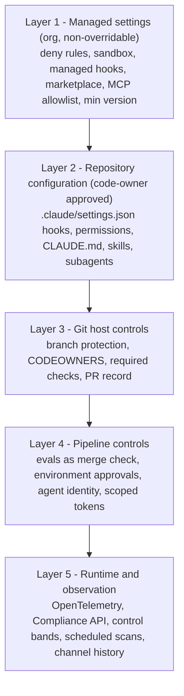

# Controls Matrix

The AI-native SDLC keeps every control objective your auditors already recognize. It replaces the *enforcement mechanism*: meetings and manual sign-offs become version-controlled artifacts, skills, hooks, managed settings, branch protection, and telemetry. This matrix shows the mapping, states whether each mechanism is **advisory** or **deterministic**, lists the evidence it produces, and names the owner.


## Advisory versus deterministic

This distinction is the single most important idea in the matrix.

| Type | Examples | Guarantee | Use for |
|---|---|---|---|
| **Advisory** | Skills, `CLAUDE.md`, `REVIEW.md`, Claude's PR review findings | Claude is *guided* to follow the rule; it usually will, but compliance is probabilistic | Conventions, design guidance, policy applied while drafting, review focus |
| **Deterministic** | Hooks (PreToolUse, PostToolUse), managed settings (`permissions.deny`, sandbox), branch protection, CI merge checks, environment approvals | The rule is enforced by code outside the model; the action is blocked or allowed regardless of what the model decides | Must-hold policies: secrets, protected paths, release authorization, egress, segregation of duties |

**Rule of thumb:** if a policy violation would be a reportable finding, the policy needs a deterministic mechanism. A skill may *also* describe it, so that Claude gets it right the first time, but the skill is not the control. Every must-hold skill should be backed by a hook or a setting.

## Control layers



Higher layers constrain lower ones. A repository cannot weaken a managed deny rule; a PR cannot bypass branch protection; an agent in CI cannot deploy to production without the environment approval.

---

## 1. Control objective mapping

| # | Control objective | Traditional mechanism | AI-native mechanism | Type | Evidence produced | Owner |
|---|---|---|---|---|---|---|
| 1 | **Segregation of duties** - the author of a change cannot approve it | Separate developer and approver roles; CAB | Code-writing agent has no approval route; branch protection requires code-owner approval; Claude review findings neither approve nor block; non-interactive runs use a distinct agent identity; production requires a named release manager | Deterministic | Branch protection settings; PR approvals by named humans; CI run identity; environment approval records | Engineering leadership, code owners |
| 2 | **Change approval** - changes are authorized before implementation and before release | Change request tickets; weekly or monthly CAB | `intent.md` merge = PO approval; `spec.md` sign-off by PO; accepted `plan.md` before any edit (plan mode); PR approval; approval-gate hook (PreToolUse) for production actions | Deterministic (merge, hook); advisory (skill guidance while drafting) | Git history of `intent/`, `spec.md`, `plan.md` with author and timestamp; PR thread; hook block messages | Product owner, change management |
| 3 | **Peer review** - changes are reviewed by a competent second party | Human line-by-line review | Layered review: Claude review guided by `REVIEW.md` (bugs/logic, security, compliance passes) plus mandatory human code-owner review focused on intent and risk | Advisory (Claude review) + deterministic (required code-owner approval) | PR review comments, tagged findings, approvals, resolution history | Tech lead, code owners |
| 4 | **Requirements traceability** - each change traces to an approved requirement | Traceability matrix maintained by hand | Artifact chain: `intent.md` -> `spec.md` -> `plan.md` -> commits -> PR, each referencing the previous; record IDs link to legacy tools; legacy records carry commit SHA | Deterministic (git linkage) if enforced by a PR template check; otherwise advisory | Git history; links in plan header; PR description; legacy ticket with SHA | Product owner, tech lead |
| 5 | **Secure coding** - code follows secure development standards | Secure coding guidelines, training, periodic review | Security skills (for example, a `secure-api-review` skill) applied while writing specs and code; `REVIEW.md` security pass; hooks for must-hold rules (secret scanning, protected paths); evals that check policy compliance; scheduled scans | Advisory (skills, review) + deterministic (hooks, CI checks) | Skill version in session logs; PR security findings; hook logs; scan reports | Security lead, policy owners |
| 6 | **Access control** - least privilege for people and automation | IAM roles; access reviews | Managed settings: `permissions.deny` for secret paths and egress, `permissions.allow` for the safe inner loop, `disableBypassPermissionsMode`, `allowManagedPermissionRulesOnly`, sandbox with domain allowlist, credential path denies; CI with short-lived scoped tokens and no standing production credentials; MCP tools scoped per environment | Deterministic | Managed settings file under MDM control; sandbox configuration; CI secret inventory; token scopes | IT/MDM admin, platform engineer |
| 7 | **Release authorization** - production releases are approved by an authorized person | Release sign-off at a board | Tiered autonomy (dev free, staging constrained, production agent-prepares/human-authorizes); release-gate hook requires an approval signal; CI environment protection with named approvers | Deterministic | Environment approval log; hook exit messages; deploy pipeline history | Release manager |
| 8 | **Audit logging** - actions are attributable and retained | Application and system logs | Git history for all artifacts; PR threads as audit record; sessions attributed to the steering engineer; OpenTelemetry metrics and events; Compliance API; Slack channel history for on-call; skill versions logged | Deterministic (logs are produced by systems, not the model) | Commits, PRs, OTel exports, Compliance API records, channel history | Platform engineer, security lead |
| 9 | **Incident management** - incidents are detected, responded to, and learned from | Monitoring, on-call rotations, post-mortems | Deterministic detection script (rolling mean/stdev, Western Electric rules, no model in detection); versioned response tiers (1 sigma log, 2 sigma diagnose read-only, 3 sigma propose PR or runbook); agent diagnosis as `intent.md`; Claude on call in Slack; post-mortem in versioned lessons folder; incident -> permanent eval | Deterministic detection and tiers; advisory diagnosis | `bands.yaml` history; triage decisions; channel history; post-mortems; new eval commits | Service owner / on-call |
| 10 | **Vulnerability management** - vulnerabilities are identified, triaged, and remediated in time | Periodic scans, pen tests, tracker | Scheduled recurring scans (for example, Claude Security) on a per-project schedule; confidence-rated findings; logged dismissals; bounded fixes via PR gate, architectural findings via `intent.md`; vuln-class eval after fix; export to tracker | Deterministic scheduling and routing; advisory findings | Scan history, dispositions with reasons, fix PRs, exported findings | Security lead |

---

## 2. Mechanism reference

| Mechanism | What it enforces | Type | Where configured | Changed by |
|---|---|---|---|---|
| `CLAUDE.md` | Project context, commands, conventions, verification expectations | Advisory | Repo root | Engineers, approved by code owners |
| Skill (`SKILL.md`) | Operational policy applied while working | Advisory | `.claude/skills/<name>/` or org plugin | Policy owner sign-off |
| Hook (PreToolUse) | Allow, ask, or block a tool call before it runs | Deterministic | `.claude/settings.json` or managed settings | Platform engineer; code owners or IT |
| Hook (PostToolUse) | Formatter, linter, checks after an edit | Deterministic | Same | Same |
| Managed settings | Non-overridable permissions, sandbox, hooks, marketplace, MCP, version | Deterministic | MDM or admin console | IT/MDM admin |
| Sandbox | OS-level filesystem and network isolation, domain allowlist | Deterministic | Settings (managed) | IT/MDM admin |
| Branch protection + CODEOWNERS | No direct push to main; human approval required | Deterministic | Git host | Repo admins |
| Required CI checks | Tests, lint, eval pass rate | Deterministic | CI + branch protection | Platform engineer |
| Environment approvals | Named approvers for production | Deterministic | CI/CD platform | Release manager |
| PR record | Discussion, findings, approvals, fixes | Evidence | Git host | n/a |
| Git history | Author, timestamp, revision history of every artifact | Evidence | Git | n/a |
| OpenTelemetry | Usage, sessions, tool decisions, cost, gate wait times | Evidence | Telemetry environment variables / managed settings | Platform engineer |
| Compliance API | Organization-level activity records for enterprise plans | Evidence | Admin | Security / compliance |
| Channel history | On-call investigation and steering | Evidence | Slack | Service owner |

---

## 3. Example: expressing a gate as a hook

Change management and compliance list the gates that must survive; the platform engineer expresses each as a hook. A PreToolUse hook reads the tool call from standard input, decides, and exits with code 2 to block (the message on standard error is returned to Claude so it can explain what approval is needed).

```bash
#!/usr/bin/env bash
# .claude/hooks/production-gate.sh - block production deploys without approval
cmd=$(jq -r '.tool_input.command // ""')
if [[ "$cmd" == *deploy* && "$cmd" == *production* && -z "${RELEASE_APPROVAL:-}" ]]; then
  echo "Production deploy blocked: a release manager must approve. See RELEASES.md for how to request approval." >&2
  exit 2
fi
exit 0
```

Team-level hooks live in `.claude/settings.json` under version control. Hooks that are non-negotiable belong in managed settings, with `allowManagedHooksOnly` so repository-level hooks cannot replace them. See [Hooks-Guide.md](../02-Guides/Hooks-Guide.md) and [Managed-Settings-Guide.md](../02-Guides/Managed-Settings-Guide.md).

---

## 4. Indicative mapping to common frameworks

> **Disclaimer:** The mappings below are **indicative only**. They show where AI-native mechanisms can contribute evidence to control families in widely used frameworks. They are not legal, audit, or compliance advice, they do not establish that any framework requirement is met, and control numbering and wording should be checked against the current official version of each framework. Work with your compliance function and auditors to confirm scope and sufficiency.

### SOC 2 (Trust Services Criteria, Common Criteria series)

| Control objective (this matrix) | Indicative CC area | Notes |
|---|---|---|
| Segregation of duties, access control | CC6 (logical and physical access) | Managed settings, sandbox, scoped tokens, branch protection |
| Change approval, peer review, release authorization | CC8 (change management) | Artifact chain, PR approvals, environment approvals, gate hooks |
| Audit logging, incident management | CC7 (system operations, monitoring, incident response) | OTel, control bands, on-call history, post-mortems |
| Vulnerability management | CC7 (monitoring for vulnerabilities) | Scheduled scans and dispositions |
| Policy owners, roles | CC1 / CC2 (control environment, communication) | Named owners, skill-encoded policy, training records |
| Risk register | CC3 (risk assessment) | See [Risk-Register.md](Risk-Register.md) |
| Monitoring of controls | CC4 (monitoring activities) | Eval pass rates, gate violation metrics |
| Control activities | CC5 (control activities) | Hooks and managed settings as automated controls |

### ISO/IEC 27001 Annex A (2022 themes)

| Annex A theme | Indicative relevance |
|---|---|
| Organizational controls | Policy ownership, roles and responsibilities, supplier relationships (model and plugin vendors), information security in project management (intent/spec stages) |
| People controls | Training and awareness for steering agents, reviewing artifacts, and recognizing automation bias |
| Physical controls | Largely unchanged; endpoint controls still apply to engineer workstations |
| Technological controls | Access restriction, secure development lifecycle, secure coding, change management, separation of environments, logging, monitoring, configuration management (managed settings), data leakage prevention (deny rules, sandbox egress) |

### NIST SSDF (SP 800-218) practice groups

| Practice group | Indicative AI-native contribution |
|---|---|
| **PO - Prepare the Organization** | Named policy owners; roles and RACI; managed settings; org marketplace; training; security requirements expressed as skills |
| **PS - Protect the Software** | Branch protection; protected-path hooks; git history integrity; plugin and MCP supply-chain restrictions (`strictKnownMarketplaces`, `allowManagedMcpServersOnly`) |
| **PW - Produce Well-Secured Software** | Security skills applied at design; plan review before code; feedback loops and evals; layered PR review; secret and dependency hooks |
| **RV - Respond to Vulnerabilities** | Scheduled scans; confidence-rated triage; fix PRs; vuln-class evals; incident-to-eval; control bands feeding `intent.md` |

---

## 5. Control testing suggestions

| Control | Suggested test | Frequency |
|---|---|---|
| Segregation of duties | Sample merged PRs; confirm approver differs from author and agent identity never approves | Quarterly |
| Change approval | Sample production changes; trace back to merged `intent.md` and accepted `plan.md` | Quarterly |
| Release authorization | Attempt a production deploy command in a sandboxed session without approval; confirm the hook blocks | Per hook change and quarterly |
| Access control | Confirm managed settings on a sample of endpoints match the approved baseline; attempt to read a denied path | Monthly |
| Audit logging | Confirm OTel data arrives for a sample of sessions; confirm retention meets policy | Monthly |
| Vulnerability management | Confirm share of in-scope repos on a scan schedule; sample dismissals for logged reasons | Monthly |
| Evals | Confirm config-change PRs show eval check; review pass-rate trend | Per change and monthly |

## Related

- [Audit-Evidence-Guide.md](Audit-Evidence-Guide.md)
- [Risk-Register.md](Risk-Register.md)
- [Security-Review-Checklist.md](../06-Checklists/Security-Review-Checklist.md)
- [PR-Review-Guide.md](../02-Guides/PR-Review-Guide.md), [CI-CD-Integration-Guide.md](../02-Guides/CI-CD-Integration-Guide.md), [Recurring-Security-Scans.md](../02-Guides/Recurring-Security-Scans.md)

---

*Based on concepts from Anthropic's AI-Native SDLC Playbook; expanded guidance for implementation.*
