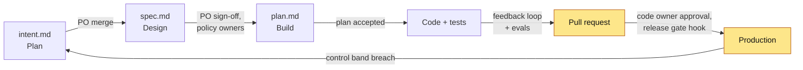

# 04 - Governance

This folder explains how to keep an AI-native software delivery lifecycle **auditable, controlled, and measurable** once agents write most of the code. The core position, taken from the playbook this kit builds on, is simple: the control objectives your organization already has do not change. What changes is the *mechanism* that enforces each objective and the *evidence* that proves it was enforced.

In a traditional SDLC, most controls are people and meetings: a change advisory board, a reviewer reading every line, a QA gate at the end of a phase. In an AI-native SDLC, the same objectives are met by version-controlled artifacts (`intent.md`, `spec.md`, `plan.md`), policy encoded as skills, deterministic hooks, managed settings that engineers cannot override, branch protection, and telemetry. Humans stay in the loop at the gates where judgment matters.

## Documents in this folder

| Document | What it answers | Primary audience |
|---|---|---|
| [Roles-and-RACI.md](Roles-and-RACI.md) | Who does what at each stage, and who is accountable for each artifact | Engineering leadership, process owners |
| [Controls-Matrix.md](Controls-Matrix.md) | How each traditional control objective is met by an AI-native mechanism, and what evidence it leaves | Security, compliance, internal audit |
| [Metrics-and-KPIs.md](Metrics-and-KPIs.md) | Which leading and lagging indicators to track per stage, and how to collect them | Engineering managers, platform team |
| [Adoption-Roadmap.md](Adoption-Roadmap.md) | How to roll out the model in phases, with entry and exit criteria | Transformation leads, platform team |
| [Maturity-Model.md](Maturity-Model.md) | Where your organization is today and what the next level looks like | Leadership, team leads |
| [Risk-Register.md](Risk-Register.md) | What can go wrong, how likely it is, and which mechanism mitigates it | Security lead, risk owners |
| [Audit-Evidence-Guide.md](Audit-Evidence-Guide.md) | What evidence each gate produces and how an auditor retrieves it | Auditors, compliance |
| [Change-Management-and-Training.md](Change-Management-and-Training.md) | How to bring people along: communication, training, champions | Change management, L&D, team leads |

## How governance fits into the loop

Every arrow above is a gate that produces evidence. The documents in this folder describe who owns each gate, how it is enforced, and how to prove it ran.

## Reading order

1. Start with the [Controls-Matrix.md](Controls-Matrix.md) if you come from security or compliance.
2. Start with the [Adoption-Roadmap.md](Adoption-Roadmap.md) and [Maturity-Model.md](Maturity-Model.md) if you are planning a rollout.
3. Start with [Roles-and-RACI.md](Roles-and-RACI.md) if you need to explain the operating model to teams.

## Related material

- Playbook overview: [../00-Playbook/AI-Native-SDLC-Playbook.md](../00-Playbook/AI-Native-SDLC-Playbook.md)
- Stage guides: [../01-Stages/](../01-Stages/01-Plan-Intent.md)
- Implementation guides: [Managed-Settings-Guide.md](../02-Guides/Managed-Settings-Guide.md), [Hooks-Guide.md](../02-Guides/Hooks-Guide.md), [PR-Review-Guide.md](../02-Guides/PR-Review-Guide.md)
- Checklists: [../06-Checklists/README.md](../06-Checklists/README.md)
- Glossary and FAQ: [../07-Reference/README.md](../07-Reference/README.md)

---

*Based on concepts from Anthropic's AI-Native SDLC Playbook; expanded guidance for implementation.*
