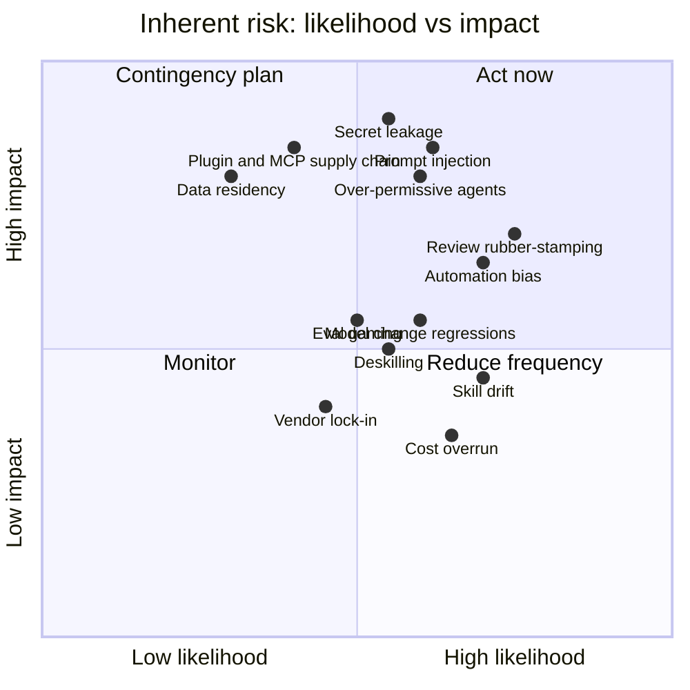

# Risk Register

This register lists the principal risks introduced or amplified by an AI-native SDLC, rates them, and maps each mitigation to a concrete mechanism described elsewhere in this kit. Ratings are a starting point; recalibrate them for your organization, data classification, and regulatory context, and review the register quarterly.

**Scales**

| Score | Likelihood | Impact |
|---|---|---|
| 1 | Rare | Negligible: minor rework |
| 2 | Unlikely | Minor: contained defect, no customer effect |
| 3 | Possible | Moderate: customer-visible defect or policy breach, contained |
| 4 | Likely | Major: data exposure, outage, or audit finding |
| 5 | Almost certain | Severe: regulatory breach, significant data loss, or sustained outage |

**Inherent rating** = Likelihood x Impact before mitigations. **Residual rating** is the expected score with the listed mitigations in place. Ratings of 15 and above are High, 8-14 Medium, below 8 Low.

---

## Heatmap (inherent risk)

---

## Register

| ID | Risk | Description | L | I | Inherent | Mitigations (mechanism) | Residual | Owner |
|---|---|---|---|---|---|---|---|---|
| R01 | **Prompt injection** | Untrusted content (issues, PR comments, web pages, logs, dependency READMEs, MCP tool output) contains instructions that steer the agent into unintended actions | 3 | 5 | 15 High | Sandbox with domain allowlist blocks arbitrary egress (managed settings); `permissions.deny` on credential paths; PreToolUse hooks block high-risk commands; no standing production credentials in CI; agent cannot approve or merge (branch protection); read-only tools for 2-sigma diagnosis; human review of all write actions via PR | 6 Low | Security lead |
| R02 | **Secret leakage** | Credentials enter the model context, logs, commits, or are sent to external endpoints | 3 | 5 | 15 High | Managed `permissions.deny` for `~/.ssh`, `~/.aws/credentials`, `.env` and similar; strip secrets from environment; sandbox egress allowlist; pre-commit/PostToolUse secret-scan hook; short-lived scoped CI tokens; PII-in-logs rule in security skill backed by a hook or CI check | 5 Low | Security lead, IT/MDM admin |
| R03 | **Over-permissive agents** | Agents granted broad tool access, bypass mode, or production credentials act beyond intent | 3 | 5 | 15 High | `disableBypassPermissionsMode`; `allowManagedPermissionRulesOnly`; sandbox `failIfUnavailable` (refuse to start without sandbox); tiered autonomy by environment; subagents with restricted tool lists; `--allowedTools` scoping in CI; environment approvals for production | 6 Low | Platform engineer, IT/MDM admin |
| R04 | **Skill drift** | Skill content diverges from the policy source of truth, or stops triggering, so policy is silently not applied | 4 | 3 | 12 Medium | One named owner and written source per skill; owner sign-off on changes; distribution through org marketplace so updates propagate; trigger tests across phrasings; track policy-citing PR findings (should trend to zero); back must-hold rules with hooks | 4 Low | Policy owners |
| R05 | **Review rubber-stamping** | Human reviewers approve because Claude reviewed, without checking intent and risk | 4 | 4 | 16 High | Code-owner approval mandatory and separate from Claude findings; `REVIEW.md` directs humans to intent and risk; nit cap keeps signal high; sample audits of approvals; track escapes vs pre-merge defects; review time too short triggers inspection | 8 Medium | Tech lead |
| R06 | **Eval gaming / test editing** | The agent makes a failing check pass by editing or skipping tests, or the eval suite stops discriminating | 3 | 3 | 9 Medium | Hook blocking test-file edits during bug fixes; "fix code not test" rule in `CLAUDE.md` verification block; reviewers reject unexplained test changes; rotate eval cases from monitoring; retire saturated cases to baseline; config-owning team approves eval changes | 4 Low | Platform engineer |
| R07 | **Cost overrun** | Parallel sessions, nightly evals, and scans consume more budget than planned | 4 | 2 | 8 Medium | OpenTelemetry cost metrics per team; spend limits on extra usage for scans; eval budget on a dedicated key; cost per merged PR reviewed monthly; right-size model per task | 4 Low | Engineering leadership, platform lead |
| R08 | **Model change regressions** | A model version or prompt change degrades behavior in ways tests do not catch | 3 | 3 | 9 Medium | Evals run on every config change including model swaps; pass-rate threshold as merge check; `requiredMinimumVersion` controls client rollout; staged rollout to pilot team first | 4 Low | Platform engineer |
| R09 | **Vendor lock-in** | Process becomes dependent on a single vendor's tooling | 2 | 3 | 6 Low | Artifacts are plain markdown in git; hooks are shell scripts; evals are portable task definitions; multiple model access routes (Anthropic API, Bedrock, Foundry, Vertex); document exit plan | 4 Low | Engineering leadership |
| R10 | **Supply chain via plugins / MCP** | Malicious or compromised plugin, skill, or MCP server introduces harmful instructions or exfiltration paths | 2 | 5 | 10 Medium | `strictKnownMarketplaces` and `disableSideloadFlags` (org marketplace only); `allowManagedMcpServersOnly`; security review before adding to marketplace; pin versions; sandbox egress allowlist | 4 Low | Security lead |
| R11 | **Data residency** | Code or data processed in a region or by a provider that violates contractual or regulatory requirements | 2 | 4 | 8 Medium | Choose model access route and region to meet residency requirements; managed settings enforce the approved route; data classification guidance in `CLAUDE.md` and skills; legal review of provider terms | 4 Low | Compliance, IT/MDM admin |
| R12 | **Deskilling** | Engineers lose the ability to reason about code and systems they did not write | 3 | 3 | 9 Medium | Plan interrogation as a core skill; engineers must be able to explain accepted plans; rotate manual deep-dives; training curriculum emphasizes reading and critique; new joiners pair on plans | 6 Low | Engineering leadership, change management |
| R13 | **Automation bias** | People over-trust agent output (diagnoses, triage, scan findings, reviews) and stop challenging it | 4 | 3 | 12 Medium | Findings carry evidence and confidence; dismissals and triage decisions require recorded reasons; no model in detection (deterministic scripts); humans decide at gates; periodic calibration reviews of agent diagnoses | 6 Low | Service owner, security lead |

---

## Risk-to-mechanism summary

| Mechanism | Risks mitigated |
|---|---|
| Managed settings (deny, sandbox, bypass disabled, managed-only rules) | R01, R02, R03, R10, R11 |
| Hooks (PreToolUse gates, test-edit block, secret scan) | R01, R02, R03, R04, R06 |
| Branch protection and code-owner approval | R01, R03, R05 |
| Org marketplace and managed MCP | R04, R10 |
| Evals as merge check | R06, R08 |
| OpenTelemetry and cost dashboards | R07 |
| Portable artifacts in git | R09 |
| Training and change management | R05, R12, R13 |
| Deterministic detection and recorded triage | R13 |

## Operating the register

- **Review cadence:** quarterly, and after any incident involving an agent action.
- **Triggers for re-rating:** new model access route, new MCP server or plugin class, expansion of autonomy tier, regulatory change, audit finding.
- **Key risk indicators:** hook block counts, sandbox violations, eval pass-rate drops after config change, share of PRs approved within an implausibly short time, policy-citing findings, cost per merged PR.
- **Escalation:** any residual rating of 15 or more goes to engineering leadership and the security lead within one week.

## Related

- [Controls-Matrix.md](Controls-Matrix.md)
- [Security-Review-Checklist.md](../06-Checklists/Security-Review-Checklist.md)
- [Managed-Settings-Guide.md](../02-Guides/Managed-Settings-Guide.md), [Hooks-Guide.md](../02-Guides/Hooks-Guide.md)

---

*Based on concepts from Anthropic's AI-Native SDLC Playbook; expanded guidance for implementation.*
