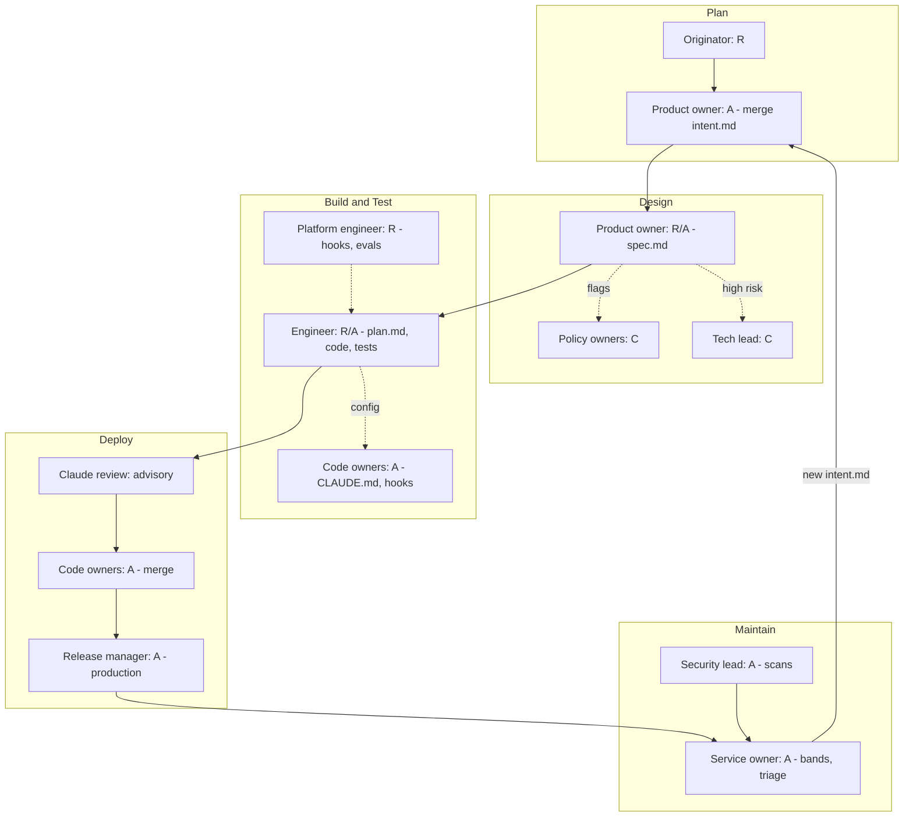

# Roles and RACI

An AI-native SDLC does not remove roles; it moves effort. People spend less time producing first drafts (requirements documents, boilerplate code, review comments on style) and more time on judgment: approving intent, resolving policy conflicts, reviewing risk, and authorizing releases. This document defines each role, describes its responsibilities stage by stage, and provides RACI matrices per stage and per artifact.

**RACI key**

| Letter | Meaning |
|---|---|
| **R** - Responsible | Does the work (may be assisted by Claude) |
| **A** - Accountable | Owns the outcome and makes the final decision; exactly one per activity |
| **C** - Consulted | Provides input before the decision (two-way) |
| **I** - Informed | Kept up to date after the decision (one-way) |

> Claude and other agents are **never Accountable** and never hold an approval route. Where the matrices show "Claude" it is as a tool used by the Responsible person or as a non-interactive job running under an agent identity. Accountability always sits with a named human.

---

## 1. Role catalogue

### Originator
Anyone with a problem worth solving: a support lead, an analyst, a customer success manager, an engineer. In an AI-native SDLC the originator does not need to wait for a product manager to write up the idea. They brainstorm with Claude until the idea is concrete (scope, users, constraints, success metrics), have Claude write `intent.md` using the organization's template, correct it, and commit it (directly or through a connector if they do not use git).

- Owns the accuracy of the problem statement.
- Answers open questions raised during design.
- Receives the outcome and confirms the problem is solved.

### Product owner (PO)
The decision-maker for *whether* and *what*. The PO approves `intent.md` (approval is the merge; rejection is closing the review), runs or triggers the design pass that produces `spec.md`, reviews the spec against the original idea, resolves flagged policy concerns with the named policy owners, and decides whether to proceed. For higher-risk changes the PO consults the tech lead.

### Tech lead
The decision-maker for *how*, at the level of architecture and review standards. The tech lead is consulted on risky specs, owns `REVIEW.md` (what the automated reviewer checks, what counts as Important versus Nit, what to skip), runs the monthly review-tuning session, and usually serves as a code owner for the repository's `CLAUDE.md` and `.claude/` configuration.

### Engineer
The person steering Claude Code. The engineer starts sessions in plan mode, interrogates the plan until a non-author could implement from it, commits `plan.md`, accepts the plan, and steers implementation (often across two or three parallel sessions in separate worktrees). The engineer is attributed for every session they steer and remains responsible for what they submit, even when Claude produced it.

### Platform engineer
Builds and runs the machinery that makes controls deterministic. The platform engineer writes hooks (including approval-gate hooks), curates the evaluation suite (20 to 50 real tasks with expected outcomes), wires evals into CI, configures non-interactive Claude Code in pipelines, exposes deploy/status/rollback as environment-scoped MCP tools, and maintains the org plugin marketplace.

### Policy owners (security, compliance, brand, UX)
Each policy that becomes a skill needs **one named owner** and a written source of truth. Policy owners approve changes to their skills, resolve concerns that the design pass flags against their policy, and decide which rules are important enough to be backed by a deterministic hook.

### Code owners
Defined in the repository's `CODEOWNERS` file and enforced by branch protection. Code owner approval is required to merge, regardless of what Claude's review says. Code owners also approve changes to `CLAUDE.md`, skills, subagent definitions, and hook scripts in their area.

### Release manager
Authorizes production releases. In the AI-native model the agent can prepare everything up to the production gate (build, staging deploy, release notes, rollback plan) but a named release manager authorizes the production step. Their authorization is what the release-gate hook checks for.

### Service owner / on-call
Owns a running service in production. The service owner picks the stable metrics to monitor, owns the control band configuration, triages agent-generated `intent.md` files from band breaches (fix now, schedule, or dismiss), steers Claude in the incident channel, and ensures every incident class produces a permanent eval.

### Security lead
Owns the recurring scan program: connects repositories, sets scan schedules, triages findings by confidence, dismisses with logged reasons, and routes bounded fixes to PRs and architectural findings to `intent.md`. Also owns the risk register and the security review checklist.

### IT / MDM admin
Deploys managed settings through MDM or the admin console so that engineers cannot override them: permission deny/allow lists, sandbox configuration, managed-only hooks, marketplace restrictions, managed MCP server allowlist, and minimum version.

### Engineering leadership
Sets the adoption pace, funds the platform work, defines which governance gates must survive the transition (together with change management and compliance), and reviews metrics. Leadership is accountable for the operating model as a whole.

### Change management
Maps the existing change-approval process (CAB, release sign-off) onto AI-native gates, runs the communication plan and training, and tracks adoption. Change management co-owns the list of gates that platform engineers translate into hooks.

---

## 2. Responsibilities by stage

| Stage | Key activities | Who leads | Who decides |
|---|---|---|---|
| **1. Plan** | Brainstorm with Claude, write and commit `intent.md` | Originator | Product owner (merge) |
| **2. Design** | Run design pass with org skills, produce `spec.md`, resolve flags | Product owner | Product owner, with policy owners on flagged items and tech lead on high risk |
| **3. Build** | Plan mode, interrogate plan, commit `plan.md`, implement, maintain `CLAUDE.md` | Engineer | Engineer accepts plan; code owners govern config |
| **4. Test** | Feedback loop (build, test, lint), failing-test-first fixes, evals in CI | Engineer; platform engineer for evals | Config-owning team approves eval-gated config changes |
| **5. Deploy** | Claude review, code owner review, approval-gate hooks, CI/CD with tiered autonomy | Engineer, tech lead, platform engineer | Code owners (merge), release manager (production) |
| **6. Maintain** | Control bands, response tiers, diagnosis as `intent.md`, scheduled scans, on-call | Service owner, security lead | Service owner / on-call (triage), security lead (scan findings) |

### Stage-by-stage detail

**Stage 1 - Plan.** The originator is Responsible for producing a good `intent.md`. The PO is Accountable for accepting it into the pipeline. Policy owners are not normally involved yet; the intent is a proto-spec, not a design. Engineering leadership is Informed through the intent queue.

**Stage 2 - Design.** The PO is Accountable for the spec. Claude, guided by the organization's skills (brand, security, compliance, UX), flags concerns as it writes. Each flag is routed to the named policy owner who is Consulted and whose decision is recorded in the PR thread. The tech lead is Consulted for higher-risk changes. As maturity grows, acceptance of `intent.md` triggers a non-interactive job that opens `spec.md` as a PR, which moves the PO from author to reviewer.

**Stage 3 - Build.** The engineer is Responsible and Accountable for the plan they accept. Code owners are Accountable for repository configuration (`CLAUDE.md`, skills, hooks, subagents). Platform engineers are Responsible for the hooks that make build-time guardrails deterministic.

**Stage 4 - Test.** The engineer ensures every session verifies itself before a human sees the change. The platform engineer is Responsible for the eval suite and its CI wiring. The team that owns a piece of agent configuration is Accountable for approving changes to it, gated on the eval pass rate.

**Stage 5 - Deploy.** Claude reviews but never approves or blocks. Code owners are Accountable for merge. The release manager is Accountable for production authorization. The platform engineer is Responsible for the approval-gate hooks and CI/CD integration. Change management and compliance are Consulted on which gates exist.

**Stage 6 - Maintain.** The service owner is Accountable for the service's control bands and for triaging agent diagnoses. The security lead is Accountable for the scan program. On-call engineers are Responsible for steering Claude in the incident channel. The team owning the affected code is Responsible for writing the regression eval after a fix ships.

---

## 3. RACI matrix per stage

Columns: **Orig** originator, **PO** product owner, **TL** tech lead, **Eng** engineer, **Plat** platform engineer, **Pol** policy owners, **CO** code owners, **RM** release manager, **SO** service owner / on-call, **Sec** security lead, **IT** IT/MDM admin, **Lead** engineering leadership, **CM** change management.

### Stage 1 - Plan

| Activity | Orig | PO | TL | Eng | Plat | Pol | CO | RM | SO | Sec | IT | Lead | CM |
|---|---|---|---|---|---|---|---|---|---|---|---|---|---|
| Brainstorm problem with Claude | R/A | C | | | | | | | | | | | |
| Write and correct `intent.md` | R/A | C | | | | | | | | | | | |
| Commit to `work/<ID>-<slug>/` | R | A | | | | | | | | | | | |
| Approve (merge) or reject | C | R/A | C | | | | | | | | | I | |
| Maintain `intent.md` template skill | | A | C | | R | C | | | | | | | |
| Provide Claude access for non-engineers | | | | | C | | | | | | R | A | |

### Stage 2 - Design

| Activity | Orig | PO | TL | Eng | Plat | Pol | CO | RM | SO | Sec | IT | Lead | CM |
|---|---|---|---|---|---|---|---|---|---|---|---|---|---|
| Run design pass with org skills | C | R/A | | | | | | | | | | | |
| Automate pass (intent merge triggers spec PR) | | C | C | | R | | | | | | | A | |
| Resolve flagged policy concerns | C | A | C | | | R | | | | C | | | |
| Decide to proceed | I | R/A | C | I | | C | | | | | | I | |
| Maintain policy skills | | | C | | R | A | C | | | C | | | |

### Stage 3 - Build

| Activity | Orig | PO | TL | Eng | Plat | Pol | CO | RM | SO | Sec | IT | Lead | CM |
|---|---|---|---|---|---|---|---|---|---|---|---|---|---|
| Generate plan in plan mode | | | C | R/A | | | | | | | | | |
| Interrogate risks and alternatives | | C | C | R/A | | | | | | | | | |
| Commit and accept `plan.md` | | I | I | R/A | | | | | | | | | |
| Implement (single or parallel sessions) | | | | R/A | | | | | | | | | |
| Maintain `CLAUDE.md` | | | C | R | | | A | | | | | | |
| Build-time hooks (protected paths, lint, secrets) | | | C | | R | C | A | | | C | | | |
| Subagent definitions | | | C | R | C | | A | | | | | | |

### Stage 4 - Test

| Activity | Orig | PO | TL | Eng | Plat | Pol | CO | RM | SO | Sec | IT | Lead | CM |
|---|---|---|---|---|---|---|---|---|---|---|---|---|---|
| One-command build/test/lint target | | | C | R | C | | A | | | | | | |
| Failing-test-first bug fixes | | | | R/A | | | | | | | | | |
| Test-edit protection hook | | | C | | R | | A | | | | | | |
| Curate eval suite | | | C | C | R/A | C | | | C | | | | |
| Gate config changes on eval pass rate | | | C | | R | | A | | | | | | |
| Incident-to-eval | | | | R | C | | | | A | | | | |

### Stage 5 - Deploy

| Activity | Orig | PO | TL | Eng | Plat | Pol | CO | RM | SO | Sec | IT | Lead | CM |
|---|---|---|---|---|---|---|---|---|---|---|---|---|---|
| Enable Claude code review | | | A | | R | | | | | C | C | | |
| Write and tune `REVIEW.md` | | | R/A | C | | C | C | | | C | | | |
| Approve merge | | | C | | | | R/A | | | | | | |
| Address review comments via @claude | | | | R/A | | | C | | | | | | |
| Define gates that must survive | | | C | | C | C | | C | | C | | A | R |
| Implement approval-gate hooks | | | C | | R | | C | C | | C | | | A |
| Deploy managed settings | | | | | C | | | | | C | R | A | |
| Authorize production release | | I | C | I | | | | R/A | C | | | | I |
| Rehearse rollback | | | C | C | R | | | C | A | | | | |

### Stage 6 - Maintain

| Activity | Orig | PO | TL | Eng | Plat | Pol | CO | RM | SO | Sec | IT | Lead | CM |
|---|---|---|---|---|---|---|---|---|---|---|---|---|---|
| Select stable metrics | | | C | | C | | | | R/A | | | I | |
| Write detection script and bands config | | | C | | R | | | | A | | | | |
| Triage agent `intent.md` | | C | C | | | | | | R/A | | | | |
| Steer Claude on call | | | | C | | | | | R/A | | | | |
| Connect repos and schedule scans | | | | | C | | | | | R/A | C | | |
| Triage scan findings | | | C | C | | | | | C | R/A | | | |
| Review drift reports (for example, PR cycle time) | | | C | | | | | | | | | A | I |

---

## 4. RACI matrix per artifact

| Artifact | Author (R) | Approver (A) | Consulted | Informed | Where it lives |
|---|---|---|---|---|---|
| `intent.md` | Originator (with Claude) | Product owner | Tech lead | Leadership | `work/<ID>-<slug>/` |
| `spec.md` | PO (with Claude, or non-interactive job) | Product owner | Policy owners, tech lead | Engineer, originator | Next to `intent.md` |
| `plan.md` | Engineer (with Claude in plan mode) | Engineer (acceptance) | Tech lead | PO | Next to spec, or in the change branch |
| `CLAUDE.md` | Engineers | Code owners | Tech lead | Team | Repo root |
| Skills (`SKILL.md`) | Platform engineer or policy author | Named policy owner | Tech lead, security | All engineers (auto-update) | `.claude/skills/` or org plugin |
| Hooks and `.claude/settings.json` | Platform engineer | Code owners | Security, change management | Team | Repo `.claude/` |
| Managed settings | IT/MDM admin | Engineering leadership (with security) | Platform engineer | All engineers | MDM / admin console |
| Subagents (`.claude/agents/`) | Engineer | Code owners | Tech lead | Team | Repo `.claude/agents/` |
| `REVIEW.md` | Tech lead | Tech lead | Code owners, security | Team | Repo root |
| Eval suite (`evals/`) | Platform engineer, owning teams | Config-owning team | Service owners | Leadership | Repo `evals/` |
| Pull request | Engineer or Claude (agent identity) | Code owners | Claude review, security | PO | Git host |
| Release authorization | Release manager | Release manager | Service owner | Change management | CI/CD environment approval |
| Control bands (`bands.yaml`) | Platform engineer | Service owner | Tech lead | On-call | Repo, versioned |
| Post-mortem / lessons | Claude (drafts), on-call | Service owner | Tech lead | Team, leadership | Versioned lessons folder |
| Scan finding disposition | Security lead | Security lead | Code owners | Tech lead | Scan tool, exported to tracker |

---

## 5. RACI flow

---

## 6. How roles change versus the traditional SDLC

| Role | Traditional emphasis | AI-native emphasis |
|---|---|---|
| Originator | Files a ticket and waits for a PM write-up | Produces a committed `intent.md` directly, in hours |
| Product owner | Writes requirements; coordinates analyst and designer phases | Reviews Claude-drafted specs; resolves policy flags; decides |
| Tech lead | Reviews many PRs line by line; holds design reviews | Writes `REVIEW.md`, tunes automated review, reviews high-risk plans and code |
| Engineer | Writes code and tests by hand; documents afterwards | Writes and interrogates plans; steers multiple sessions; reviews artifacts |
| Platform engineer | Maintains CI and developer tooling | Builds hooks, eval suites, managed agent configuration, MCP tools |
| Policy owners | Review documents or code late, often after build | Encode policy as skills applied while specs and code are written |
| Code owners | Approve merges | Approve merges and also own agent configuration in their area |
| Release manager | Chairs or attends a weekly/monthly board | Authorizes each production step; gate enforced by hook at the moment of action |
| Service owner | Watches dashboards; paged for anomalies | Defines bands and tiers; triages agent diagnoses |
| Security lead | Periodic assessments and pen tests | Continuous scheduled scans; findings routed through normal gates |
| IT/MDM admin | Laptop and SaaS provisioning | Deploys non-overridable agent policy (managed settings) |
| Leadership | Approves roadmaps; reviews delivery status | Funds platform work; decides which gates survive; watches loop metrics |
| Change management | Runs the CAB | Translates CAB rules into hooks and evidence; runs adoption |

Three shifts are worth calling out explicitly:

1. **Review moves upstream.** Design review happens at the plan, before any code exists, because plan mode cannot edit files until the plan is accepted. Policy review happens while the spec is being written.
2. **Authors become reviewers.** Much of the first-draft work moves to Claude, so the human skill that matters most is critical reading of artifacts. Training should reflect this (see [Change-Management-and-Training.md](Change-Management-and-Training.md)).
3. **Enforcement moves into configuration.** Rules that used to depend on a person remembering them are now hooks and managed settings. That makes the platform engineer and IT admin part of the control environment, and their changes must themselves be reviewed.

## Related

- [Controls-Matrix.md](Controls-Matrix.md) - mechanisms each role operates
- [Audit-Evidence-Guide.md](Audit-Evidence-Guide.md) - evidence produced at each gate
- Stage guides: [01-Plan-Intent.md](../01-Stages/01-Plan-Intent.md), [02-Design-Spec.md](../01-Stages/02-Design-Spec.md), [03-Build-Plan-Mode.md](../01-Stages/03-Build-Plan-Mode.md), [04-Test-Feedback-Loops-and-Evals.md](../01-Stages/04-Test-Feedback-Loops-and-Evals.md), [05-Deploy-Review-and-Gates.md](../01-Stages/05-Deploy-Review-and-Gates.md), [06-Maintain-Close-the-Loop.md](../01-Stages/06-Maintain-Close-the-Loop.md)

---

*Based on concepts from Anthropic's AI-Native SDLC Playbook; expanded guidance for implementation.*
