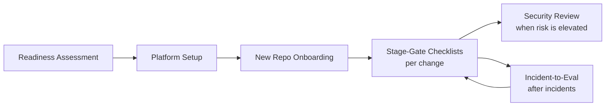

# 06 - Checklists

Practical, tick-box checklists for rolling out and operating an AI-native SDLC. Each checklist is written so it can be copied into a PR description, an issue, or a tracker and completed item by item. Where an item corresponds to a control, it links back to the governance documents in [../04-Governance/](../04-Governance/README.md).

| Checklist | Use it when | Owner |
|---|---|---|
| [Readiness-Assessment.md](Readiness-Assessment.md) | Before starting adoption, or before onboarding a new team | Engineering leadership, transformation lead |
| [Stage-Gate-Checklists.md](Stage-Gate-Checklists.md) | At each stage boundary: definition of ready and definition of done | Stage owner (PO, engineer, tech lead, service owner) |
| [Security-Review-Checklist.md](Security-Review-Checklist.md) | Reviewing agent configuration, a new MCP server or plugin, or a release with elevated risk | Security lead |
| [Platform-Setup-Checklist.md](Platform-Setup-Checklist.md) | Standing up managed settings, sandbox, marketplace, MCP allowlist, telemetry, and CI secrets | Platform engineer, IT/MDM admin |
| [New-Repo-Onboarding-Checklist.md](New-Repo-Onboarding-Checklist.md) | Bringing a repository into the AI-native workflow | Tech lead, code owners |
| [Incident-to-Eval-Checklist.md](Incident-to-Eval-Checklist.md) | After an incident or scan finding is fixed, to lock in a regression eval | Service owner, owning team |

## How to use these checklists

1. **Copy, do not link.** Paste the checklist into the PR or ticket so completion is recorded in the same audit trail as the work.
2. **Unchecked items need a reason.** If an item does not apply, strike it through and write why. That turns the checklist into evidence.
3. **Improve them.** If an item is repeatedly skipped or repeatedly catches a problem, update the checklist through a normal PR.
4. **Automate what you can.** Items that can be checked by a hook or a CI job should become one; the checklist then records that the automation ran.

## Where checklists fit

## Related

- Playbook: [../00-Playbook/AI-Native-SDLC-Playbook.md](../00-Playbook/AI-Native-SDLC-Playbook.md)
- Templates: [../03-Templates/](../03-Templates/)
- Governance: [../04-Governance/README.md](../04-Governance/README.md)

---

*Based on concepts from Anthropic's AI-Native SDLC Playbook; expanded guidance for implementation.*
