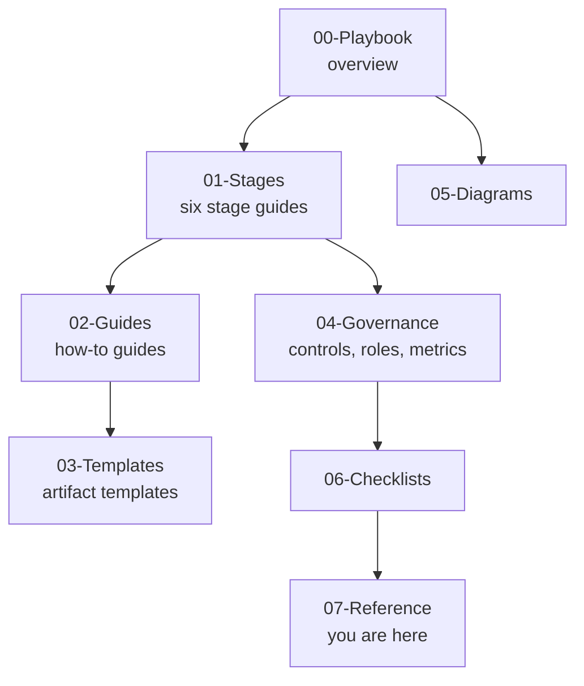

# 07 - Reference

Reference material that supports every other part of this kit: definitions, answers to common questions, ready-to-use prompts, and sources.

| Document | Contents |
|---|---|
| [Glossary.md](Glossary.md) | Definitions of every term used in the kit, from `intent.md` to Western Electric rules |
| [FAQ.md](FAQ.md) | Questions and answers grouped for executives, engineers, security, and compliance |
| [Prompt-Library.md](Prompt-Library.md) | Copy-ready prompts for each stage: intent brainstorming, spec with flags, plan interrogation, failing-test bug fixes, review, triage, and post-mortems |
| [Sources-and-Further-Reading.md](Sources-and-Further-Reading.md) | The source playbook, Claude Code documentation, DORA, NIST SSDF, statistical process control, and acknowledgments |

## Kit map

## Quick links

- Playbook: [../00-Playbook/AI-Native-SDLC-Playbook.md](../00-Playbook/AI-Native-SDLC-Playbook.md)
- Stages: [Plan](../01-Stages/01-Plan-Intent.md), [Design](../01-Stages/02-Design-Spec.md), [Build](../01-Stages/03-Build-Plan-Mode.md), [Test](../01-Stages/04-Test-Feedback-Loops-and-Evals.md), [Deploy](../01-Stages/05-Deploy-Review-and-Gates.md), [Maintain](../01-Stages/06-Maintain-Close-the-Loop.md)
- Governance: [../04-Governance/README.md](../04-Governance/README.md)
- Checklists: [../06-Checklists/README.md](../06-Checklists/README.md)

---

*Based on concepts from Anthropic's AI-Native SDLC Playbook; expanded guidance for implementation.*
